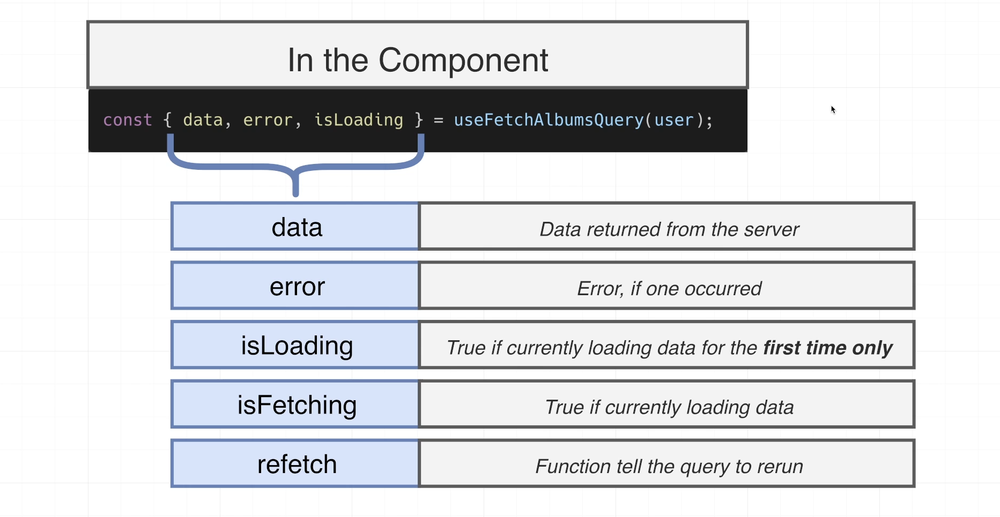
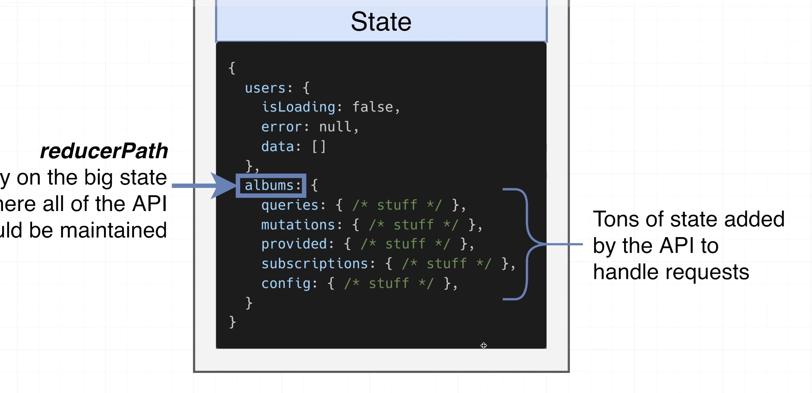
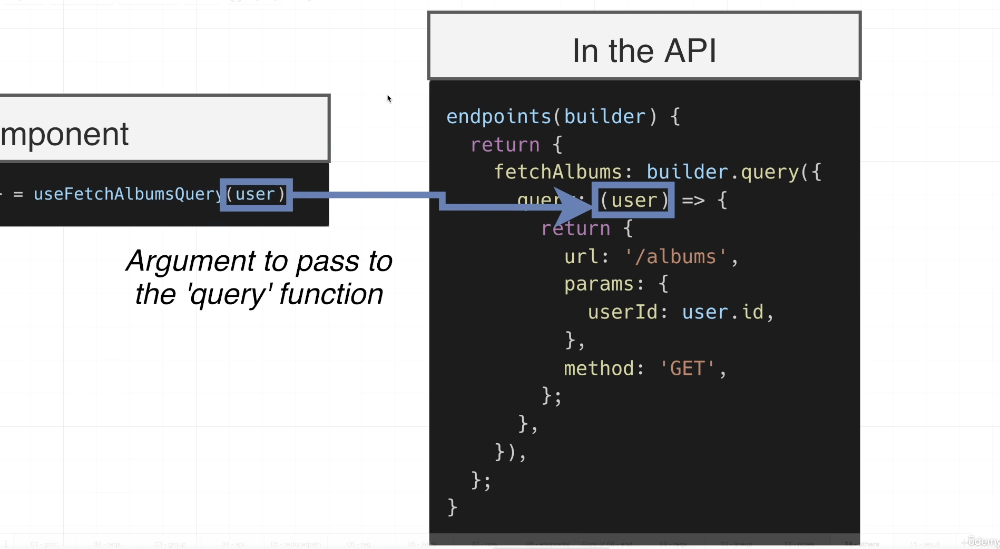

# INDEX

- [INDEX](#index)
  - [Redux-toolkit](#redux-toolkit)
    - [Why RTK is Redux today?](#why-rtk-is-redux-today)
    - [Installation](#installation)
    - [Setup](#setup)
  - [RTK methods](#rtk-methods)
    - [`createSlice()`](#createslice)
    - [`createActions()`](#createactions)
    - [`createAsyncThunk()`](#createasyncthunk)
      - [Handling thunk state](#handling-thunk-state)
  - [Redux Toolkit Query](#redux-toolkit-query)
    - [Redux Toolkit Query Steps](#redux-toolkit-query-steps)

---

## Redux-toolkit

It is an official recommended and modern approach for writing Redux code.

- It's an **opinionated** approach forcing us to use Redux best practices.
- It's a set of utilities to facilitate common Redux use cases.
- It's 100% compatible with classic Redux, allowing us to **use them together**.
- It allows us to write less code to achieve the same result ( less boilerplate code )
  - like: setting up middleware
- It gives us 3 big things (but there are more):

  1. We can write code that **mutates** the state inside the reducers (will be converted to immutable updates under the hood by `immer` library)
  2. Action creators are generated **automatically**
  3. Automatic setup of middleware (like thunk) and Redux DevTools Extension

- It's known as **RTK**

---

### Why RTK is Redux today?

[more](https://redux.js.org/introduction/why-rtk-is-redux-today)

- `Redux Toolkit` eliminates the "boilerplate" from hand-written Redux logic, prevents common mistakes, and provides APIs that simplify standard Redux tasks.
- You don't need to do manual **thunk** setup as redux-toolkit comes with out of the box `createAsyncThunk` which enables you to perform async operations in very free way.
- `Redux Toolkit` starts with **two** key APIs that simplify the most common things you do in every Redux app:

- `configureStore` sets up a well-configured Redux store with a single function call, including combining reducers, adding the thunk middleware, and setting up the Redux DevTools integration.

- It also is easier to configure than `createStore`, because it takes **named options parameters**.

- `createSlice` lets you write reducers that use the `Immer library` to enable writing immutable updates using "**mutating**" JS syntax, with no spreads needed.
  - It also automatically generates action creator functions for each reducer, and generates action type strings internally based on your reducer's names.
  - Finally, it works great with TypeScript.

> The only case where you may want you to stick to redux is when you're using **class-based components**, where Redux Toolkit does have some boilerplate (like Redux) and you may miss out decent support.
> However with functional components, Redux toolkit is like **Redux on steroids**.
>
> **Mutability** might be considered as advantage or disadvantage, but if you're not too used to writing with spread operators, Do straight assignments and let redux toolkit take care of mutability under the hoods.

---

### Installation

```sh
npm install @reduxjs/toolkit

# Complementary Packages
npm install react-redux
npm install --save-dev @redux-devtools/core
```

---

### Setup

- Here, we use `configureStore()` instead of `createStore()` as it's a wrapper around `createStore()` and it's a recommended way to create a store with redux-toolkit.

  ```js
  // store/index.js
  import { configureStore } from '@reduxjs/toolkit';
  import counterReducer from '../features/counter/counterSlice';

  export const store = configureStore({
    reducer: {
      counter: counterReducer
    }
  });
  ```

- Also, no need to manually create:
  - root reducer, as it's automatically created by `configureStore()`
  - `Provider` component, as it's automatically created by `configureStore()`
  - devtools, as it's automatically created by `configureStore()`
  - middleware, as it's automatically created by `configureStore()`

---

## RTK methods

Rtk provides us with some methods like:

- `createSlice()` -> to create a slice of the global state
- `createActions()` -> to create actions
- `createAsyncThunk()` -> to create async actions
- `createApi()` -> to create an API

### `createSlice()`

it gets a slice of the global state and returns a reducer function and action creators automatically.

- It automatically generates `action creators` and action types that correspond to the reducers and state.
- It makes writing `reducers` easier by using `immer` library to allow us to write "mutating" logic in reducers.
  - we don't need to use `switch` statement anymore.
  - we don't need to provide a `default` case anymore. because `immer` will take care of it.
- Here we can mutate the state as redux-toolkit behind the scene makes a clone of the state

```js
// features/counter/counterSlice.js
import { createSlice } from '@reduxjs/toolkit';

const initialState = {
  value: 0
};

export const counterSlice = createSlice({
  name: 'counter',
  initialState,
  reducers: {
    increment: state => {
      state.value += 1;
    },
    decrement: state => {
      state.value -= 1;
    },
    incrementByAmount: (state, action) => {
      state.value += action.payload;
    }
  }
});

// Now, we have access to the action creators that we defined in the reducers object
export const { increment, decrement, incrementByAmount } = counterSlice.actions;
```

- one of the drawbacks of the opinionated approach is that we can't configure the action-creators functions to our needs ( like having extra parameters in the action-creator function ), but we can use the `prepare` callback to do that.

  ```js
  // ...

  reducers: {
    incrementByAmountWithExtraParams: {
      // 1. "prepare" callback to configure the action-creator function before it's created and passed to the reducer
      prepare: (amount, extraParams) => {
        return { payload: { amount, extraParams } }; // action.payload = { amount, extraParams }
      }

      reducer: (state, action) => {
        state.value += action.payload.amount;
      },
    }

  }
  ```

---

### `createActions()`


---

### `createAsyncThunk()`

It's how we create async actions in redux-toolkit.

- It's a function that takes a string `action type` and a function that returns a `promise`.
- It automatically generates `action creators` that dispatch the `promise` and the `promise` itself.
- To be able to use it, we use the old way of creating `action-creator` functions and `reducers` as we don't have a `reducers` object anymore.
  - it can be for just one `action-creator` function, and other `action-creator` functions can be created using `createSlice()` normally.

```js
// features/accounts/accountSlice.js
import { createAsyncThunk } from '@reduxjs/toolkit';

// createAsyncThunk(actionType, promiseCreator)
export const fetchAccountById = createAsyncThunk(
  'accounts/fetchByIdStatus',
  async (userId, thunkAPI) => {
    const response = await fetch(`https://reqres.in/api/users/${userId}`);
    const data = await response.json();
    dispatch({ type: 'accounts/accountLoaded', payload: data });
    // type: sliceName/actionCreatorName
  }
);
```

---

#### Handling thunk state

- `createAsyncThunk()` automatically generates `action creators` that dispatch the `promise` and the `promise` itself.
- the `promise` is dispatched with the `pending` state, and when the `promise` is resolved, it's dispatched with the `fulfilled` state, and when the `promise` is rejected, it's dispatched with the `rejected` state.
- To access the `pending`, `fulfilled`, `rejected` states, we can use the `extraReducers` property of `createSlice()` method.

```js
// features/accounts/accountSlice.js
import { createAsyncThunk } from '@reduxjs/toolkit';

// createAsyncThunk(actionType, promiseCreator)
export const fetchAccountById = createAsyncThunk(
  'accounts/fetchByIdStatus'
  // async function
);

const accountSlice = createSlice({
  name: 'accounts',
  initialState: {
    account: {},
    status: 'idle',
    error: null
  },
  reducers: {
    // ...
  },
  extraReducers: {
    // pending
    [fetchAccountById.pending]: (state, action) => {
      state.status = 'loading';
    },
    // fulfilled
    [fetchAccountById.fulfilled]: (state, action) => {
      state.status = 'succeeded';
      state.account = action.payload;
    },
    // rejected
    [fetchAccountById.rejected]: (state, action) => {
      state.status = 'failed';
      state.error = action.error.message;
    }
  }
});
```

---

## Redux Toolkit Query

It's a module in Redux-toolkit used to create an **API** which is an (client side code in our app to provide an interface to go and fetch data )

- So, when using the `createApi()` method, we don't mean that we're creating a backend server. It's just to create code that will fetch data in a specific way
  
  
  
- Redux Toolkit Query handles tons of corner cases and almost all aspects of making requests, so It's a heavy duty and little hard to understand as it produce:
  - Fine-grained loading state
  - Fine-grained error state
  - Data caching and refetching
- **`reducerPath`:**
  
  - It's a property on the big state object where all of the API state should be maintained
  - It's a string that specify the key-name that we want to store all the state related to the API
- **`fetchBaseQuery`:**
  - It's a function to make a pre-configured version of `fetch`
- **`endpoints`:**
  
  
  

---

### Redux Toolkit Query Steps

1. Identify a group of related requests that your app needs to make
2. Make a new file what will create the API
3. The API needs to store a ton of state related to data, request, status, errors, So You need to add a `reducerPath`
4. The API needs to know how and where to send requests. Add a `baseQuery`
5. Add `endpoints`, one for each kind of request you want to make.
   - Requests that read data -> "queries"
   - Requests that write data -> "mutations"
6. Export all of the automatically generated hooks
7. Connect the API to the store. (Reducers, middleware, and listeners)
8. Export the hooks from `store/index.js` file
9. Use the generated hooks in a component

```

```
