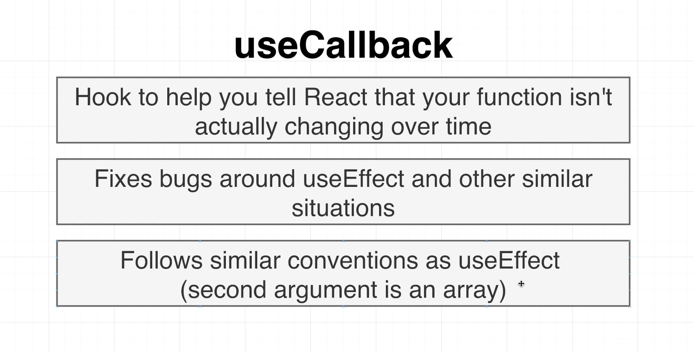
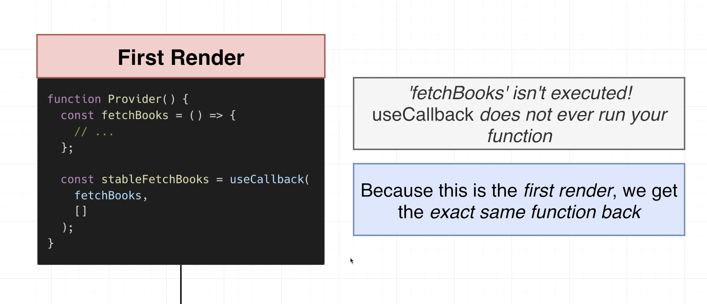
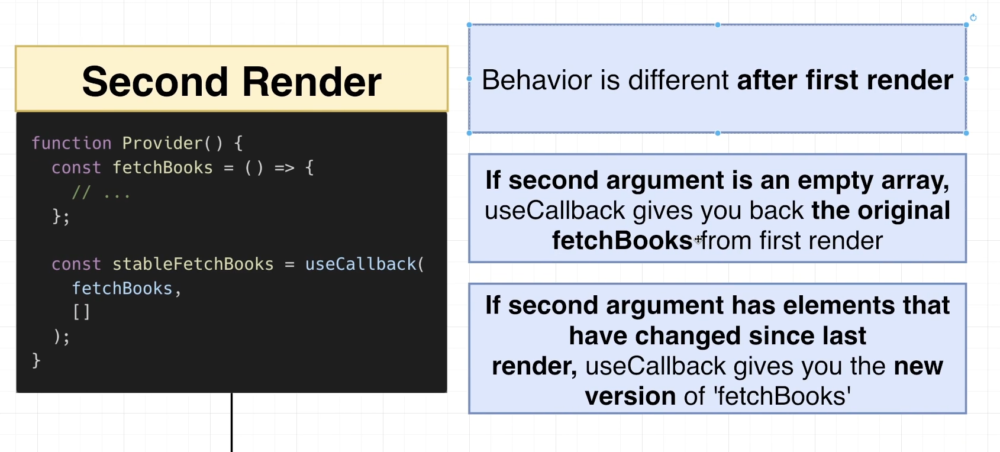
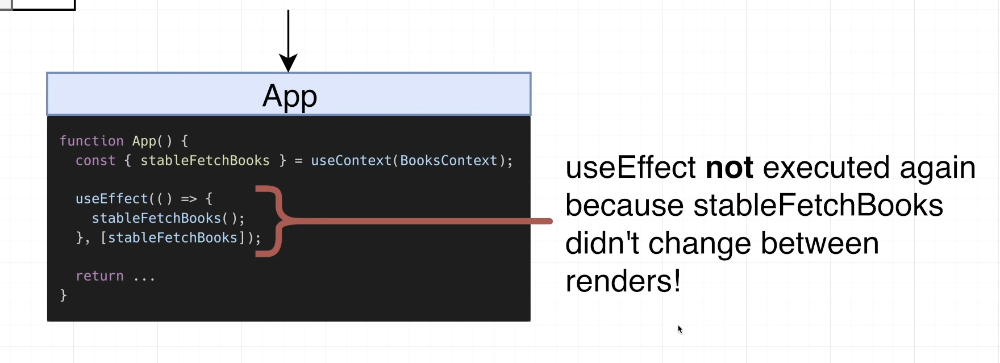
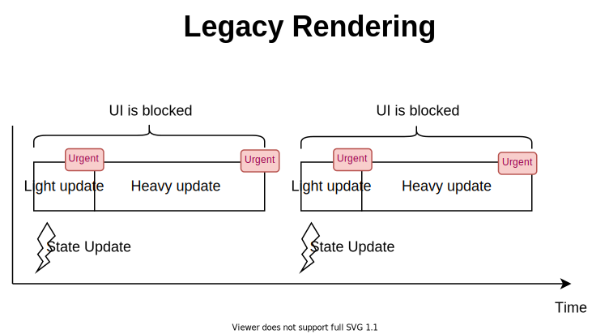

# INDEX

- [INDEX](#index)
  - [Performance Optimization in React](#performance-optimization-in-react)
    - [Reasons for re-renders for react components](#reasons-for-re-renders-for-react-components)
  - [useCallback()](#usecallback)
    - [Using `useCallback` to fix `useEffect()` infinite-loop-rendering problem](#using-usecallback-to-fix-useeffect-infinite-loop-rendering-problem)
  - [useMemo()](#usememo)
  - [React.memo()](#reactmemo)
  - [useTransition](#usetransition)
  - [PureComponent](#purecomponent)
  - [Code Splitting \& Dynamic Imports](#code-splitting--dynamic-imports)
    - [`React.lazy()`](#reactlazy)
    - [React Suspense](#react-suspense)
  - [React DevTools](#react-devtools)
    - [Dev tools Profiler](#dev-tools-profiler)

---

## Performance Optimization in React

- You only want to start improving the performance of the code once you see there's a **performance bottleneck**
- if you don't find slow-downs in your code, there's no reason to start optimizing, that is because **Optimization have a cost**, as it will have tradeoffs
  - Ex: when memorizing something, we are storing the output value in memory somewhere and to do that storing, it also takes time
  - this will be only worth it if we are making multiple calls and re-renders
- one of the tradeoffs is that we will have a slow start so that we get more optimized calls later

> React team are always optimizing their code for performance and this reduce the need of using optimization techniques

---

### Reasons for re-renders for react components

- Reasons:
  - passed props changes
  - component's state changes
  - parent component re-renders
    - sometimes, we can fix this by **Lowering the state** moving it to where it's used instead of passing it down

---

## useCallback()

> [read more here..](https://dmitripavlutin.com/dont-overuse-react-usecallback/)

It allows us to memoize (remember) a function, which is useful if we have an expensive function that we only want to re-compute when its dependencies change



- it takes 2 arguments:
  - function we want to memoize
  - array of dependencies
- `useCallback` Hook returns a memoized version of the callback function.
- It only runs when one of its dependencies-array changes.
  - if any state-item is used in the function, we must put it in the dependencies-array to prevent the memoized function from running with **outdated-state-items**

> "Every callback function should be memoized to prevent useless re-rendering of child components that use the callback function"

```js
import { useCallback } from 'react';

function MyComponent() {
  const handleClick = useCallback(() => {
    // handle the click event
  }, []);

  return <MyChild onClick={handleClick} />;
}
```

---

### Using `useCallback` to fix `useEffect()` infinite-loop-rendering problem






---

## useMemo()

It memorized the return value from a function, for any future call

- The React `useMemo` Hook returns a `memoized` value.
  - Think of memoization as `caching` a value so that it does not need to be recalculated.
- only runs when one of its dependencies update This can improve performance.
- usually with high-computation operations like `sorting`, a result-value from `for-loop`

- `useMemo()` accepts 2 arguments — a function compute that computes a result and the dependencies array

- usually it's used in the parent and the child components

```js
import { useState, useMemo } from 'react';

const App = () => {
  const [count, setCount] = useState(0);
  const [todos, setTodos] = useState([]);

  const calculation = useMemo(() => expensiveCalculation(count), [count]);

  const increment = () => {
    setCount(c => c + 1);
  };
  const addTodo = () => {
    setTodos(t => [...t, 'New Todo']);
  };
};
```

> The `useMemo` and `useCallback` Hooks are similar. The main difference is:
>
> - `useCallback` memorizes the function itself
> - `useMemo` memorizes the return value of the function (returns a memoized value(reference-values like objects & Arrays))

---

## React.memo()

> When deciding to update DOM, React first renders your component, then compares the result with the previous render. **If the render results are different, React updates the DOM**.

When a component is wrapped in `memo()` method, React renders the component and memoizes the result. Before the next render, if the **new props** are the same, React reuses the memoized result which means -> **skipping the next rendering.**

> This comes at a cost of storing the previous component in memory and comparing it each time, so It's best to use it if you have big component that has a lot of child-components.

**NOTE**:

- If you have a component wrapped in `React.memo()` and the props from the parent-component is a **callback-function** for and event or other -> you should put the callback in a `useCallback()` hook as each time the parent element renders it will also render the callback-function unless it's in an `useCallback()` hook.
- watch out for props that is a **reference type** (e.g functions,objects,arrays,..) as they will be recreated each time the parent component rerenders which will make the prop different each time
  - To solve this we use [useCallback](#usecallback)

---

## useTransition

> In order to use `useTransition()` hook, make sure to [enable the concurrent mode](https://github.com/reactwg/react-18/discussions/5).

It's a React hook that lets you update the state without blocking the UI

> Ex: filtering on each letter-input, which will block the UI (make it not responsive) until the filtering is done

- By default, all updates in React are considered **urgent**. That could create a problem when quick updates are slowed down by heavy updates.
  

- `useTransition()` is the hook that lets you access **concurrent mode** features inside of the React component.
- Invoking `const [isPending, startTransition] = useTransitionHook()` returns an array of 2 items:
  - `isPending`: indicates that the transition is pending
  - `startTransition(callback)`: allows you to mark any UI updates inside callback as transitions.

```jsx
import { useTransition } from 'react';
function MyComponent() {
  const [isPending, startTransition] = useTransition();
  // ...
  const someEventHandler = event => {
    startTransition(() => {
      // Mark updates as transitions
      setValue(event.target.value);
    });
  };
  return <HeavyComponent value={value} />;
}
```

---

## PureComponent

Functional components cannot leverage the performance improvements and render optimizations that come with `React.PureComponent` since by definition, they are not classes.

- If you want React to treat a functional component as a pure component, you’ll have to convert the functional component to a class component that extends `React.PureComponent`.

  ```js
  class PercentageStat extends React.PureComponent {}
  ```

---

## Code Splitting & Dynamic Imports

bundling involves aligning our code components in progression and putting them in one javascript chunk that it passes to the browser; but as our application grows, we notice that bundle gets very cumbersome in size. This can quickly make using your application very hard and especially slow.

- With Code splitting, the bundle can be split to `smaller chunks` where the most important chunk can be loaded first and then every other secondary one lazily loaded.

To do so, we're going to use a combination of React-router and React in order to split our code at the **route-level**. this is done using some concepts like: `React.lazy()` & `React.suspense` which are required in order to do **"Dynamic Imports"**

- **dynamic import**: is like `async-await` as

  ```js
  import HomeComponent from './routes/Home'; // static import

  const HomeComponent = await import('./routes/Home'); // dynamic import
  ```

  - React can't do this without `React.lazy()` & `React.suspense` together

---

### `React.lazy()`

It is a new function in react that lets you load react components lazily through code splitting without help from any additional libraries.

- **Lazy loading** is the technique of **rendering only-needed** or critical user interface items first, then quietly unrolling the non-critical items later.

  - it's used instead of `await` for dynamic-imports

    ```js
    const HomeComponent = lazy(() => import('./routes/Home'));
    ```

  - In order to use `lazy()`, we need to use `<Suspense>` because the `<Suspense>` is essentially saying:
    - "I know that you are currently trying to fetch something in suspended animation (meaning it's asynchronous), So while you're waiting, tell me what to do/show"

### React Suspense

The **Suspense API** is a feature in React that allows you to manage the loading state of your components. It provides a way to **"suspend" rendering of a component until some data has been fetched**, and display a fallback UI in the meantime. This makes it easier to handle asynchronous data loading and provide a smooth user experience

- `<Suspense></Suspense>` is a component required by the `lazy()` function basically used to wrap lazy components. Multiple lazy components can be wrapped with the suspense component. It takes a fallback property that accepts the react elements you want to render as the lazy component is being loaded, like a **loading spinner**
- usually it's for components/pages that are not rendered often

```jsx
import { lazy, Suspense } from 'react';
const Artists = lazy(() => import('./Artists'));
const Performers = lazy(() => import('./Performers'));

//...
return (
  <Suspense fallback={<h1>Still Loading…</h1>}>
    <Artists />
    <Performers />
  </Suspense>
);
```

---

## React DevTools

It's a chrome extension that allows us to inspect our react components

- it's a great tool to see how our components are rendered and how they are interacting with each other

### Dev tools Profiler

It shows all the different components and their interactions during the time of profiling

- in here there's a **timeline** that is showing all of the different things that are happening inside of our components
