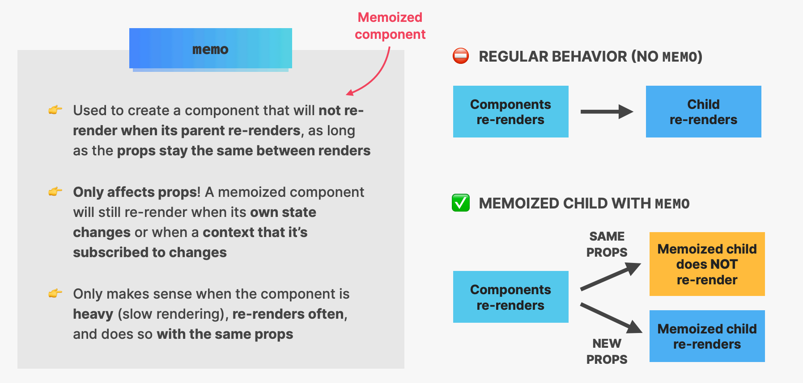
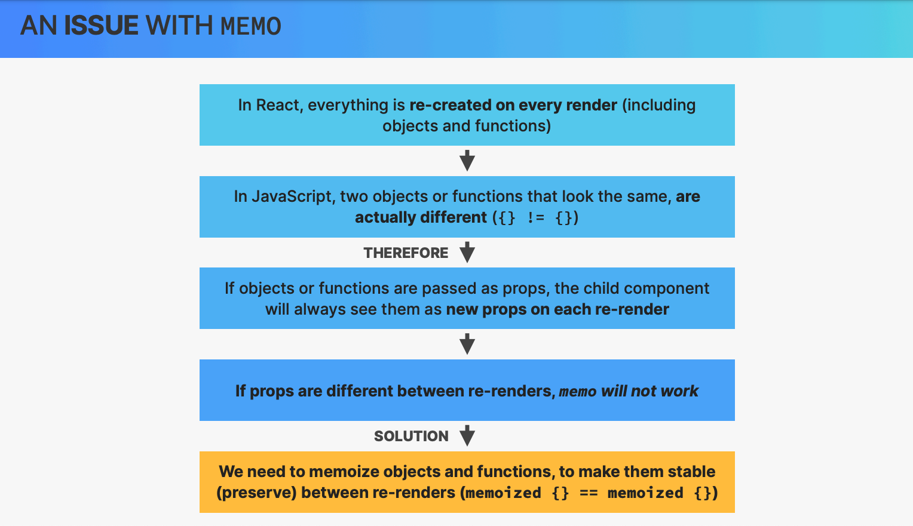
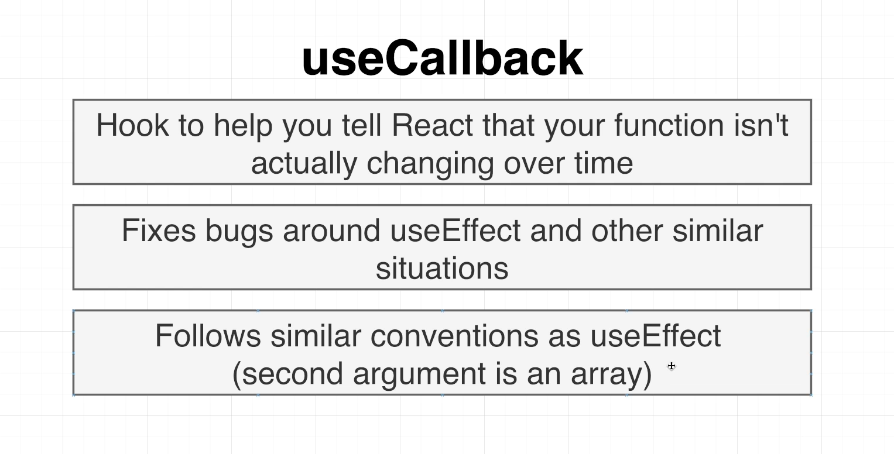
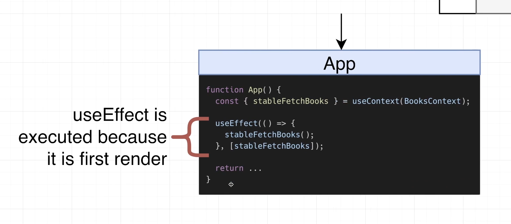
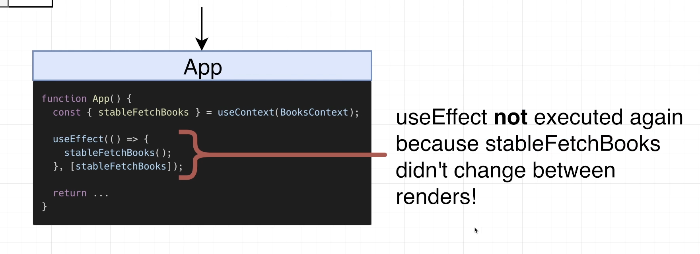
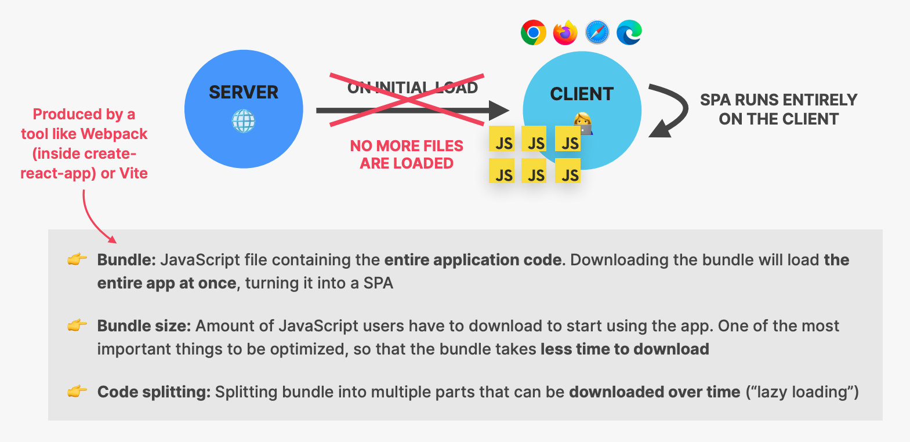

# INDEX

- [INDEX](#index)
  - [Performance Optimization in React](#performance-optimization-in-react)
    - [When to optimize ?](#when-to-optimize-)
    - [Reasons for re-renders for react components](#reasons-for-re-renders-for-react-components)
  - [Passing elements as `children` or `props`](#passing-elements-as-children-or-props)
  - [Memoization](#memoization)
    - [memo()](#memo)
    - [useMemo()](#usememo)
    - [useCallback()](#usecallback)
      - [Using `useCallback` to fix `useEffect()` infinite-loop-rendering problem](#using-usecallback-to-fix-useeffect-infinite-loop-rendering-problem)
  - [useTransition](#usetransition)
  - [PureComponent](#purecomponent)
  - [Code Splitting \& Dynamic Imports](#code-splitting--dynamic-imports)
    - [`React.lazy()`](#reactlazy)
    - [React Suspense](#react-suspense)
  - [Optimization Advices](#optimization-advices)
    - [Optimizing Context](#optimizing-context)
    - [Optimizing dependencies](#optimizing-dependencies)
  - [React DevTools](#react-devtools)
    - [DevTools Profiler](#devtools-profiler)

---

## Performance Optimization in React

React is already very fast, but there are some techniques that we can use to make it even faster


---

### When to optimize ?

- You only want to start improving the performance of the code once you see there's a **performance bottleneck**
- if you don't find slow-downs in your code, there's no reason to start optimizing, that is because **Optimization have a cost**, as it will have tradeoffs
  - Ex: when memorizing something, we are storing the output value in memory somewhere and to do that storing, it also takes time
  - this will be only worth it if we are making multiple calls and re-renders
- one of the tradeoffs is that we will have a slow start so that we get more optimized calls later
- To check if your app needs optimization or not, you can use the [DevTools Profiler](#devtools-profiler) to check current rendering behavior

> React team are always optimizing their code for performance and this reduce the need of using optimization techniques

---

### Reasons for re-renders for react components

- Reasons:
  - component's `state` changes
  - parent component re-renders
    - The problem here is that it creates a false impression that (changing `prop` re-renders the component) but it's actually the parent component that re-renders and passes the new `prop` to the child component
    - sometimes, we can fix this by **Lowering the state** moving it to where it's used instead of passing it down
- Notes:
  - A render does not mean that the DOM is updated, it just means that the component function **gets called**. But this can be an expensive operation if the component is big and has a lot of child components
  - **"Wasted render"**: a render that didn't produce any changes in the DOM (just a function call)
    - It's usually no problem, as React is very fast
    - It only becomes a problem, when it happens too frequently or when the component is very slow

---

## Passing elements as `children` or `props`

- When you have a slow component, you can pass it as a `children` to a parent component that is not slow

  - this way, the slow component will only be rendered when the parent component renders
  - this is useful when the slow component is not rendered often

- SLOW ❌

  - Here, every time the state `changes`, the `SlowComponent` will re-render as `Counter` re-renders

  ```jsx
  function Counter() {
    const [count, setCount] = useState(0);
    return (
      <div>
        <p>Count: {count}</p>
        <button onClick={() => setCount(count + 1)}>Increment</button>

        <SlowComponent />
      </div>
    );
  }

  function Parent() {
    return (
      <div>
        <h1>Parent</h1>
        <Counter />
      </div>
    );
  }
  ```

- FAST ✅

  - Instead, we can pass the `SlowComponent` as a `children` to `Counter` and it will only render when `Counter` renders
  - This is because we know that `Parent` component doesn't re-render often

  ```jsx
  function Counter({ children }) {
    const [count, setCount] = useState(0);
    return (
      <div>
        <p>Count: {count}</p>
        <button onClick={() => setCount(count + 1)}>Increment</button>

        {children}
      </div>
    );
  }

  function Parent() {
    return (
      <div>
        <h1>Parent</h1>
        <Counter>
          <SlowComponent />
        </Counter>
      </div>
    );
  }
  ```

---

## Memoization

**"Memoization"**: is an optimization technique that executes a pure function once, and saves the result in memory. For any future calls with the same arguments, the memoized function returns the cached result instead of executing again.

- Memoization is used in React to:
  - Memoize `components` with `memo()`
  - Memoize `values / objects` with `useMemo()`
  - Memoize `functions` with `useCallback()`
- By using it, we:
  - Prevent **wasted renders**
  - Improve app speed

### memo()



- When deciding to update DOM, React first renders your component, then compares the result with the previous render. **If the render results are different, React updates the DOM**.
- When a component is wrapped in `memo()` function, React renders the component and memoizes the result. Before the next render, if the **new props** are the same, React reuses the memoized result which means -> **skipping the next rendering.**

> This comes at a cost of storing the previous component in memory and comparing it each time, so It's best to use it if you have big component that has a lot of child-components.

- **Notes**:

  - If you have a component wrapped in `memo()` and the props from the parent-component is a **callback-function** for and event or other -> you should put the callback in a `useCallback()` hook as each time the parent element renders it will also render the callback-function unless it's in an `useCallback()` hook.
  - watch out for props that is a **reference type** (e.g functions,objects,arrays,..) as they will be recreated each time the parent component rerenders which will make the prop different each time
    
    - To solve this we use [useCallback](#usecallback) or [useMemo](#usememo) hooks to **memoize** the `prop`

- Example:

  ```jsx
  import { memo } from 'react';
  const MyComponent = memo(props => {
    /* render using props */
  });

  // or
  const MyComponent = memo(function MyComponent(props) {
    /* render using props */
  });
  ```

---

### useMemo()

It memorized the (values or the `return` value from a function), for any future call between renders.

- The React `useMemo` Hook returns a `memoized` value.
- only runs when one of its dependencies (inputs) change
- usually with high-computation operations like `sorting`, a result-value from `for-loop`

- `useMemo()` accepts 2 arguments — a function compute that computes a result and the **dependencies array**

- usually it's used in the parent and the child components

  ```jsx
  import { useState, useMemo } from 'react';

  const App = () => {
    const [count, setCount] = useState(0);
    const [todos, setTodos] = useState([]);

    // Memoizing a result-value from a function
    const calculation = useMemo(() => expensiveCalculation(count), [count]);
    // Memoizing an object
    const sortedTodos = useMemo(() => {
      return {
        todos: todos.sort((a, b) => a.localeCompare(b)),
        sortedAt: Date.now()
      };
    }, [todos]);

    const increment = () => {
      setCount(c => c + 1);
    };
    const addTodo = () => {
      setTodos(t => [...t, 'New Todo']);
    };

    return (
      <div>
        <div>Calculation: {calculation}</div>
        <div>Todo Count: {todos.length}</div>
        <div>Todo Sorted At: {sortedTodos.sortedAt}</div>
        <button onClick={increment}>Increment</button>
        <button onClick={addTodo}>Add Todo</button>
      </div>
    );
  };
  ```

- Use cases:
  - Memoizing `props` to prevent wasted renders (together with `memo()`)
  - Memoizing `values` to prevent wasted expensive re-computations on every render
  - Memoizing values that are used in dependency-array of `useEffect()` to prevent infinite-loop-rendering

> The `useMemo` and `useCallback` Hooks are similar. The main difference is:
>
> - `useCallback` memorizes the function itself
> - `useMemo` memorizes the return value of the function (returns a memoized value(reference-values like objects & Arrays))

---

### useCallback()

> [read more here..](https://dmitripavlutin.com/dont-overuse-react-usecallback/)

It allows us to memoize (remember) a function, which is useful if we have an expensive function that we only want to re-compute when its dependencies change



- Used when you want to memoize a function that is passed as a `prop` to a child component
- it takes 2 arguments:
  - function we want to memoize
  - array of dependencies
- `useCallback` Hook returns a memoized version of the callback function.
- It only runs when one of its dependencies-array changes.
  - if any state-item is used in the function, we must put it in the dependencies-array to prevent the memoized function from running with **outdated-state-items**

> "Every callback function should be memoized to prevent useless re-rendering of child components that use the callback function"

```js
import { useCallback } from 'react';

function MyComponent() {
  // const handleAddItem = useCallback(() => {
  //   // do something
  // }, [/* dependencies */]);

  const handleAddItem = useCallback(function handleAddItem(item) {
    setItems(items => [...items, item]);
  }, []); // no dependencies because the function doesn't use any state-items

  return <List onAddItem={handleAddItem} />;
}
```

---

#### Using `useCallback` to fix `useEffect()` infinite-loop-rendering problem





---

## useTransition

> In order to use `useTransition()` hook, make sure to [enable the concurrent mode](https://github.com/reactwg/react-18/discussions/5).

It's a React hook that lets you update the state without blocking the UI

> Ex: filtering on each letter-input, which will block the UI (make it not responsive) until the filtering is done

- By default, all updates in React are considered **urgent**. That could create a problem when quick updates are slowed down by heavy updates.
  

- `useTransition()` is the hook that lets you access **concurrent mode** features inside of the React component.
- Invoking `const [isPending, startTransition] = useTransitionHook()` returns an array of 2 items:
  - `isPending`: indicates that the transition is pending
  - `startTransition(callback)`: allows you to mark any UI updates inside callback as transitions.

```jsx
import { useTransition } from 'react';
function MyComponent() {
  const [isPending, startTransition] = useTransition();
  // ...
  const someEventHandler = event => {
    startTransition(() => {
      // Mark updates as transitions
      setValue(event.target.value);
    });
  };
  return <HeavyComponent value={value} />;
}
```

---

## PureComponent

Functional components cannot leverage the performance improvements and render optimizations that come with `React.PureComponent` since by definition, they are not classes.

- If you want React to treat a functional component as a pure component, you’ll have to convert the functional component to a class component that extends `React.PureComponent`.

  ```jsx
  class PercentageStat extends React.PureComponent {}
  ```

  - It's a replacement for `shouldComponentUpdate()` method in class components

    ```jsx
    shouldComponentUpdate(nextProps, nextState) {
      return (
        this.props.value !== nextProps.value ||
        this.props.max !== nextProps.max
      );
    }
    ```

- Now with new version of React, we can use `React.memo()` to memoize the functional component and make it behave like a pure component

  ```jsx
  const PercentageStat = React.memo(() => {
    // ...
  });
  ```

---

## Code Splitting & Dynamic Imports

**Bundling** involves aligning our code components in progression and putting them in one javascript chunk that it passes to the browser; but as our application grows, we notice that bundle gets very cumbersome in size. This can quickly make using your application very hard and especially slow.



- With **Code splitting**, the bundle can be split to `smaller chunks` where the most important chunk can be loaded first and then every other secondary one lazily loaded.

To do so, we're going to use a combination of `React-router` and `React` in order to split our code at the **route-level**. this is done using some concepts like: `React.lazy()` & `React.suspense` which are required in order to do **"Dynamic Imports"**

- **dynamic import**: is like `async-await` as

  ```js
  import HomeComponent from './routes/Home'; // static import

  const HomeComponent = await import('./routes/Home'); // dynamic import
  ```

  - React can't do this without `React.lazy()` & `React.suspense` together

  ```jsx
  // The React way of doing dynamic imports ✅
  const HomeComponent = lazy(() => import('./routes/Home'));
  ```

- To check results after code-splitting, we can:
  - In `DEV` mode: use the **Network** tab in the browser's dev-tools to see the chunks being loaded
  - In `PROD` mode: run `npm run build` and check the `build` folder to see the chunks
- Notes:
  - This technique will also create multiple `css` chunks (files)

---

### `React.lazy()`

It is a new function in react that lets you load react components lazily through code splitting without help from any additional libraries.

- **Lazy loading** is the technique of **rendering only-needed** or critical user interface items first, then quietly unrolling the non-critical items later.

  - it's used instead of `await` for dynamic-imports

    ```js
    const HomeComponent = lazy(() => import('./routes/Home'));
    ```

  - In order to use `lazy()`, we need to use `<Suspense>` because the `<Suspense>` is essentially saying:
    - "I know that you are currently trying to fetch something in suspended animation (meaning it's asynchronous), So while you're waiting, tell me what to do/show"

---

### React Suspense

The **Suspense API** is a feature in React that allows you to manage the loading state of your components. It provides a way to **"suspend" rendering of a component until some data has been fetched**, and display a fallback UI in the meantime. This makes it easier to handle asynchronous data loading and provide a smooth user experience

- `<Suspense></Suspense>` is a component required by the `lazy()` function basically used to wrap lazy components. Multiple lazy components can be wrapped with the suspense component.
  - Basically, it's a component that allows to wait for something to happen before rendering the component
  - It takes a `fallback` property that accepts the React elements you want to render as the lazy component is being loaded, like a **loading spinner**
  -
- usually it's for components/pages that are not rendered often

- Example with Components

  ```jsx
  import { lazy, Suspense } from 'react';
  const Artists = lazy(() => import('./Artists'));
  const Performers = lazy(() => import('./Performers'));

  //...
  return (
    <Suspense fallback={<h1>Still Loading…</h1>}>
      <Artists />
      <Performers />
    </Suspense>
  );
  ```

- Example with Routes

  - it wraps around the `<Routes>`, so that it can wait for the routes to load before rendering them

  ```jsx
  import { lazy, Suspense } from 'react';
  import { BrowserRouter as Router, Route, Switch } from 'react-router-dom';
  const Artists = lazy(() => import('./Artists'));
  const Performers = lazy(() => import('./Performers'));

  //...
  return (
    <Router>
      <Suspense fallback={<h1>Still Loading…</h1>}>
        <Routes>
          <Route path='/artists' component={Artists} />
          <Route path='/performers' component={Performers} />
        </Routes>
      </Suspense>
    </Router>
  );
  ```

---

## Optimization Advices

### Optimizing Context

- **Memoizing the consumer components**:

  - Each time the context changes, all the components that are using that context will re-render
  - To prevent this, we can use `memo()` to memoize the components that are using the context

    ```jsx
    const MyComponent = memo(() => {
      const value = useContext(MyContext);
      // ...
    });

    // because the provider is wrapping around the component, it will re-render the component
    <MyContext.Provider value={/* some value */}>
      <MyComponent /> // Now it's memoized
      <MyOtherComponent />
    </MyContext.Provider>;
    ```

- **Memoizing the context value**:

  - If the context value is an `object` or an `array`, it will be re-created each time the provider re-renders
  - To prevent this, we can use `useMemo()` to memoize the context value

    ```jsx
    function MyContext() {
      const [value, setValue] = useState(/* some value */);
      const contextValue = useMemo(() => ({ value, setValue }), [value]);

      return (
        <Context.Provider value={contextValue}>
          // Now value is memoized
          <MyComponent />
          <MyOtherComponent />
        </Context.Provider>
      );
    }
    ```

---

### Optimizing dependencies

We can remove unnecessary dependencies by:

- Removing function dependencies

  - move the function inside the `useEffect()` hook
  - memoize the function with `useCallback()` if you need it in multiple places
  - if the function doesn't reference any `reactive` values, move it out of the component
    - So that it wouldn't be re-created each time the component renders

- Removing object dependencies
  - instead of including the entire object, include only the properties you need (`primitive` values)

---

## React DevTools

It's a chrome extension that allows us to inspect our react components

- it's a great tool to see how our components are rendered and how they are interacting with each other

### DevTools Profiler

It shows all the different components and their interactions during the time of profiling

- in here there's a **timeline** that is showing all of the different things that are happening inside of our components
- We can use it to see:
  - which components are re-rendering
  - how long it takes to render each component
  - what causes the re-rendering
