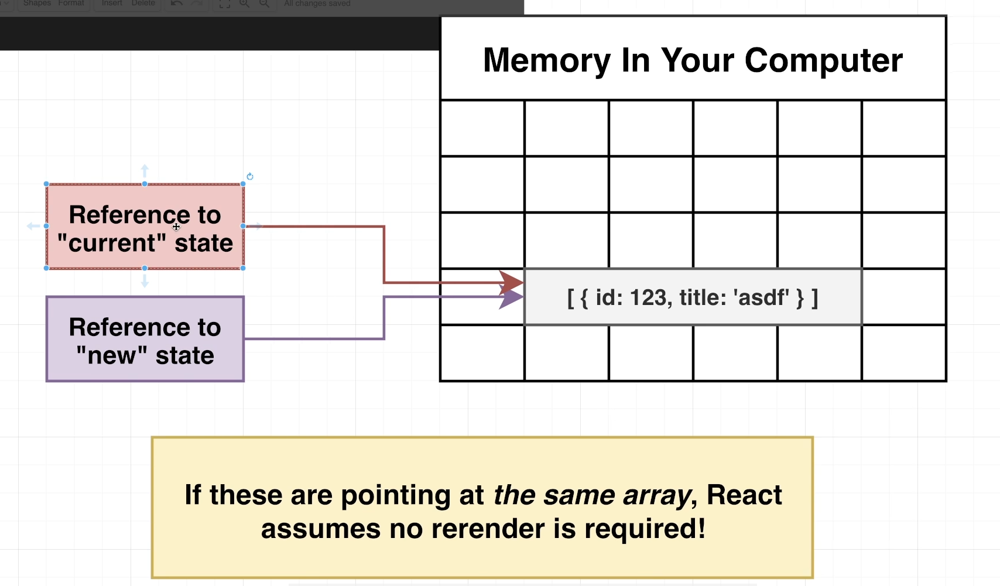
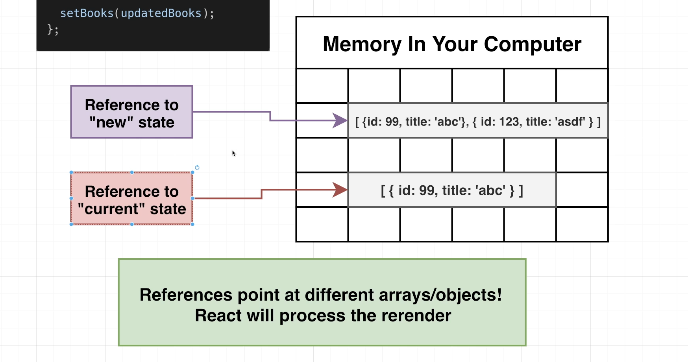
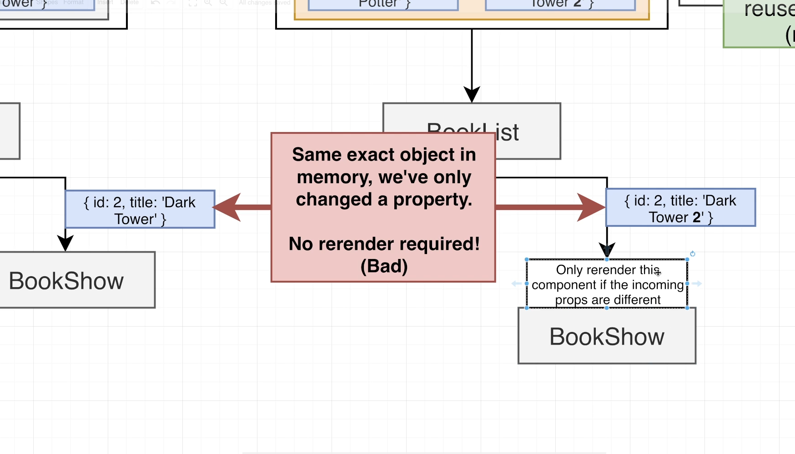
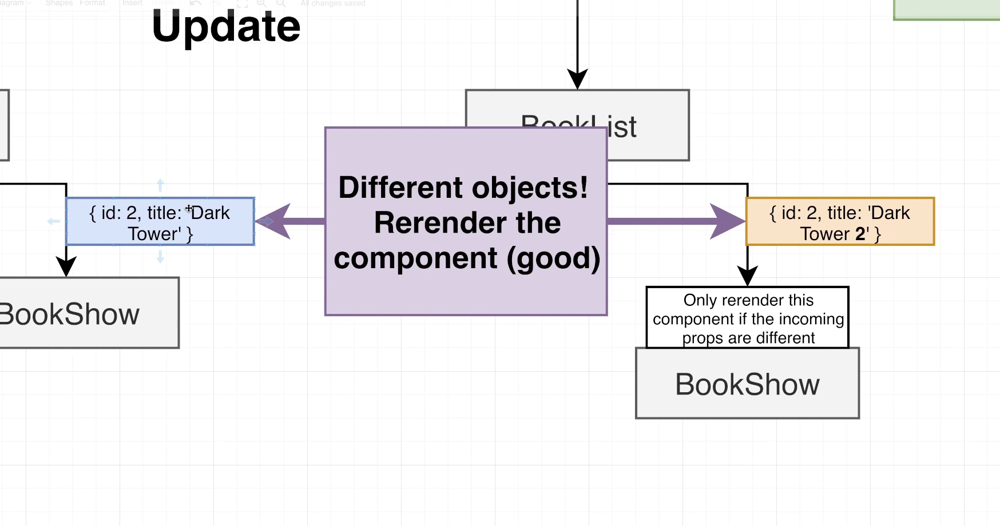

# INDEX

- [INDEX](#index)
  - [Interview Questions](#interview-questions)

---

## Interview Questions

[React Interview Questions & Answers](https://github.com/sudheerj/reactjs-interview-questions)

- What will happen if you used a state in a JSX block without defining initial state and just setting state in a `componentDidMount()` lifeCycle?

  - it will result an error, as on the first invocation of the `render()` function, the `componentDidMount()` isn't yet invoked and there's no initial state defined

- Why we use `useEffect()` or `componentDidMount()` to change state after mounting, why don't we just invoke the function we want directly in the component body?

  - it's because like that we would be calling this function each time we render which changes the state (with different state object than the current one in memory) and cause re-render again, and this will lead to **render infinite loop**

- Why React Hook `useState` uses `const` and not `let`?

  - because the state is immutable, so we can't change it, so we can't use `let` as it's mutable.

- why if I write

  ```jsx
  <h1
    onClick={() => {
      this.state.name = 'Ahmed';
    }}>
    Hi {this.state.name}
  </h1>
  ```

  it doesn't change the name in the page but if `console.log` it I see that the name is equal to 'Ahmed'

  - because the state is changed but the component needs to be rerendered as what is shown on the page is what we call **`object's reference by memory`**
  - **Note:** The state must be changed in a way that React recognized in order to trigger "re-rendering", and this is done using `setState()`

    - `setState` performs a **shallow merge** with the current `state` object which is to update the current object-keys with the keys given
    - so when we rerender we create a new `object(state)`, so we should use

      ```jsx
      this.setState(() => {
        name: "Ahmed",
      });
      ```

- Why (fetching with setting the state to the resolved value) without `componentDidMount()` or `useEffect()` results **infinite render**

  - because when fetching and changing the state (with different state object than the current one in memory) which cause re-render again and again.

  - because the resolved object/array is different from the one in the memory so the state gets reset over and over

- why we must open the app (in development/production modes) through a server

  - it's because libraries like **Babel**
  - and as it's a SPA, so the HTML will be empty and need to get the requested data (mounted react app) and this request is made through a server that serves these files and data

- why when updating state item or doing a modification to object or array, we don't mutate this item directly and instead we return a copy of this item with our modification. isn't creating new object/array costly?

  - Answer: This is done specially with reference-type data-structures like `object` and `array`, as if the (reference to current state and reference to new state) are pointing to the same object/array, React assumes no render is required!
    
    
    
    

- why in `reducer function` that we always `return` the current state and **override** it even if we're overriding all items in the state like here:

  ```js
  currentState: {
    count: 10,
    valueToAdd: 20
  }

  // .. in reducer function
  case ADD_VALUE_TO_COUNT:
    return {
      ...state, // why this??
      count: state.count + state.valueToAdd,
      valueToAdd: 0
    }
  ```

  - Answer: the reason is that in any time if the `state` object has some additional features been added, so that the updated state will be handled

- What happens if you used a context in the `useContext()` inside a component that is not wrapped with that context-provider ?
  - Answer: It will return the initial(default) value of that context value, as the provider is the one responsible for updating the context object value
