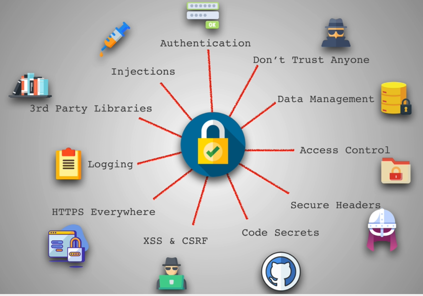
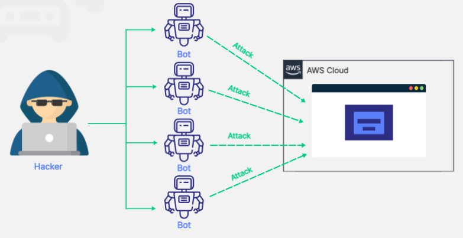
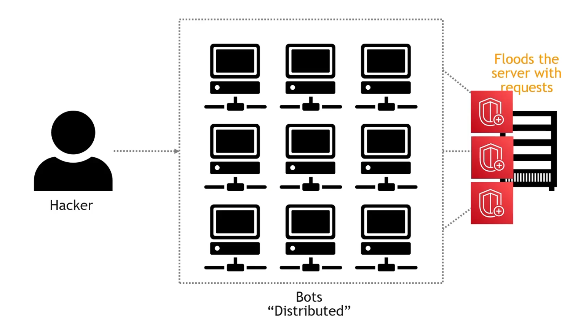
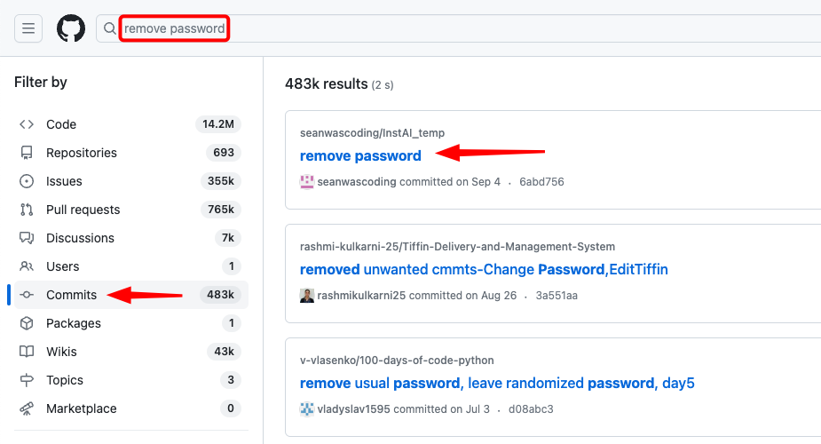
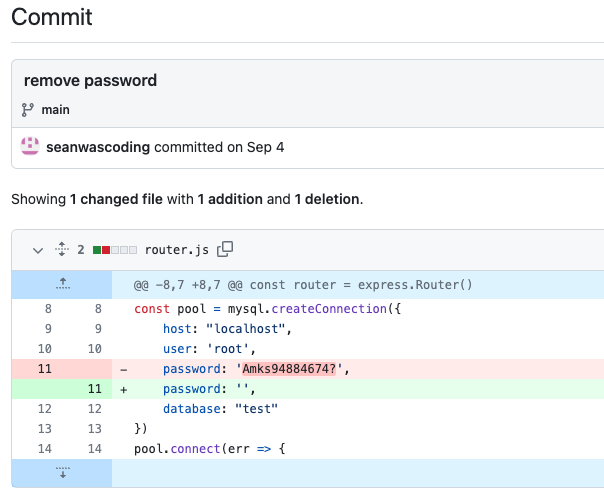

# INDEX

- [INDEX](#index)
  - [Security](#security)
  - [Injections](#injections)
    - [SQL Injection](#sql-injection)
    - [Cross-site scripting (XSS)](#cross-site-scripting-xss)
    - [Cross-site request forgery (CSRF)](#cross-site-request-forgery-csrf)
  - [3rd party libraries](#3rd-party-libraries)
  - [Logging](#logging)
  - [HTTPS \& Secure Headers](#https--secure-headers)
    - [Security concerns in using HTTP](#security-concerns-in-using-http)
    - [HTTPS for security](#https-for-security)
  - [Content Security Policy (CSP)](#content-security-policy-csp)
  - [Distributed Denial of Service (DDoS)](#distributed-denial-of-service-ddos)
  - [Code Secrets](#code-secrets)
  - [Access Control](#access-control)
  - [OWASP](#owasp)

---

## Security

It's the protection of digital information and IT assets from unauthorized access, use, disclosure, disruption, modification, or destruction in order to provide confidentiality, integrity, and availability.


- People and companies get the important of security **after** they get hacked. unlike other fields like performance, where you can see the difference immediately.
- Senior developers should be aware of security issues and how to prevent them. by using **secure coding practices** in their code.

- **Firewall**: a network security device that monitors incoming and outgoing network traffic and decides whether to allow or block specific traffic based on a defined set of security rules

> You can see security overview for any site from the **devtools**

---

## Injections

Injections are the most common security vulnerability in web applications. It happens when an attacker sends invalid data to the web application with the intention to make it do something that the application was not designed/programmed to do.

- It's the most important security vulnerability because it can lead to other vulnerabilities like **Broken Authentication** and **Sensitive Data Exposure**.

### SQL Injection

SQL injection is a code injection technique that might destroy your database. It's one of the most common web hacking techniques.

- It's a type of injection attack that allows an attacker to execute malicious SQL statements that control a web application’s database server.
- It allows an attacker to view data that they are not normally able to retrieve.
- It allows an attacker to modify data in the database.
- Examples:

  - `OR 1=1` -> to bypass the login page, by making the query always `true`.

    ```sql
    SELECT * FROM users WHERE username = 'admin' AND password = '' OR 1=1 --'
    -- By doing so, the check will always be true and the attacker will be able to login as admin
    -- By using the comment '--' we can ignore the rest of the query
    ```

  - `username = 'admin'` -> to have access to the admin account and do whatever you want.

    ```sql
    SELECT * FROM users WHERE username = 'admin'; DROP TABLE users --' AND password = 'password'
    ```

  - `VALUES ('admin', 'password')` -> to overwrite the admin password.

    ```sql
    INSERT INTO users (username, password) VALUES ('admin', 'password'); --'
    ```

- **How to prevent it?**

  - Use **prepared statements** with **parameterized queries**.

    - It pre-compiles the SQL query statement, and then it binds the parameters to the placeholders. So that we only send the `parameters` to the database server.
    - A `parameterized query` is a query in which placeholders are used for parameters and the parameter values are supplied at execution time.

      ```sql
      -- Wrong ❌
      SELECT * FROM users WHERE username = 'admin' AND password = 'password'

      -- Correct ✅
      SELECT * FROM users WHERE username = ? AND password = ?
      -- This query will be sent to the database server, and the parameters will be sent separately
      ```

    - Note: This is the best way to prevent SQL injection attacks, and it's supported by all major databases.

  - Use SQL query builders like `knex.js` and `sequelize.js`.
    - They're libraries that help you build SQL queries in a safe way.

---

### Cross-site scripting (XSS)

Cross-site scripting (`XSS`) is a type of security vulnerability typically found in web applications. `XSS` attacks enable attackers to inject client-side scripts into web pages **without validation or escaping**.

- A cross-site scripting vulnerability may be used by attackers to bypass access controls such as the **same-origin policy**.
- It usually involves
  - **stealing cookies**
  - **session hijacking**
  - **redirecting users**
  - **injecting ads**
  - **defacing websites**
  - **injecting malicious scripts**
- Examples:

  - Typing `<script>alert('XSS')</script>` in the `input` element or search bar, and when the admin search for something, the alert will pop up.
    - **Note:** This may not work because the javascript scripts are executed when the page is loaded, and the admin may not load the page. So there're other ways to do it. like depending on `Events` like `onmouseover`, `onload`, `onError`, ...
  - Typing `<script>window.location.href = 'https://google.com'</script>` in the `input` element or search bar, and when the admin search for something, the page will redirect to google.
  - Typing `<script>document.body.innerHTML = ''</script>` in the `input` element or search bar, and when the admin search for something, the alert will pop up.

- **How to prevent it?**

  - Sanitize (clean) the user input. by using `white-list` and `black-list` to prevent the browser from interpreting the input as HTML.

    - **white-list**: is a list of allowed values. (recommended way)
    - **black-list**: is a list of disallowed values.
    - Use `document.createTextNode()` instead of `document.innerHTML` to prevent the browser from interpreting the input as HTML.

      ```js
      // Wrong ❌
      const p = document.getElementById('paragraph');
      p.innerHTML = '<script>alert('XSS')</script>';

      // Correct ✅
      const p = document.getElementById('paragraph');
      const text = document.createTextNode('<script>alert('XSS')</script>');
      p.appendChild(text);
      ```

  - Escape the user input. by using escape characters to prevent the browser from interpreting the input as HTML.
    - ex: `&lt;` instead of `<`.

---

### Cross-site request forgery (CSRF)

It's a type of security vulnerability that allows an attacker to **impersonate** a user and send requests on their behalf. by using the user's **cookies**.

- It depends on that the user is logged in to the website using `cookies`. So if he went to a link that the attacker sent him, the attacker can do whatever he wants. because the browser will send the cookies with every request.
- It usually involves changing the user's `[email, password, role, permissions, credit card, ...]`
- Examples:

  - The attacker sends a `link` to the user. and when the user clicks on it, it will change their password or charge their credit card.

    ```html
    <a href="https://example.com/transfers?to=attacker&amount=1000">Click here to get $1000</a>
    ```

- **How to prevent it?**

  - Use `HTTPS`
  - Use libraries like `helmet` and `csurf` to prevent it.

    ```js
    app.use(
      helmet({
        contentSecurityPolicy: false
      })
    );
    ```

  - Use `CSRF tokens`

    - It's a random string that's generated by the server and sent to the client. and then the client sends it back to the server with every request.

      ```js
      res.cookie('csrf-token', 'random-string');
      ```

    - The server checks if the token is valid or not. if it's valid, it will process the request. if it's not valid, it will reject the request.
    - It's usually stored in a `cookie` or in the `local storage`.
    - It's usually sent in the `headers` of the request.

  - Use `session cookies` instead of `permanent cookies`.

    - `session cookies` are deleted when the browser is closed.

      ```js
      res.cookie('session', 'random-string', { expires: false });
      ```

    - `permanent cookies` are stored in the browser for a long time.

  - OR **don't use `cookies` at all. and use `JWT` instead**.

    - `cookies` require extra security steps like `CSRF tokens` and `HTTPS`. and they're vulnerable to `XSS` and `CSRF`.
    - `JWT` is a token that contains the user's data. and it's signed by the server. so the server can verify it.

---

## 3rd party libraries

The more libraries you use, the more security vulnerabilities you have. So you should be careful when using 3rd party libraries.

- When there's a security vulnerability in a library, it's called a **vulnerability disclosure**. and if it has a fix, it's called a **security patch**.

  - To check if a library has a vulnerability disclosure

    ```sh
    npm audit
    ```

  - To fix the vulnerabilities (if it has a fix)

    ```sh
    npm audit fix
    ```

---

## Logging

It's the process of recording events that happen in an application. It's used to track the activity of the application and to debug it.

- **Logs**: are the records of events that happened in an application.
  - **Log level**: is the severity of the log. It can be `info`, `warning`, `error`, ...
  - **Log message**: is the message that describes the event that happened in an application.
  - **Log file**: is a file that contains the logs of an application.
  - **Log rotation**: is the process of deleting old log files and creating new ones.
- By checking the logs, you can know what happened in your application, and you can debug it. So it's important to have a good logging system.
- systems without a good logging system are called **black boxes**. because you can't know what's happening inside them. and they're very likely to have security vulnerabilities.

  - if a security breach happens, you can't know what happened and how to fix it without a good logging system. or you might know what happened after a long time from an external source like a user. and not an internal source like the `logs`.

- Examples of logging libraries:

  - `winston`
  - `morgan` -> for express / Node.js
  - `pino`
  - `bunyan`
  - `debug`

- Notes:
  - **Don't log sensitive data** like passwords, credit card numbers, ...
  - **Don't log too much**. because it will be hard to read the logs and it will take a lot of space.
  - **Don't log too little**. because you won't be able to debug the application.
  - **Don't log in the client-side**. because the user can see the logs and it may contain sensitive data.

---

## HTTPS & Secure Headers

### Security concerns in using HTTP

The `HTTP` protocol is not secure. because it sends the data in plain text. so anyone can see the data.

- You're not certain that the data is sent to the right server. because anyone can pretend to be the server.
- So, the connection will be **insecure**. and it's vulnerable to `Man in the middle` attacks. Instead, you can use the `HTTPS` protocol. which is a secure version of `HTTP`.
  

---

### HTTPS for security

- **HTTPS** is a protocol that encrypts the data sent between the client and the server. It's used to protect the privacy and integrity of the data.

  - It uses `SSL/TLS` certificates to encrypt the data.
  - It's used in any website that has sensitive data like:
    - Forms
    - Login pages
    - Payment pages

> **Summary:** `HTTPS` gives you the certainty that the website (server) you're talking to is the right one.

- When using `HTTPS`, we can use **Secure Headers** to make the website more secure, by telling the browser to do something that will add extra security.

  - `X-Frame-Options`: is a header that tells the browser to prevent the website from being loaded in an iframe. and it's used to prevent `clickjacking` attacks.
  - `X-XSS-Protection`: is a header that tells the browser to prevent the website from being loaded if it detects a `XSS` attack. and it's used to prevent `XSS` attacks.
  - `X-Content-Type-Options`: is a header that tells the browser to prevent the website from being loaded if it detects a `MIME` type mismatch. and it's used to prevent `MIME` type mismatch attacks.
  - `Content-Security-Policy`: is a header that tells the browser to prevent the website from being loaded if it detects a `XSS` attack. and it's used to prevent `XSS` attacks.
  - `Strict-Transport-Security`: is a header that tells the browser to only use `HTTPS` for the website. and it's used to prevent `Man in the middle` attacks.
  - `Referrer-Policy`: is a header that tells the browser to prevent the website from being loaded if it detects a `Referrer` attack. and it's used to prevent `Referrer` attacks.
  - `Feature-Policy`: is a header that tells the browser to prevent the website from being loaded if it detects a `Feature` attack. and it's used to prevent `Feature` attacks.

- Now, browsers have **limit some functionalities** for websites that don't use `HTTPS`. like:

  - `Geolocation`
  - `Webcam`
  - `Microphone`
  - `Notifications`
  - `Payment`
  - `Service Workers`
  - `...`

  > This is done to give users more privacy and security.

- Also, by using `HTTPS`, you can use `HTTP/2` and `HTTP/3` which are faster than `HTTP/1.1` ⚡️.

---

## Content Security Policy (CSP)

**Content Security Policy (CSP)** is an added layer of security that helps to detect and mitigate certain types of attacks, including Cross-Site Scripting (XSS) and data injection attacks

- Browsers that don't support it still work with servers that implement it, and vice versa: browsers that don't support CSP ignore it, functioning as usual, defaulting to the standard same-origin policy for web content. If the site doesn't offer the CSP header, browsers likewise use the standard same-origin policy.
- To enable CSP, you need to configure your web server to return the `Content-Security-Policy` HTTP header.

  - Alternatively, the `<meta>` element can be used to configure a policy, for example:

    ```html
    <meta
      http-equiv="Content-Security-Policy"
      content="default-src 'self'; img-src https://*; child-src 'none';"
    />
    ```

- Configuring Content Security **Policy** involves adding the `Content-Security-Policy` HTTP header to a web page and giving it values to control what resources the user agent is allowed to load for that page.

  - For example, a page that uploads and displays images could allow images from anywhere, but restrict a form action to a specific endpoint. A properly designed Content Security Policy helps protect a page against a cross-site scripting attack.

- **Writing a policy**

  - A policy is described using a series of policy directives, each of which describes the policy for a certain resource type or policy area.
  - A policy needs to include a **default-src** or **script-src** directive to prevent inline scripts from running, as well as blocking the use of `eval()`.
  - A policy needs to include a **default-src** or **style-src** directive to restrict inline styles from being applied from a `<style>` element or a `style attribute`.

  ```js
  // wants all content to come from the site's own origin (this excludes subdomains.)
  Content-Security-Policy: default-src 'self'

  // wants to allow content from a trusted domain and all its subdomains (it doesn't have to be the same domain that the CSP is set on.)
  Content-Security-Policy: default-src 'self' example.com *.example.com

  // wants to allow users of a web application to include images from any origin in their own content, but to restrict audio or video media to trusted providers, and all scripts only to a specific server that hosts trusted code.
  Content-Security-Policy: default-src 'self'; img-src *; media-src example.org example.net; script-src userscripts.example.com
  ```

> For more info & examples -> [here](https://developer.mozilla.org/en-US/docs/Web/HTTP/CSP)

---

## Distributed Denial of Service (DDoS)

A `DDoS` attack causes a traffic jam on a website or web application in an attempt to flood the server with requests and cause it to crash.



This result in that a real user can't access the website **(Denied!)**

- In order to prevent this, you can use `AWS Shield` to protect your applications from `DDoS` attacks.
  

---

## Code Secrets

- **Environment variables** are variables that are set outside of the application. and they're used to store sensitive data like `API keys`, `database credentials`, `passwords`, ...

  - They're used to store sensitive data because they're not stored in the code. and they're not sent to the client.

- **Commit history** is the history of commits in a repository. and it's used to track the changes in the code.

  - It's important to keep the commit history private. because it may contain sensitive data like `API keys`, `database credentials`, `passwords`, ...
    
    

---

## Access Control

**Access control** is the process of controlling who can access what in an application. It's used to prevent unauthorized access to sensitive data.

- **Principal of least privilege**: is the process of giving users the minimum permissions they need to do their job. and it's used to prevent unauthorized access to sensitive data.
  - It's usually done by using `roles` and `permissions`.
    - **Roles** are the groups of users. and they're used to group users with similar permissions.
    - **Permissions** are the actions that users can do. and they're used to control what users can do.
- **CORS** is a mechanism that allows a website to access resources from another website. and it's used to prevent unauthorized access to sensitive data.
  - It's usually done by using `Access-Control-Allow-Origin` header.
  - It's usually used in `APIs` to allow other websites to access the data.
  - It's usually used in `CDNs` to allow other websites to access the files.

---

## OWASP

**Open Web Application Security Project (OWASP)**: is an an online community that produces articles, methodologies, documentation, tools, and technologies in the field of web application security.

- **OWASP Top 10** is the list of the 10 most common application vulnerabilities. It also shows their risks, impacts, and countermeasures. Updated every three to four years, these're the ones for 2021:
  - `Injection`
    - A code injection happens when an attacker sends invalid data to the web application with the intention to make it do something that the application was not designed/programmed to do.
    - the most common example around this security vulnerability is the **SQL query consuming untrusted data**
    - The core of a code injection vulnerability is the lack of **validation** and **sanitization** of the data used by the web application
  - `Broken authentication`
    - A broken authentication vulnerability can allow an attacker to use manual and/or automatic methods to try to gain control over any account they want in a system – or even worse – to gain complete control over the system.
    - Broken authentication usually refers to logic issues that occur on the application authentication’s mechanism, like bad session management prone to username enumeration – when a malicious actor uses brute-force techniques to either guess or confirm valid users in a system.
    - To minimize broken authentication risks -> **avoid leaving the login page for admins publicly accessible to all visitors of the website**
      - ex:
        - `/administrator on Joomla!`
        - `/wp-admin/ on WordPress`
      - **brute force** is the act of trying many possible combinations
  - `Sensitive data exposure`
    - It consists of compromising data that should have been protected (Credentials, Credit card numbers, Social Security Numbers, ...)
    - one way to protect it on a website is by having an **SSL certificate**.
  - `XML external entities (XXE)`
    - is a type of attack against an application that parses **XML** input. This attack occurs when XML input containing a reference to an external entity is processed by a weakly configured XML parser.
  - `Broken access control`
    - In website security, access control means putting a limit on what sections or pages visitors can reach, depending on their needs.
  - `Security misconfigurations`
  - `Cross site scripting (XSS)`
    - XSS attacks consist of injecting malicious client-side scripts into a website and using the website as a propagation method.
    - The risks behind XSS is that it allows an attacker to inject content into a website and modify how it is displayed, forcing a victim’s browser to execute the code provided by the attacker while loading the page.
  - `Insecure deserialization`
    - The process of **serialization** is converting objects to byte strings.
    - The process of **deserialization** is converting byte strings to objects.
  - `Using components with known vulnerabilities`
  - `Insufficient logging and monitoring`

> - For more details->
>   - [OWASP Top 10 Security Risks](https://sucuri.net/guides/owasp-top-10-security-vulnerabilities-2020/)
>   - [Brute Force Attack](https://sucuri.net/guides/what-is-brute-force-attack/)
> - OWASP Web Application Security Testing Checklist -> [here](https://github.com/0xRadi/OWASP-Web-Checklist)
> - OWASP Cheat Sheet Series -> [here](https://cheatsheetseries.owasp.org/cheatsheets/AJAX_Security_Cheat_Sheet.html)

---
