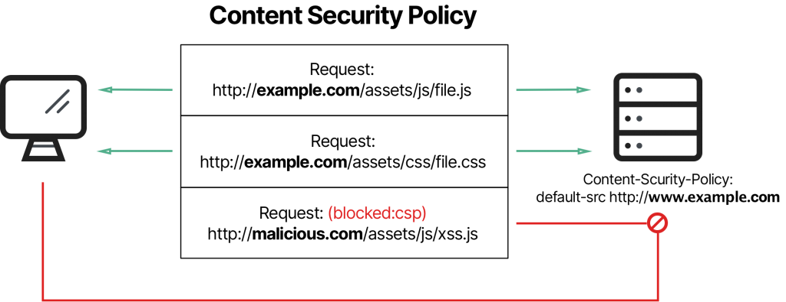
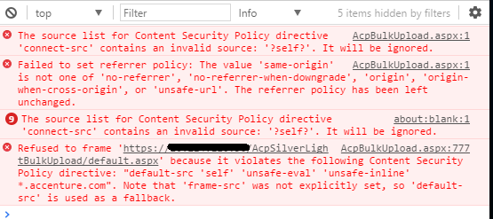
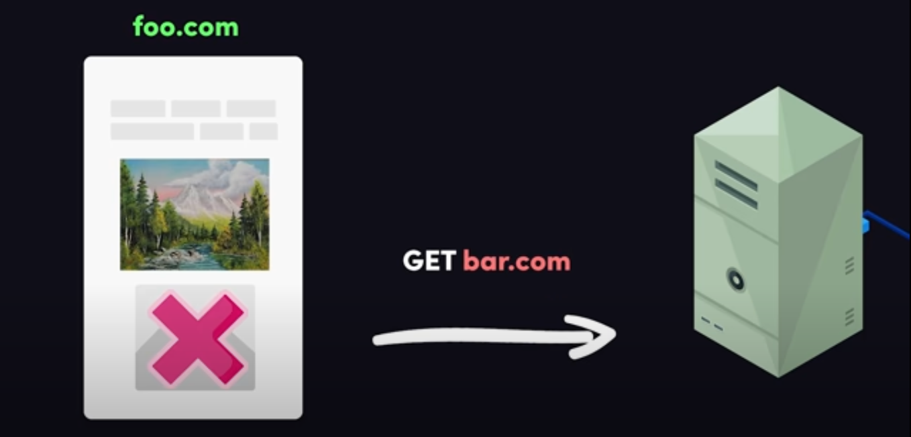
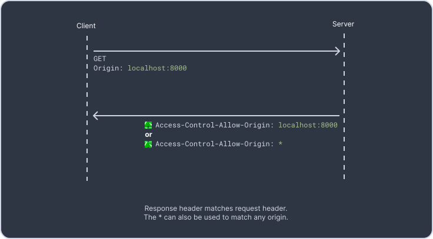
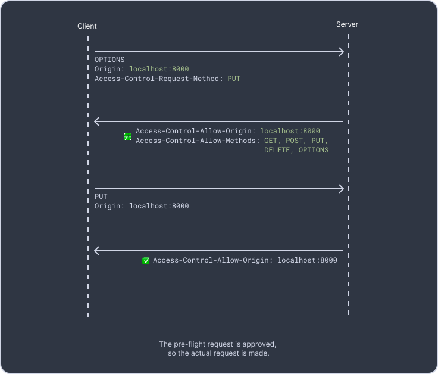
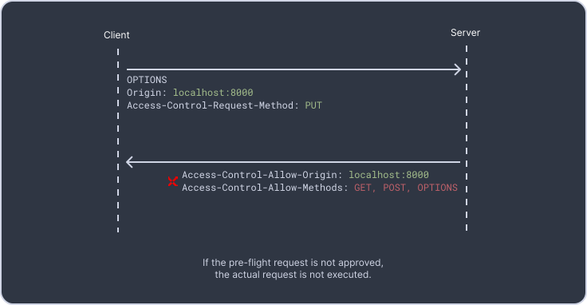

# INDEX

- [INDEX](#index)
  - [Content Security Policy (CSP)](#content-security-policy-csp)
    - [Why is a Content Security Policy Important?](#why-is-a-content-security-policy-important)
    - [When to use or not to use CSP ?](#when-to-use-or-not-to-use-csp-)
    - [Implementing Content Security Policy](#implementing-content-security-policy)
      - [CSP Headers](#csp-headers)
      - [CSP policy](#csp-policy)
    - [How to fix CSP errors ?](#how-to-fix-csp-errors-)
  - [HTTP Access Control (CORS)](#http-access-control-cors)
    - [What requests use CORS ?](#what-requests-use-cors-)
    - [How it works ?](#how-it-works-)
    - [How to fix CORS errors?](#how-to-fix-cors-errors)

---

## Content Security Policy (CSP)

**Content Security Policy (CSP)** is an added layer of security that helps to detect and mitigate certain types of attacks, including Cross-Site Scripting (XSS) and data injection attacks

It basically allow to load sources from the specified origins -> hardcode from which origin you expect to load content in your application, and block other origins that are not allowed.

> It's a (`HTTP` header or a `<meta>` element) that allows you to control what resources the user agent is allowed to load for a given page. (Restrict loading assets from an unknown/malicious domain)

- With `CSP`, you can limit which data sources are allowed by a web application, by defining the appropriate `CSP` **directive** in the HTTP response header.
  
- In addition to whitelisting domains from which a browser may load content, servers can also specify the allowed protocols. For example, the server can specify that browsers must load content via `HTTPS`.

---

### Why is a Content Security Policy Important?

- **Mitigating Cross Site Scripting**

  - The main purpose of `CSP` is to mitigate and detect `XSS` attacks. `XSS` attacks exploit the browser’s trust in the content received from the server. The victim’s browser is exposed to execution of malicious scripts, because the browser trusts the source of the content.

  - `CSP` allows server administrators to reduce or eliminate the ability of an attacker to trigger `XSS`, by specifying which Internet domains browsers should consider as legitimate sources of executable scripts. (by whitelisting trusted sources)

    - Ex: if a user enters a script in a form/input element, it will be executed in the browser.

      ```html
      <!-- input will have this value -->
      <input type="text" value="
      <script type="text/javascript" src="malicious-site.com/script.js" />
      " />
      ```

    - Or, EX: Entering this script on an input, so that it would be sent to server and then sent to other users to show inputs from other users

      ```html
      <input type="text" value=" 
      ```

      - This script will be executed in the browser of the user who sees the input. because the browser trusts the source of the content, and the `onerror` event will be triggered because the `src` attribute is empty.

    - How to prevent this ? -> by using `CSP` headers.
      - `CSP` headers will prevent the browser from executing the script, **because it's not in the whitelist**.

  - CSP-compliant browsers only run scripts contained source files that are retrieved from whitelisted domains, and ignore all other scripts (including inline script and `HTML` event handling attributes).

- **Mitigating Packet Sniffing and Enforcing HTTPS**

  - In addition to whitelisting domains from which a browser may load content, servers can also specify the allowed protocols. For example, the server can specify that browsers must load content via `HTTPS`.
  - You can use `CSP` to enforce the `HTTPS` protocol to any value defined in `*-src` attributes, by adding the `https://` prefix to any URL in your **whitelist**. This way resources will never load over an unencrypted `HTTP` connection. You can achieve the same effect by adding the `block-all-mixed-content` property.

    ```js
    Content-Security-Policy: default-src 'self' https://*;
    ```

- In addition, CSP can prevent the following common vulnerabilities:

  - Unsigned inline `CSS` statements in `<style>` tags
  - Unsigned inline `Javascript` in `<script>` tags
  - Dynamic `CSS` using `CSSStyleSheet.insertRule()`
  - Dynamic `Javascript` code using `eval()`

- It is best to keep the `script` and `CSS` in separate files that are referenced by the `HTML` page. If your site needs to allow this, you can enable it using the keywords `unsafe-eval` and `unsafe-inline`.

---

### When to use or not to use CSP ?

- **When to use it:**

  - Complex web applications are more sensitive to `XSS` attacks, and therefore should use `CSP` to mitigate them.
  - Application that manages sensitive data, such as administrative user interfaces, device management consoles, or any products hosting files, documents or messages created by users.
    - In modern frameworks, adding CSP is easy and can provide high return of investment in terms of added security.

- **When not to use it:**
  - Static applications hosted on their own domains or subdomains without login or cookies.
  - Applications that have experienced `XSS` attacks in the past, or have known vulnerabilities in templates or frameworks they are using.
    - In this case the best approach is to invest in patching or fixing vulnerable code, because CSP on its own will not provide sufficient protection.
    - CSP should be added on top of a secure application with no known vulnerabilities.

---

### Implementing Content Security Policy

- The best way to add CSP retroactively to an entire website is to **define a completely empty whitelist**, essentially blocking everything. Initially, run CSP in report-only mode, which means the browser evaluates rules but does not block the content yet.
  - You can then review errors and see which of them should be added to the list (allowed) or not (disallowed).
  - The difficult part is deciding how much to block. For example, if you are using a script hosted through a CDN and you allow the addresses, you accept all traffic coming from those CDNs, which could include malicious traffic.

> Running CSP in report mode for a few weeks, or at the most a few months, should give you all the possible cases of errors. When you feel your set of rules captures all relevant use cases, disable report-only and start blocking resources that are not on the whitelist.

#### CSP Headers

- To enable CSP, you need to:

  - **Option 1:** configure your web server to return the `Content-Security-Policy` HTTP header.

    ```js
    Content-Security-Policy: default-src 'self'
    ```

  - **Option 2:** use the `Content-Security-Policy` meta tag.

    ```html
    <meta http-equiv="Content-Security-Policy" content="default-src 'self'" />
    ```

  - **Option 3:** Inject the `Content-Security-Policy` header using a `Content-Security-Policy` middleware.

    ```js
    const express = require('express');
    const csp = require('helmet-csp');

    const app = express();

    app.use(
      csp({
        directives: {
          defaultSrc: ["'self'"],
          scriptSrc: ["'self'", "'unsafe-inline'"],
          styleSrc: ["'self'", "'unsafe-inline'"]
        }
      })
    );
    ```

    > Trick: You can inject the `Content-Security-Policy` header when testing your app using `Postman` or [`Requestly` extension](https://requestly.io/blog/learn-and-bypass-content-security-policy-http-response-header/).

- `Content-Security-Policy`

  - It's the main header that instructs the browser to apply the policy.

- `Content-Security-Policy-Report-Only`

  - Allows you to experiment with policies by monitoring (but not enforcing) their effects.
  - We can specify a report endpoint to which the browser will send any CSP violations as a `JSON` object.

- `CSP` allow you to specify source locations for a variety of resource types which are referred to as `fetch-directives`.
  - `default-src`: is the default policy for loading content such as `JavaScript`, `Images`, `CSS`, `Fonts`, `AJAX` requests, `Frames`, `HTML5 Media`.
    - the value of this property `'self'` — meaning the browser can only upload resources from the current website (same origin).
  - `script-src`: restricts the locations from which you can load scripts.
    - If your website or application doesn't use client-side scripts, you can set this directive to `'none'`.
    - If you do use client-side scripts, you should set this directive to `'self'` if you host your own scripts.
  - `style-src`: restricts the locations from which you can load stylesheets.
  - `img-src`: restricts the locations from which you can load images.
  - `font-src`: restricts the locations from which you can load fonts.
  - `etc...`

#### CSP policy

Coming up with the `CSP` policies for your site can be a bit tricky as there are a lot of options and directives involved. Your site might also be pulling in dependencies from a variety of sources. Setting `CSP` policies is also an excellent time to review your application dependencies and manage them correctly. For e.g., if you have a javascript file from an untrusted source, etc.

- Configuring Content Security **Policy** involves adding the `Content-Security-Policy` HTTP header to a web page and giving it values to control what resources the user agent is allowed to load for that page.

  - For example, a page that uploads and displays images could allow images from anywhere, but restrict a form action to a specific endpoint. A properly designed Content Security Policy helps protect a page against a cross-site scripting attack.

- A policy is described using a series of policy directives, each of which describes the policy for a certain resource type or policy area.
- A policy needs to include a **default-src** or **script-src** directive to prevent inline scripts from running, as well as blocking the use of `eval()`.
- A policy needs to include a **default-src** or **style-src** directive to restrict inline styles from being applied from a `<style>` element or a `style attribute`.

  ```http
  // wants all content to come from the site's own origin (this excludes subdomains.)
  Content-Security-Policy: default-src 'self'

  // wants to allow content from a trusted domain and all its subdomains (it doesn't have to be the same domain that the CSP is set on.)
  Content-Security-Policy: default-src 'self' example.com *.example.com

  // wants to allow users of a web application to include images from any origin in their own content, but to restrict audio or video media to trusted providers, and all scripts only to a specific server that hosts trusted code.
  Content-Security-Policy: default-src 'self'; img-src *; media-src example.org example.net; script-src userscripts.example.com
  ```

> For more info & examples -> [here](https://developer.mozilla.org/en-US/docs/Web/HTTP/CSP)

---

### How to fix CSP errors ?

- If a `CSP` error occurs, the browser will return an error message instead of the response from the other origin.
  
- To see what's wrong with the request, open the network tab in the browser's developer tools and:
  - Check if the `Content-Security-Policy` response header is present and matches the `Content-Security-Policy` header from the request.
    - If they don't match, the browser will block the response.
  - If it's a **preflight** request, also check if the response has the `Access-Control-Allow-Methods` header and if the value contains the HTTP method being used by the actual request.
- To fix it, you have to modify the `meta` tag or the `Content-Security-Policy` header in the server to match the request.

  ```html
  <meta http-equiv="Content-Security-Policy" content="default-src 'self'" />
  <!-- or for a specific site -->
  <meta http-equiv="Content-Security-Policy" content="default-src 'self' https://example.com" />
  ```

  ```js
  Content-Security-Policy: default-src 'self'
  // or for a specific site
  Content-Security-Policy: default-src 'self' https://example.com
  ```

---

## HTTP Access Control (CORS)

**Cross-Origin Resource Sharing (CORS)** is an `HTTP-header` based mechanism that allows a website to access resources from another website. and it's used to prevent unauthorized access to sensitive data.

- It allows a server to indicate any other `origins` (domain, scheme, or port) than its own from which a browser should permit loading of resources.
- For security reasons, browsers restrict cross-origin HTTP requests initiated from scripts.

  - For example, `Fetch API` follow the `same-origin policy`. So, a web application using those APIs can only request `HTTP` resources from the same origin the application was loaded from unless the response from the other origin includes the right CORS headers.
    - `same-origin policy`: is a policy that prevents a website from accessing data from another website.
  - Example of cross-origin request in the frontend from 2 different origins:
    
    - Here, the main origin is `domain-a.com` and the other origin is `domain-b.com`.
    - The requests to/from same origin are called `same-origin requests`, and **they're allowed by default and don't require any special headers**.
      
    - The requests to/from different origin are called `cross-origin requests`, and **they're not allowed by default and require special headers**.
      

- Browsers use `CORS` in `APIs` such as `fetch()` to mitigate the risks of `cross-origin` `HTTP` requests.

  - It allows servers to specify who (i.e., which origins) can access the assets & info on the server, among many other things.

- It's usually done by using `Access-Control-Allow-Origin` header in `HTTP` requests.
  - The value in the response header should match the value of the `Origin` header from the request.
  - If the value matches, the browser will allow the response to be read by the requesting `origin`.
    
  - If the value doesn't match, the browser will block the response.
    

---

### What requests use CORS ?

Usually, `CORS` is used in `HTTP` requests that are not `same-origin` requests. For example:

- `XMLHttpRequest` and `Fetch API` follow the `same-origin policy`. So, a web application using those APIs can only request `HTTP` resources from the same origin the application was loaded from unless the response from the other origin includes the right CORS headers.
- `Web Fonts` (for example, `@font-face` used in `CSS`).
  - (`<link rel="stylesheet">` in `HTML`) can be loaded from any origin. However, `TTF/OTF` fonts for `@font-face` must be `same-origin` and `CORS` headers are required to display them.
- `WebGL` textures -> 3D graphics.
- `Images` and `Videos` (for example, ``, `<canvas>`, and `<video>` elements) can be loaded from any origin, but `CORS` headers are needed to `canvas` read their `pixel data`.
- CSS Shapes from images.

---

### How it works ?

- The `CORS` mechanism works by adding `HTTP` headers to cross-origin `HTTP` requests and responses.
- Requests that use methods other than `GET`, `POST`, `HEAD`, or requests with non-standard headers, need to be **pre-flighted**.

  - When making these requests, browsers will send a **pre-flight** request using the `OPTIONS` HTTP method, and servers will respond with the `Access-Control-Allow-Origin` and the `Access-Control-Allow-Methods headers`.

    - If both headers match the request origin and method, the actual request can be made.
      
    - If the headers don't match, the browser will block the response.
      

  - Such `cross-origin` requests are pre-flighted because they may have implications for server data. (in order to **determine whether the actual request is safe to send**).

    > Usually the preflight requests are sent for `POST`, `PUT` and `DELETE` methods. This is because these methods can have side-effects on user data, for example, deleting data or buying something. **GET** requests are not usually preflighted.

  - Upon the **approval** from the server, the browser will send the actual request.
  - Servers can also allow **Preflight Caching** by specifying `Access-Control-Max-Age` in the response.
    - This will allow the browser to cache the result of the preflight request to be used in later similar requests.
    - This will reduce the number of preflight requests sent to the server.

- Servers can also notify clients whether "credentials" (including `Cookies` and `HTTP Authentication` data) should be sent with requests.

  - **Credentials** are cookies, authorization headers or TLS client certificates.
  - **Credentials** are allowed by default, but you can specify `Access-Control-Allow-Credentials: false` in the response to disallow credentials in the request.

---

### How to fix CORS errors?

- If a `CORS` error occurs, the browser will return an error message instead of the response from the other origin.
  
  

- To see what's wrong with the request, open the network tab in the browser's developer tools and:
  - Check if the `Access-Control-Allow-Origin` response header is present and matches the `Origin` header from the request.
  - If it's a **preflight** request, also check if the response has the `Access-Control-Allow-Methods` header and if the value contains the HTTP method being used by the actual request.
- After verifying what response headers are missing or have the wrong value all you have to do is update the server to respond with the proper headers. In ExpressJS for example this can be easily configured by using the `cors` middleware:

  ```js
  const express = require('express');
  const cors = require('cors');
  const app = express();

  cors({ origin: 'http://example.com' });
  app.use(cors()); // enable all CORS requests

  app.get('/api', function (req, res, next) {
    res.json({ msg: 'success' });
  });

  app.listen(3000);
  ```

- **Note**: A good thing to understand when debugging CORS errors is that they don't happen when using tools like `Postman` or `curl`. So even if you are getting `CORS` errors in the browser, the same request will work just fine when sent by these tools.
  - These tools don't make cross-origin requests. They send a top-level network call (like if you are opening the URL on a new browser tab).
  - Although CORS are configured on the server side, it is the client's decision to honor these configurations or not. Most browsers do enforce it for security reasons, but developer tools don't care about it.

> [Video on how to fix CORS error](https://www.youtube.com/watch?v=PNtFSVU-YTI)

---
