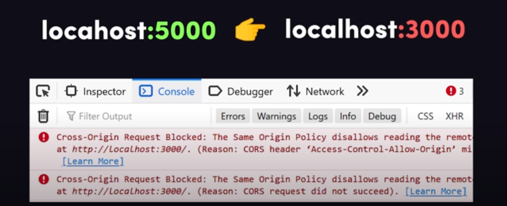

# INDEX

- [INDEX](#index)
  - [HTTP Access Control (CORS)](#http-access-control-cors)
    - [What requests use CORS ?](#what-requests-use-cors-)
    - [How it works ?](#how-it-works-)
    - [How to fix CORS errors?](#how-to-fix-cors-errors)
  - [Content Security Policy (CSP)](#content-security-policy-csp)

---

## HTTP Access Control (CORS)

**Cross-Origin Resource Sharing (CORS)** is an `HTTP-header` based mechanism that allows a website to access resources from another website. and it's used to prevent unauthorized access to sensitive data.

- It allows a server to indicate any other `origins` (domain, scheme, or port) than its own from which a browser should permit loading of resources.
- For security reasons, browsers restrict cross-origin HTTP requests initiated from scripts.

  - For example, `Fetch API` follow the `same-origin policy`. So, a web application using those APIs can only request `HTTP` resources from the same origin the application was loaded from unless the response from the other origin includes the right CORS headers.
    - `same-origin policy`: is a policy that prevents a website from accessing data from another website.
  - Example of cross-origin request in the frontend from 2 different origins:
    
    - Here, the main origin is `domain-a.com` and the other origin is `domain-b.com`.
    - The requests to/from same origin are called `same-origin requests`, and **they're allowed by default and don't require any special headers**.
      
    - The requests to/from different origin are called `cross-origin requests`, and **they're not allowed by default and require special headers**.
      

- Browsers use `CORS` in `APIs` such as `fetch()` to mitigate the risks of `cross-origin` `HTTP` requests.

  - It allows servers to specify who (i.e., which origins) can access the assets & info on the server, among many other things.

- It's usually done by using `Access-Control-Allow-Origin` header in `HTTP` requests.
  - The value in the response header should match the value of the `Origin` header from the request.
  - If the value matches, the browser will allow the response to be read by the requesting `origin`.
    
  - If the value doesn't match, the browser will block the response.
    

---

### What requests use CORS ?

Usually, `CORS` is used in `HTTP` requests that are not `same-origin` requests. For example:

- `XMLHttpRequest` and `Fetch API` follow the `same-origin policy`. So, a web application using those APIs can only request `HTTP` resources from the same origin the application was loaded from unless the response from the other origin includes the right CORS headers.
- `Web Fonts` (for example, `@font-face` used in `CSS`).
  - (`<link rel="stylesheet">` in `HTML`) can be loaded from any origin. However, `TTF/OTF` fonts for `@font-face` must be `same-origin` and `CORS` headers are required to display them.
- `WebGL` textures -> 3D graphics.
- `Images` and `Videos` (for example, ``, `<canvas>`, and `<video>` elements) can be loaded from any origin, but `CORS` headers are needed to `canvas` read their `pixel data`.
- CSS Shapes from images.

---

### How it works ?

- The `CORS` mechanism works by adding `HTTP` headers to cross-origin `HTTP` requests and responses.
- Requests that use methods other than `GET`, `POST`, `HEAD`, or requests with non-standard headers, need to be **pre-flighted**.

  - When making these requests, browsers will send a **pre-flight** request using the `OPTIONS` HTTP method, and servers will respond with the `Access-Control-Allow-Origin` and the `Access-Control-Allow-Methods headers`.

    - If both headers match the request origin and method, the actual request can be made.
      
    - If the headers don't match, the browser will block the response.
      

  - Such `cross-origin` requests are pre-flighted because they may have implications for server data. (in order to **determine whether the actual request is safe to send**).

    > Usually the preflight requests are sent for `POST`, `PUT` and `DELETE` methods. This is because these methods can have side-effects on user data, for example, deleting data or buying something. **GET** requests are not usually preflighted.

  - Upon the **approval** from the server, the browser will send the actual request.
  - Servers can also allow **Preflight Caching** by specifying `Access-Control-Max-Age` in the response.
    - This will allow the browser to cache the result of the preflight request to be used in later similar requests.
    - This will reduce the number of preflight requests sent to the server.

- Servers can also notify clients whether "credentials" (including `Cookies` and `HTTP Authentication` data) should be sent with requests.

  - **Credentials** are cookies, authorization headers or TLS client certificates.
  - **Credentials** are allowed by default, but you can specify `Access-Control-Allow-Credentials: false` in the response to disallow credentials in the request.

---

### How to fix CORS errors?

- If a `CORS` error occurs, the browser will return an error message instead of the response from the other origin.
  
  

- To see what's wrong with the request, open the network tab in the browser's developer tools and:
  - Check if the `Access-Control-Allow-Origin` response header is present and matches the `Origin` header from the request.
  - If it's a **preflight** request, also check if the response has the `Access-Control-Allow-Methods` header and if the value contains the HTTP method being used by the actual request.
- After verifying what response headers are missing or have the wrong value all you have to do is update the server to respond with the proper headers. In ExpressJS for example this can be easily configured by using the `cors` middleware:

  ```js
  const express = require('express');
  const cors = require('cors');
  const app = express();

  cors({ origin: 'http://example.com' });
  app.use(cors()); // enable all CORS requests

  app.get('/api', function (req, res, next) {
    res.json({ msg: 'success' });
  });

  app.listen(3000);
  ```

- **Note**: A good thing to understand when debugging CORS errors is that they don't happen when using tools like `Postman` or `curl`. So even if you are getting `CORS` errors in the browser, the same request will work just fine when sent by these tools.
  - These tools don't make cross-origin requests. They send a top-level network call (like if you are opening the URL on a new browser tab).
  - Although CORS are configured on the server side, it is the client's decision to honor these configurations or not. Most browsers do enforce it for security reasons, but developer tools don't care about it.

> [Video on how to fix CORS error](https://www.youtube.com/watch?v=PNtFSVU-YTI)

---

## Content Security Policy (CSP)
