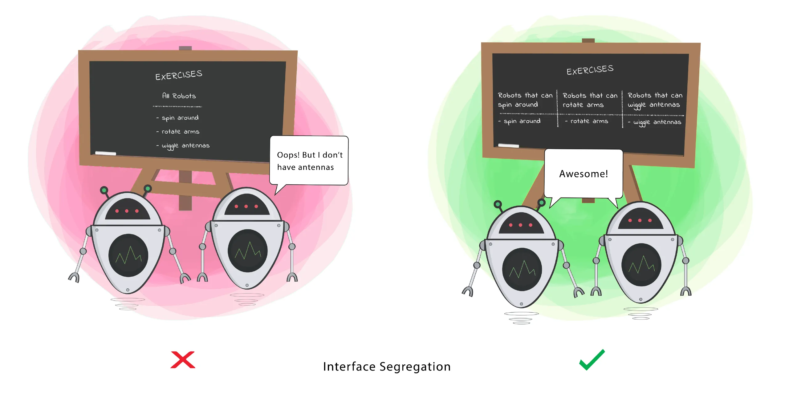

# INDEX

- [INDEX](#index)
  - [Design Patterns](#design-patterns)
  - [SOLID Principles](#solid-principles)
    - [S - Single Responsibility Principle (S.R.P)](#s---single-responsibility-principle-srp)
    - [O - Open-Closed Principle (O.C.P)](#o---open-closed-principle-ocp)
    - [L - Liskov Substitution Principle](#l---liskov-substitution-principle)
    - [I - Interface Segregation Principle](#i---interface-segregation-principle)
    - [D - Dependency Inversion Principle (D.I.P)](#d---dependency-inversion-principle-dip)

---

## Design Patterns

They're best practices for solving common problems in software design.

- **Design Patterns** are general reusable solutions to commonly occurring problems within a given context in software design.
  - it is a description or **template** for how to solve a problem that can be used in many different situations.
  - it is a proven solution to a common problem in a specific context.
  
- **Design Patterns** are categorized into three groups:
  1. **Creational Patterns**: deal with the creation of objects.
  2. **Structural Patterns**: deal with the composition of classes or objects.
  3. **Behavioral Patterns**: deal with the communication between classes and objects.

---

## SOLID Principles

They're best practices for writing clean and maintainable code. They're a set of principles that help us write loosely coupled and extensible code.

> **"loosely coupled"** code is code that is not dependent on other code.

- "SOLID": is an acronym for the first five object-oriented design (OOD) principles by Robert C. Martin (Uncle Bob).
- we usually use `class` to explain the SOLID principles, but they can also be applied to `functions` and `modules`.

### S - Single Responsibility Principle (S.R.P)

It states that a class should have one and only one reason to change, meaning that a class should have only one job.


- If a Class has many responsibilities, it increases the possibility of bugs because making changes to one of its responsibilities, could affect the other ones without you knowing.
  - This principle aims to separate behaviours so that if bugs arise as a result of your change, it won't affect other unrelated behaviours.

- Ex: a class that is responsible for sending emails should not be responsible for storing the email addresses.
  - because if we change the way we store the email addresses, we'll have to change this class. and this is a violation of the S.R.P.

  ```py
  # This is a violation of the S.R.P. ❌
  class EmailSender:
    def send_email(self, message):
      pass

    def store_email_address(self, address):
      pass

  # This is a better design. ✅
  class EmailSender:
    def send_email(self, message):
      # code to send the email
      EmailStore().store_email_address(address) # we're using the EmailStore class to store the email address. so if we change the way we store the email addresses, we'll only have to change the EmailStore class.

  class EmailStore:
    def store_email_address(self, address):
      pass
  ```

- Ex: too much logic in one single function

  ```py
  # This is a violation of the S.R.P. ❌
  def customerSalesReport(customerId):
    customer = db.getCustomerInfo(customerId)
    orders = db.getOrdersForCustomer(customerId)
    total = 0
    for order in orders:
      total += order.price
    print(customer.name + " has a total of " + total + " in sales.")
  ```

  - in the function above, we're getting the customer info and the orders for that customer and calculating the total sales for that customer and printing the result.
  - the problem with this function is that it has too much logic in it. it's doing too many things like:
    1. getting the customer info.
    2. getting the orders for that customer.
    3. calculating the total sales for that customer.
    4. printing the result.
  - if we had to change the way we calculate the total sales, we'll have to change this function. and this is a violation of the S.R.P.

---

### O - Open-Closed Principle (O.C.P)

It states that classes should be open for extension but closed for modification.


- If you want the Class to perform more functions, the ideal approach is to add to the functions that already exist NOT change them.
  

> **"extension"** means adding new functionality.
> 

- It's usually done on `Abstract Classes` or `Interfaces`.
  
  - `Abstract Classes` are classes that cannot be instantiated. They can only be used as a base class for other classes that extend them.
  - `Interfaces` are classes that contain only abstract methods. They are used to define the operations that the high-level classes should use.

- Why?
  - Because if you change the existing functions, you might break the code that depends on those functions. So we will guarantee that the existing code will not break.

---

### L - Liskov Substitution Principle

It states that objects in a program should be replaceable with instances of their subtypes without altering the correctness of that program. and the behavior should remain the same.


- Meaning that when an instance of a class is replaced/extended with an instance of a subclass, the inheriting class should not change the behavior of the base class. Thus the program should not break.
- It's an extension of the `O.C.P`.
- When a child Class cannot perform the same actions as its parent Class, this can cause bugs.
- If you have a Class and create another Class from it, it becomes a parent and the new Class becomes a child. The child Class should be able to do everything the parent Class can do. This process is called Inheritance.
- This principle aims to **enforce consistency** so that the parent Class or its child Class can be used in the same way without any errors.

---

### I - Interface Segregation Principle

It states that many client-specific interfaces are better than one general-purpose interface.



- Clients should not be forced to depend on methods that they do not use.
  - When a Class is required to perform actions that are not useful, it is wasteful and may produce unexpected bugs if the Class does not have the ability to perform those actions.
  - A Class should perform only actions that are needed to fulfil its role. Any other action should be removed completely or moved somewhere else if it might be used by another Class in the future.
- Avoid **"fat"** interfaces that expose a lot of methods that are not needed by the client.

> "Segregation" means separation "عزل"

```py
class IShape:
  def draw_square(self):
    pass

  def draw_circle(self):
    pass

  def draw_triangle(self):
    pass

class Circle(IShape):
  # Here we're forced to implement the draw_square and draw_triangle methods even though we don't need them.

# ------------------------------------------------------------ #

# This is a better design. ✅
class IShape:
  def draw(self):
    pass

class Circle(IShape):
  def draw(self):
    # code to draw a circle

class Square(IShape):
  def draw(self):
    # code to draw a square
```

---

### D - Dependency Inversion Principle (D.I.P)

It states that high-level modules should not depend (import from) on low-level modules. Both should depend on **abstractions** (e.g. `interfaces`). and abstractions should not depend on details. Details should depend on abstractions.


- This principle says a Class should not be fused with the tool it uses to execute an action. Rather, it should be fused to the interface that will allow the tool to connect to the Class.
- High-level classes should not know the implementation details of the low-level classes.

  - `High-level classes` are classes that are closer to the user and contain complex business logic.
  - `Low-level classes` are classes that contain basic building blocks (Tools) that are used by the high-level classes.
  - `Abstractions` are `interfaces` that define the operations that the high-level classes should use. -> connects 2 classes together.
  - `Details` are the implementation of the low-level classes.

- This principle aims at reducing the dependency(coupling) of a high-level Class on the low-level Class by introducing an interface.
  - It aims to make them **loosely coupled**.

- Ex:
  - violation of the D.I.P.
    
  - better design. ✅ -> by using a middle Abstraction layer(interface) -> connects 2 classes together.
    
