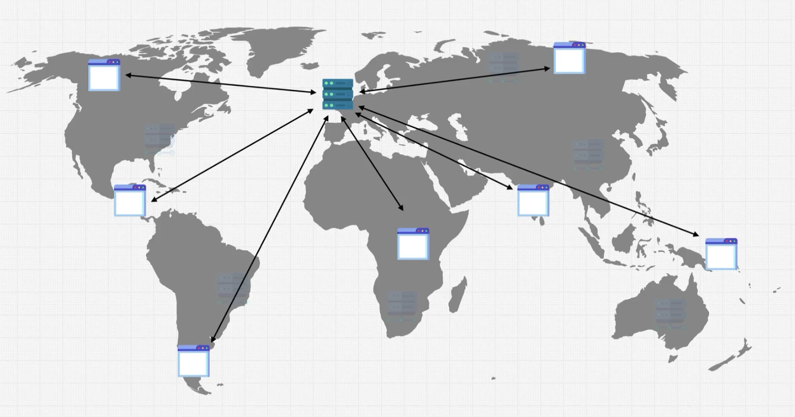
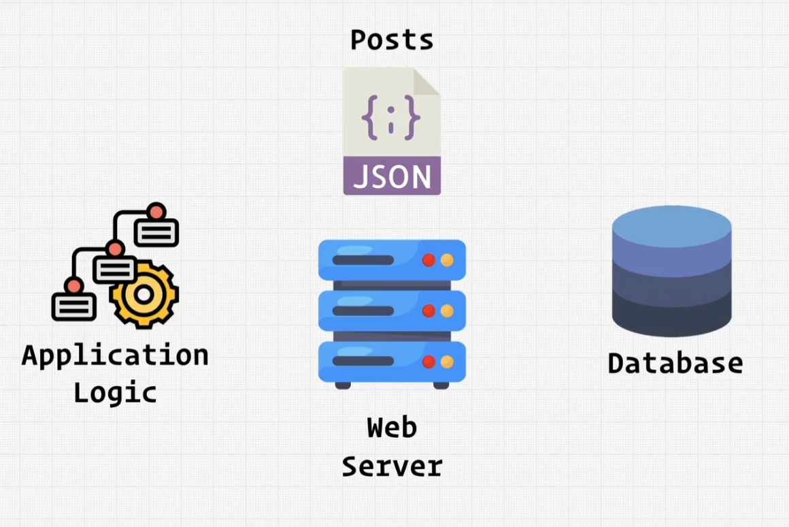
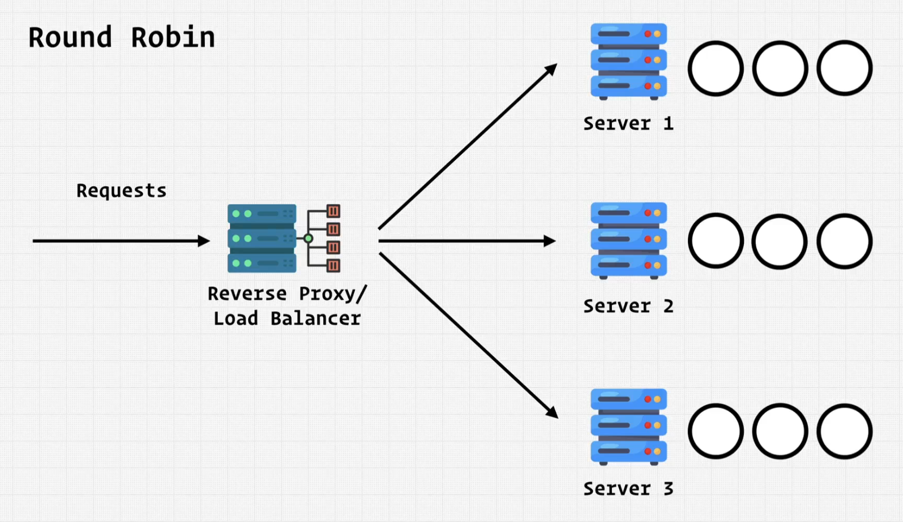
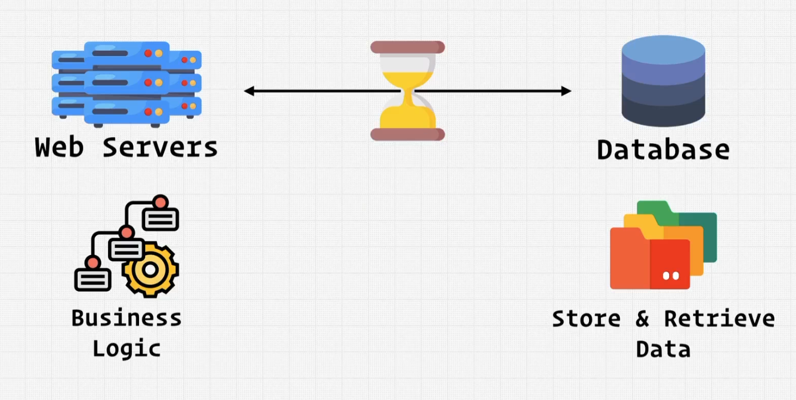
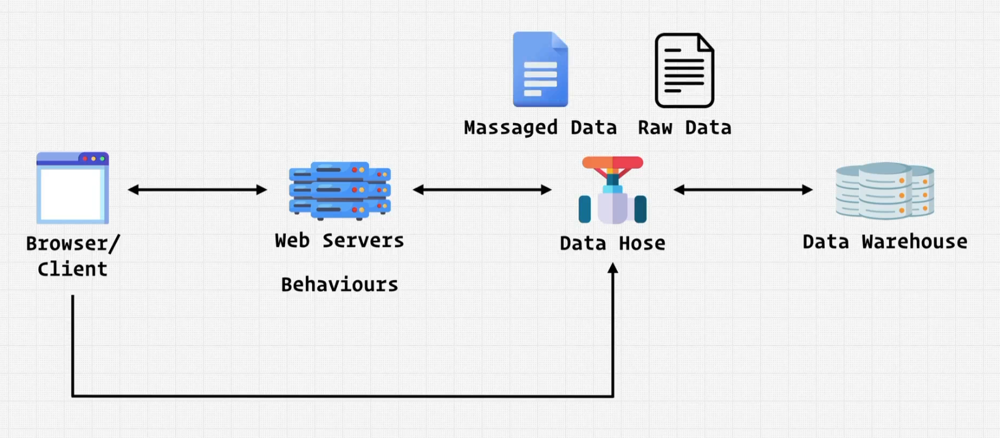

# INDEX

- [INDEX](#index)
  - [System Design](#system-design)
    - [Important concepts](#important-concepts)
  - [Browser / Client](#browser--client)
  - [DNS](#dns)
  - [CDN](#cdn)
  - [Web Server](#web-server)
  - [Load Balancer](#load-balancer)
    - [Session Persistence](#session-persistence)
  - [Data Source](#data-source)
    - [Database](#database)
    - [Caching Service](#caching-service)
    - [Data Hose](#data-hose)
    - [Data Warehouse](#data-warehouse)
    - [Cloud Storage](#cloud-storage)
  - [Jobs](#jobs)
    - [Job server](#job-server)
    - [Job Queue](#job-queue)
  - [Services](#services)
  - [System Design Interview](#system-design-interview)
  - [System Design Questions](#system-design-questions)

---

## System Design

**System design** is the process of designing the architecture, components, and interfaces for a system so that it meets the requirements.

- It's a process of defining the architecture, modules, interfaces, and data for a system to satisfy specified requirements.

### Important concepts

- **Latency**: the time it takes for a request to go from the client to the server and back.

---

## Browser / Client

- **Client** is the **front-end** of the system, which is responsible for:
  - rendering the UI.
  - interact with the user.
  - interact with the server.
- When requesting a page, the **client** sends a **request** to the **server**. The **server** then sends back a **response** to the **client**.
  
- But, in order to make it scale, we need to add other components to the system. like: **Load Balancer**, **Cache**, **CDN**, etc.
  

---

## DNS

**DNS** is a **Domain Name System**. It's a **phone book** for the internet. It's a **distributed database** that translates **domain names** to **IP addresses**.

- usually a website has multiple servers, and each server has a different IP address. So, when a user types a domain name in the browser, the browser sends a request to the DNS server to get the IP address of the server that has the website.
- IP address from the DNS has multiple formats:
  - `IPv4`: 4 numbers separated by dots.
    - `69.63.176.13`
  - `IPv6`: 8 groups of 4 hexadecimal digits separated by colons.
    - `2001:0db8:85a3:0000:0000:8a2e:0370:7334`
    - It was created to solve the problem of IPv4 addresses running out. as `IPv4` has only `4` billion addresses. and `IPv6` has `340` undecillion addresses.
- DNS handles which `IP` address type to use. by default, it uses `IPv4`. but, if the server has `IPv6` address, it will use it instead.

---

## CDN

**CDN** is a **Content Delivery Network**. It's a network of servers that distributes the content to the client. It also stores the content in the cache.

- It holds the files that you want to serve to the client, to prevent the client from requesting the files from the server directly in case the files are already cached in the CDN.
- It uses **"Edge servers"** to store the files. and it uses **"Load Balancer"** to distribute the traffic between the servers.

  - Without `edge servers`, the client will have to request the files from the server directly. and it will result in a high latency ❌.
    
  - With `edge servers`, the client will request the files from the `edge server`. and it will result in a low latency ✅.
    

- Using a CDN may result additional complexity and cost.
  - as we need to make sure that the files are up to date. and we need to make sure that the files are cached in the CDN. and we need to make sure that the files are cached in the correct `edge server`. and we need to make sure that the files are cached in the correct region. etc.
  - also, we need to pay for the CDN service.
- It's recommended to only use a CDN when the website has a high traffic and global distribution.

---

## Web Server

**Web Server** is a **server** that **serves** the **client**. It's a **software** that **handles** the **HTTP requests** sent by the **client**.

- It selects the correct data to send to the client using **"Business logic"** and **"Database"**.
  

> - "Business logic" is the logic when a web server has to compute a behavior that the **client** requested. like: sending an email, or sending a notification, etc.
> - "Application logic" is the logic when a web server has to compute a behavior that the **server** requested. like: sending a request to another server, or sending a request to the database, etc. It's handled in the [Job server / Job Queue](#jobs).

- a web server can be a **dedicated server** or a **shared server**.
  - **Dedicated Server**: a server that is dedicated to a single website.
  - **Shared Server**: a server that is shared between multiple websites.
- Also, it can serve multiple clients at the same time. This high traffic requires processing power and resources.
  
- in order to increase the performance, we can use **horizontal scaling** or **vertical scaling**.
  - **Vertical Scaling**: adding more resources to the server.
    
  - **Horizontal Scaling**: adding more servers, by duplicating the server.
    
    - Note that, we just duplicate the server (including the Application logic) and **without the database**.
      
- When horizontal scaling, we need to use a **Load Balancer** to distribute the traffic between the servers.
  

---

## Load Balancer

**Load Balancer** is a **server** that **distributes** the **traffic** between the **servers**.

- Without it, we don't know which server to send the request to. and it may result in overloading a server.
  
- So, we need something to **evenly-distribute** the traffic between the servers. and that's the **Load Balancer**.
  - It acts as the **"Entry point"** for the system.
  - It knows if a server is down or not. and it can **redirect** the traffic to another server.
- Distribution strategies:
  - **Round Robin**: it sends the request to the next server in the list.
    

### Session Persistence

**Session Persistence** is a way to keep the `session` on the same server.

- if a client sends a request to a server, and the server sends back a response with a `session` cookie. then, the client sends another request to another server, the server won't have the `session` cookie. and it will create a new `session` for the client.
- To solve this problem, we can use **"Sticky Session"**. which is a way to keep the `session` on the same server. **(maintain persistent connection between the client and the server)**.
  - This is done by the **Load Balancer**. as it establishes a connection with the client, and then it sends the request to the server. and it keeps the connection open until the client finishes the session. (**locks** the client to the server).
    
- if the server (that has the `session` cookie) is down, the **Load Balancer** will redirect the client to another server. and the new server will create a new `session` for the client. or it can re-catch the `session` from the (client / load balancer).
  

---

## Data Source

### Database

**Database** is a **software** that **stores** and **manages** the **data**.

- It communicates with the Application/Business logic in the Web Server.
  - This is the process which usually takes the most time. as it's the process of reading/writing data.
    
- Usually the data requested by the client is regional or common and not specific to a single user. So, we can use **Caching** to increase the performance.

---

### Caching Service

**Caching Service** is a service that stores the data in the memory.

- `Database` and `Caching Service` both store data. but, `Database` stores the data in the disk, while `Caching Service` stores the data in the memory.
- `caching service` prioritize **speed** over **data storage**. so, it stores the data in the memory. and it's usually used for **read** operations.
  - **It stores much less data, but retrieves it much faster**.
- How it works:
  - After the `web server` gets the request from the `client`, it checks if the data is in the `caching service` or not.
  - if the data is in the `caching service`, it will send it back to the `web server`.
  - if the data is not in the `caching service`, it will get it from the `database`, and then it will send it back to the `web server` then process the data and format it, and then send it back to the `client`. and **concurrently** it will store the data in the `caching service`.

---

### Data Hose

**Data Hose** is a service that receives the raw data from the (`web server` / `client`) and then it processes ( massages ) the data and then it sends it to the `data warehouse`.

- It's like a **pipe** which is a **middleman** between the `web server` and the `data warehouse`.
- Ex: `Kafka`, `Kinesis`, etc.

---

### Data Warehouse

**Data Warehouse** is a service that **stores** the **data**.

---

### Cloud Storage

**Cloud Storage** is a service that stores the data in the cloud.

- It's like a `database`, but it's not a `database`. as it's not a `database` that is installed on a server. instead, it's a `database` that is installed on the cloud.
- Ex: `Amazon S3`, `Google Cloud Storage`, etc.

---

## Jobs

**Job** is a **background job**. It's a **task** that is **not** related to the **request**. and it's **not** required to be done **immediately**.

- Ex:

  - Sending an email.
  - Sending a notification.
  - reaching out to another server to get some data. (ex: getting the latest posts from another server)
  - etc.

- This is how jobs are requested and handled:
  1. The `web server` sends the request to the `job queue`.
  2. The `job queue` stores the job and based on the priority, it sends the job to the `job server`.
  3. The `job server` executes the job.
  4. The `job server` sends the result back to the `web server`.

---

### Job server

**Job server** is a server that **handles** the **background jobs**.

- **Background jobs** are jobs that are **not** related to the **request**. and they are **not** required to be done **immediately**.
  - They are any operations that are not "User-driven", instead they're required by the (server / application) to do some work **(Application logic)**.
- Jobs are handled in a "Job server" by writing "Application logic" code. and then the "Job server" will execute the code.

---

### Job Queue

**Job Queue** is a way to **queue** the **jobs**. (way to know how job servers should execute the jobs).

---

## Services

**Service** is another system that is not related to the current system. and it's usually a 3rd party system. **(Self contained deliverable system)**

- It's responsible for one thing.
- **Microservices** are a type of services. but, they are **smaller** and **more focused**.
- By dividing the system into services, we can make the system more **scalable and more maintainable**.
- Ex:

  - Authentication service. (like: `OAuth`, `JWT`, etc)
  - Massaging service. (like: `Twilio`, `Nexmo`, etc)
  - NewsFeed service. (like: `Mailchimp`, `Sendgrid`, etc)
  - Communities service. (like: `Facebook`, `Twitter`, etc)

- Example of entering a `NewsFeed` service:
  
- Example of entering a `Authentication` service:
  
- Example of a system that uses the 2 services:
  

---

## System Design Interview

It's meant to test your **ability to design scalable systems**. It's a **high-level** test to see if you can **design a system**.

- **High Level Notes**
  - There's no one right answer
  - There's no one right way to solve a problem or design a system
  - Focus on the data model
  - Don't mention the technology you're going to use
  - Draw a diagram
  - Talk
- **Steps**
  - Identify 2 core features
  - Possible implementation
  - Identify and address difficulties
  - Solution for **scaling**
    - Scaling for Users:
      - Caching -> Memory Cache -> Redis Cache -> CDN
      - Deployment Options -> Load Balancer -> Horizontal Scaling

---

## System Design Questions
