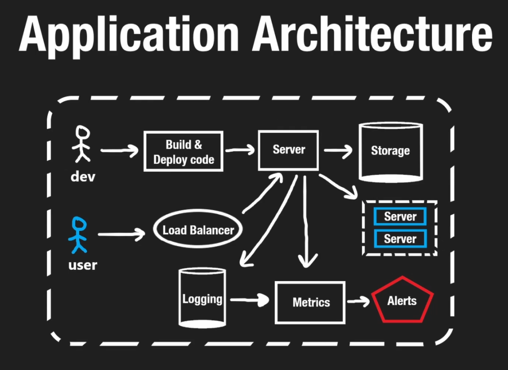
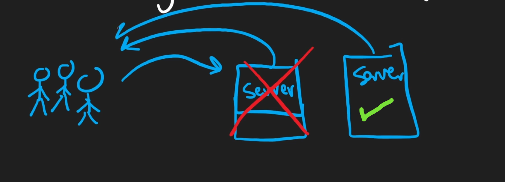
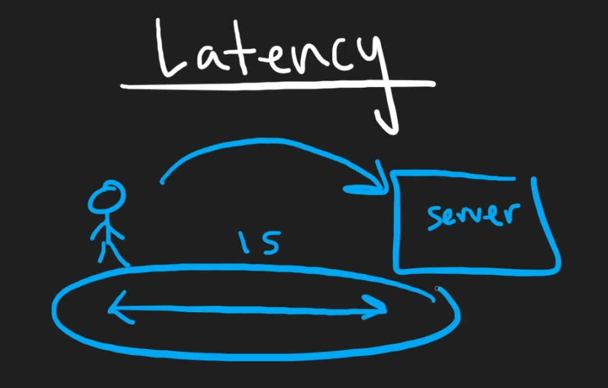
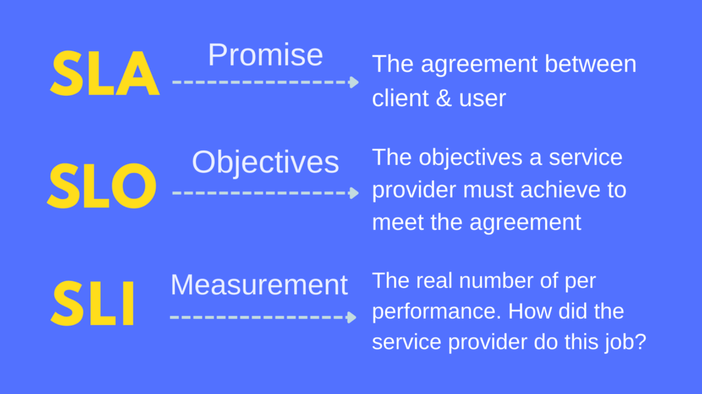
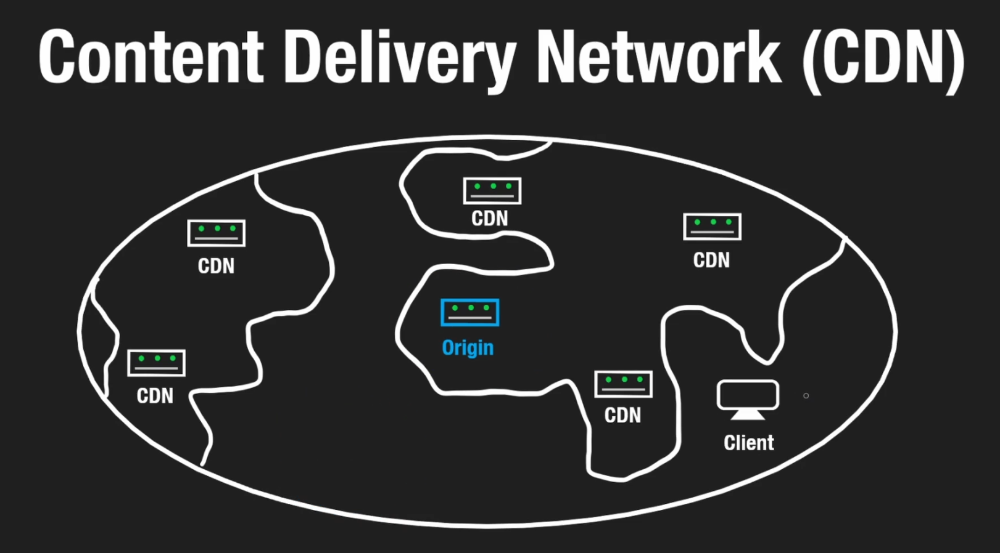
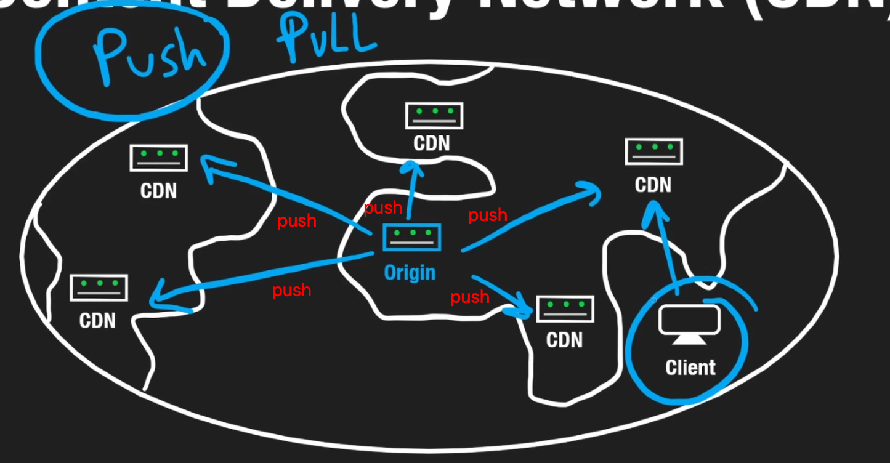
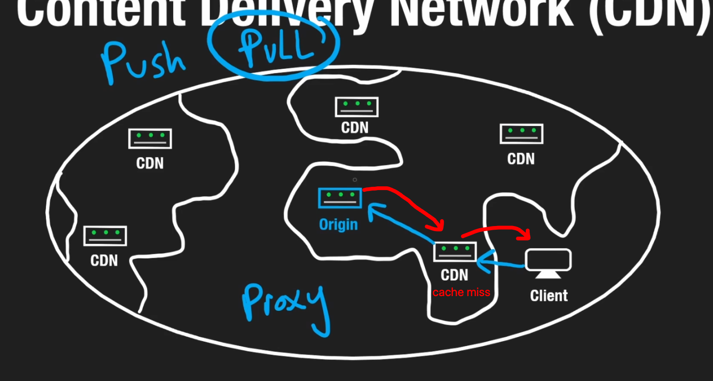
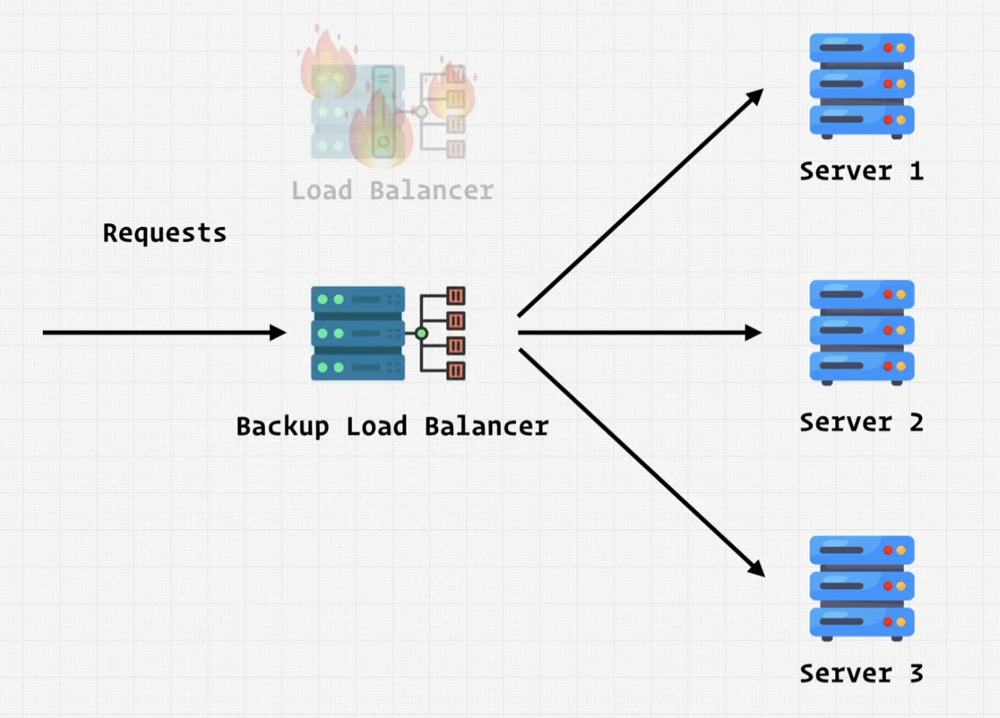
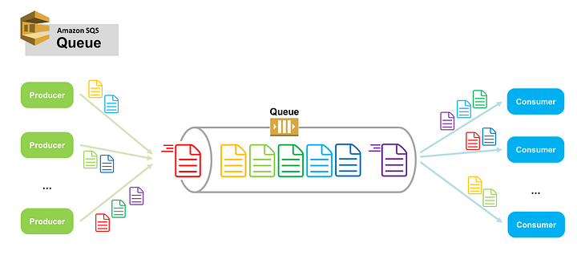

# INDEX

- [INDEX](#index)
  - [System Design](#system-design)
    - [Goal of system design](#goal-of-system-design)
    - [System design core principles](#system-design-core-principles)
  - [Browser / Client](#browser--client)
  - [DNS](#dns)
  - [CDN](#cdn)
    - [CDN Types](#cdn-types)
    - [Edge servers](#edge-servers)
  - [Web Server](#web-server)
  - [Proxies](#proxies)
    - [Forward Proxy](#forward-proxy)
    - [Reverse Proxy](#reverse-proxy)
  - [Load Balancer](#load-balancer)
    - [Load Balancer Types](#load-balancer-types)
    - [Load balancer distribution strategies](#load-balancer-distribution-strategies)
    - [Session Persistence](#session-persistence)
  - [Clustering](#clustering)
  - [Data Source](#data-source)
  - [Jobs](#jobs)
    - [Job server](#job-server)
    - [Job Queue (Message Queue)](#job-queue-message-queue)
  - [Services](#services)
  - [Monitoring](#monitoring)

---

## System Design

**System design** is the process of designing the architecture, components, and interfaces for a system so that it meets the requirements.

- It's a process of defining the architecture, modules, interfaces, and data for a system to satisfy specified requirements.
- It's mainly about 3 things:

  - **Move Data**: how to move data from one place to another
    - in the same server -> `RAM` to `CPU`
    - in different servers -> `Client` to `Server`
  - **Store Data**: how to store data
    - in the same server -> `RAM` to `Disk`
    - in different servers -> `Database` to `Caching Service`
    - in the cloud -> `Database` to `Cloud Storage`
  - **Process Data**: how to process & transform data

- Good design choices are based on observations of how the system will be used and how it will be affected by external factors and constraints.
  - EX: We have large number of users, and the server (computer) can't handle the requests. We can solve this by determining the **bottleneck** first. and then we can solve it by:
    
    - checking if it's a `CPU` problem or a `RAM` problem or a `Disk` problem -> we can add more resources to the server. -> **Vertical Scaling**
    - checking if it's a resources limitation -> we can add more servers. -> **Horizontal Scaling** which will require a **Load Balancer** to distribute the traffic between the servers.
    - checking if it's a `Database` problem -> we can add a `Caching Service` to cache the data. -> **Caching**
    - Needing to monitor the system -> we can add a `Monitoring Service` to monitor the system and store the `logs` for any activities. -> **Monitoring logs**
    - Needing to check if something is not working correctly (lower than threshold) -> we can add a **Metrics service** and **Alerts service** to notify the system admin if there's a problem in the system.
- Bad design choices are hard to change / correct later. so, we need to make sure that we make the right design choices from the beginning.
  - Ex: choosing the wrong database, means that we'll have to change the entire system later by:
    - changing the database
    - migrating the data to the new database
    - changing the code to work with the new database
    - etc.

---

### Goal of system design

As you go up in seniority, you'll be expected to be able to design systems that are **scalable**, **reliable**, **highly available**, **secure**, **maintainable**, etc.

- Usually, we won't have the prefect solution, but we need to figure out which option is the best. by **trading off** between the different options.

> So system design is not about memorizing some facts. instead, it's about the **Thought process** by analyzing what improvements can be made and sacrifices can be made to make the system better.

- Design Requirements:

  - Move Data -> `Client` to `Server` or between `Servers` and `Databases` and `services`.
  - Store Data -> `Database` to `Caching Service` or `Cloud Storage`.
  - Process / Transform Data -> For example aggregating data from multiple sources to get a percentage of something for different metrics.

- When you're junior, mid-level, or early senior, you'll usually interact with **Low-level** code. like:
  - "Business logic"
  - "Application logic"
  - "Database"
  - "CI/CD"
  - "Dockers"
  - "Kubernetes"
  - etc
- But when you're senior, you'll usually interact with **High-level** code. like:
  - "System design"
  - "Architecture"
  - "Data modeling"
  - "Microservices"
  - "Scalability"
  - "Reliability"
  - "High availability"
  - "Security"
  - "Maintainability"
  - etc

---

### System design core principles

- **Availability**: the system should be available all the time.
  
  

  - Usually we use **"The nines of availability"** to measure the availability of a system.
    
  - When we reduce the `down time`, we increase the `availability`.
    - downtime `1% -> 0.1%` -> availability `99% -> 99.9%`
    - downtime `0.1% -> 0.01%` -> availability `99.9% -> 99.99%`
    - downtime `0.01% -> 0.001%` -> availability `99.99% -> 99.999%`
  - Notice that the improvement in downtime is huge going from `1%` to `0.1%`. but, the improvement in availability is small going from `99%` to `99.9%`. That's why we use **"The nines of availability"** to measure the availability of a system.

- **Reliability**: the system should be reliable. (no data loss or crashes or system failures).
  
  

  - Usually we want to figure out if the system is reliable to perform its functionality without errors.
  - we do this by reducing the amount of errors. Or increasing the mean time between failures (`MTBF`). This can be done by `horizontal scaling` as if one server is down, the other servers will handle the requests.
    

- **Single point of failure**: a component that if it fails, the entire system will fail.
  
  - It happens when we have a single component that if it fails, the entire system will fail. So, we need to make sure that we don't have a single point of failure. by adding a redundant backup component (server, database, etc).
- **Fault tolerance**: the ability of a system to continue operating even if there's a failure in one of its components.
  - It's related to **Reliability**
- **Redundancy**: having multiple components that do the same thing. (having a backup component).
  - It's related to **Reliability**
- **Throughput**: the amount of operations or data that can be processed (handle) in a period of time.

  - ex:
    - how many users can the system handle in second (`requests per second`).
    - how many queries can the database handle in second (`queries per second`).
    - data transfer rate (`bytes per second`).
  - It's related to **Scalability**

- **Latency**: the time it takes for a request to go from the client to the server and back.
  

  - We calculate it from the **User's perspective**.
    - as the user doesn't care about the internal components. instead, the user cares about the time it takes for the request to go from the client to the server and back.
  - it can be caused by: `network`, `server`, `database`, `caching service`, etc.
  - It can be improved by:
    - caching -> `caching service`
    - CDN -> to cache the data closer to the client.
    - Load Balancer -> to distribute the traffic between the servers.

- **Service Level**
  

  - **Service level objective (SLO)**: is a target value or range of values for a service level that is measured by a service level indicator. (it's a way to measure the `availability` and `reliability` of a system).
  - **Service level indicator (SLI)**: is a **measure** of **reliability** and **availability** of a system. (it's a way to measure the availability and reliability of a system).
  - Ex: `CPU`, `RAM`, `Disk`, `Network`, etc.
  - **Service level agreement (SLA)**: is a **commitment** between a **service provider** and a **client**. (it's a way to measure the availability and reliability of a system).

    - It's usually a **contract / agreement** between the **service provider** and the **client**.

---

## Browser / Client

- **Client** is the **front-end** of the system, which is responsible for:
  - rendering the UI.
  - interact with the user.
  - interact with the server.
- When requesting a page, the **client** sends a **request** to the **server**. The **server** then sends back a **response** to the **client**.
  
- But, in order to make it scale, we need to add other components to the system. like: **Load Balancer**, **Cache**, **CDN**, etc.
  

---

## DNS

**DNS** is a **Domain Name System**. It's a **phone book** for the internet. It's a **distributed database** that translates **domain names** to **IP addresses**.

- usually a website has multiple servers, and each server has a different IP address. So, when a user types a domain name in the browser, the browser sends a request to the DNS server to get the IP address of the server that has the website.
  - After the browser gets the IP address (after DNS query), it will **cache** it for a period of time. So, the next time the user types the domain name, the browser will use the cached IP address instead of sending a request to the DNS server.
- IP address from the DNS has multiple formats:
  - `IPv4`: 4 numbers separated by dots. each number has max of `255` numbers.
    - `69.63.176.13`
  - `IPv6`: 8 groups of 4 hexadecimal digits separated by colons.
    - `2001:0db8:85a3:0000:0000:8a2e:0370:7334`
    - It was created to solve the problem of IPv4 addresses running out. as `IPv4` has only `4` billion addresses. and `IPv6` has `340` undecillion addresses.
- DNS handles which `IP` address type to use. by default, it uses `IPv4`. but, if the server has `IPv6` address, it will use it instead.
- The Domain consist of:
  - `www`: subdomain
  - `google`: domain
  - `com`: top-level domain
  - `www.google.com`: fully qualified domain name (FQDN) ✅
- There're organizations that are responsible for managing the DNS servers. like: `ICANN`
- There're re-sellers that are responsible for selling the domain names. like: `GoDaddy`, `Namecheap`, etc.

---

## CDN

**CDN** is a **Content Delivery Network**. It's a network of servers that distributes the content to the client. It's our best options to minimize the latency in request-response by fetching the assets from a nearby server.

- It's goal is to bring the content closer to the client so that:
  - we will lower the demand / hits on the server.
  - we will decrease the latency.
  - we will increase the availability. (because if one of the `CDNs` goes down, the other `CDNs` will handle the requests).
- It holds the files that you want to serve to the client, to prevent the client from requesting the files from the server directly in case the files are already cached in the CDN.

  - Assets like: `images`, `videos`, `CSS`, `JS`, etc.

- Unless the code / assets in the `edge server` are not updated, the `CDN` will serve the files to the client

  - if the files are updated, the `CDN` will request the files from the server. and then it will cache the files in the `CDN / edge server` and serve the files to the client.

- Using a CDN may result additional complexity and cost.
  - as we need to make sure that the files are up to date. and we need to make sure that the files are cached in the CDN. and we need to make sure that the files are cached in the correct `edge server`. and we need to make sure that the files are cached in the correct region. etc.
  - also, we need to pay for the CDN service.
- It's recommended to only use a CDN when the website has a high traffic and global distribution.

---

### CDN Types

- **Push CDN**:

  - On any update, the origin server automatically pushes the files to every CDN. and then the CDN will be always ready to serve the files to the client.
    
  - Steps:
    1. The origin server pushes the files to the CDN on any update. (push)
    2. The CDN caches the files.
    3. The client requests the files from the CDN (Hits the CDN).
    4. The CDN serves the files to the client.

- **Pull CDN**:
  - On any update, the origin server doesn't push the files to the CDN. instead, the CDN will request the files from the origin server if the client requests the files. So, the CDN will only request the files from the origin server if the files are not cached in the CDN.
    
  - Steps:
    1. The client requests the files from the CDN (Hits the CDN).
    2. The CDN checks if the files are cached in the CDN.
    3. If the files are cached in the CDN, the CDN will serve the files to the client.
    4. If the files are not cached in the CDN (cache miss), the CDN will request the files from the origin server. (pull)
  - Here, we won't need to push the files to all the CDNs. as the update file might not be requested by clients in other regions. So, we will only push the files to the CDN that is requested by the client.

---

### Edge servers

- It uses **"Edge servers"** to store the files. and it uses **"Load Balancer"** to distribute the traffic between the servers.

  - Without `edge servers / CDN`, the client will have to request the files from the server directly. and it will result in a high latency ❌.
    
  - With `edge servers / CDN`, the client will request the files from the `edge server`. and it will result in a low latency ✅.
    

  > Note that `edge servers` are not the same as `CDN`. as `edge servers` are just a part of the `CDN`. and have the ability to run code, unlike `CDN` which only contains **static files**.

---

## Web Server

**Web Server** is a **server** that **serves** the **client**. It's a **software** that **handles** the **HTTP requests** sent by the **client**.

- It selects the correct data to send to the client using **"Business logic"** and **"Database"**.
  

> - "Business logic" is the logic when a web server has to compute a behavior that the **client** requested. like: sending an email, or sending a notification, etc.
> - "Application logic" is the logic when a web server has to compute a behavior that the **server** requested. like: sending a request to another server, or sending a request to the database, etc. It's handled in the [Job server / Job Queue](#jobs).

- a web server can be a **dedicated server** or a **shared server**.
  - **Dedicated Server**: a server that is dedicated to a single website.
  - **Shared Server**: a server that is shared between multiple websites.
- Also, it can serve multiple clients at the same time. This high traffic requires processing power and resources.
  
- in order to increase the performance, we can use **horizontal scaling** or **vertical scaling**.
  - **Vertical Scaling**: adding more resources to the server.
    
  - **Horizontal Scaling**: adding more servers, by duplicating the server.
    
    - Note that, we just duplicate the server (including the Application logic) and **without the database**.
      
- When horizontal scaling, we need to use a **Load Balancer** to distribute the traffic between the servers.

---

## Proxies

**Proxy** is a server that acts as a middleman between the client and the server.

- It **abstracts** one side from the other. so, the client won't know about the server, and the server won't know about the client.

### Forward Proxy

- It sets between the `client` and the `internet`, and it's not part of the system.
  
  - It communicates between:
    - `client` and `proxy`
    - `proxy` and `internet`
  - This way the client won't directly access the internet. instead, it will access it through the proxy.
- It's on the `client` side. and it's usually used for security reasons.
- The forward proxy can:
  - **hide** the `client` IP address ( client's details / Source ) from the `internet`.
  - modify the request before sending it to the `internet`.
  - block certain websites.
- It's used in:
  - VPNs.
  - corporate networks.
  - schools.
  - etc.

---

### Reverse Proxy

- It sets between the `server` and the `internet`, and it's part of the system.
  

- It acts as an **entry point** to the system.
  - It receives the request from the `internet` before it reaches the `server`. and then it forwards the request to the `server`.
- It can:
  - **hide** the `server` (destination) details from the `internet`. as the `internet` will only see the `proxy` IP address.
- It's very similar to the **Load Balancer**. but, it's not the same.

  - **Load Balancer** is used to distribute the traffic between the servers.
    - in fact, many **Load Balancers** are also **Reverse Proxies**. like: `Nginx`, `HAProxy`, etc.
  - **Reverse Proxy** is used to hide the `server` details from the `internet`.
    - when using a **Reverse Proxy** also as a **Load Balancer**, we get best of both worlds. as we get the **Load Balancer** functionality and the **Reverse Proxy** functionality like:
      - caching.
      - compression.

- It's used as:
  - `CDN`, where it caches the files and serves them to the client on behalf of the server.
  - Load Balancer, where it distributes the traffic between the servers.

---

## Load Balancer

**Load Balancer** is a **server** that **distributes** the **traffic** between the **servers**.

- It's a type of **Reverse Proxy**. as it's used to hide the `server` details from the `internet` and distribute the traffic between the servers.
  
- Without it, we don't know which server to send the request to. and it may result in overloading a server.
  
- So, we need something to **evenly-distribute** the traffic between the servers. and that's the **Load Balancer**.

  - It acts as the **"Entry point"** for the system.
  - It knows if a server is down or not. and it can **redirect** the traffic to another server.

- Also, it's used to **horizontal scale** the system. as we can add more servers and the **Load Balancer** will distribute the traffic between them.
- Usually to prevent breaking the entire system if the **Load Balancer** is down, we use a redundant backup load balancer
  

- Most common **Load Balancers** are:
  - `Nginx` -> Open source (free)
  - `HAProxy`
  - `F5`
  - `AWS ELB`
  - `Azure Load Balancer`
  - `Google Cloud Load Balancer`

---

### Load Balancer Types

There's multiple types of **Load Balancers**:

- **Layer 4 Load Balancer**: it's a **TCP Load Balancer**. it's used to distribute the traffic based on the `IP address` and the `port number`.
  - It's faster than the **Layer 7 Load Balancer**. as it doesn't need to look at the `URL` and the `HTTP headers` and only looks at the `IP address` and the `port number`.
- **Layer 7 Load Balancer**: it's an **Application layer (HTTP Load Balancer)**. it's used to distribute the traffic based on the `URL` and the `HTTP headers`.

  - It's more advanced than the **Layer 4 Load Balancer**. as it can distribute the traffic based on the `URL` and the `HTTP headers`.
    - it establishes connections using the `URL` and the `HTTP headers`. So it's more expensive.
  - It's usually used for **HTTP** and **HTTPS** traffic.
  - It's slower than the **Layer 4 Load Balancer**. as it needs to look at the `URL` and the `HTTP headers` and not only the `IP address` and the `port number`.
  - It just **forwards** the request to the server. So it's cheap.

---

### Load balancer distribution strategies

- **Round Robin**:
  - it sends the request evenly to the next server in the list.
    
  - The problem here is that servers are independent of each other and they have no knowledge of the other servers.
    
    - This is an issue because often the servers have different resources and capabilities. So, it's not a good idea to send the same amount of traffic to each server.
- **Weighted Round Robin**:
  - Here, we assign a `weight` to each server. and the `weight` is based on the server's resources and capabilities ( The higher the weight-number, the higher the resources ).
    
- **Least Connections**:

  - It sends the request to the server that has the least connections (least current load).
  - It depends on `sessions` or how many requests are being processed by the server. and it's usually used for **long-lived connections**. like: `WebSockets`, `HTTP Streaming`, etc.
    
    

- **Consistent Hashing** is a way to distribute the traffic based on the `URL` or the `IP address`.

  - For example a client with `IP = 6` and if we have `3` servers. then, we can use the `IP` to distribute the traffic between the servers. as we can use the `IP` to get a number between `0` and `3`. and then we can send the traffic to the server that has the same number.
    

    - `IP = 6` -> `6 % 3 = 0` -> `server 0`
    - `IP = 7` -> `7 % 3 = 1` -> `server 1`
    - `IP = 8` -> `8 % 3 = 2` -> `server 2`

  - This way, we can send the traffic from the same client (same IP) to the same server. and it's usually used for servers with `caching` or `in-memory caching` (like: `Redis`) -> **stateful servers**.
  - Hashing Algorithm
    
  - It's used to **maintain persistent connection between the same client and the server**. as the client will always send the request to the same server.

---

### Session Persistence

**Session Persistence** is a way to keep the `session` on the same server.

- Usually when using a distribution strategy like **Round Robin**:

  - if we use `REST` API, then it's not a problem. as the `REST` API is **stateless**. so, the server doesn't need to remember the previous request.
  - but, if we have a **stateful** `session` or the server has in-memory caching (ex: `Redis`), then it's a problem. as the server needs to remember the previous request.
    - That's where **Session Persistence** or **Consistent Hashing** comes in.

- if a client sends a request to a server, and the server sends back a response with a `session` cookie. then, the client sends another request to another server, the server won't have the `session` cookie. and it will create a new `session` for the client.
- To solve this problem, we can use **"Sticky Session"**. which is a way to keep the `session` on the same server. **(maintain persistent connection between the client and the server)**.
  - This is done by the **Load Balancer**. as it establishes a connection with the client, and then it sends the request to the server. and it keeps the connection open until the client finishes the session. (**locks** the client to the server).
    
- if the server (that has the `session` cookie) is down, the **Load Balancer** will redirect the client to another server. and the new server will create a new `session` for the client. or it can re-catch the `session` from the (client / load balancer).
  

---

## Clustering

**Clustering** is a technique to increase the amount of servers. It's where you have multiple servers that are aware of each other and work together as a complete unit for some objective.

- In `load balancing`, The servers are independent of each other and they have no knowledge of the other servers.
  
- `clustering` doesn't replace `load balancing`. instead, Here the servers are aware of each other and they work together as a complete unit for some objective.
  
  - Each of the servers in the cluster is called a `node`.
    - The `nodes` don't share the same resources. instead, each `node` has its own resources and they're identical.
  - in the system, the `cluster` is treated as a single server.
  - In `cluster`, there's a leader node that is responsible for:
    
    - receiving the requests.
    - distributing the requests between the nodes.
    - etc.
- `clustering` is used to increase the **reliability** and **availability** of the system. as if one of the nodes is down, the other nodes will handle the requests.
- it's used with `load balancing` to increase the performance and the reliability of the system.
  

---

## Data Source

[Here](./4-Data.md)

---

## Jobs

**Job** is a **background job**. It's a **task** that is **not** related to the **request**. and it's **not** required to be done **immediately**.

- Ex:

  - Sending an email.
  - Sending a notification.
  - reaching out to another server to get some data. (ex: getting the latest posts from another server)
  - etc.

- This is how jobs are requested and handled:
  1. The `web server` sends the request to the `job queue`.
  2. The `job queue` stores the job and based on the priority, it sends the job to the `job server`.
  3. The `job server` executes the job.
  4. The `job server` sends the result back to the `web server`.

---

### Job server

**Job server** is a server that **handles** the **background jobs**.

- **Background jobs** are jobs that are **not** related to the **request**. and they are **not** required to be done **immediately**.
  - They are any operations that are not "User-driven", instead they're required by the (server / application) to do some work **(Application logic)**.
- Jobs are handled in a "Job server" by writing "Application logic" code. and then the "Job server" will execute the code.

---

### Job Queue (Message Queue)

**Job Queue** is a way to **queue** the **jobs / messages**. (way to know how job servers should execute the jobs).

> It's also known as **"Message Queue"**

- When we have a large number of `application events` in a fast-paced that the `server` can't handle. we can use a `message queue` to queue the jobs. and then the `server` will execute the jobs/messages later.
  
- This is done as a replacement for handling the `messages` via multiple servers Asynchronously.
- This would enable us to scale the system. as we can make us handle more requests by queueing the jobs so that the server can handle them later.
- Data stored in the queue are **Durably** stored:
  - if the server is down, the data will still be there. because data is stored in `Disk` and not in `RAM`.
  - the queue knows if the server can handle the message in the queue or not (as the server sends an `acknowledgment` to the queue after receiving the message), so that the queue doesn't need to send the message to the server again.
- `Publish` and `Subscribe` (Pub/Sub) are the most popular ways to send and receive messages from the queue to/from multiple servers/services
  - `Publish` is a way to send a message to the queue.
  - `Subscribe` is a way to receive a message from the queue.
- Most popular `job queues` are:
  - `RabbitMQ` ✅
  - `Kafka` ✅
  - `Redis` ✅
  - `Amazon SQS`
  - `Google Cloud Pub/Sub`
  - `Azure Service Bus`

---

## Services

**Service** is another system that is not related to the current system. and it's usually a 3rd party system. **(Self contained deliverable system)**

- It's responsible for one thing.
- **Microservices** are a type of services. but, they are **smaller** and **more focused**.
- By dividing the system into services, we can make the system more **scalable and more maintainable**.
- Ex:

  - Authentication service. (like: `OAuth`, `JWT`, etc)
  - Massaging service. (like: `Twilio`, `Nexmo`, etc)
  - NewsFeed service. (like: `Mailchimp`, `Sendgrid`, etc)
  - Communities service. (like: `Facebook`, `Twitter`, etc)

- Example of entering a `NewsFeed` service:
  
- Example of entering a `Authentication` service:
  
- Example of a system that uses the 2 services:
  

---

## Monitoring

**Monitoring** is a way to monitor the system. It's a way to know if the system is working properly or not.

- It's usually done by seeing the **logs**. and it's usually done by a **monitoring service**.
- We can use the `logs` to create **Metrics** and **Alerts**.
  - **Metrics** are a way to measure the system. (like: `CPU`, `RAM`, `Disk`, `Network`, etc).
  - **Alerts** are a way to notify the system admin if there's a problem in the system. (like: `CPU` is high, `RAM` is high, `Disk` is full, low metrics (below the threshold), etc).

---
