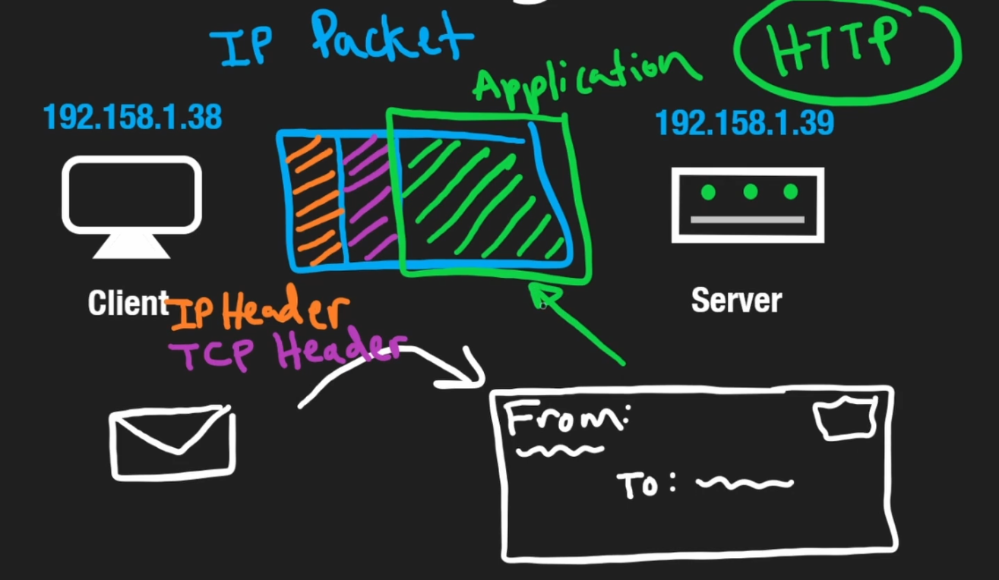
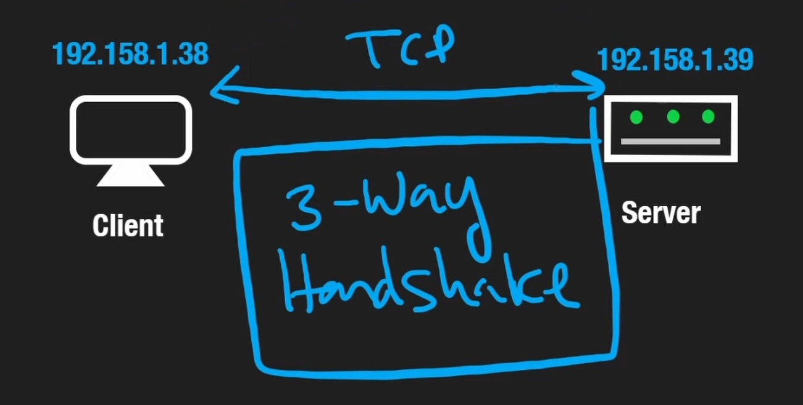
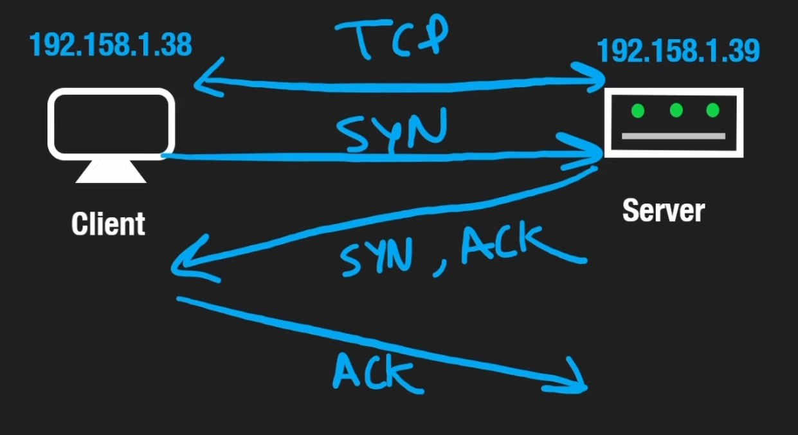
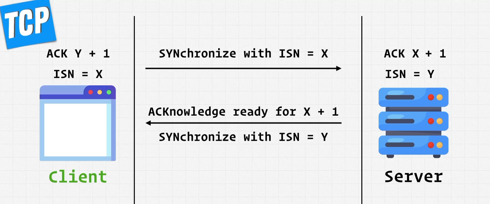
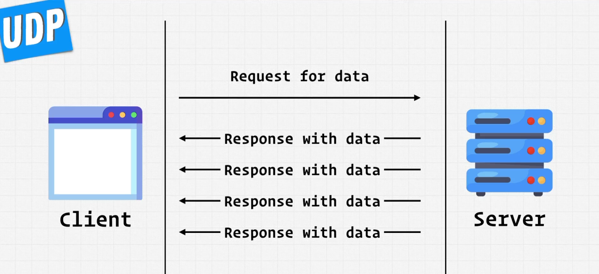

# INDEX

- [INDEX](#index)
  - [Networking](#networking)
    - [OSI Model](#osi-model)
    - [Public vs Private IP](#public-vs-private-ip)
    - [Ports](#ports)
    - [Internet Protocol (IP)](#internet-protocol-ip)
      - [TCP/IP](#tcpip)
      - [UDP](#udp)
    - [Application Protocols](#application-protocols)
      - [HTTP](#http)
      - [WebSockets](#websockets)
      - [Comparing HTTP and WebSockets](#comparing-http-and-websockets)
      - [Other Application Protocols](#other-application-protocols)
  - [APIs](#apis)
    - [REST API](#rest-api)
    - [GraphQL](#graphql)
    - [gRPC](#grpc)
  - [API design](#api-design)
  - [API Caching](#api-caching)
    - [Caching on the client side](#caching-on-the-client-side)
    - [Caching on the server side](#caching-on-the-server-side)
    - [Caching Strategies](#caching-strategies)

---

## Networking

- `TCP/IP` model is specific for the internet
- `OSI` model is for any communication between 2 computers( systems ).

### OSI Model

As long as 2 computers are communicating, We can use the `OSI` model to abstract the communication process.

[More Here](../Internet/Internet.md#osi-model)

---

### Public vs Private IP

- **Public IP** is an IP address that is **public** and **unique**. (it's the IP address that is used to communicate with the internet).
  - Ex: `Router`, `Load Balancer`, `Server`, etc.

- **Private IP** is an IP address that is **private** and **not unique**. (it's the IP address that is used to communicate with the local network).

---

### Ports

**Port** is a **communication endpoint / channle**. It's a way to identify a specific process to which an **Internet message** or **request** is to be forwarded when it arrives at a server.

- The default port for `HTTP` is `80`.
- The default port for `HTTPS` is `443`.
  - That's why when we type `https://www.google.com` in the browser, it will send a request to `https://www.google.com:443`.
  - We don't need to specify the port number in the browser. as the browser will use the default port number for `HTTP` and `HTTPS`.
- We can't have multiple applications listening on the same port. as the port is used to identify the application.
- It's a `16` bits number. (it has `2` bytes). each byte has max of `255` numbers. which means we can have up to `65000` ports per IP address (machine).

---

### Internet Protocol (IP)

**IP**: it's a **connectionless** protocol. It's used to **send** and **receive** data between 2 computers. It's **unreliable** and **unordered**.

- `IPv4` -> it's `32` bits. (it has `4` bytes). each byte has max of `255` numbers
  - `256.256.256.256` -> `4` billion addresses.
- `IPv6` -> it's `128` bits. (it has `16` bytes). each byte has max of `255` numbers
  - it's used to solve the problem of `IPv4` addresses running out. as `IPv4` has only `4` billion addresses. and `IPv6` has `340` undecillion addresses.

- **How it works:**
  - The `IP` is the rule that is used to send and receive data between 2 computers, and data is sent in form of `packets`.
    
    - `packets` are small pieces of data that are sent between 2 computers. and they contain `metadata` about the data. like: `source IP`, `destination IP`, `source port`, `destination port`, etc.
    - When we want to send bigger data, we split it into `packets` and send them. and then the other side will receive the `packets` and combine them to get the data (using the `TCP` protocol). by adding a `TCP header` to the `packets` to make sure that the data is received completely.
      
    - The `packet` also contains the `application data`. which is the actual data that we want to send, and mostly deal with as software engineers.
      

---

#### TCP/IP

**Transmission Control Protocol / Internet Protocol** is a **protocol** that is used to **communicate** between **computers**.

- It consists of 2 protocols:
  - **TCP**: it's a **connection-oriented** protocol. It's used to **send** and **receive** data between 2 computers. It's **reliable** and **ordered** but it's **slow**.
    - It has error-checking mechanism. (it checks if the data is received completely or not).

  - **IP**

- Benefits of `TCP`:
  - it handles the ordering and checking if the data is received completely or not using the `TCP header`.
  - It's **reliable**, because it has error-checking mechanism. (it checks if the data is received completely or not).
    
    - in [internet protocol](#internet-protocol-ip), if there's a data loss, it won't get corrected.
    - in `TCP`, if there's a data loss, it will get corrected in the next data packet anyway. (as it's a stream of data).

- It depends on **"Handshake"** to establish a connection between the `client` and the `server`. it's called: **"3-way handshake"**.
  
  - The `client` sends a `SYN` (Synchronize message) to the `server`. Then the `server` sends a `SYN-ACK` (Synchronize - Acknowledgement) to the `client` to let it know that it received the `SYN`. Then the `client` sends an `ACK` (Acknowledgement) to the `server` to let it know that it received the `SYN-ACK`.
    
  - The process continues until the `client` and the `server` each time increase the `ISN` by `1` until they reach the `ISN` that they received from the other side.
  - These messages are costly as it adds additional overhead to the network. (it adds additional data to be send/receive in the network).
    - This is why `TCP` is **slower** than `UDP`.

- Handshake Steps (explained in another way)
  
  1. The `client` generates a `ISN` (Initial Sequence Number) and sends it to the `server`.
  2. The `server` generates a `ISN` and sends it to the `client`.
  3. Now, both the `client` and the `server` have a `ISN`. and they can start sending data to each other.
  4. The `client` sends a `SYN` (Synchronize ISN) to the `server`. Then the `server` sends a `SYN-ACK` (Synchronize ISN - Acknowledgement) to the `client` to let it know that it received the `SYN`.
  5. The process continues until the `client` and the `server` each time increase the `ISN` by `1` until they reach the `ISN` that they received from the other side.

---

#### UDP

**User Datagram Protocol** is a **connection-less** protocol. (it's like yelling "HI!" and assume that the other side heard it and keep sending data like that anyway)



- Here, data might arrive out of order. and it might not arrive at all. and it might arrive duplicated.
  
- **It's much faster** than `TCP`. because:
  - it doesn't come with the overhead of establishing a connection (we don't have to do a handshake).
  - it doesn't worry about the `packets` arriving in order or not.
  - it doesn't have the error-checking mechanism. (it doesn't check if the data is received completely or not).

  > It's not always guaranteed that the data will arrive. But when it works, it's much faster than `TCP`.

- It's **connection-less** means that it doesn't establish a connection between the `client` and the `server`. instead, it just sends the data to the `server` and assumes that the `server` received it.
- It's used in cases where we don't care about the data loss. like: `VoIP`, `Video Streaming`, `Online Gaming`, etc.
  - This is because if there's a data loss, it will get corrected in the next data packet anyway.
  - Because for example in `live streaming`, if there's a data loss, it won't matter as the next data packet will be sent anyway. because if there's a frame drop, we don't care about it. as we want to see the next frame anyway (live frame).
  - And when we're watching something live, we want the connection to be as fast as possible.
- So, we use `UDP` when we care about the speed and consistency. and we use `TCP` when we care about the reliability ( data loss ) and order.

---

### Application Protocols

**Application Protocol** is a set of rules that governs the communication between applications.

- It's between the `client` and the `server`. and it's on top of the `TCP` or `UDP` protocols.
  - `client` doesn't need ot be an actual end user. it can be another server or anything that can send a request to the server.
- It's used to transfer data between applications.
- The 2 machines can communicate with each other using a **Remote Procedure Call (`RPC`)**. which is a protocol that allows a computer program to cause a subroutine or procedure to execute in another address space (commonly on another computer on a shared network) without the programmer explicitly coding the details for this remote interaction.
  - It's like a function call, but it's in another machine.
  - For example, we're in the browser and we want to call a function in the server that is responsible for a certain task. So, we send a request to the server to call that function. **(remote procedure call)**
  - So, it's executing code that is not in our machine.

#### HTTP

**Hypertext Transfer Protocol (HTTP)** is a protocol that is used to transfer data between clients and servers on the internet.

- it's built on top of `TCP` and `IP` protocols. and it's the one which we can control.
- It's a "request-response" protocol. (it's a **"pull"** protocol)
  - The `client` sends a request to the `server` and the `server` sends a response to the `client`.
    

- Methods: (verbs)
  - `GET`: is used to **retrieve** data from the server.
  - `POST`: is used to **send** data to the server.
  - `PUT`: is used to **update** data in the server.
  - `DELETE`: is used to **delete** data from the server.
  - `PATCH`: is used to **update** data in the server. (it's used to update a part of the data, while `PUT` is used to update the whole data)

- Endpoint: (noun)
  - it's the url that we send the request to.
  - it's the **"resource"** that we want to **"operate"** on.
  - it's the **"noun"** in the `REST` api.
  - it's the **"path"** in the `GraphQL` api.
- Status Codes: (adjectives)
  - it's a number that is sent in the response to indicate the status of the request.
  - it's the **"adjective"** in the `REST` api.
  - it's the **"status"** in the `GraphQL` api.
  - it's a **3** digits number. (ex: `200`, `404`, `500`, ...)
  - it's divided into 5 categories:
    - `1xx`: Informational
      - `100`: Continue
    - `2xx`: Success
      - `200`: OK
      - `201`: Created
      - `204`: No Content
      - `206`: Partial Content
    - `3xx`: Redirection
      - `301`: Moved Permanently
    - `4xx`: Client Error
      - `400`: Bad Request
      - `401`: Unauthorized
      - `403`: Forbidden
      - `404`: Not Found
    - `5xx`: Server Error
      - `500`: Internal Server Error
      - `503`: Service Unavailable

- More [here](../Networking/Internet/HTTP.md)

---

#### WebSockets

**WebSockets** is a protocol that allows for **full-duplex** communication between a client and a server over a single `TCP` connection.

- **Full-duplex**: means that both the client and the server can send and receive data at the same time.
- It's used in cases where the client needs to receive **real-time updates** from the server.
  - ex: live chat, live score, ...
- **The WebSocket protocol is based on events and callbacks**. For example, when your browser app establishes a connection with the server, it receives the connection event, and your app invokes a callback to handle this event.
- to get real-time updates using `HTTP`, the client needs to send a request to the server every few seconds to check for updates. This is called **"polling"** and it's not efficient as it creates a lot of unnecessary requests and establishes a new connection every time.
  
- `WebSockets` solves this problem by establishing only one connection between the client and the server **(Handshake)** that remains open as long as the client is connected to the server.
  
  - this allows the server to send data to the client whenever it needs to without the client having to send a request again to check if there's new data available.
- The URLs of the WebSocket endpoints start with `ws` instead of `http` for instance,
  - `ws://localhost:8085`

- **Notes:**
  - `WebSockets` uses **"Bi-directional"** communication. This is something that `HTTP` doesn't do. but `HTTP/2` does by introducing **Server Push / Streaming**. which makes `websockets` not that important anymore.
  - it's called `"ws"` in the `network` tab
    - to get data -> `message` event
      

> You can find more info and technical implementation about `WebSockets` in the [web-api file](../Frontend/JavaScript/5-Web-APIs.md#websockets-api)

---

#### Comparing HTTP and WebSockets

- With the request-based HTTP protocol:
  - a client sends a request over a connection and waits for a response to come back. Both the request and the response use the same browser-server connection. First, the request goes out, and then the response comes back via the same “wire.” Think of a narrow bridge over a river where cars from both sides have to take turns crossing the bridge. In the web realm, this type of communications is called **half-duplex**.
    
  - A typical HTTP request/response adds several hundred bytes (HTTP headers) to the application data. Say you want to write a web app that reports the latest stock prices every second. With HTTP, such an app would need to send an HTTP request (about 300 bytes) and receive a stock price that would arrive with an additional 300 bytes of an HTTP response object.

- The WebSocket protocol:
  - It allows data to travel in both directions simultaneously (full-duplex ) over the same connection, and any party can initiate the data exchange. It’s like a two-lane road. Another analogy is a phone conversation where two callers can speak and be heard at the same time.
    
  - The WebSocket connection is kept alive, which has an additional benefit: low latency in the interaction between the server and the client.
  - With WebSockets, the overhead is as low as a couple of bytes. Besides, there’s no need to keep sending requests for the new price quote every second—this stock may not be traded for a while. Only when the stock price changes will the server push the new value to the client.

> Some people might say that HTTP/2 and HTTP/3 can achieve similar results to WebSockets with features like server push and multiplexing. While these protocols do improve upon traditional HTTP, WebSockets still offer a more straightforward approach for real-time, bidirectional communication, especially in scenarios where low latency and minimal overhead are critical.
>
> Because the websocket protocol allows pushing data to the client's app that is running in the browser, while HTTP/2 pushes static resources like CSS and JS files. So, they serve different purposes.

---

#### Other Application Protocols

- **FTP**: File Transfer Protocol
- **SMTP**: Simple Mail Transfer Protocol
- **SSH**: Secure Shell
- **GraphQL**
- **gRPC**

---

## APIs

**Application Programming Interface (API)**: is a set of rules that governs the communication between two systems. It's used to transfer data between applications.

- the difference between it and a protocol is that a protocol is a set of rules that governs the communication between two systems, while an API is a set of rules that governs how a developer can interact with an application.
  - **APIs** are used to transfer data between applications, while **protocols** are used to transfer data between systems.

---

### REST API

**REpresentational State Transfer (REST)**: is a set of rules that governs the communication between clients and servers on the internet. It's used to transfer data between clients and servers.

- It's a misconception that `REST` is the same as `HTTP`.
  - `REST` is a set of rules that **governs the communication** between clients and servers on the internet. **(It's not a protocol)**
  - `HTTP` is a protocol that is used to transfer data between clients and servers.
- It's stateless (it doesn't remember the previous request).
  - it means that there's no `state` stored in the server for the current session.
  - it can store data outside the server (ex: `database`)
  - it can have `state` in the client side (ex: `cookies`)
  - Example of stateless:
    - in pagination, the server doesn't remember the previous page you were in. So, you need to send the page number in the request.

      ```http
      GET /posts?page=2

      # Wrong ❌
      GET /posts
      ```

  - Why it's stateless?
    - Because it's easier to horizontally-scale. as if we have multiple servers, we don't need to worry about the `state` in the server. and managed by the load balancer.
    - Because it's easier to cache. as we don't need to worry about the `state` in the server. and we can cache the response in the server.

- The most common data format used in `REST` is `JSON` (JavaScript Object Notation).
  - It's more human-readable.

---

### GraphQL

**GraphQL** is a query language for `APIs` and a runtime for fulfilling those queries with your existing data.

- GraphQL provides a complete and understandable description of the data in your API, **gives clients the power to ask for exactly what they need and nothing more**, makes it easier to evolve APIs over time, and enables powerful developer tools.
  - So, It's used to prevent **"Overfetching"** and **"Underfetching"**.
- It's built on top of `HTTP` protocol, specifically `POST` method as it's used to send data in the `body` to the server (`GET` doesn't have a `body`, so we don't use it with `GraphQL`).
  - In the `body` of the request we include the `query` or `mutation` that we want to execute. and `variables` if we have any.

    ```http
    POST /graphql
    Content-Type: application/json
    {
      "query": "...",
      "variables": { "myVariable": "someValue", ... }
    }
    ```

  - one drawback to this is that `POST` requests can't be cached by the browser.

- Example:
  

- Unlike `JSON`, `GraphQL` uses `schema` to define the data structure which makes it easier to validate the data and smaller in size.

- it was open-sourced by facebook in `2015`
- More, [here](../Backend/Databases/GraphQL.md)

---

### gRPC

**gRPC** is a modern, open source, high-performance remote procedure call (RPC) framework that can run anywhere.

> gRPC -> **g**oogle **R**emote **P**rocedure **C**all

- It enables client and server applications to communicate transparently, and makes it easier to build connected systems.
- It's built on top of `HTTP/2` protocol, as it needs some features from it.
  - features like: `streaming`, `bi-directional`, `header compression`, `multiplexing`, ...
- it can't be used natively in the browser, but you can use it using `gRPC-web` (it's a **proxy** library that allows you to use `gRPC` in the browser)
  - This is because it requires some controls over the `HTTP/2` protocol that the browser doesn't allow.
    
  - So, It's usually used for **Server-to-Server** communication.
- It's faster and more efficient than `REST` API, because it sends data in `protocol buffers` format instead of `JSON` format.
  - `protocol buffers` is a binary format that is smaller in size and faster to parse than `JSON`.
  - it uses `schema` to define the data structure which makes it easier to validate the data and smaller in size.
- It doesn't have status codes like `REST` api, instead it has a `status` field and `message` in the response.
  - So, it require more error-handling code in the client side for the different custom status messages/errors.
- It's not used as much, because it's new and it's not supported in the browser natively, and it doesn't have a lot of tools and libraries yet because it's new.
  - it was open-source by google in `2016`

---

## API design

It's the process of designing the interface of the `API` that will be used by the clients (The **contract** between the client and the server).

- **Designing public APIs**
  - Public-API design is very important in order to be backward-compatible (to not break the old clients when adding new features). To do this, you need to use `versioning` in the `url`
  - For example, if you want to add a new field to the `post` object, you can't just add it to the `post` object, because the old clients will break. So, you need to create a new version of the `post` object and add the new field to it.
    - ex: `/api/v2/posts`
    - ex: `https://api.twitter.com/v2/tweets`
  - Documentation is very important for public APIs. as it's the only way for the developers to know how to use the API.
    - It should be easy to understand and follow.
- In order to prevent requesting large amount of data from the server, you need to use `pagination` and `filtering` in the `url` for the endpoints that return a list of data.
  - ex: `/api/v1/posts?page=2&limit=10&category=tech`
  - as we're sending these parameters in the URL, it will be a `GET` request.
- Notes for REST API design:
  - We should respect the http methods, for example we shouldn't use `GET` method to create a new resource, instead we should use `POST` method.
  - We should respect the http status codes, for example we shouldn't use `200` status code to indicate that the resource is not found, instead we should use `404` status code.
  - `GET` requests should be "**Idempotent**" (it means that the result of the request should be the same no matter how many times we send the request).
    - For example, if we send a `GET` request to get the list of posts, it should return the same list of posts no matter how many times we send the request.
    - This is because `GET` requests are **cached** by the browser. So, if we send a `GET` request to get the list of posts, it will be cached by the browser. So, if we send the same request again, it will return the cached result instead of sending a request to the server.

---

## API Caching

**Caching** is the process of storing data in a cache. A **cache** is a temporary storage area.

- Why we need caching?
  - To improve the performance of the application by reducing:
    - number of requests to the server (reduce network costs).
    - time it takes to process the request.

---

### Caching on the client side

- It's used to improve the performance of the application by reducing the number of requests to the server.
- For example, **javascript bundles** are cached in the browser to avoid downloading them every time the user visits the website.
  - This is because the javascript bundle is not expected to change frequently (static files). So, we can cache it in the browser.
  - This will be cached in the browser for a certain period of time (ex: 1 day) and the browser will send a request to the server only if the cache is expired or the bundle is updated.
    
  - Caching is controlled by the `Cache-Control` header in the response.
    - `Cache-Control: max-age=86400` -> 1 day
    - `Cache-Control: no-cache` -> don't cache
    - `Cache-Control: no-store` -> don't cache and don't store in the disk

---

### Caching on the server side

- It's used to improve the performance of the application by reducing the time it takes to process the request.

- For example, instead of reading in the server from the `disk`, we can use `in-memory` caching to read from the `RAM` which is faster (ex: `Redis`)
- It's based on the concept of `cache-hit` and `cache-miss`.
  
  - `cache-hit`: means that the data is already stored in the cache, so we don't need to request it from the server.
  - `cache-miss`: means that the data is not stored in the cache, so we need to request it from the server.
  - `cache-ratio`: is the percentage of `cache-hit` requests -> `cache-hit` / `total requests` = `cache-hit / (cache-hit + cache-miss)`

---

### Caching Strategies


> More [here](https://en.rattibha.com/thread/1533088152159719425)

- **Cache-Aside** (Lazy loading): is a caching pattern where the application is responsible for reading and writing from the cache.
  
  - When the application needs to read data, it first checks the cache, if the data is not found in the cache, it reads it from the database and then stores it in the cache.
    - So, here we expect to have a lot of `cache-miss` requests.
  - When the application needs to write data, it first writes it to the database, then it invalidates the cache.
  - This pattern is used when the data is not expected to change frequently.

- **Read-Through**: is a caching pattern where the cache is responsible for reading from the database, but the application is responsible for writing to the database.
  
  - When the application needs to read data, it first checks the cache, if the data is not found in the cache, it reads it from the database and then stores it in the cache.
  - When the application needs to write data, it first writes it to the database, then it invalidates the cache.
  - This pattern is used when the data is expected to change frequently.

- **Write-Through**: is a caching pattern where the cache is updated every time the database is updated.
  
  - When the application needs to write data, it first writes it to the cache, then it writes it to the database.
  - This pattern is used when the data is expected to change frequently.

- **Write-Back**: is a caching pattern where the cache is updated immediately, but the data is written to the database later.
  
  - we can use `Write-Back` when we don't care about the data loss. as if the server crashes, the data in the cache will be lost.
  - When the application needs to write data, it first writes it to the cache, then it writes it to the database periodically in the background.
  - This pattern is used when the data is expected to change frequently.
  - Here, we expect to have a lot of `cache-hit` requests.

- **Write-Around**: is a caching pattern where the application is responsible for writing to the database, but the cache is responsible for reading from the database.
  
  - When the application needs to read data, it first checks the cache, if the data is not found in the cache, it reads it from the database and then stores it in the cache.
  - When the application needs to write data, it first writes it to the database, then it invalidates the cache.
  - This pattern is used when the data is not expected to change frequently.

- **Eviction policies**: are used to determine which data should be removed from the cache when the cache is full.
  - **First In First Out (FIFO)**: removes the oldest data from the cache.
  - **Least Recently Used (LRU)**: removes the least recently used data from the cache.
  - **Least Frequently Used (LFU)**: removes the least frequently used data from the cache.
  - **Time To Live (TTL)**: removes the data from the cache after a certain period of time.
