# INDEX

- [INDEX](#index)
  - [Data](#data)
  - [Database](#database)
    - [ACID \& BASE](#acid--base)
    - [Replication and Sharding](#replication-and-sharding)
      - [Replication](#replication)
      - [Sharding](#sharding)
    - [CAP Theorem](#cap-theorem)
  - [Object Storage](#object-storage)
  - [Caching Service](#caching-service)
  - [Data Hose](#data-hose)
    - [Data Warehouse](#data-warehouse)
  - [Cloud Storage](#cloud-storage)
  - [Cache](#cache)

---

## Data

- Data is the most important part of the system. as it's the reason why the system exists.
- Data can be stored in different places:
  - Disk -> persistent storage -> `B+ Tree` is used to store the data.
  - Memory (RAM) -> volatile storage -> `Hash Table` is used to store the data.
  - Database -> Relational Database, NoSQL Database, etc.

---

## Database

**Database** is a **software** that **stores** and **manages** the **data**.

- It communicates with the Application/Business logic in the Web Server.
  - This is the process which usually takes the most time. as it's the process of reading/writing data.
    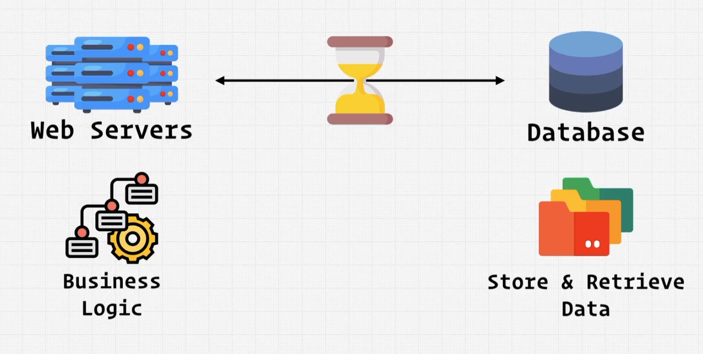
- Usually the data requested by the client is regional or common and not specific to a single user. So, we can use **Caching** to increase the performance.
- It's not used to store data like `images`, `videos`, `documents`, etc. as it's not efficient. As it will slow down the database.
  - Instead, we can use [Object Storage](#object-storage) to store these types of data.
- **Database Transaction**: it's a set of operations that are executed as a single unit. (either all the operations are done, or none of them are done).
  - Ex: `transfer money from account A to account B` is a transaction. as it's a set of operations that are executed as a single unit. (either all the operations are done, or none of them are done).
  - transaction starts with `BEGIN` and ends with `COMMIT` or `ROLLBACK`.
    - if the transaction is successful, then it will `COMMIT` the changes.
    - if the transaction is not successful, then it will `ROLLBACK` the changes.
  - It's important when discussing [ACID](#acid--base) compliance.

---

### ACID & BASE

- **ACID** is a set of properties of **relational database (SQL) transactions**. It's a way to make sure that the data is consistent.

  - **Atomicity**
    - a transaction is either **All or Nothing**. (either all the operations are done, or none of them are done). we can't split or do part of the transaction. it must be done as a single unit.
    - Example: `transfer money from account A to account B`, if the transaction wasn't done as a single unit, then we may lose money. as the money may be transferred from account A, but not transferred to account B.
  - **Consistency**
    - a transaction must be consistent. (it can't break the rules of the database).
    - Example: setting a column to not be `null` or to be unique.
  - **Isolation**
    - a transaction must be isolated. (it can't be affected by other transactions). So transactions must be executed in order. (one after the other). and not concurrently.
  - **Durability**
    - a transaction must be durable. (it can't be lost). That's why we use `Disk` to store the data. as it's persistent storage unlike `Memory` which is volatile storage.

> It's hard to scale `RDBMS` (Relational Database Management System) **horizontally**. (as it's not partition tolerant due to `ACID` compliance). and it's hard to scale `NoSQL` **vertically**. as it's not consistent.

- **BASE** is a set of properties of **Non relational database transactions (NoSQL)**. It's a way to make sure that the data is consistent. (it's the opposite of `ACID`)

  - **Basically Available** -> the system guarantees availability.
  - **Soft state** -> the state of the system may change over time. (it's not guaranteed to be consistent).
  - **Eventual consistency** -> the system will eventually become consistent once it stops receiving input (In sync with the database).
    - This is for database replication, as it take time to update the data in the replicas. so, the data may be inconsistent for a while. but it will eventually become consistent.

- **Notes:**
  - as `NoSQL` doesn't support `ACID` compliance, it's good for horizontal scaling. as it's partition tolerant.
    - because there's no joins, no foreign keys, etc. so, it's easy to scale horizontally.

---

### Replication and Sharding

When we have a single `DB` and we want to scale it as the traffic increases, we can use **Replication** and **Sharding**.

#### Replication

It's the process of **copying** the data from one database to another database.

- This enables us to handle more read requests. as we can read from the replicas.
- It's usually used in **"Read-heavy"** applications. because it's used to handle more read requests.
- It's usually used in **"Single Region"**. as it's not partition tolerant.
- **Leader-Follower (Master-Slave) Replication**
  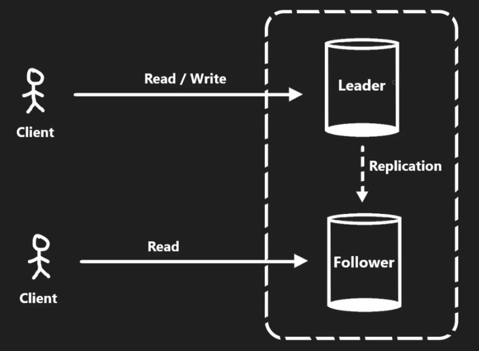

  - `Leader` -> is the database that receives the `write` requests.
    - it's used to handle the (`read` / `write`) requests.
  - `Follower` -> is the database that receives the `read` requests.
    - it only handles the `read` requests.
    - `Leader` sends the data to the `Follower` and the `Follower` stores it in the `disk`.
  - It's used to **horizontally scale** the `read` requests only.
    - because we're allowed to write only to the `Leader`, and read from the `Leader` and the `Follower`.
  - The replication process may be `Async` or `Sync`
    - **Async Replication** -> the `Leader` sends the data to the `Follower` and the `Follower` stores it in the `disk` **eventually (in a later time)**. This may cause the data to be inconsistent when reading from the `Follower`.
    - **Sync Replication** -> the `Leader` sends the data to the `Follower` and the `Follower` stores it in the `disk` **immediately**
      - Advantage: consistent reading between them.
      - Disadvantage: higher latency -> the `Follower` will be slow when reading from it. as it has to wait for the `Leader` to send the data to it and store it in the `disk` before it can read it.

- **Leader-Leader Replication**
  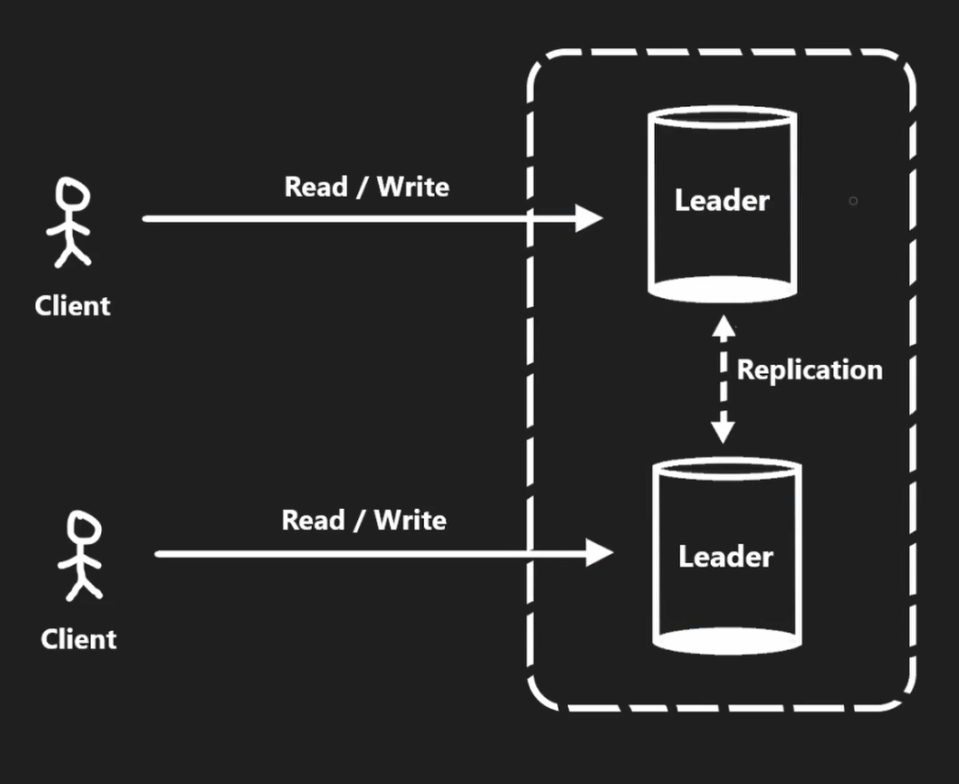
  - It's used to scale the `read` and `write` requests.
  - It's usually not consistent.
    - if async replication is used, then it will be "loosely consistent". but it will be fast.
    - if sync replication is used, then it will be "strongly consistent". but it will be slow (higher latency).

---

#### Sharding

It's the process of **splitting** the data into multiple databases.

- It's used when the DB has a lot of data that can't be stored in a single database -> (`petabytes` of data) that need to be split into multiple smaller databases called `"shards"`.
  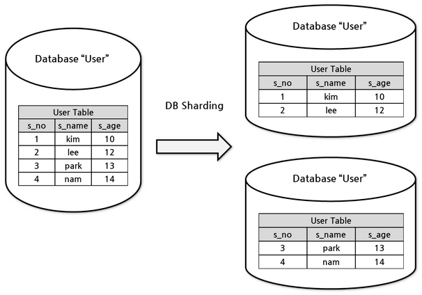

- This enables us to handle more `read` and `write` requests. as we can read and write from the `shards`.
- It's an advanced technique used in cases where we have **massive** amounts of data that can't be stored in a single database (petabytes of data).
- It's usually used in **"Write-heavy"** applications. because it's used to handle more write requests.
- That is where `sharding` comes in. `Sharding` is the process of splitting up a large database into multiple smaller databases called `shards` that contains part of the data.
- Each `shard` is a separate database that can be stored on a **separate server (machine)**.
- Sharding is done using a `sharding key` which is a key that is used to determine which `shard` the data should be stored in.

  - `Range based sharding` -> the `sharding key` is a range of values. (ex: `id`).
  - `Hash based sharding` -> the `sharding key` is a hash of the data. (ex: `hash(id)`).

- **Notes:**
  - `SQL` DBs like `MySQL` and `PostgreSQL` don't support `sharding` out of the box. So, we need to use a `sharding middleware` like `Vitess` to do the `sharding` for us at the application level.
    - By sharding a `SQL` DB, we lose the `ACID` compliance. as the data is not consistent anymore.
      - This is because we won't be able to do `joins` anymore. as the data is split into multiple `shards`, and we won't have `foreign keys` constraints anymore.
  - Most `NoSQL` DBs like `MongoDB` and `Cassandra` support `sharding` out of the box. So, we don't need to use a `sharding middleware`.

---

### CAP Theorem

**CAP Theorem** is a theorem for designing databases in distributed systems (e.g. `leader-follower` replication). It states that it's impossible for a distributed system to simultaneously provide more than 2 out of 3 of the following guarantees: (`Consistency`, `Availability`, `Partition tolerance`).
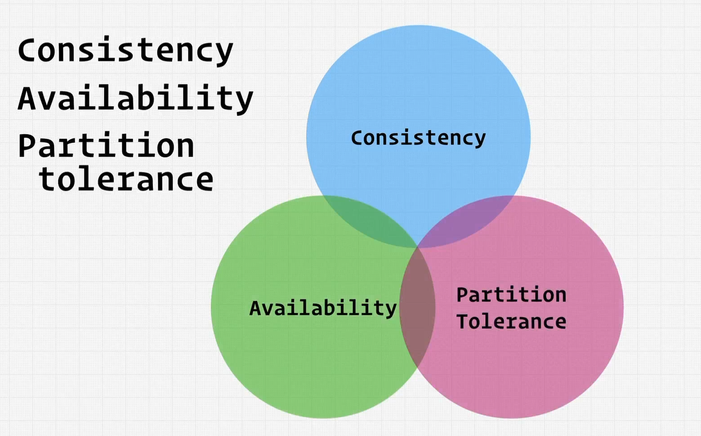

- **Consistency**: all nodes see the same data at the same time (every `read` will get the most up-to-date `written data` or an error).
  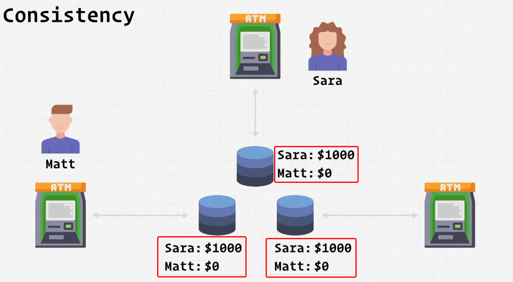
  - This is usually achieved by updating several nodes before allowing further reads. in order to make sure that all nodes have the same data.
    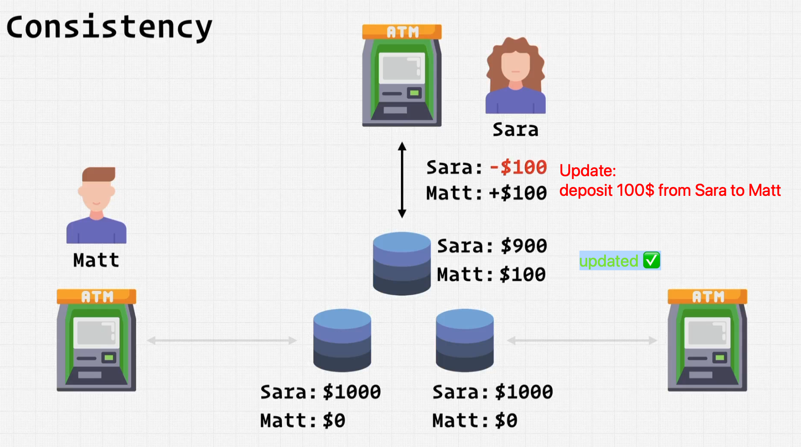
  - So, no reads are allowed until all nodes are updated.
    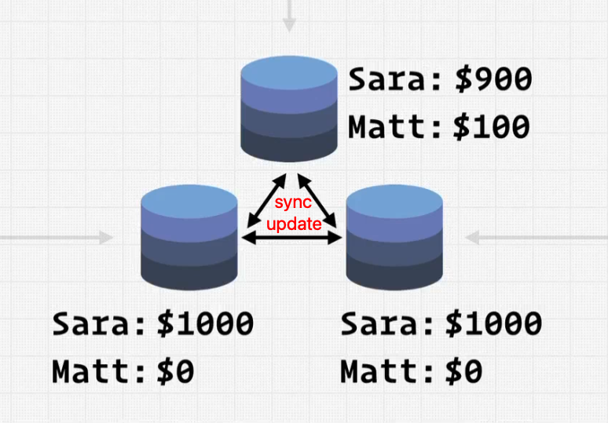
    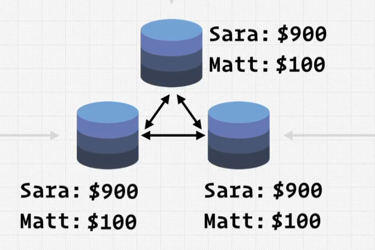
  - Notes:
    - we won't achieve `Consistency` if there's a `partition / connection-loss` between the nodes. as the nodes won't be able to communicate with each other. so, they won't be able to update each other. and the data won't be consistent.
    - if we still want to achieve `Consistency` even if there's a `partition / connection-loss` between the nodes, then we will allow `reads` only from the `Leader` node. as it's the only node that has the most up-to-date data. and we won't allow `reads` from the `Follower` nodes. as they may have stale data. -> **Which means that we won't achieve `Availability` 🤦‍♂️**.
- **Availability**: a guarantee that every request receives a response about whether it succeeded or failed.
- **Partition tolerance**: the system continues to operate despite arbitrary message loss or failure of part of the system (loss of connection between nodes/databases).

  - in a system, if a point is down, then we have a **partition**. and if the system can still operate, then it's **partition tolerant**.
  - For example, if a db is partitioned from other dbs, then it should still be able to operate even if it's partitioned and has **stale data** and the data is not guaranteed to be updated.
    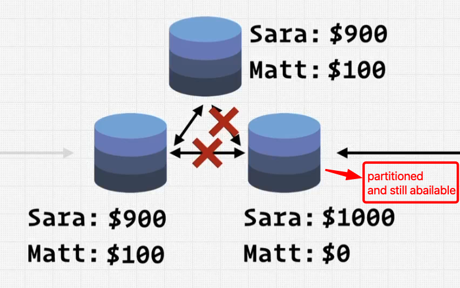
  - If the system is not partition tolerant, then it won't be able to operate if a point is down ( will give error ).

- System can be categorized into 2 categories:

  - **CP**: Consistency and Partition tolerance.
    - It's usually used in **"Relational Databases"**. like: `MySQL`, `PostgreSQL`, etc.
    - It's usually used in **"Single Region"**. as it's not partition tolerant.
  - **AP**: Availability and Partition tolerance.
    - It's usually used in **"NoSQL Databases"**. like: `MongoDB`, `Cassandra`, etc.
    - It's usually used in **"Multi Region"**. as it's partition tolerant.
  - **CA**: Consistency and Availability.
    - It's usually used in **"Single Region / Point"**. as it's not partition tolerant.
      - It can't be in distributed systems **(Not commonly used ❌)**
    - It's usually used in **"Databases"**. like: `Redis`, `Memcached`, etc.

---

## Object Storage

**Object Storage** is a service that stores the data in the cloud as `objects` instead of `files` (like in the file-system).

- It's used for large files like: `images`, `videos`, `documents` that shouldn't be stored in the `database`. as it's not efficient.
  - instead, we can store them in the `object storage`, and then store the `URL` of the object in the `database`.
  - We can access the objects using `HTTP` requests using the `URL` of the object.
    - Ex: `GET`, `POST`, `PUT`, `DELETE`, etc.
- Here, the data is stored in a flat structure. (no folders). and each object has a unique identifier.

  - There isn't hirarchy in the `object storage`. as it's a flat structure. so, we can't have folders.
  - Ex: `Amazon S3`, `Google Cloud Storage`, etc.

- `object` -> `BLOB` (Binary Large Object)
  - It's a collection of binary data stored as a single entity in a database management system.
- **Object storage** is usually used for `read` & `write` operations. But it can't be used for `update / Edit` operations. as it's not efficient.

  - It's usually used to store data that can't be updated like: `images`, `videos`, `documents`, etc.
  - So, if we want to update an object, we need to delete it and then create a new one.

- Here, we can't have duplicate objects. as each object has a **unique** identifier.
  - It must be **globally unique**. as it's stored in the cloud. so, it must be unique across the whole cloud.
- So, in system design, any time you have a large file that you want to store, you should consider storing it in an object storage service instead of a database.

---

## Caching Service

**Caching Service** is a service that stores the data in the memory.
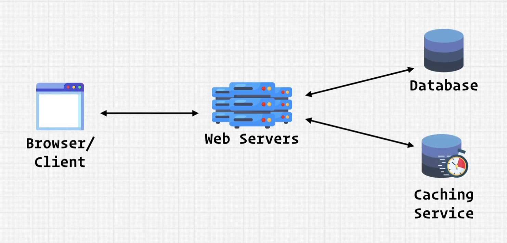

- `Database` and `Caching Service` both store data. but, `Database` stores the data in the disk, while `Caching Service` stores the data in the memory.
- `caching service` prioritize **speed** over **data storage**. so, it stores the data in the memory. and it's usually used for **read** operations.
  - **It stores much less data, but retrieves it much faster**.
- How it works:
  - After the `web server` gets the request from the `client`, it checks if the data is in the `caching service` or not.
  - if the data is in the `caching service`, it will send it back to the `web server`.
  - if the data is not in the `caching service`, it will get it from the `database`, and then it will send it back to the `web server` then process the data and format it, and then send it back to the `client`. and **concurrently** it will store the data in the `caching service`.

---

## Data Hose

**Data Hose** is a service that receives the raw data from the (`web server` / `client`) and then it processes ( massages ) the data and then it sends it to the `data warehouse`.

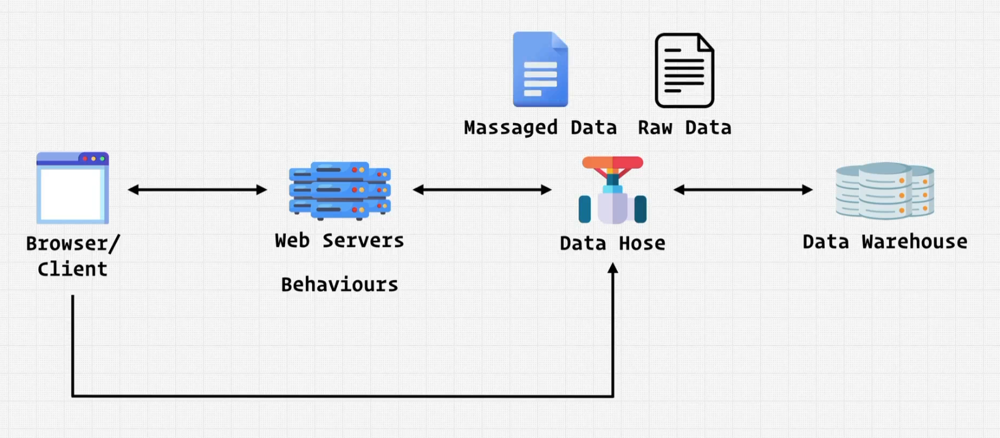

- It's like a **pipe** which is a **middleman** between the `web server` and the `data warehouse`.
- Ex: `Kafka`, `Kinesis`, etc.

---

### Data Warehouse

**Data Warehouse** is a service that **stores** the **data**.

---

## Cloud Storage

**Cloud Storage** is a service that stores the data in the cloud.

- It's like a `database`, but it's not a `database`. as it's not a `database` that is installed on a server. instead, it's a `database` that is installed on the cloud.
- Ex: `Amazon S3`, `Google Cloud Storage`, etc.

---

## Cache

> More here: [Cache](./2-API-design.md#api-caching)
