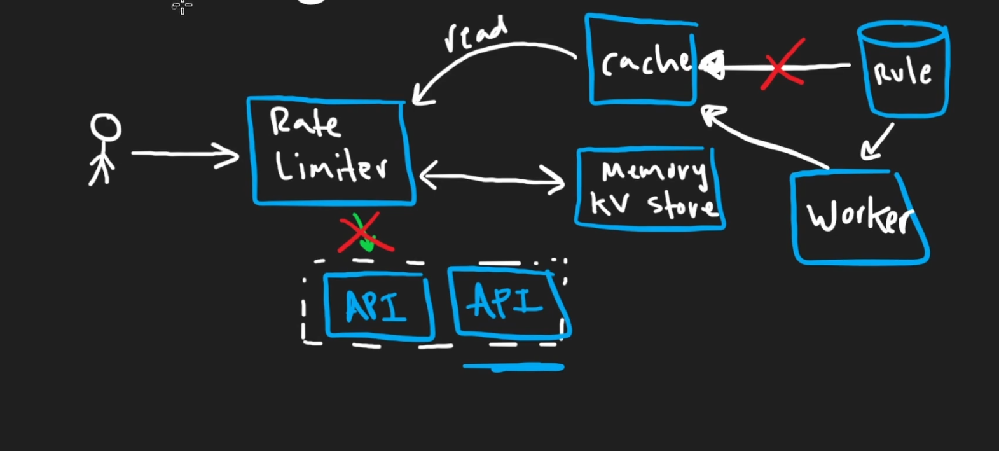
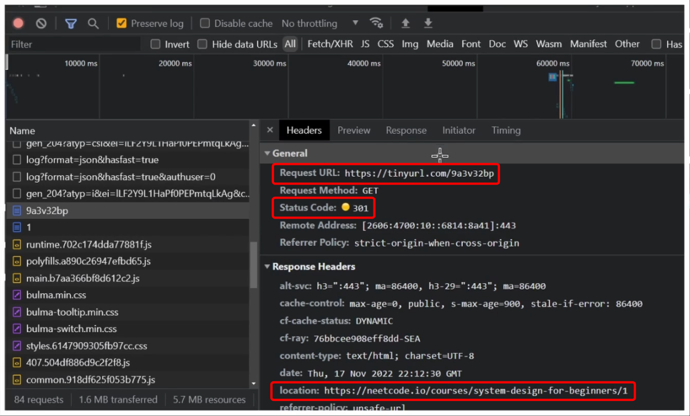
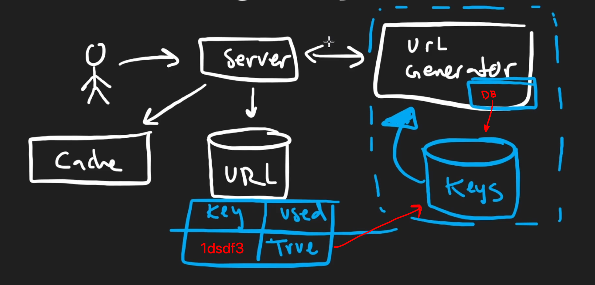
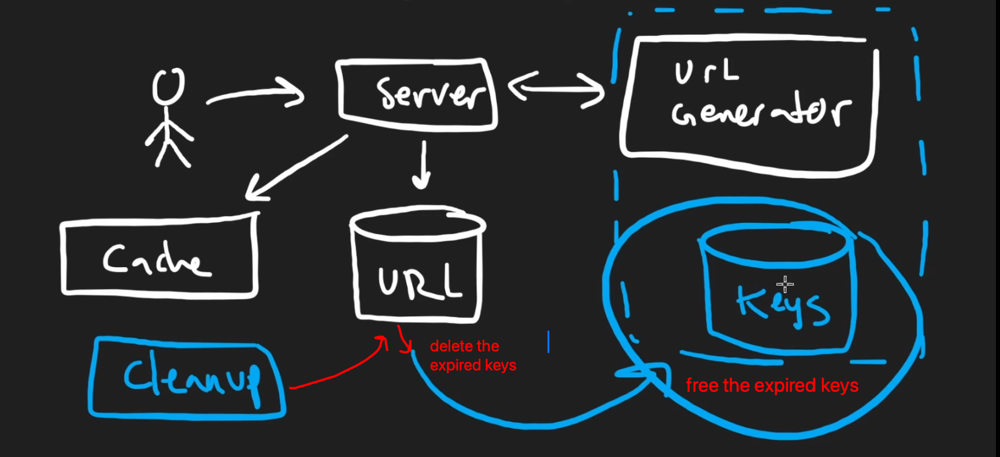

# INDEX

- [INDEX](#index)
  - [System Design Interview](#system-design-interview)
    - [How to approach](#how-to-approach)
  - [System Design Questions](#system-design-questions)
    - [Design a Rate Limiter](#design-a-rate-limiter)
    - [Design TinyURL](#design-tinyurl)

---

## System Design Interview

It's meant to test your **ability to design scalable systems**. It's a **high-level** test to see if you can **design a system**.

It's base on taking **real-world problems** and designing a system to solve them.

### How to approach

- Usually, you won't be asked a generic question like "Design Twitter". Instead, you'll be asked to design a small part of a system, like:
  - "Design the "like" button for Twitter"
- In the interview, you will be scoping the problem, asking questions, and designing the system with the interviewer.

- The most important thing is to **communicate** with the interviewer and **ask questions**. It's not about getting the right answer, it's about showing your thought process and how you approach problems, and that you're understanding the problem correctly.
- Any problem will have (functional and non-functional) requirements.

  - **Functional Requirements**: What the system should do. (like what do we want to happen when user clicks the "like" button on a tweet)
    - **Example**: When a user clicks the "like" button, the tweet should be liked and the like count should be updated.
  - **Non-Functional Requirements**: How the system should do it. (like scalability, reliability -> how many likes can the system handle per second)
    - **Example**: The system should be able to handle 1000 likes per second (which means we need to design a system that can handle this load and scale if needed and maintain high availability)

- We won't be able to have the exact numbers for the non-functional requirements like `throughput`, `latency`, `availability`, etc. But we should have a **general idea** of what we're trying to achieve.

  - In this case we use **"Back of the envelope"** calculations to get a rough idea of what we're trying to achieve.

    > It's called like that because you can do it on the back of an envelope or a napkin fast and without much detail.

  - Example: If we know that twitter has `100 million` daily active users and each user reads `100 tweets` per day, and number of users that write tweets is `10%` of the total users, and each tweet has `100 likes` per day, then we can calculate the number of likes per second.

    ```plaintext
    Total number of likes per second = (100 million * 100) / (24 * 60 * 60) = 1157 likes per second
    ```

    

    > This is a rough estimate, but it gives us a starting point to design our system. Here's a [rough estimate of the number of likes per second we need to handle](https://colin-scott.github.io/personal_website/research/interactive_latency.html)

- In the end, we can't have perfect design, our goal is to meet as many requirements as possible, and when we can't meet them all, we should prioritize them by making **trade-offs**.

- **High Level Notes**
  - There's no one right answer
  - There's no one right way to solve a problem or design a system
  - Focus on the data model
  - Don't mention the technology you're going to use
  - Draw a diagram
  - Talk
- **Steps**
  - Identify 2 core features
  - Possible implementation
  - Identify and address difficulties
  - Solution for **scaling**
    - Scaling for Users:
      - Caching -> Memory Cache -> Redis Cache -> CDN
      - Deployment Options -> Load Balancer -> Horizontal Scaling

---

## System Design Questions

- How to answer:
  1. **Clarify the goal and scope of the problem**
     - This is done by asking questions to the interviewer to further understand the problem
  2. **Identify the functional and non-functional requirements**
     - Functional Requirements: What the system should do
     - Non-Functional Requirements: How the system should do it
     - You should have a general idea of what you're trying to achieve after asking questions to the interviewer (first step)
  3. **Propose a high-level design**
  4. **Design details**

### Design a Rate Limiter

> Resources:
>
> - [Rate Limiting Fundamentals](https://blog.bytebytego.com/p/rate-limiting-fundamentals)
> - [Rate Limiting Algorithms 1](https://hechao.li/2018/06/25/Rate-Limiter-Part1/)
> - [Rate Limiting Algorithms 2](https://konghq.com/blog/engineering/how-to-design-a-scalable-rate-limiting-algorithm)
> - [Rate Limiting Algorithms 3](https://medium.com/@ankitsheoran127201/rate-limiter-design-9ef126c7e030)

- What is the goal?

  - main goal is for security, to prevent brute force attacks
  - cost of the operation & availability
    - for example Youtube has a rate limiter for the number of videos you can upload per day
  - Ux issues
    - for example, in Youtube, if there're bots for writing comments, it will be a bad experience for the users
  - **Overall goal** -> To prevent users / bots from making too many requests in a short period of time

- **Step 1:** scoping the problem

  - Are we designing a rate limiter for a Backend API or a Frontend UI?
    - Backend API
    - if the interviewer asks about why not implementing it in the frontend?
      - This is because if the rate limiter is implemented in the frontend code, it will only be effective for the users who are using the frontend code, and not for the users who are directly calling the backend API.
      - So, the frontend can be manipulated by the user, as he can bypass the rate limiter by using a different browser or by clearing the cookies or by directly calling the backend API using `curl` or `postman`
  - can it be reusable for multiple microservices?
    - Yes, so we need to implement it as a service and not in the endpoint level.
      
  - What is the rate limit?
    - 100 requests per minute
  - How we will identify the user?
    - By IP address
    - By user ID

- **Step 2:** clarifying the functional and non-functional requirements

  - **Functional Requirements**:
    - The system should limit the number of times a user can enter the code in a given time frame
    - We will use the user's IP address to identify the user
    - The system should return a `429 Too Many Requests` status code when the rate limit is exceeded -> Throttling
    - The system should reset the rate limit after the time frame has passed -> 24 hours
  - **Non-Functional Requirements**: (how well the system should do, `performance`, `scalability`, `etc`)

    - As the rate limiter will be used as a layer before the actual service, it might introduce some `latency`, So we need to make sure that the latency is as minimal as possible and doesn't affect the overall performance of the system
    - For `throughput`, we need to make sure that the system can handle a large number of requests per second, because if the system can't handle the requests, then the rate limiter will be useless
    - The system should be able to scale horizontally
    - For `storage`, it should have rate limit `rules` and `counters` for each user (each `IP`). So we need to make sure that the storage can handle the load and is highly available
      - Each IP -> 4 digit code -> 100 requests per some time -> `128 bytes` per user
      - So if we have `1 million` users, then we need `128 billion bytes` -> `128 GB` of storage, which is feasible to store in `memory`
    - For `availability`, the system should be highly available, and if the `rate limiter` goes down, then the whole system should still be able to function -> **Fail Open**
      

      > The opposite is **Fail Close**, which means that if the rate limiter goes down, then the whole system should stop functioning, which is not a good idea, but might be needed in some cases, like in a bank system, where we need to make sure that the rate limiter is always up and running

- **Step 3:** Propose a high-level design
  

  - First, when a user makes a request, it will hit the `rate limiter` service, which will act as a `reverse proxy`, and then it will forward the request to the actual service
    - it will allow the request if the rate limit is not exceeded, or it will return a `429 Too Many Requests` status code if the rate limit is exceeded
  - We will need a `storage` to store the rate limit `rules` and `counters` for each user (each `IP`). So, the `rate limiter` will:
    - Read the `rule` for the current operation from the `storage` (as each operation might have a different rate limit rule) -> `DB`
    - Read / Write the `counter` for the user (each `IP`) in memory -> `Redis`
  - We will have APIs which the rate limiter will decide whether to allow the request or not
  - Another approach is to send the request directly to the API, and then the API will call the rate limiter within the application-logic to check if the request should be allowed or not
    - In this case we won't need a `DB` to store the `rules`, as the `rules` will be hardcoded in the application-logic
    - This approach is good if we have a small number of microservices, and we don't want to introduce a new service for the rate limiter. First approach is good if we have a large number of microservices, and we want to reuse the rate limiter for all of them

- **Step 4:** Design details

  - **Storage**:

    - We will use `Redis` to store the `counters` for each user, as it's a `key-value` store, and it's `in-memory`, so it's fast
      - We should set an expiration time for the `counters` in `Redis` to reset the rate limit after the time frame has passed
    - We will use `MySQL` to store the `rules` for each operation, as it's a `relational` database, and it's `disk-based`, so it's good for storing large amounts of data

      - Schema:

        - `id` -> the `id` of the rule
        - `api` -> the `api` of the rule (URL of the endpoint)
        - `operation` -> the `operation` of the rule (Name of the operation)
        - `time unit` -> the `time unit` of the rule (minute, hour, day, etc)
        - `requests` -> the number of requests allowed in the time frame

        ```sql
        CREATE TABLE rate_limit_rules (
          id INT AUTO_INCREMENT PRIMARY KEY,
          api VARCHAR(255) NOT NULL,
          operation VARCHAR(255) NOT NULL,
          time_unit VARCHAR(255) NOT NULL,
          requests INT NOT NULL
        );
        ```

    - The main reason for `latency` will be the `storage`, so we need to make sure that the `storage` is fast and highly available by using `caching` and `replication`
      - We can use another `cache` layer before the `storage` to cache the `rules` and the `counters`, and a `worker` to update the `counters` in `Redis` and to reset the rate limit after the time frame has passed
        

  - **Algorithm**:
    - We need to store the `counters` in `Redis` for each user (each `IP`), The key will be the `IP`, and the value will be the `counter` for the user
    - We will update the `counter` for the user (each `IP`) in `Redis` for each request (in the time frame)
    - For specifying the time frame, we can use `Sliding Window` or `Fixed Window` algorithm. (look at the resources for more details)
      
      > You're not expected to know the exact algorithm, but you should have a general idea of how it works
  - **Scaling**:
    - We will use `Redis` for the `counters`, and `MySQL` for the `rules`, so we can scale them horizontally
    - We will use a `load balancer` to distribute the requests to the `rate limiter` service
    - We will use a `load balancer` to distribute the requests to the actual service
  - **Fail Open**:
    - If the `rate limiter` goes down, then the whole system should still be able to function
    - We will use a `circuit breaker` to detect

---

### Design TinyURL

**TinyURL** is a URL shortening service, a web service that provides short aliases for redirection of long URLs.


- **Step 1:** scoping the problem (asking questions to the interviewer)
  - We want it to be `8` characters long (user-friendly)
  - User can create / delete a `custom` URL, so do we need to keep track of the **ownership** of the URL?
  - What is the expiration time for the URL? (1 year, 5 years, etc)
  - What would happen if multiple users try to create the same custom URL? should it always map to the same short URL? No, it should be unique for each user
- **Step 2:** clarifying the functional and non-functional requirements

  - **Functional Requirements**:
    - The system should be able to shorten the URL
    - The system should be able to redirect the short URL to the original URL
    - The system should be able to create / delete a custom URL
    - The system should be able to keep track of the ownership of the URL
    - The system should be able to expire the URL after a certain time
  - **Non-Functional Requirements**:
    - We want it to be as `available` and `fault-tolerant` as possible, because if the system goes down, then the whole system will be down
    - We also want to minimize the `latency` as much as possible, because if the conversion takes a long time, then the user experience will be bad for no reason
    - For `scalability`, The `reads` will be much more than the `writes`, so we need to make sure that the system can handle a large number of `reads per second`
      - for example the ratio of `reads` to `writes` is `100:1`, so we need to make sure that the system can handle `100` times more `reads` than `writes`
    - If we knew from the interviewer that the number of the URLs that we will deal with is like `1 billion write per month`, then we need to make sure to come with a mapping method that can handle this number of URLs in just `8` characters
      - For this, we should use as many digits / characters as possible in each position of the URL (`a-z`, `A-Z`, `0-9`), and we should use as many positions as possible in the URL
        - `9a3v5b7c` -> `8` characters -> `62^8` -> `218,340,105,584,896` URLs -> `218 trillion` URLs -> `1 billion` URLs per month ✅
    - For `throughput`, the system should be able to handle a large number of requests per second
      - `1 billion` URLs per month -> `1 billion / 30 days / 24 hours / 60 minutes / 60 seconds` -> `380` URLs `writes` per second
      - As the ratio of `reads` to `writes` is `100:1`, then the system should be able to handle `38,000` URLs `reads` per second
    - The system should be able to scale horizontally
    - For `storage`, it should be able to store a large number of URLs, and it should be highly available
      - Here, we focus on the `writes`, So `1 billion` URLs per month -> `1 billion URLs * 8 characters * average 100 bytes per URL` -> `800 GB -> 1 TB` of storage per month

- **Step 3:** Propose a high-level design
  

  - We will be handling a large number of `reads` compared to the `writes`, so we can use `NoSQL`, because:
    - `NoSQL` is designed to handle a large number of `reads` and `writes`
    - `NoSQL` doesn't come with `ACID` properties, and we're not going to be storing `writes` a lot, so we don't need `ACID` properties
    - We won't be doing `joins` between the tables, so we don't need `SQL`
    - With `BASE` properties, we can have **eventual consistency** (as we won't be `writing` frequently), which is good for `reads`
  - First, when a user makes a request, it will hit the server, which will be communicating with:
    - `URL shortener / generator` service, which will be responsible for generating the short URL
    - `URL DB` service, which will be responsible for storing the URLs
  - If the user is `writing` a URL, then the request will hit the `URL shortener / generator` service, which will generate the short URL, and then it will hit the `URL DB` service, which will store the URL, then it will return the short URL to the user
  - If the user is `reading` a URL, then the request will hit the `URL DB` service, which will return the original URL to the user
    - We will also have a `cache` layer before the `URL DB` service to cache the URLs, as some URLs will be `read` frequently

- **Step 4:** Design details

  - **How should it work**

    - For `reading`, if you looked at the request header, you will find that:
      
      - the original `Request URL` that we hit is `https://tinyurl.com/9a3v32bq`
      - You will get a `Status Code` of `🟡 301 Moved Permanently`, which means (the resource has been moved, meaning that the resource exists but the response will come from another URL)
      - In the `Response Headers`, you will find the `location` that the response came from which is `https://neetcode.io/courses/system-design-for-beginners/1`, which is different from the `Request URL` that we hit (meaning that there was a conversion)
    - As soon as the browser receives this response, it will:
      - automatically make a new request using the new `location`
      - cache it so that if we hit the `tiny url` again ti will hit the new `generated url` instead (this won't happen if the `status code` is `302 Moved Temporarily`)

  - **Storage**:

    - We will use `Cassandra` for the `URL DB`
      - `1 TB` of storage per month, so we can store `1 TB` of URLs in `Cassandra`
      - Data to store:
        - `uid` -> the `id` of the URL
        - `original_url` -> the `original_url` of the URL
        - `short_url` -> the `short_url` of the URL
        - `expiration_time` -> the `expiration_time` of the URL
    - We will use `Redis` as a `cache` layer before the `URL DB`
      - If we're expecting `1 TB` of storage per month, then we can make the `cache` layer to store `25%` of the `reads`, so we can store `265 GB` of URLs in `Redis`
      - For the caching algorithm, we can use `LRU` (Least Recently Used) algorithm, as it's `simple`, and it's `fast`, and matches our goal of caching the most recently accessed URLs

  - **Algorithm**:

    - How are we going to generate the short URL (the `8` characters long URL)? and how do we make sure that we won't have a collision between the URLs?
    - We will use `Base62` to generate the short URL, as it's `user-friendly`, and it can handle a large number of URLs in just `8` characters
      - `a-z`, `A-Z`, `0-9` -> `62` characters
      - `62^8` -> `218,340,105,584,896` URLs -> `218 trillion` URLs
    - We will use `Base62` to convert the `ID` of the URL to the short URL
    - In order to avoid `collisions`:
      

      - we can use a `Database` with the `url-generator` service in order to check if the `key` is already used or not
      - When a `url` expires, we can reuse the `key` for another `url` by marking it as `unused` in the `Database`
      - Here, this `keys DB` should be `SQL` because we need to make sure that the `key` is unique, and we need to make sure that the `key` is not used before, and we need to make sure that the `key` is not used by another user, or to avoid the `collisions` between the `keys` if 2 users are trying to create the same `custom` URL at the same time -> `ACID` properties -> `atomic & isolation` properties

    - Deleting an expired URL:
      
      - We can use a `worker` or a `cleanup` service to delete the expired URLs from the `URL DB` service by filtering the URLs that have expired
      - After getting the expired URLs, we can delete them from the `URL DB` service and go to the `keys DB` and mark the `keys` as `unused`
      - this `worker` or `cleanup` service should be `scheduled` to run **asynchronously** every `24 hours / 1 hour / 10 minutes` depending on the discussion with the interviewer

  - **Scaling**:
    - We can use a `load balancer` between the `client` and the `server` to distribute the requests to the `URL shortener / generator` service and the `URL DB` service
    - For the `URL DB` service, We can:
      - have `replicas` to make sure that the system is `fault-tolerant` and `highly available`
      - partition the database by `hashing` the `ID` of the URL to distribute the URLs across the `nodes` evenly
