# INDEX

- [INDEX](#index)
  - [System Design Interview](#system-design-interview)
    - [How to approach](#how-to-approach)
  - [System Design Questions (BE)](#system-design-questions-be)
    - [Design a Rate Limiter](#design-a-rate-limiter)
    - [Design TinyURL](#design-tinyurl)
    - [Design Twitter](#design-twitter)
    - [Design Discord](#design-discord)
    - [Design YouTube](#design-youtube)
    - [Design Google Drive](#design-google-drive)
  - [System Design Questions (FE)](#system-design-questions-fe)

---

## System Design Interview

It's meant to test your **ability to design scalable systems**. It's a **high-level** test to see if you can **design a system**.

It's base on taking **real-world problems** and designing a system to solve them.

### How to approach

- Usually, you won't be asked a generic question like "Design Twitter". Instead, you'll be asked to design a small part of a system, like:
  - "Design the "like" button for Twitter"
- In the interview, you will be scoping the problem, asking questions, and designing the system with the interviewer.

- The most important thing is to **communicate** with the interviewer and **ask questions**. It's not about getting the right answer, it's about showing your thought process and how you approach problems, and that you're understanding the problem correctly.
- Any problem will have (functional and non-functional) requirements.

  - **Functional Requirements**: What the system should do. (like what do we want to happen when user clicks the "like" button on a tweet)
    - **Example**: When a user clicks the "like" button, the tweet should be liked and the like count should be updated.
  - **Non-Functional Requirements**: How the system should do it. (like scalability, reliability -> how many likes can the system handle per second)
    - **Example**: The system should be able to handle 1000 likes per second (which means we need to design a system that can handle this load and scale if needed and maintain high availability)

- We won't be able to have the exact numbers for the non-functional requirements like `throughput`, `latency`, `availability`, etc. But we should have a **general idea** of what we're trying to achieve.

  - In this case we use **"Back of the envelope"** calculations to get a rough idea of what we're trying to achieve.

    > It's called like that because you can do it on the back of an envelope or a napkin fast and without much detail.

  - Example: If we know that twitter has `100 million` daily active users and each user reads `100 tweets` per day, and number of users that write tweets is `10%` of the total users, and each tweet has `100 likes` per day, then we can calculate the number of likes per second.

    ```plaintext
    Total number of likes per second = (100 million * 100) / (24 * 60 * 60) = 1157 likes per second
    ```

    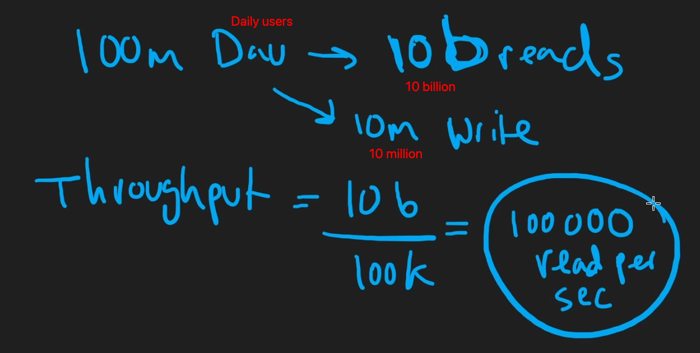

    > This is a rough estimate, but it gives us a starting point to design our system. Here's a [rough estimate of the number of likes per second we need to handle](https://colin-scott.github.io/personal_website/research/interactive_latency.html)

- In the end, we can't have perfect design, our goal is to meet as many requirements as possible, and when we can't meet them all, we should prioritize them by making **trade-offs**.

- **High Level Notes**
  - There's no one right answer
  - There's no one right way to solve a problem or design a system
  - Focus on the data model
  - Don't mention the technology you're going to use
  - Draw a diagram
  - Talk
- **Steps**
  - Identify 2 core features
  - Possible implementation
  - Identify and address difficulties
  - Solution for **scaling**
    - Scaling for Users:
      - Caching -> Memory Cache -> Redis Cache -> CDN
      - Deployment Options -> Load Balancer -> Horizontal Scaling

---

## System Design Questions (BE)

- How to answer:
  1. **Clarify the goal and scope of the problem**
     - This is done by asking questions to the interviewer to further understand the problem
  2. **Identify the functional and non-functional requirements**
     - Functional Requirements: What the system should do
     - Non-Functional Requirements: How the system should do it
     - You should have a general idea of what you're trying to achieve after asking questions to the interviewer (first step)
  3. **Propose a high-level design**
  4. **Design details**

### Design a Rate Limiter

> Resources:
>
> - [Rate Limiting Fundamentals](https://blog.bytebytego.com/p/rate-limiting-fundamentals)
> - [Rate Limiting Algorithms 1](https://hechao.li/2018/06/25/Rate-Limiter-Part1/)
> - [Rate Limiting Algorithms 2](https://konghq.com/blog/engineering/how-to-design-a-scalable-rate-limiting-algorithm)
> - [Rate Limiting Algorithms 3](https://medium.com/@ankitsheoran127201/rate-limiter-design-9ef126c7e030)

- What is the goal?

  - main goal is for security, to prevent brute force attacks
  - cost of the operation & availability
    - for example Youtube has a rate limiter for the number of videos you can upload per day
  - Ux issues
    - for example, in Youtube, if there're bots for writing comments, it will be a bad experience for the users
  - **Overall goal** -> To prevent users / bots from making too many requests in a short period of time

- **Step 1:** scoping the problem

  - Are we designing a rate limiter for a Backend API or a Frontend UI?
    - Backend API
    - if the interviewer asks about why not implementing it in the frontend?
      - This is because if the rate limiter is implemented in the frontend code, it will only be effective for the users who are using the frontend code, and not for the users who are directly calling the backend API.
      - So, the frontend can be manipulated by the user, as he can bypass the rate limiter by using a different browser or by clearing the cookies or by directly calling the backend API using `curl` or `postman`
  - can it be reusable for multiple microservices?
    - Yes, so we need to implement it as a service and not in the endpoint level.
      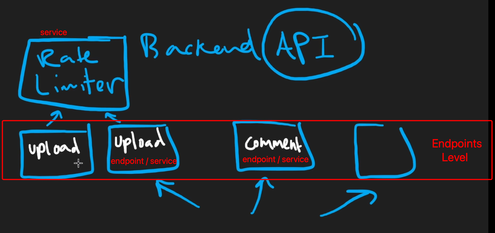
  - What is the rate limit?
    - 100 requests per minute
  - How we will identify the user?
    - By IP address
    - By user ID

- **Step 2:** clarifying the functional and non-functional requirements

  - **Functional Requirements**:
    - The system should limit the number of times a user can enter the code in a given time frame
    - We will use the user's IP address to identify the user
    - The system should return a `429 Too Many Requests` status code when the rate limit is exceeded -> Throttling
    - The system should reset the rate limit after the time frame has passed -> 24 hours
  - **Non-Functional Requirements**: (how well the system should do, `performance`, `scalability`, `etc`)

    - As the rate limiter will be used as a layer before the actual service, it might introduce some `latency`, So we need to make sure that the latency is as minimal as possible and doesn't affect the overall performance of the system
    - For `throughput`, we need to make sure that the system can handle a large number of requests per second, because if the system can't handle the requests, then the rate limiter will be useless
    - The system should be able to scale horizontally
    - For `storage`, it should have rate limit `rules` and `counters` for each user (each `IP`). So we need to make sure that the storage can handle the load and is highly available
      - Each IP -> 4 digit code -> 100 requests per some time -> `128 bytes` per user
      - So if we have `1 million` users, then we need `128 billion bytes` -> `128 GB` of storage, which is feasible to store in `memory`
    - For `availability`, the system should be highly available, and if the `rate limiter` goes down, then the whole system should still be able to function -> **Fail Open**
      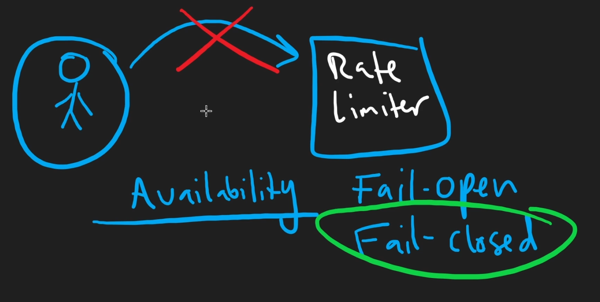

      > The opposite is **Fail Close**, which means that if the rate limiter goes down, then the whole system should stop functioning, which is not a good idea, but might be needed in some cases, like in a bank system, where we need to make sure that the rate limiter is always up and running

- **Step 3:** Propose a high-level design
  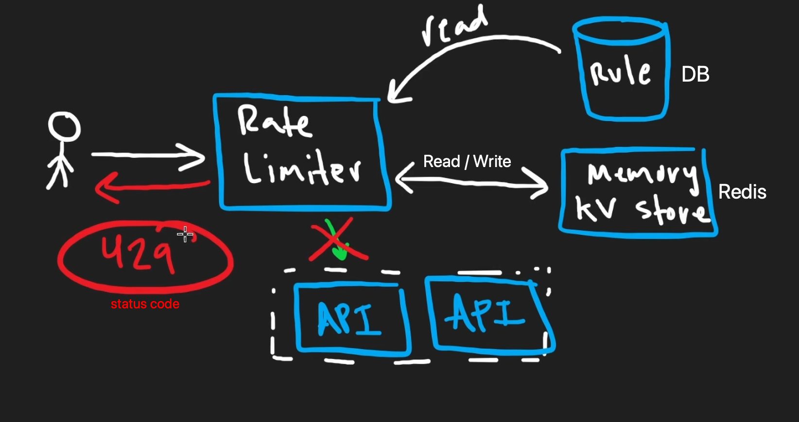

  - First, when a user makes a request, it will hit the `rate limiter` service, which will act as a `reverse proxy`, and then it will forward the request to the actual service
    - it will allow the request if the rate limit is not exceeded, or it will return a `429 Too Many Requests` status code if the rate limit is exceeded
  - We will need a `storage` to store the rate limit `rules` and `counters` for each user (each `IP`). So, the `rate limiter` will:
    - Read the `rule` for the current operation from the `storage` (as each operation might have a different rate limit rule) -> `DB`
    - Read / Write the `counter` for the user (each `IP`) in memory -> `Redis`
  - We will have APIs which the rate limiter will decide whether to allow the request or not
  - Another approach is to send the request directly to the API, and then the API will call the rate limiter within the application-logic to check if the request should be allowed or not
    - In this case we won't need a `DB` to store the `rules`, as the `rules` will be hardcoded in the application-logic
    - This approach is good if we have a small number of microservices, and we don't want to introduce a new service for the rate limiter. First approach is good if we have a large number of microservices, and we want to reuse the rate limiter for all of them

- **Step 4:** Design details

  - **Storage**:

    - We will use `Redis` to store the `counters` for each user, as it's a `key-value` store, and it's `in-memory`, so it's fast
      - We should set an expiration time for the `counters` in `Redis` to reset the rate limit after the time frame has passed
    - We will use `MySQL` to store the `rules` for each operation, as it's a `relational` database, and it's `disk-based`, so it's good for storing large amounts of data

      - Schema:

        - `id` -> the `id` of the rule
        - `api` -> the `api` of the rule (URL of the endpoint)
        - `operation` -> the `operation` of the rule (Name of the operation)
        - `time unit` -> the `time unit` of the rule (minute, hour, day, etc)
        - `requests` -> the number of requests allowed in the time frame

        ```sql
        CREATE TABLE rate_limit_rules (
          id INT AUTO_INCREMENT PRIMARY KEY,
          api VARCHAR(255) NOT NULL,
          operation VARCHAR(255) NOT NULL,
          time_unit VARCHAR(255) NOT NULL,
          requests INT NOT NULL
        );
        ```

    - The main reason for `latency` will be the `storage`, so we need to make sure that the `storage` is fast and highly available by using `caching` and `replication`
      - We can use another `cache` layer before the `storage` to cache the `rules` and the `counters`, and a `worker` to update the `counters` in `Redis` and to reset the rate limit after the time frame has passed
        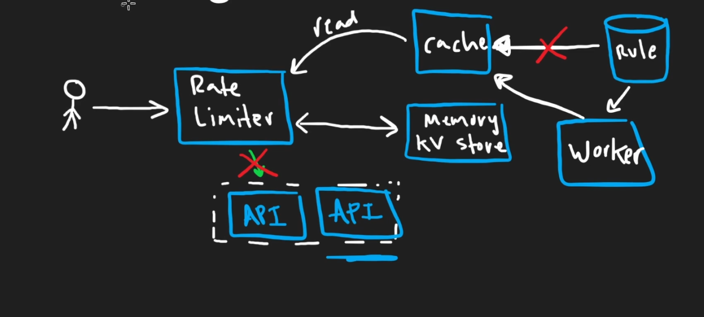

  - **Algorithm**:
    - We need to store the `counters` in `Redis` for each user (each `IP`), The key will be the `IP`, and the value will be the `counter` for the user
    - We will update the `counter` for the user (each `IP`) in `Redis` for each request (in the time frame)
    - For specifying the time frame, we can use `Sliding Window` or `Fixed Window` algorithm. (look at the resources for more details)
      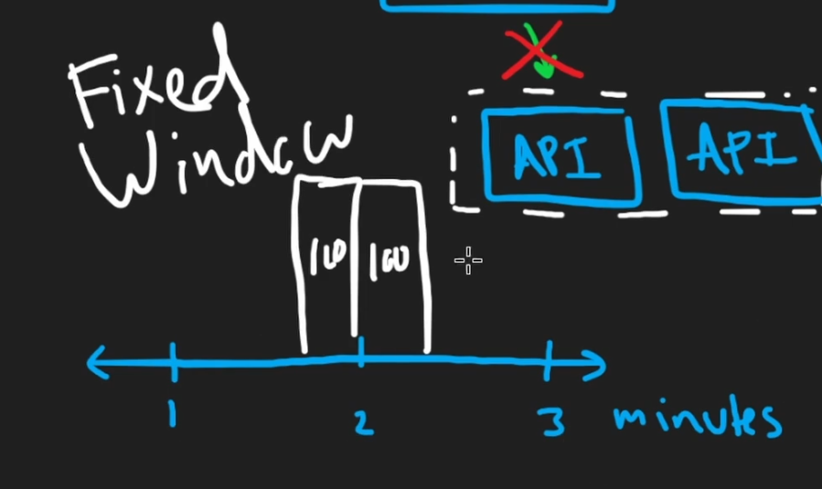
      > You're not expected to know the exact algorithm, but you should have a general idea of how it works
  - **Scaling**:
    - We will use `Redis` for the `counters`, and `MySQL` for the `rules`, so we can scale them horizontally
    - We will use a `load balancer` to distribute the requests to the `rate limiter` service
    - We will use a `load balancer` to distribute the requests to the actual service
  - **Fail Open**:
    - If the `rate limiter` goes down, then the whole system should still be able to function
    - We will use a `circuit breaker` to detect

---

### Design TinyURL

**TinyURL** is a URL shortening service, a web service that provides short aliases for redirection of long URLs.
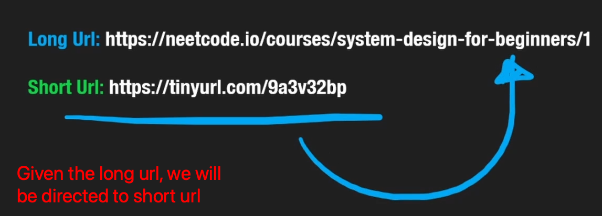

- **Step 1:** scoping the problem (asking questions to the interviewer)
  - We want it to be `8` characters long (user-friendly)
  - User can create / delete a `custom` URL, so do we need to keep track of the **ownership** of the URL?
  - What is the expiration time for the URL? (1 year, 5 years, etc)
  - What would happen if multiple users try to create the same custom URL? should it always map to the same short URL? No, it should be unique for each user
- **Step 2:** clarifying the functional and non-functional requirements

  - **Functional Requirements**:
    - The system should be able to shorten the URL
    - The system should be able to redirect the short URL to the original URL
    - The system should be able to create / delete a custom URL
    - The system should be able to keep track of the ownership of the URL
    - The system should be able to expire the URL after a certain time
  - **Non-Functional Requirements**:
    - We want it to be as `available` and `fault-tolerant` as possible, because if the system goes down, then the whole system will be down
    - We also want to minimize the `latency` as much as possible, because if the conversion takes a long time, then the user experience will be bad for no reason
    - For `scalability`, The `reads` will be much more than the `writes`, so we need to make sure that the system can handle a large number of `reads per second`
      - for example the ratio of `reads` to `writes` is `100:1`, so we need to make sure that the system can handle `100` times more `reads` than `writes`
    - If we knew from the interviewer that the number of the URLs that we will deal with is like `1 billion write per month`, then we need to make sure to come with a mapping method that can handle this number of URLs in just `8` characters
      - For this, we should use as many digits / characters as possible in each position of the URL (`a-z`, `A-Z`, `0-9`), and we should use as many positions as possible in the URL
        - `9a3v5b7c` -> `8` characters -> `62^8` -> `218,340,105,584,896` URLs -> `218 trillion` URLs -> `1 billion` URLs per month ✅
    - For `throughput`, the system should be able to handle a large number of requests per second
      - `1 billion` URLs per month -> `1 billion / 30 days / 24 hours / 60 minutes / 60 seconds` -> `380` URLs `writes` per second
      - As the ratio of `reads` to `writes` is `100:1`, then the system should be able to handle `38,000` URLs `reads` per second
    - The system should be able to scale horizontally
    - For `storage`, it should be able to store a large number of URLs, and it should be highly available
      - Here, we focus on the `writes`, So `1 billion` URLs per month -> `1 billion URLs * 8 characters * average 100 bytes per URL` -> `800 GB -> 1 TB` of storage per month

- **Step 3:** Propose a high-level design
  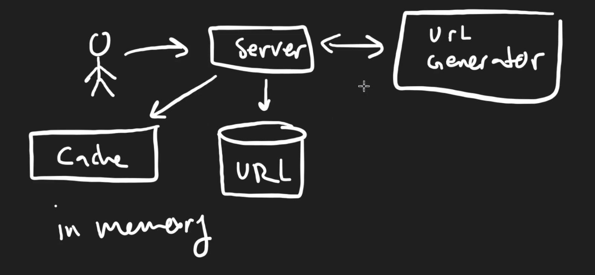

  - We will be handling a large number of `reads` compared to the `writes`, so we can use `NoSQL`, because:
    - `NoSQL` is designed to handle a large number of `reads` and `writes`
    - `NoSQL` doesn't come with `ACID` properties, and we're not going to be storing `writes` a lot, so we don't need `ACID` properties
    - We won't be doing `joins` between the tables, so we don't need `SQL`
    - With `BASE` properties, we can have **eventual consistency** (as we won't be `writing` frequently), which is good for `reads`
  - First, when a user makes a request, it will hit the server, which will be communicating with:
    - `URL shortener / generator` service, which will be responsible for generating the short URL
    - `URL DB` service, which will be responsible for storing the URLs
  - If the user is `writing` a URL, then the request will hit the `URL shortener / generator` service, which will generate the short URL, and then it will hit the `URL DB` service, which will store the URL, then it will return the short URL to the user
  - If the user is `reading` a URL, then the request will hit the `URL DB` service, which will return the original URL to the user
    - We will also have a `cache` layer before the `URL DB` service to cache the URLs, as some URLs will be `read` frequently

- **Step 4:** Design details

  - **How should it work**

    - For `reading`, if you looked at the request header, you will find that:
      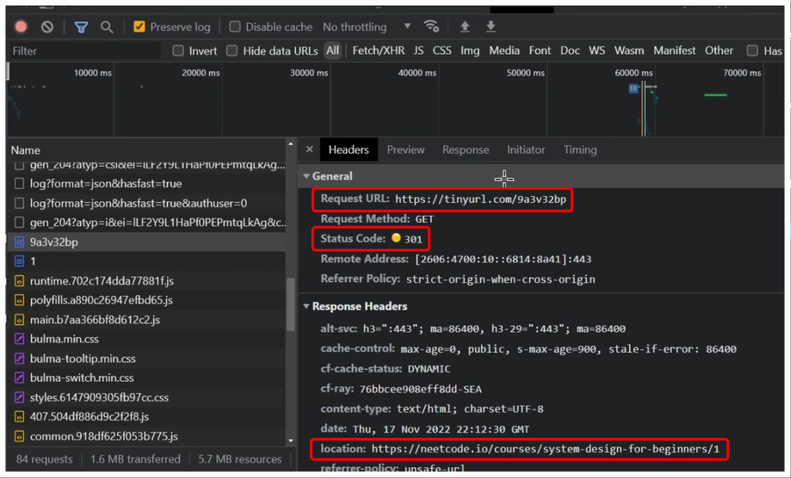
      - the original `Request URL` that we hit is `https://tinyurl.com/9a3v32bq`
      - You will get a `Status Code` of `🟡 301 Moved Permanently`, which means (the resource has been moved, meaning that the resource exists but the response will come from another URL)
      - In the `Response Headers`, you will find the `location` that the response came from which is `https://neetcode.io/courses/system-design-for-beginners/1`, which is different from the `Request URL` that we hit (meaning that there was a conversion)
    - As soon as the browser receives this response, it will:
      - automatically make a new request using the new `location`
      - cache it so that if we hit the `tiny url` again ti will hit the new `generated url` instead (this won't happen if the `status code` is `302 Moved Temporarily`)

  - **Storage**:

    - We will use `Cassandra` for the `URL DB`
      - `1 TB` of storage per month, so we can store `1 TB` of URLs in `Cassandra`
      - Data to store:
        - `uid` -> the `id` of the URL
        - `original_url` -> the `original_url` of the URL
        - `short_url` -> the `short_url` of the URL
        - `expiration_time` -> the `expiration_time` of the URL
    - We will use `Redis` as a `cache` layer before the `URL DB`
      - If we're expecting `1 TB` of storage per month, then we can make the `cache` layer to store `25%` of the `reads`, so we can store `265 GB` of URLs in `Redis`
      - For the caching algorithm, we can use `LRU` (Least Recently Used) algorithm, as it's `simple`, and it's `fast`, and matches our goal of caching the most recently accessed URLs

  - **Algorithm**:

    - How are we going to generate the short URL (the `8` characters long URL)? and how do we make sure that we won't have a collision between the URLs?
    - We will use `Base62` to generate the short URL, as it's `user-friendly`, and it can handle a large number of URLs in just `8` characters
      - `a-z`, `A-Z`, `0-9` -> `62` characters
      - `62^8` -> `218,340,105,584,896` URLs -> `218 trillion` URLs
    - We will use `Base62` to convert the `ID` of the URL to the short URL
    - In order to avoid `collisions`:
      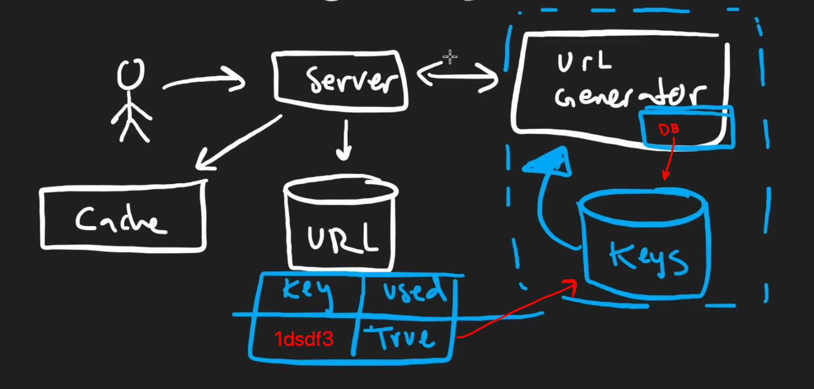

      - we can use a `Database` with the `url-generator` service in order to check if the `key` is already used or not
      - When a `url` expires, we can reuse the `key` for another `url` by marking it as `unused` in the `Database`
      - Here, this `keys DB` should be `SQL` because we need to make sure that the `key` is unique, and we need to make sure that the `key` is not used before, and we need to make sure that the `key` is not used by another user, or to avoid the `collisions` between the `keys` if 2 users are trying to create the same `custom` URL at the same time -> `ACID` properties -> `atomic & isolation` properties

    - Deleting an expired URL:
      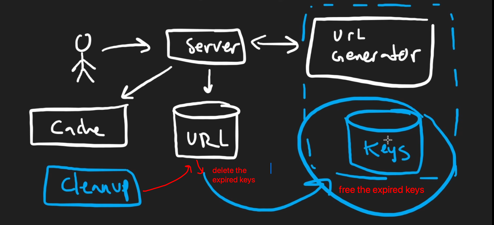
      - We can use a `worker` or a `cleanup` service to delete the expired URLs from the `URL DB` service by filtering the URLs that have expired
      - After getting the expired URLs, we can delete them from the `URL DB` service and go to the `keys DB` and mark the `keys` as `unused`
      - this `worker` or `cleanup` service should be `scheduled` to run **asynchronously** every `24 hours / 1 hour / 10 minutes` depending on the discussion with the interviewer

  - **Scaling**:
    - We can use a `load balancer` between the `client` and the `server` to distribute the requests to the `URL shortener / generator` service and the `URL DB` service
    - For the `URL DB` service, We can:
      - have `replicas` to make sure that the system is `fault-tolerant` and `highly available`
      - partition the database by `hashing` the `ID` of the URL to distribute the URLs across the `nodes` evenly

---

### Design Twitter

**Twitter** is a social media platform that allows users to post and interact with messages known as "tweets", and users can follow other users to see their tweets.

The majority of users in Twitter are `readers`, and only a small percentage of users are `writers`. This indicates that this will be a **read-heavy system**.

- **Step 1:** scoping the problem (asking questions to the interviewer)

  - Are we designing the whole Twitter system or just a small part of it?
    - Just a small part of it, like:
      - Following / Unfollowing a user
      - Posting a tweet
      - News Feed

- **Step 2:** clarifying the functional and non-functional requirements

  - **Functional Requirements**:
    - The system should be able to follow / unfollow a user
    - The system should be able to post a tweet with max of `140` characters, any the tweet can involve uploading image or video
    - The system should be able to show the news feed (tweets of the users that the user is following)
  - **Non-Functional Requirements**:
    - The system should Handle th`500M` total users, and `200M` daily active users.
      - From the `200M` users, each of them will read about `100` tweets per day -> `20B` tweets `reads` per day
      - For `writes`, we can assume that `10%` of the total users will write tweets, so we will have `50M` users writing tweets per day -> `50M` tweets `writes` per day
    - Size of each tweet will be:
      - For `reads`:
        - tweet text: `140 characters` -> `140 bytes`
        - tweet metadata: `800 bytes`
        - image: `1MB`
        - Total: `1MB + 800 bytes + 140 bytes` -> `1MB + 1KB` -> `1MB`
        - `20B` tweets `reads` per day -> `20B` \* `1MB` -> `20PB` per day (petabytes)
      - For `writes`:
        - `50M` tweets `writes` per day -> `50M` \* `1MB` -> `50TB` per day (terabytes) -> Much less than the `reads`
    - For a user, how many followers can he have?
      - Some people on twitter have more than `100M` followers, so we need to make sure that the system can handle a large number of followers
      - For the followers, we need to make sure that they can read the tweets of the users that they are following

- **Step 3:** Propose a high-level design
  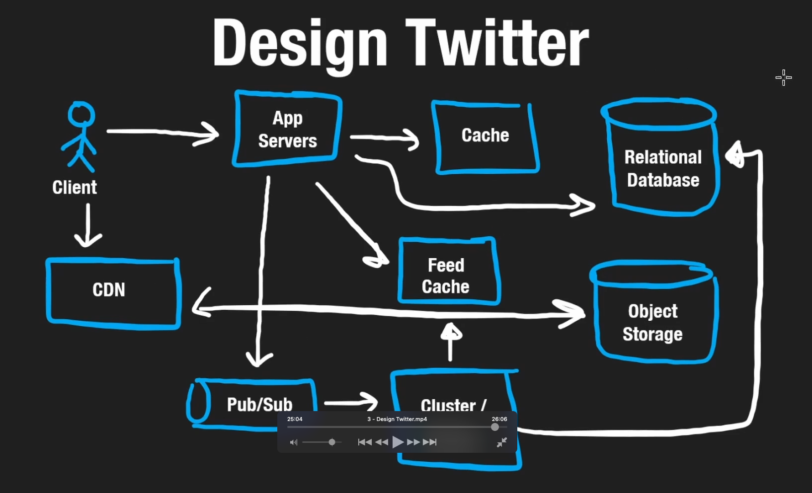

  - First, when a user makes a request, The first thing that the request will hit is the `load balancer`, which will distribute the requests to the `App Servers` that are responsible for the request and doing actions like:
    - `Following / Unfollowing a user`
    - `Posting a tweet`
    - `Reading the news feed`
  - Because of the high load we will be bottlenecks in the `App Server`, so we need to make sure that the `App Server` is `stateless` scaled horizontally, and have a load balancer in front of it to distribute the requests
    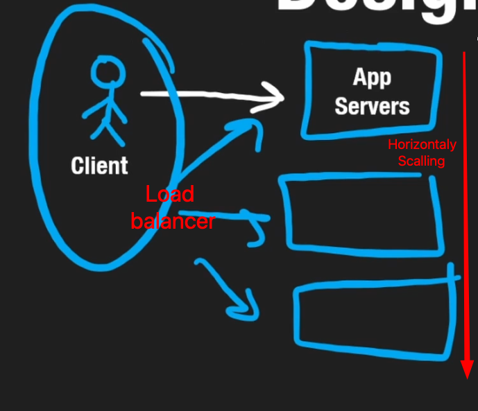
  - The `Application Servers` will communicate with the `Database` to store the `tweets`, the `users`, the `followers`, and the `news feed`
    - We will use `Relational Database` because:
      - We will be doing `joins` between the tables (like joining the `followers users` table with the `following users` table to get the `news feed`)
      - We need to make sure that the `tweets` are `consistent` and `ACID` properties
      - We will be doing `writes` frequently, so we need to make sure that the `writes` are `consistent` and `ACID` properties
  - For storing the `media` (like the `images` and the `videos`), we can use `Object Storage` like `Amazon S3` or `Google Cloud Storage`
    - We can use `CDN` to cache the `media` and to serve the `media` to the users with the lowest latency -> `pull CDN` (pull the `media` from the `origin` to the `edge` when the user requests the `media`)
      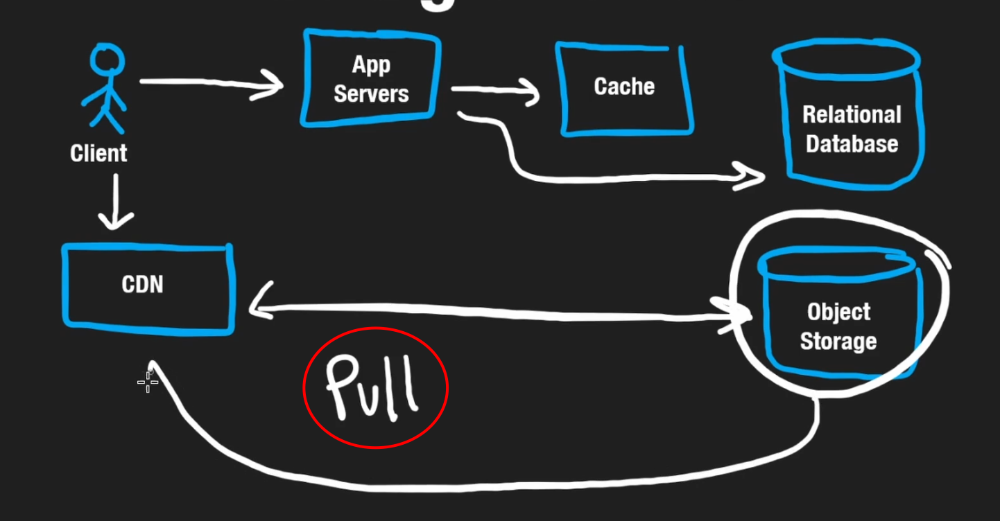
  - With the massive amount of `reads` that we will be doing, we need to make sure that the `Database` is using a `cache` layer to cache the data.
    - We can use `Redis` as a `cache` layer before the `Database` to cache the `tweets`, the `users`, the `followers`, and the `news feed`
    - We can use `LRU` (Least Recently Used) algorithm for the caching algorithm, as it's `simple`, and it's `fast`, and matches our goal of caching the most recently accessed data

- **Step 4:** Design details

  - **Interface**:

    - Creating a tweet:

      - The user will:

        - make a `POST` request to the `App Server` with the `tweet text` and the `media`, and data like the `user ID`

          ```js
          createTweet({
            userId: '123',
            tweetText: 'Hello World',
            media: 'image'
          });
          ```

        - Send an `authorization token` header with the request to make sure that the user is authenticated and authorized to post the tweet **(The correct person is posting the tweet)**

      - The `App Server` will:
        - Generate a `tweet ID` and `timestamp` for the `tweet`
        - store the `tweet` and the `media` in the `Database`, and then it will return the `tweet` to the user

    - Reading the news feed:

      - The user will:

        - make a `GET` request to the `App Server` with the `user ID`

          ```js
          getNewsFeed({
            userId: '123'
          });
          ```

        - Send an `authorization token` header with the request to make sure that the user is authenticated and authorized to read the news feed **(The correct person is reading the news feed)**

      - The `App Server` will:
        - Get the `followers` of the user from the `Database`
        - Get the `tweets` of the `followers` from the `Database`, and then it will return the `tweets` to the user

    - Following / Unfollowing a user:

      - The user will:

        - make a `POST` request to the `App Server` with the `user ID` of the user that he wants to follow / unfollow

          ```js
          followUser({
            userId: '123',
            userToFollowId: '456'
          });
          ```

        - Send an `authorization token` header with the request to make sure that the user is authenticated and authorized to follow / unfollow a user **(The correct person is following / unfollowing a user)**

      - The `App Server` will:
        - store the `followers` of the user in the `Database`, and then it will return the `followers` to the user

  - **Storage**:

    - We will use `MySQL` for the `Database`
      - We will have a `users` table to store the `users`
      - We will have a `tweets` table to store the `tweets`
      - We will have a `follow` table to store the `followers` & `followees`
        - For each user (`follower`), we want to get data from the users that he is following -> `followees`, so we need to make sure that the `follow` table is `indexed` by the `follower` so that all `records` in the table will be grouped together based on the `follower`
        - This is because we have a **read-heavy system**, and we want to make sure that the `reads` are as fast as possible
    - We can use `read only replicas` for the `Database` to make sure that the system is `fault-tolerant` and `highly available`
      - We can use `sharding` to distribute the `tweets` of the user across the `nodes` evenly to make sure that the system can handle a large number of `reads` per second
      - `sharding` can be based on the `user ID` of the user, so that all `tweets` of the user will be grouped together based on the `user ID`
        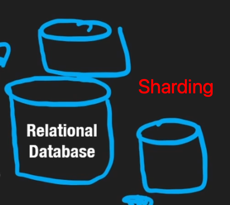
    - We will use `Redis` as a `cache` layer before the `Database`
      - We can use `LRU` (Least Recently Used) algorithm for the caching algorithm, as it's `simple`, and it's `fast`, and matches our goal of caching the most recently accessed data
    - We will use `Amazon S3` or `Google Cloud Storage` for the `media`
      - We can use `CDN` to cache the `media` and to serve the `media` to the users with the lowest latency -> `pull CDN` (pull the `media` from the `origin` to the `edge` when the user requests the `media`)

  - **Algorithm**:

    - How are we going to generate the `news feed` for the user?
      - We can use a `pub/sub` message queue to generate the `news feed` for the user
      - When a user `writes` a `tweet`, we can use a `worker / cluster` to send a message to the `pub/sub` message queue to generate the `news feed` for the `followers` of the user
      - We will also use a `feed cache` to cache the `news feed` of the user, as some `news feed` will be `read` frequently
        - We can use `LRU` (Least Recently Used) algorithm for the caching algorithm, as it's `simple`, and it's `fast`, and matches our goal of caching the most recently accessed data

  - **Scaling**:

    - We can use a `load balancer` between the `client` and the `server` to distribute the requests to the `App Servers`
    - We can use `replicas` for the `App Servers` to make

---

### Design Discord

**Discord** is a communication platform that allows users to communicate through voice, video, and text. users must be in a `server / group` to communicate with each other, and each `server / group` can have multiple `channels` for different topics.
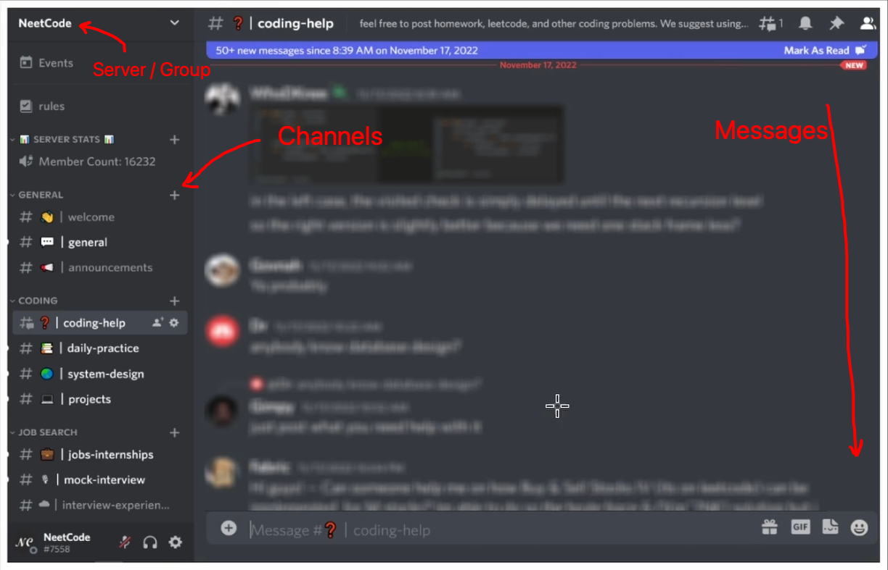

- **Step 1:** scoping the problem (asking questions to the interviewer)

  - We want to handle having multiple `channels`
  - We want to handle having multiple `servers / groups`
  - We want to handle notifications for the users
  - We want to keep track when the user left off, so that when he comes back, he will find the messages that he missed

- **Step 2:** clarifying the functional and non-functional requirements

- **Functional Requirements**:
  - The system should be able to send / receive a `message` in real-time (handle chats)
  - The system should be able to have a visual indicator for the `notifications` for the number of unread `messages` for each `channel` and each `server / group`
  - The system should be able to keep track of the `last message` that the user read
- **Non-Functional Requirements**:

  - The system should have as low `latency` as possible, because the most important thing in a chat application is to have a real-time communication
  - The system also should be `fault-tolerant` and `highly available`, because if the system goes down, then the whole system will be down
  - The system should be able to support `5M` daily active users, and `50M` messages per day
    - For example, the max limit for the number of people in a `server` is `20K`, and `200k` messages sent per day in a `server`, and `10k` messages sent per day in a `channel`
    - `messages` should be text-based, and the size of each `message` will be `2KB` (`2000 bytes` per `message`). Most of these messages won't be read, as we mostly will only read the last `100` messages (Last Recent Messages)
  - `Writes` will be much more than `reads`, so we need to make sure that the system can handle a large number of `writes` per second

- **Step 3:** Propose a high-level design
  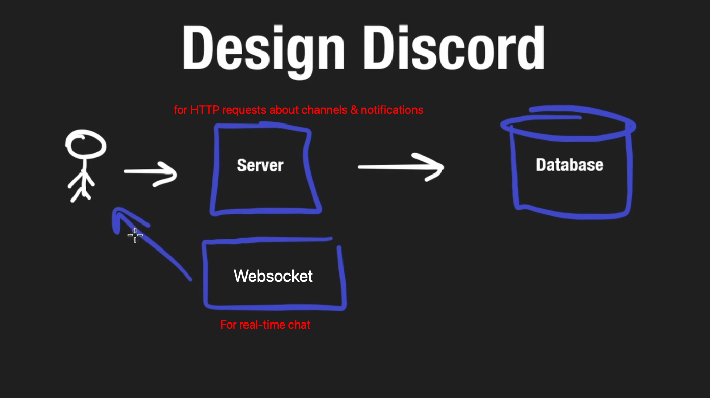

  - First, when user sends a message, it will send a request to the server. (Sending a message can be done through a `HTTP REST API` or a `WebSocket`)
    - if we're using `HTTP REST API`, then the server will send the message to the `Database`, and then it will send the message to the `App Servers`, and then it will send the message to the `client` by using `polling` each `x` seconds (worst case the user will get the message after `x` seconds and we will be sending a lot of requests to the server) ❌
    - if we're using `WebSocket`, then the server will send the message to the `Database`, and then it will send the message to the `App Servers`, and then it will send the message to the `client` in real-time (best case the user will get the message in real-time and we will be sending less requests to the server) ✅
    - The `App Servers` will push the `messages` to the `clients` in a `channel` in real-time using `WebSocket` (real-time communication & reduced latency)
  - Secondly, we want to handle when the user opens a `channel`, and he wants to see the `messages` that he missed (continue where he left off)
    - User will send a request `viewChannel()` to the server, and the server will send a request to the `Database` to get the `messages` of the `channel` that the user missed using `pagination`
      - When querying the `messages` of the `channel`, we want `messages` to be `indexed` by the `channel` and the `timestamp` to make sure that the `reads` are as fast as possible

- **Step 4:** Design details

  - **Interface**:

    - Sending a message:

      - The user will:

        - make a `POST` request to the `App Server` with the `message` and the `channel ID`

          ```js
          sendMessage({
            channelId: '123',
            message: 'Hello World'
          });
          ```

        - Send an `authorization token` header with the request to make sure that the user is authenticated and authorized to send a message **(The correct person is sending the message)**

      - The `App Server` will:
        - Generate a `message ID` and `timestamp` for the `message`
        - store the `message` in the `Database`, and then it will send the `message` to the `clients` in the `channel` in real-time using `WebSocket`

    - Viewing the messages of the channel:

      - The user will:

        - make a `GET` request to the `App Server` with the `channel ID` and the `last message ID` that the user read

          ```js
          viewChannel({
            channelId: '123',
            lastMessageId: '456'
          });
          ```

        - Send an `authorization token` header with the request to make sure that the user is authenticated and authorized to view the messages of the channel **(The correct person is viewing the messages of the channel)**

      - The `App Server` will:
        - Get the `messages` of the `channel` from the `Database` using `pagination`, and then it will return the `messages` to the user

  - **Storage**: (what we will focus on)

    - Option 1: We will use `SQL` for the `Database` (as we're not dealing with massive scale)

      - We will have a `Messages` table to store the `messages`
        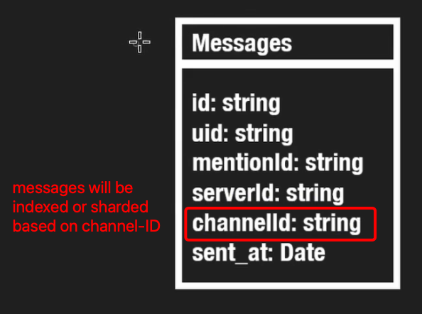
        - We can implement `sharding` to distribute the `messages` of the `channel` across the `nodes` using the `channel ID` to make sure that the system can handle a large number of `reads` per second, as the user will be reading the `messages` of the `channel` frequently
        - if we did this, then we can index the `messages` by the `sent_at` date (as we only care about the recent `messages`), and we can use `pagination` to get the `messages` of the `channel` that the user missed
        - We can use a `caching` layer before the `Database` to cache the `messages` of the `channel`, as some `messages` will be `read` frequently
          - We can use `LRU` (Least Recently Used) algorithm for the caching algorithm, as it's `simple`, and it's `fast`, and matches our goal of caching the most recently accessed data
      - We will have a `UserActivity` table to make the user continue where he left off
        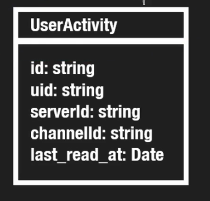

        - We can store the last time the user visited the `channel` using a `last_read_at` column, and then we can use this timestamp to get the `messages` of the `channel` that the user missed **(messages that were sent after the `last_read_at` timestamp)**

          ```sql
          SELECT * FROM messages
          WHERE channel_id = '123'
          AND sent_at > (
            SELECT last_read_at
            FROM user_activity
            WHERE user_id = '456'
            AND channel_id = '123'
          )
          ```

        - This will be slow for getting `notifications` for the number of unread `messages` for each `channel` and each `server / group`, so we can use a `cache` layer to cache the `notifications` for the number of unread `messages` for each `channel` and each `server / group`
          - and each time the server gets updated with a new message, it will update the `cache` layer with the new number of unread `messages` for each `channel` and each `server / grou p`

      - We will have a `servers` table to store the `servers`
      - We will have a `channels` table to store the `channels`

    - Option 2: We will use `NoSQL` for the `Database` (the actual discord which uses `NoSQL` for more scalability and flexibility)

      - Discord followed a similar approach to the `SQL` approach above, but they used `NoSQL` instead of `SQL` for the `Database` to make sure that the system can handle a large number of `reads` per second, and to make sure that the system can scale horizontally
      - At first, they were using `MongoDB`
        - They **indexed** their collections by (`channel_id` and `sent_at` time), so that `messages` will be grouped together based on the `channel_id` and ordered by the `sent_at` time.
          - The problem that they ran into was: as the the number of `messages` increased, that `index` couldn't fit into `RAM`
          - so the solution was to use `sharding` to distribute the `messages` of the `channel` across the `nodes` evenly. **But** they saw that it was not worth it, and they switched to `Cassandra`
      - Then they switched to `Cassandra`
        - `Cassandra` is different as it has `2` keys, the `partition key` and the `clustering key`
          - it's partitioned as like it's `sharded`, but it's `distributed` across the `nodes` evenly
        - They **partitioned** their tables by (`channel_id`), so that all `messages` of the `channel` will be grouped together based on the `channel_id`
        - They **clustered** their tables by (`sent_at` time), so that all `messages` of the `channel` will be ordered by the `sent_at` time

    > More here: [How Discord Stores Billions of Messages](https://discord.com/blog/how-discord-stores-billions-of-messages)

---

### Design YouTube

**YouTube** is a video-sharing platform that allows users to upload, watch, rate, share, add to playlists, report, comment on videos, and subscribe to other users.

- **Step 1:** scoping the problem (asking questions to the interviewer)

  - What can the user do on YouTube?
    - Uploading a video
    - Watching a video
    - Commenting on a video
    - Subscribing to a user
    - Reporting a video
  - Are we designing the whole YouTube system or just a small part of it?
    - Just a small part of it, like:
      - Uploading a video
      - Watching a video

- **Step 2:** clarifying the functional and non-functional requirements

  - **Functional Requirements**:
    - User should be able to upload and watch a video
  - **Non-Functional Requirements**:

    - `reliability`:
      - it's the most important thing here, because in youtube we don't expect someone to upload a video and then the video gets lost or the video gets corrupted due to a failure in the system
      - so, the system should be extremely `reliable` and `fault-tolerant`
    - `scalability`:

      - a single video can have thousands of views per second, so the system should be able to handle a large number of `reads` per second
      - the ratio of `reads / watching` to `writes / uploading` is `100:1`, so we need to make sure that the system can handle `100` times more `reads` than `writes`
        - if youtube has `1B` daily active users, and on average each user watches `5` videos per day, then we will have:
          - `5B` videos `reads` per day
          - `50M` videos `writes` per day (5B / 100)

    - `availability`:
      - here, we want to **favor availability over consistency**, because if the system goes down, then the whole system will be down, but if the system is not consistent, then the user can refresh the page and get the correct data or the most recent data
      - the system should be `highly available`, because if the system goes down, then the whole system will be down
    - `latency`:
      - the system should have as low `latency` as possible, because the most important thing in a video-sharing platform is to have a real-time communication
      - when clicking on a video, the user should be able to watch the video immediately without waiting or buffering

- **Step 3:** Propose a high-level design
  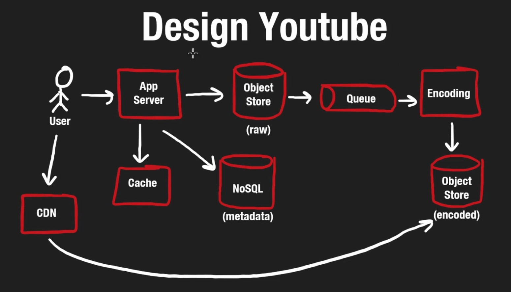

  - **Uploading a video**

    - The user will make a `POST` request to the `App Server` with the `video` and the `user ID`

      ```js
      uploadVideo({
        userId: '123',
        title: 'video title',
        description: 'video description',
        video: 'video.mp4'
      });
      ```

    - We will have a load balancer between the `client` and the `server` to distribute the requests to the `App Servers`
      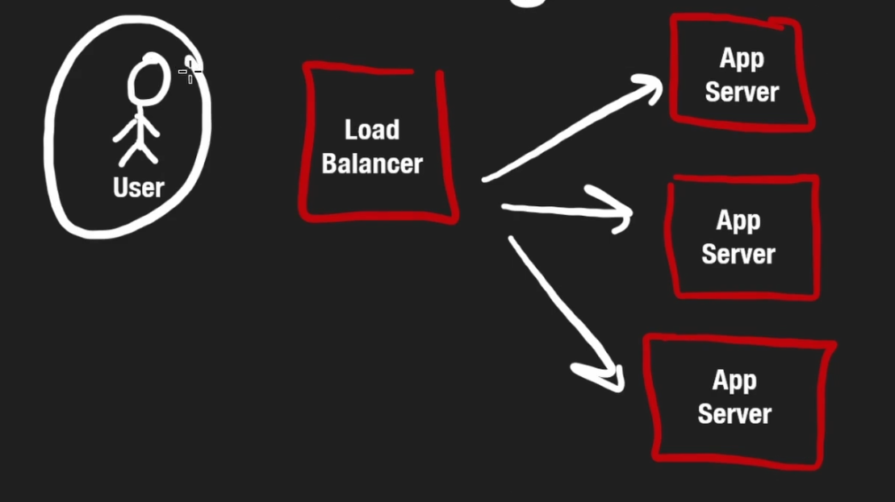
    - The `App Server` will store the `raw video` in the `Object Storage` like `Amazon S3` or `Google Cloud Storage`, and then it will store the `video` in the `Database` as a link to the `video` in the `Object Storage`, and then it will return the `video` to the user
      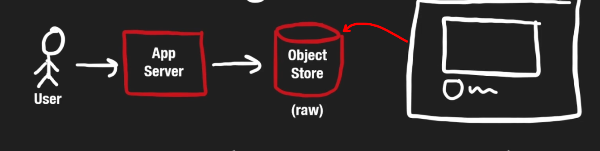

      - `AWS S3` or `Google Cloud Storage` will handle a lot of things for us like: (replication, backup, and security)

    - The `App Server` will also store the `metadata` of the `video` in the `NoSQL Database` like the `title`, the `description`, the `user ID`, and the `video ID`, as long as the user information like the `user ID`, the `username`, and the `user email`
      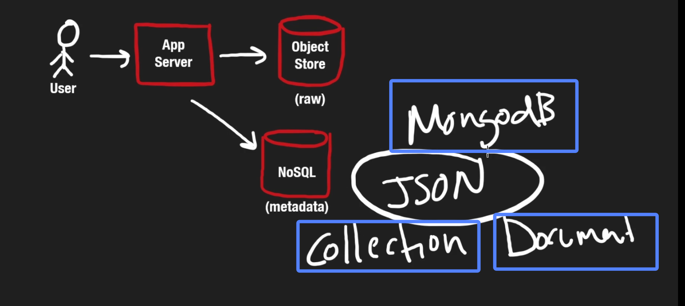

      - we use `NoSQL` for the `metadata` of the `video` because:

        - we will have `collections` like `Users`, `Videos`, and we will be doing `joins` between the `collections` (like joining the `Users` collection with the `Videos` collection to get the `videos` of the `user`)

        ```json
        {
          "userId": "123",
          "username": "user123",
          "email": "email@gmail.com",
          "videos": [
            {
              "videoId": "456",
              "title": "video title",
              "description": "video description"
            }
          ]
        }
        ```

    - **Encoding** the `video` to different `resolutions` and `formats`
      - This is an expensive operation, which can take a long time, and it can consume a lot of resources, so we handle it **asynchronously** using a `worker` or a `cluster`
      - after `raw videos` are uploaded to the `Object Storage`, we can use a `message queue` to send a message to the `worker` or the `cluster` to encode the `video` to different `resolutions` and `formats`, and after the `video` is encoded, we can store the `encoded videos` in the `Object Storage` like `Amazon S3` or `Google Cloud Storage`
        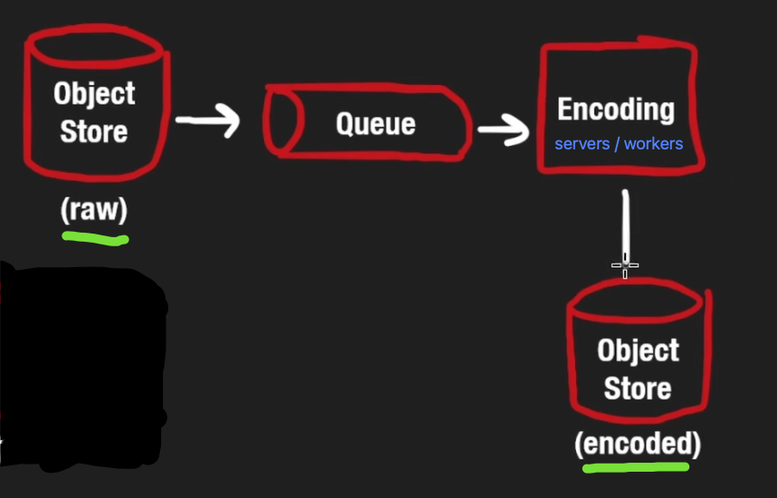
      - we can use a `worker` or a `cluster` to encode the `video` to different `resolutions` and `formats` like `1080p`, `720p`, `480p`, `360p`, and `240p`,

  - **Watching a video**

    - The user will make a `GET` request to the `App Server` with the `video ID` to watch the `video`

      ```js
      watchVideo({
        videoId: '123'
      });
      ```

    - We can use a `CDN` to cache the `encoded videos` and to serve the `videos` to the users with the lowest latency -> `pull CDN` (pull the `videos` from the `origin` to the `edge` when the user requests the `video`)
      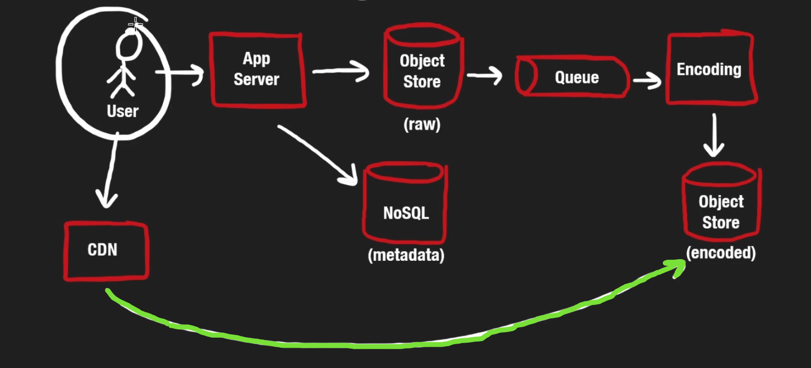
    - We can also use caching to cache the `metadata` of the `video` and the `user` to make sure that the `reads` are as fast as possible, we do this by adding a `cache` layer before the `NoSQL Database` to cache the `metadata` of the `video` and the `user` -> `LRU` Cache
      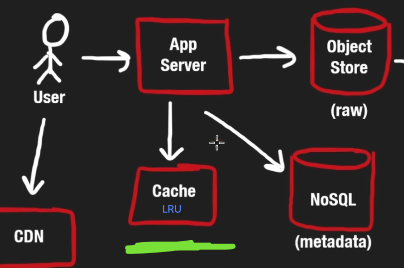

- **Step 4:** Design details

  - **Encoding** the `video` to different `resolutions` and `formats`

    - We can have up to `50M` videos `writes / uploads` per day, and each `video`, and we have multiple `workers` working in parallel to encode the `video` to different `resolutions` and `formats`
      - each `worker` takes `1 minute` to encode a video (assuming that we have good `workers`), so we need to make sure that the system can handle a large number of `writes` per second
      - `50M / day` -> `50M / 24 hours` -> `50M / 1440 minutes` -> `35K videos / minute` -> `35K workers` to encode the `videos`
    - How many `workers` or `clusters` do we need to encode the `videos` to different `resolutions` and `formats`?
      - We can use a `worker` or a `cluster` to encode the `video` to different `resolutions` and `formats`
    - We can use `FFmpeg` to encode the `video` to different `resolutions` and `formats`
      - `FFmpeg` is a free and open-source software project consisting of a large suite of libraries and programs for handling video, audio, and other multimedia files and streams
      - `FFmpeg` can be used to encode the `video` to different `resolutions` and `formats` like `1080p`, `720p`, `480p`, `360p`, and `240p`

  - **Watching a video**

    - When opening a video, we don't need to download the entire `video` at once, we can use `adaptive streaming` to download the `video` in chunks, and then we can play the `video` while downloading the next `chunks` of the `video`
      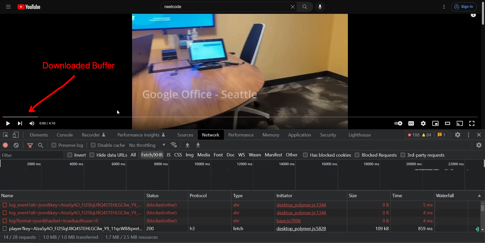
      - So, we fire a request for the next `chunk / buffer` of the video in these cases:
        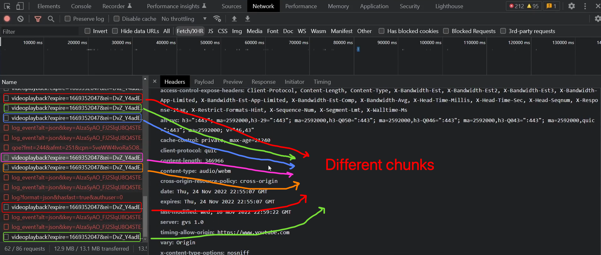
        - Opening a video
        - video is playing and reaching the end of the `chunk / buffer`
        - User clicks on the `quality` of the video to change the `resolution` of the `video`
        - User manually moves to different video time in the playback controller
      - By doing this, we're **decreasing the `latency`** and increasing the `quality` of the `video` for the user by making sure that the user is watching the `video` with the lowest `latency` and the highest `quality` possible ✅
    - So, we use **streaming protocols** like `HLS` (HTTP Live Streaming) or `DASH` (Dynamic Adaptive Streaming over HTTP) to stream the `video` to the user

      - `HLS` is an `adaptive streaming protocol` that breaks the `video` into small `chunks` and then it serves the `chunks` to the user using `HTTP`
      - We use `TCP` and not `UDP` because we want to make sure that the `video` is delivered to the user without any `packet loss` or `corruption`

      - These `chunks` are stored in the browser's memory, so it's important to have a client-side code that is handling this and freeing the memory after the `chunk` is played to make sure that the `browser` is not consuming a lot of `memory` -> **Frontend**

  - **Uploading a video**

    - We need to have a **rate limiter** to make sure that the user is not uploading a lot of videos at the same time, and to make sure that the system is not overwhelmed with a large number of `uploads` at the same time
      - It will be implemented in the `load balancer` or in the `App Server` to make sure that the system is not overwhelmed with a large number of `uploads` at the same time

  - There're a lot of other features like **recommendation engine**, **search engine**, **commenting on a video**, **subscribing to a user**, **reporting a video**, and **notifications** that we didn't cover here

---

### Design Google Drive

**Google Drive** is a file storage and synchronization service that allows users to store files on their servers, synchronize files across devices, and share files.

- **Step 1:** scoping the problem (asking questions to the interviewer)

  - What can the user do on Google Drive?
    - Upload, download, rename, edit, delete a file
  - Are we designing the whole Google Drive system or just a small part of it?
    - Just a small part of it, like:
      - Uploading, downloading and renaming a file
      - Scaling the system to handle a large number of `reads` and `writes`

- **Step 2:** clarifying the functional and non-functional requirements

  - **Functional Requirements**:
    - User should be able to upload, download, and rename a file
  - **Non-Functional Requirements**:

    - We have `200M` users, and `50M` daily active users, every user will:
      - be given `15GB` of free storage -> `200M * 15GB` -> `3000PB` of storage (petabytes)
      - upload `2` files per day (`10MB` per file) -> `100M` files `writes` per day -> `100M * 10MB` -> `1PB` of storage (petabytes)
      - have read/write ratio of `2:1`, so we need to make sure that the system can handle `2` times more `reads` than `writes`
    - `Latency and Throughput`:
      - Here, they're not as important as the `availability`, but we need to make sure that the system can handle a large number of `reads` and `writes` per second
    - `Availability`:
      - It's the most important thing here, because the user need to feel safe that his files are stored in a safe place, and he can access them at any time
      - Each file uploaded need to be replicated `3` times to make sure that the system is `fault-tolerant` and `highly available` -> so we need to have more than `3` copies of the file -> more than `3000PB * 3` -> `9000PB` of storage (petabytes)

- **Step 3:** Propose a high-level design
  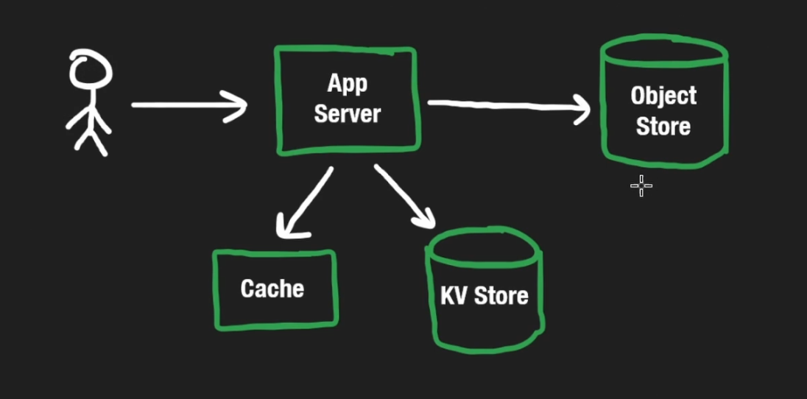

  - When user uploads a file, it will hit the `App Server` which will store the `file` in the `object storage`, and then it will store the `metadata` of the `file` in a `key-value (KV) store` like `NoSQL Database`
  - Data model:
    - We will have a `Files` table to store the `files` -> `distributed file system` or `object storage`
      - We can use `Object Storage` like `Amazon S3` or `Google Cloud Storage` to store the `files` in a flat structure (`id` and `file`) ✅
        
        - Upside: it's `scalable`, `reliable`, and `available` out of the box
        - Downside: we can't edit the `files` in place, instead we can delete the `file` and upload a new `file`
      - Or we can use a `file system` to store the `files` in a hierarchical structure like `HDFS` (Hadoop Distributed File System)
        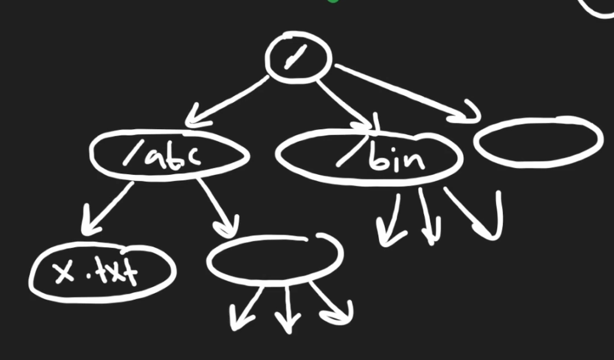
        - Upside: we can edit the `files` in place
        - Downside: it's not `scalable` and it's not `fault-tolerant`
    - We will have a `Metadata` table to store the `metadata` of the `files` -> `NoSQL Database`
    - We will have a `Users` table to store the `users`
  - Caching
    - We can have a `cache` layer before the `NoSQL Database` to cache the `metadata` of the `files` but we are likely won't have a lot of `reads` for the `metadata` of the `files`, so we can skip the `cache` layer

- **Step 4:** Design details

  - Permissions:
    - As we're using `Object Storage` like `Amazon S3` or `Google Cloud Storage`, we won't have permission-control at the `file` level, specially if we're distributing the `files` across CDNs
      - so we can add permissions to the object storage to make sure that the `files` are `private` and only the user can access the `file`
      - Or we need to make sure to restrict the access to the `files` by using a `signed URL` or in the `App Server` by checking the `user Token` and the `file ID` before serving the `file` to the user
  - **Interface**:

    - Uploading a file:

      - The user will make a `POST` request to the `App Server` with the `file` and the `user ID`

        ```js
        uploadFile({
          userId: '123',
          file: 'file.pdf'
        });
        ```

      - The `App Server` will store the `file` in the `Object Storage` like `Amazon S3` or `Google Cloud Storage`, and then it will store the `metadata` of the `file` in the `NoSQL Database`, and then it will return the `file` to the user

    - Downloading a file:

      - The user will make a `GET` request to the `App Server` with the `file ID` to download the `file`

        ```js
        downloadFile({
          fileId: '123'
        });
        ```

      - The `App Server` will get the `file` from the `Object Storage` like `Amazon S3` or `Google Cloud Storage`, and then it will return the `file` to the user

    - Renaming a file:

      - The user will make a `PUT` request to the `App Server` with the `file ID` and the `new file name` to rename the `file`

        ```js
        renameFile({
          fileId: '123',
          newFileName: 'new file name'
        });
        ```

      - The `App Server` will update the `metadata` of the `file` in the `NoSQL Database`, and then it will return the `file` to the user

  - **Storage**:

    - We will use `Object Storage` like `Amazon S3` or `Google Cloud Storage` to store the `files` in a flat structure (`id` and `file`)
      - We can use `CDN` to cache the `files` and to serve the `files` to the users with the lowest latency -> `pull CDN` (pull the `files` from the `origin` to the `edge` when the user requests the `file`)
    - We will use a `NoSQL Database` to store the `metadata` of the `files`
      - We can use `MongoDB` or `Cassandra` to store the `metadata` of the `files` in a `

---

## System Design Questions (FE)

---

[⬆ back to top](#index)
