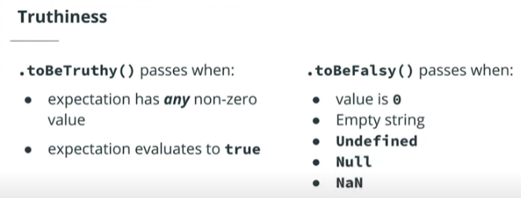

# INDEX

- [INDEX](#index)
  - [Testing](#testing)
    - [Testing Pyramid](#testing-pyramid)
    - [Testing types](#testing-types)
      - [Unit testing](#unit-testing)
      - [Snapshot Testing](#snapshot-testing)
      - [Sanity Test](#sanity-test)
  - [How to test](#how-to-test)
    - [(AAA) Pattern](#aaa-pattern)
    - [BDD vs TDD](#bdd-vs-tdd)
      - [Behavior Driven Development (BDD)](#behavior-driven-development-bdd)
      - [Test-Driven Development (TDD)](#test-driven-development-tdd)
    - [Glass-box vs Black-box Testing](#glass-box-vs-black-box-testing)
      - [Glass-box Testing](#glass-box-testing)
      - [Black-box Testing](#black-box-testing)
    - [Test Design Best Practices](#test-design-best-practices)
    - [Testing Setup](#testing-setup)
  - [Tests Structure](#tests-structure)
    - [Suites and Specs](#suites-and-specs)
    - [Assertions \& Expectations](#assertions--expectations)
    - [Matchers](#matchers)
      - [Comparisons](#comparisons)
      - [Truthiness](#truthiness)
      - [Numerical Matchers](#numerical-matchers)
      - [Negating](#negating)
      - [Exceptions (error handling)](#exceptions-error-handling)
      - [Other matchers](#other-matchers)
  - [Backend: Endpoint / API Testing (HTTP assertions)](#backend-endpoint--api-testing-http-assertions)
    - [Framework for Endpoint Testing](#framework-for-endpoint-testing)
  - [Testing Hooks](#testing-hooks)
    - [Teardown of Suites](#teardown-of-suites)
    - [`beforeEach` and `afterEach`](#beforeeach-and-aftereach)
    - [`beforeAll` and `afterAll`](#beforeall-and-afterall)
    - [Skipping or Specifying Tests](#skipping-or-specifying-tests)
  - [Spies \& Mocks (SideEffects)](#spies--mocks-sideeffects)
    - [Spies](#spies)
    - [Mock Testing](#mock-testing)

---

## Testing

**Testing**: is the process of checking that an application is functioning as expected

> Testing is the process of experimentally checking the correctness of a program, while debugging is the process of tracking the execution of a program and discovering the errors in it.

- 2 Types of tests:
  - Manual
  - Automated

- `Unit tests` test individual pieces of code.

  
  - if there're dependencies, the unit test should [mock or stub](#mock-testing) them out
    - > it means to replace a dependency with something that pretends to be that dependency (ex: fake-API)

### Testing Pyramid


- `UI testing` at the top is also known as **Manual Testing**
- As we go up in the pyramid, the testing time is increased. as `unit-tests` take short time, and `manual-tests & E2E` take the longest time
- Jasmine works well with `Unit Testing` and `Integration Testing (API Testing)`.
  - the difference between Unit Testing and Integration Testing is the use of third-party integration.

- Jasmine/Jest can be used for `End-to-End Testing` with a tool call `Selenium` to emulate user interactions.

---

### Testing types

> Unit tests run quickly, but most application business logic should be tested with E2E tests.
>
> While you’re writing tests, make them fail to see that their failure report is easy to understand.
>
> Running unit tests should be part of your automated build process, but E2E tests shouldn’t.

#### Unit testing

**Unit testing** is the practice of testing the smallest pieces of code (units) in isolation—typically individual functions or methods. The goal is to verify that each unit behaves correctly on its own before integrating it with the rest of the application.

> **Definition**: A unit test should verify that a known, fixed input produces a known, fixed output. If you provide a fixed input for a function that internally uses other dependencies, those dependencies should be mocked out, so a single unit test script tests an isolated unit of code. — _Elliotte Rusty Harold (Google Engineer)_

- **Why Unit Testing Matters - A Real-World Example**
  - A large app evolves over several years. Some of the developers who started writing the app are gone. A new developer joins the project and has to quickly learn the code and get up to speed.

  - A new business requirement comes in, and the new team member starts working on it. They implement this requirement in the existing function `doSomething()`, but the QA team opens another issue, reporting that the app is broken in a seemingly unrelated area. After additional research, it becomes obvious that the app is broken because of the code change made in `doSomething()`. The new developer doesn't know about a certain business condition and can't account for it.

  - This wouldn't have happened if unit (or e2e) tests were written with the original version of `doSomething()` and run as a part of each build. Besides, the original unit test would serve as documentation for `doSomething()`. Although writing unit tests seems like an additional, time-consuming task, it may save you a lot more time in the long run.

- Unit tests should be **written in a natural language** that describes the behavior of the function being tested.
  - Because it’s so easy to understand the meaning of tests, they can serve as your program documentation. If other developers need to become familiar with your code, they can start by reading the code for the unit tests to understand your intentions.
  - Using natural language to describe tests has another advantage: it’s easy to reason about the test results

  ```js
  describe('add function', () => {
    it('should return the sum of two numbers', () => {
      expect(add(2, 3)).toBe(5);
    });

    it('should return a negative number when the sum is negative', () => {
      expect(add(-2, -3)).toBe(-5);
    });
  });
  ```

---

#### Snapshot Testing

- Snapshot tests assert that the current output is same as the output before.
- The main difference between snapshot testing and functional/unit tests is, snapshot tests never assert the correct behavior of the application functionality but does an output comparison instead.

---

#### Sanity Test

is just a casual term to mean that you're testing/confirming/validating something that should follow very clear and simple logic. It's asking someone else to confirm that you are not **insane** and that what seems to make sense to you also makes sense to them

- Usually at the beginning of the testing process to make sure that our testing environment and configuration works correctly

```js
expect(true).toBe(true);
```

---

## How to test

### (AAA) Pattern

**Arrange** - **Act** - **Assert**


---

### BDD vs TDD

#### Behavior Driven Development (BDD)

- tests are focused on how the `user` interacts with the application
- A development style built on `Test Driven Development` where the focus is **user interaction and stakeholders**.
- `Jasmine` is recognized as a Behavior Driven Development testing framework.

#### Test-Driven Development (TDD)

- A development style where tests are written `before` development
- It focuses on writing unit and integration tests that produce expected results.
- Test Driven Development Cycle

  
  
  

- Benefits:
  - Ensure you're testing the right thing and avoid duplicate and unnecessary tests
    - think of it as you only write tests when you have failing test(red stage)
  - describe the "why" rather than the implementation
  - Higher test coverage
  - makes code easy to refactor & leads to higher quality tests and implementation code

  > Refactor here is for the code-implementation to find more optimized solution, and **not refactor the test**

---

### Glass-box vs Black-box Testing

It's a way to describe the level of knowledge that the tester has about the system being tested.

- It indicate the level of test coverage.

#### Glass-box Testing

- The tester has access to the **source code** and can see how the system works.
  - This allows the tester to write tests that cover all possible paths through the code.
- It's called `path-complete` if it covers all possible paths through the code.
- It's also known as **white-box testing**.
- Drawback: it's time-consuming and expensive.

#### Black-box Testing

- The tester has no access to the source code and can only test the system through the specifications of the system / features.
- It's also known as **functional testing**. as it tests the functionality of the system.
- It's usually tested through **End-to-End testing** (UI testing).
- Drawback: it's not path-complete (no guarantee that all paths are covered)

---

### Test Design Best Practices

- Test file structure and file names should match the app.
- Describe and name the tests to be easy to read and maintain.
- Write short tests that allow you to pinpoint why the test is failing.
  - write tests with an `object` with data that `should pass` and test each value in the object.
  - Try this again with an object with data that should `fail`
- Tests should only fail when there are bugs in the tested code.

---

### Testing Setup


---

## Tests Structure


### Suites and Specs

In BDD frameworks, a test is called a `"spec"`, and a combination of one or more specs is called a `"suite"`.

- `Spec`
  - an individual test
  - `it()` function is used to define a spec
- `Suite`
  - a collection of similar tests related to one function
  - `describe()` function is used to define a suite


---

### Assertions & Expectations

Testing frameworks have the notion of an **assertion**, which is a way of questioning whether an expression under test is `true` or `false`. If the assertion returns `false`, the framework throws an error.

- In Jasmine/Jest, assertions are specified using the `expect()` function, followed by **matchers** like `toBe()`, `toEqual()`, and so on.
- It's as if you're writing a sentence: _"I expect 2 plus 2 to equal 4"_:

  ```js
  expect(2 + 2).toEqual(4);
  ```

---

### Matchers

**Matchers** implement a Boolean comparison between the actual and expected values. If the matcher returns `true`, the spec passes.

- If you expect a test result to have a certain value, you use a matcher like `toEqual()` or `toBe()`:

  ```js
  expect(2 + 2).toEqual(4);
  ```

- If you expect a test result **not** to have a certain value, just add the keyword `not` before the matcher:

  ```js
  expect(2 + 2).not.toEqual(5);
  ```

- But if the matcher returns `false`, the spec fails, and an error is thrown.

#### Comparisons

- **`.toEqual()`**
  - checks if the tested object is the same object in terms of value
  - used with reference-types like `objects`, `arrays`, `sets`
  - it's like `==`
- **`toBe()`**
  - checks if the tested object is the same object (same location in memory)
  - used with primitive-types like `string`, `number`
  - it's like `===`

#### Truthiness



#### Numerical Matchers

- `.toBeCloseTo(expected value, precision)`
  - Passes if a value is within a specified `precision` of the expected value
  - `precision` is optional and is represented the number of decimal points to check (defaults to 2)
- .toBeGreaterThan(expected value)
- .toBeLessThan(expected value)
- .toBeGreaterThanOrEqual(expected value)
- .toBeLessThanOrEqual(expected value)

#### Negating


#### Exceptions (error handling)

- `.toThrow(expected value)`
- `.toThrowError(expected value, expected message`

- expected value and expected message are optional

#### Other matchers

- `.toContain(expected value)`
- `.toMatch(expected value)`
- `.toBeDefined()`
- `.toBeUndefined()`
- `.toBeNull()`
- `.toBeNan()`

---

## Backend: Endpoint / API Testing (HTTP assertions)

`endpoint`: is the `URL` of the REST API with the method that (gets, adds to, or modifies) the data of an API in some way.

- Testing APIs use tools together:
  - test runner -> jest
  - test fixtures -> a `fixture` is how your tests are setup and organized by modules
    - each test-fixture can run in its own **environment**
  - assertions
  - mocking
    - like when working with database-api, So we prevent the test from affecting the real database, so we mock the database

- Benefits of Endpoint Testing
  - Confirms that the server is working.
  - Confirms that endpoints are configured properly.
  - More efficient than manual testing.

### Framework for Endpoint Testing

- Jest
- [Supertest](https://www.npmjs.com/package/supertest)
  - tests the status of responses from servers.

```bash
# here we install it as a dependency as it's done after combiling from TS to JS
npm i supertest

npm i --save-dev @types/supertest  #  compile without TypeScript errors.
```

- ex

  ```js
  import supertest from 'supertest'; // the module
  import app from '../index'; // the file that have the server code

  const request = supertest(app); // telling supertest where the server is

  describe('Test endpoint responses', () => {
    it('gets the api endpoint', async doneCallback => {
      const response = await request.get('/api');
      expect(response.status).toBe(200); // success code

      // or
      const response = await request.get('/api').expect(status).toBe(200);

      doneCallback(); // it tells supertest to close the server-calling
    });
  });
  ```

---

## Testing Hooks

### Teardown of Suites

- These Jasmine features allow you to
  - Connect to a `database` before a test
  - Connect to a different database for specific tests
  - Run only a specific test
  - Skip one or more tests

### `beforeEach` and `afterEach`

- `beforeEach` takes a callback function where we can tell the test to perform a task before each test is run.

- `afterEach` is used if there is a task to be run after each test is complete.

  

  ```js
  describe('', () => {
    beforeEach(function () {
      // callback function
      foo = 1;
    });

    it('', () => {
      expect(foo).toEqual(1);
      foo += 1;
    });

    it('', () => {
      expect(foo).toEqual(2);
    });
  });
  ```

### `beforeAll` and `afterAll`

- perform an operation once before/after **all the specs** in a suite

  

- Handling Multiple Suites with `beforeAll` and `afterAll`

  

---

### Skipping or Specifying Tests


Here the idea is to eliminate any **pollution** (any test that affect the result of another test)

```js
xdescribe('A spec', function () {
  it('is just a function, so it can contain any code', () => {
    expect(foo).toEqual(1);
  });
});

fdescribe('A spec', function () {
  it('is just a function, so it can contain any code', () => {
    expect(foo).toEqual(1);
  });
});
```

---

## Spies & Mocks (SideEffects)


### Spies

It's when you want to see if the function was called, but aren't interested in what the function does.

- `The Jest Object`:
  - It keeps track to the changes in the function
  - It is automatically in scope within every test file. The methods in the jest object help create mocks and let you control Jest's overall behavior.

```js
import { jest } from 'jest';
const mockFunction = jest.fn();
mockFunction();
expect(mockFunction).toHaveBeenCalled();
```

---

### Mock Testing


Mock testing is an approach to unit testing that lets you make assertions about how the (code under test) is interacting with other system modules. In mock testing, the dependencies(Ex:database) are replaced with objects that simulate the behavior of the real ones.

- The purpose of mocking is to isolate and focus on the code being tested and not on the behavior or state of external dependencies.
  - it does so by changing the functionality of the function to take a **shortcut**.
- It's used if a function takes a long time to be executed or a promise with a lot of data

[mock function in Jest](https://jestjs.io/docs/mock-functions)
