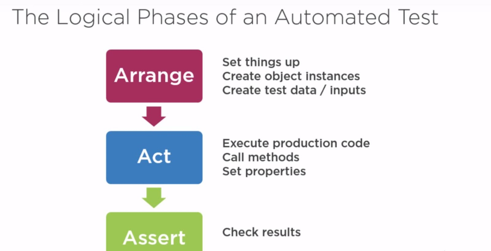

# INDEX

- [INDEX](#index)
  - [Configuring](#configuring)
    - [Installation](#installation)
    - [Linting](#linting)
  - [Jest Syntax](#jest-syntax)
  - [Testing Asynchronous Code](#testing-asynchronous-code)
    - [1-Promises](#1-promises)
    - [2- Async/Await](#2--asyncawait)
    - [3- Callbacks](#3--callbacks)
    - [Checking number of assertions](#checking-number-of-assertions)
  - [Concurrent Tests](#concurrent-tests)
  - [Testing React components](#testing-react-components)
    - [Snapshot Testing](#snapshot-testing)
    - [Redux testing](#redux-testing)
  - [Mock Testing](#mock-testing)
    - [Timer Mocks](#timer-mocks)
    - [HTTP Requests (axios)](#http-requests-axios)

---

## Configuring

### Installation

```bash
npm install --save-dev jest
```

- `json`

  ```json
  "scripts": {
    "test": "jest"
  },
  ```

---

### Linting

EsLint will throw errors when using **test** global-object in the node environment, so:

- add `jest: true` to the **env** in **.eslintrc.js** file

---

## Jest Syntax

- Use the `describe` keyword followed by a short description of what the suite is testing and one or more specs.
- A best practice is to start a sentence with `“it”` and then complete the sentence with the description of what the suite is testing.

  ```js
  describe('suite description', () => {
    it('describes the spec', () => {
      const myVar = true;
      expect(myVar).toBe(true);
    });
  });
  ```

---

## Testing Asynchronous Code

Jest needs to know **when** the code it is testing has completed, before it can move on to another test. Jest has several ways to handle this:

### 1-Promises

- Return a promise from your test, and Jest will wait for that promise to resolve. If the promise is rejected, the test will fail.

```js
test('the data is peanut butter', () => {
  return fetchData().then(data => {
    expect(data).toBe('peanut butter');
  });
});
```

### 2- Async/Await

- To write an async test, use the async keyword in front of the function passed to test.

```js
test('the data is peanut butter', async () => {
  const data = await fetchData();
  expect(data).toBe('peanut butter');
});
```

### 3- Callbacks

- If you don't use promises, you can use callbacks. For example, let's say that fetchData, instead of returning a promise, expects a callback, i.e. fetches some data and calls callback(null, data) when it is complete. You want to test that this returned data is the string 'peanut butter'.

- By default,**Jest tests complete once they reach the end of their execution**. That means this test will not work as intended with Async code

  - The problem is that the test will complete as soon as fetchData completes, before ever calling the callback.

- There is an alternate form of test that fixes this. Instead of putting the test in a function with an empty argument, use a single argument called **(done)**. -> **Jest will wait until the done callback is called before finishing the test**.

```js
// ---------------------------Don't do this!--------------------------- //
test('the data is peanut butter', () => {
  function callback(error, data) {
    if (error) {
      throw error;
    }
    expect(data).toBe('peanut butter');
  }

  fetchData(callback);
});

// ------------------------------Do this!------------------------------ //
test('the data is peanut butter', done => {
  function callback(error, data) {
    if (error) {
      done(error);
      return;
    }
    try {
      expect(data).toBe('peanut butter');
      done();
    } catch (error) {
      done(error);
    }
  }

  fetchData(callback);
});
```

---

### Checking number of assertions

`expect.assertions(number)`

- It verifies that a certain number of assertions are called during a test. This is **often useful when testing asynchronous code**, in order to make sure that assertions in a callback actually got called.

```js
test('doAsync calls both callbacks', () => {
  expect.assertions(2); // ensures that both callbacks actually get called
  function callback1(data) {
    expect(data).toBeTruthy();
  }
  function callback2(data) {
    expect(data).toBeTruthy();
  }

  doAsync(callback1, callback2);
});
```

---

## Concurrent Tests

Use `test.concurrent` or `describe.concurrent` if you want the test to run concurrently (parallel).

---

## Testing React components

[enzyme](https://www.npmjs.com/package/enzyme): it allows us to render components

- **phases**:

  

### Snapshot Testing

It's an useful tool whenever you want to make sure your UI does not change unexpectedly.

- in react to see if component changed without rendering it each time

### Redux testing

- `Testing reducers`: It's straight forward as reducer-functions are **pure functions**

- `Testing actions`:

---

## Mock Testing

> Tests must not depend on external services. Use mocking tools such as jest.mock to avoid it.

- Jest mock function `jest.fn()`
  - it plays the role of a real function.
  - we use it as a replacement for a real/complex function that we don't want to involve in our tests to keep it lightweight and simple

### Timer Mocks

[Timer Mocks](https://jestjs.io/docs/timer-mocks)

They are mock functions like `jest.fn()` but with focus on javascript timer functions

- `jest.useFakeTimers`
  - method that auto-mocks all the javascript timer functions, ex: `setTimeout`, `setInterval`
  - this help us to not have to mock every timer function we use as it will automatically do that
- `jest.useRealTimers`

  - method that returns the mocked functions to their original native javascript implementations
  - to undo using the fake timers from jest and returning to the native js-timers

- **Note:**
  - if `jest.useFakeTimers` doesn't work, you can use `jest.spyOn(global, "setInterval")`
  - comment from issue in Github:
    > they are mocked, but they are not mock functions. This is on purpose. See [#5171](https://github.com/facebook/jest/pull/5171) (although that's not the PR that landed, it contains notes of all the differences between "modern" and "legacy" fake timers)

---

### HTTP Requests (axios)

We don't want out unit-test component to make an actual API-request. It's slow, complex and prone to error. Rather, we can instruct Jest to mock out a dependency (like `axios`) and Jest will replace all of the `axios` object methods with **mock functions**.

> if you had importing problems, add axios to the transformIgnorePatterns in configurations

```js
// import axios

// Must be on the same scope as your `import` to be hoisted to the top of the file not the scope
jest.mock('axios'); // mock the axios object and all its methods as jest functions

// (implicit): telling it to make it use this function when it's called
jest.mock('axios', () => ({
  get: () => Promise.resolve({ data: [{ val: 1 }] })
}));

// or

// (explicit): to simulate what axios return from GET-REQUEST
axios.get.mockResolvedValue({ data: [{ val: 1 }] }); // control the resolved value from the mocked method (get())
```

- `mockReset()` method:

  - it's a clean-up method that clear any custom mock-implementation set-up in any spec
  - it's suitable inside a `afterEach` block

    ```js
    afterEach(() => {
      axios.get.mockReset(); // clearing any custom mock-implementation set-up in any spec
    });
    ```
