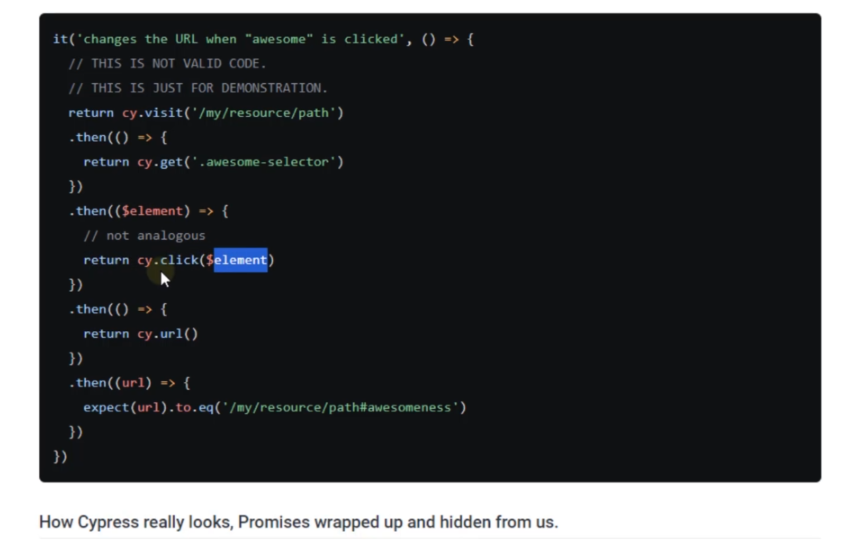
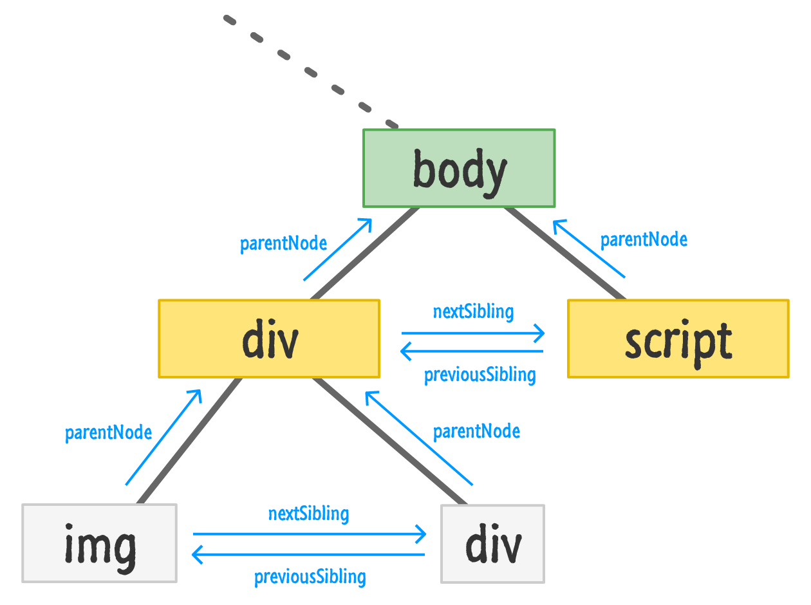
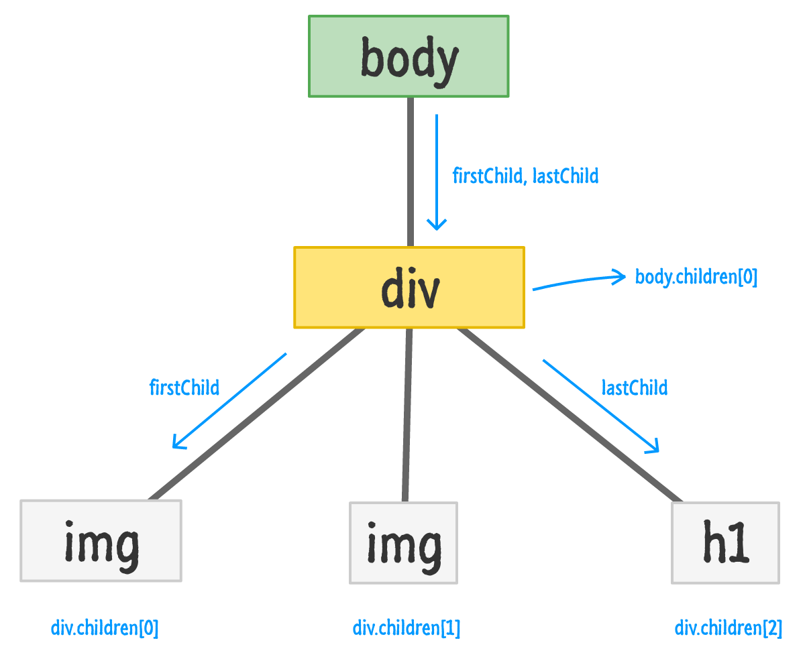

## INDEX

- [INDEX](#index)
- [E2E testing](#e2e-testing)
- [Cypress](#cypress)
  - [Advantages](#advantages)
  - [Disadvantages](#disadvantages)
  - [Guide](#guide)
  - [Running cypress on CMD](#running-cypress-on-cmd)
  - [Configuration](#configuration)
- [File Structure](#file-structure)
- [Selecting elements](#selecting-elements)
  - [Aliasing elements](#aliasing-elements)
  - [Xpath](#xpath)
- [Actions](#actions)
  - [Click](#click)
  - [Trigger](#trigger)
- [Assertions](#assertions)
  - [Text Content](#text-content)
- [Synchronous](#synchronous)
- [variables](#variables)
  - [Aliases](#aliases)
    - [Sharing Context](#sharing-context)
- [Iteration through Elements](#iteration-through-elements)
- [Traversal](#traversal)
- [Upload file](#upload-file)
- [Hooks](#hooks)
- [Fixture](#fixture)
- [API tests](#api-tests)
  - [`.request()` command](#request-command)
    - [Passing multiple attributes to `.request()` command](#passing-multiple-attributes-to-request-command)
  - [Getting data from request](#getting-data-from-request)
  - [`.intercept()` command](#intercept-command)
    - [Syntax](#syntax)
- [Custom Commands](#custom-commands)
- [General](#general)
  - [Handling Multiple tabs in browser](#handling-multiple-tabs-in-browser)
  - [Same Origin Policy (Web Security)](#same-origin-policy-web-security)
  - [Handling Alerts](#handling-alerts)
  - [Timeout](#timeout)
    - [Globally](#globally)
    - [For a command](#for-a-command)
    - [For a test suite](#for-a-test-suite)
  - [Viewport](#viewport)

---

## E2E testing

- **unit testing** is for testing small & isolated pieces of code
- **End To End Testing**: presents the user's point of view

---

## Cypress

Cypress framework is a JavaScript-based **end-to-end testing framework** built on top of Mocha – a feature-rich JavaScript test framework running on and in the browser, making asynchronous testing simple and convenient. It also uses a BDD/TDD assertion library and a browser to pair with any JavaScript testing framework.

### Advantages

- Work on real browser and not a headless browser
  - Headless, means a Web Browser without User Interface.
- readable
- element vs visible

### Disadvantages

- only runs inside a real-browser with Javascript
- doesn't allow to visit more that one superDomain in one test

### Guide

[Here](https://docs.cypress.io/api/table-of-contents)

### Running cypress on CMD

[Here](https://docs.cypress.io/guides/guides/command-line)

### Configuration

- `cypress.json` file is to change default settings
- you can configure which `env` to use
  - to access environment variable -> `cypress.env(name_of_variable)`
- to use **baseUrl** -> add it to the file
  - and to use it use `cy.visit("/")`
- [Guide and different options](https://docs.cypress.io/guides/references/configuration#Configuration-File)

---

## File Structure

- `cypress.json` file is to change default settings
- `plugin` folder is where we add additional functionalities to cypress (extend cypress functionality)
- `fixtures` folder is where we have the **test Data objects**, **mocked objects** needed, in `json` format
- `SUPPORT` folder is used to store custom commands and files

---

## Selecting elements

When selecting elements it's recommended to use **data attributes** -> `data-cy=""`

> You can use the selector in cypress window that suggests a unique selector-name for the element

### Aliasing elements

`.as()`: Assign an alias for later use.

- to use it: Reference the alias later within a `cy.get()` or `cy.wait()` command with an `@` prefix.

```js
cy.get('.main-nav').find('li').first().as('firstNav'); // Alias element as @firstNav

// using it
cy.get('@firstNav');
```

> **Note**: we can't just name it as a variable as the process of getting an element is **Asynchronous**

```js
// THIS WON'T WORK
const firstNav = cy.get('.main-nav').find('li').first();
```

---

### Xpath

You can use `xpath` as a selector instead of `id/class/attribute`

---

## Actions

### Click

when using `click` you may see that error appears that element is hidden, so in this case we can use `options parameter` in `click()`

```js
cy.get('@closeBtn').click({ force: true });
```

---

### Trigger

Trigger an `event` on a `DOM element`.

```js
// Syntax
.trigger(eventName)
.trigger(eventName, position)
.trigger(eventName, options)
.trigger(eventName, x, y)
.trigger(eventName, position, options)
.trigger(eventName, x, y, options)
// ---------------------------------------------- //

// Example
cy.get('a').trigger('mousedown') // Trigger mousedown event on link
```

- `.trigger()` yields the same subject it was given from the previous command.
  ```js
  cy.get('button').trigger('mouseover'); // yields 'button'
  ```
- other `events`, `options`,.. can be found [here](https://docs.cypress.io/api/commands/trigger#Syntax)

---

## Assertions

Cypress bundles the popular `Chai` assertion library

[Guide](https://docs.cypress.io/guides/references/assertions#Chai)

- `chai` uses word: `should` for assertion

### Text Content

```js
// assert the element's text content is exactly the given text
cy.get('[data-testid="user-name"]').should('have.text', 'Joe Smith');

-------------------------------------------------------

// use cy.contains to find an element with its text
// matching the given regular expression (the element's text should start with "Hello")
cy.contains('[data-testid="greeting"]', /^Hello/)
```

> You can use regular expression when writing the text like:
>
> - the text start with ...

- `.find`: to search inside an element
  - `cy.get('[data-testid="user-name"]').find('.sdsd')`

---

## Synchronous

In cypress, commands are **Asynchronous**

> Cypress Commands are **Promises** > 

- so if you have synchronous code, it will behave not like you want with cypress
- to fix this you can use some of the commands by cypress like:
- `cy.log()` instead of `console.log()`
- or use chaining commands with `.then()` and write your synchronous-code

```js
cy.get('button').then(($btn) => {
  // $btn is the object that the previous
  // command yielded us
});
```

---

## variables

> You cannot assign or work with the **return values** of any Cypress command. Commands are enqueued and run **asynchronously**.

```js
// this won't work the way you think it does
const button = cy.get('button');
const form = cy.get('form');

button.click();
```

- To fix this we must declare `variables / Cypress commands` inside of the `.then()`

```js
cy.get('button').then(($btn) => {

  // store the button's text
  const txt = $btn.text()

  // submit a form
  cy.get('form').submit()
})

// these commands run after all of the
// other previous commands have finished
cy.get(...).find(...).should(...)
```

---

### Aliases

Using `.then()` callback functions to access the previous command values is great—but what happens when you're running code in hooks like `before` or `beforeEach`?

```js
//--------------------------------- The problem ---------------------------------//
beforeEach(() => {
  cy.get('button').then(($btn) => {
    const text = $btn.text();
  });
});

it('does not have access to text', () => {
  // how do we get access to text ?!?!
});
```

**Solution**:

- [NOT RECOMMENDED] We could make our code do some ugly backflips using `let` to get access to it.

  ```js
  describe('a suite', () => {
    // this creates a closure around
    // 'text' so we can access it
    let text;

    beforeEach(() => {
      cy.get('button').then(($btn) => {
        // redefine text reference
        text = $btn.text();
      });
    });

    it('does have access to text', () => {
      // now text is available to us
      // but this is not a great solution :(
      text;
    });
  });
  ```

- [RECOMMENDED] **Introducing Aliases**: Aliases are a powerful **construct** in Cypress that have many uses, we'll use them to share objects between your hooks and your tests (Sharing Context).

#### Sharing Context

Sharing context is the simplest way to use aliases.

To alias something you'd like to share use the `.as()` command.

```js
beforeEach(() => {
  // alias the $btn.text() as 'text'
  cy.get('button').invoke('text').as('text');
});

it('has access to text', function () {
  this.text; // is now available
});
```

---

## Iteration through Elements

Iterate through an array like structure (arrays or objects with a `length` property) using -> **each**

- to use actions on the element -> we **wrap** it using ` cy.wrap()`
  - if we didn't do so, it will be dealt with as a `jQuery element`

```js
cy.get('ul>li').each(() => {...}) // Iterate through each 'li'

cy.get('ul>li').each(($el, index, $list) => {
  // $el is a wrapped jQuery element
  if ($el.someMethod() === 'something') {
    // wrap this element so we can
    // use cypress commands on it
    cy.wrap($el).click()
  } else {
    // do something else
  }
})
```

---

## Traversal

[Guide](https://example.cypress.io/commands/traversal#)




---

## Upload file

We can upload a file in Cypress. To perform the file upload task in Cypress, we have to first install a plugin ([cypress-file-upload](https://www.npmjs.com/package/cypress-file-upload)) with the command:

```sh
npm i cypress-file-upload
```

- import it in the file
- add the file that we want to upload within the **fixtures folder**(Picture.png file).
- To upload a file, we have to use the Cypress command, `attachFile`, and pass the path of the file to be uploaded as a parameter to it.
  - `cySubject.attachFile(fixture, optionalProcessingConfig);`

```js
describe('Tutorialspoint Test', function () {
  it('Test Case6', function () {
    //file to be uploaded path in project folder
    const p = 'Picture.png';

    cy.visit('https://the-internet.herokuapp.com/upload');

    //upload file with attachFile
    cy.get('#file-upload').attachFile(p);

    //click on upload
    cy.get('#file-submit').click();

    //verify uploaded file
    cy.get('#uploaded-files').contains('Picture');
  });
});
```

---

## Hooks

Hooks are used to carry out the certain operations `prior`/`post` `every`/`each` test.Some of the common hooks are as follows:

- `before` − It is executed, once the prior execution of any tests within a describe block is carried out.

- `after` − It is executed, once the post execution of all the tests within a describe block is carried out.

- `beforeEach` − It is executed prior to the execution of an individual, it blocks within a describe block.

- `afterEach` − It is executed post execution of the individual, it blocks within a describe block.

---

## Fixture

Load a fixed set of **data** located in a file.

```js
cy.fixture(filePath);
cy.fixture(filePath, encoding);
cy.fixture(filePath, options);
cy.fixture(filePath, encoding, options);

// -------------------------------------------------------- //

// usage
import user from '../fixtures/user.json';
it('loads the same object', () => {
  cy.fixture('user').then((userFixture) => {
    expect(user, 'the same data').to.deep.equal(userFixture);
  });
});
```

---

## API tests

### `.request()` command

- **syntax**:

  ```js
  cy.request(url);
  cy.request(url, body);
  cy.request(method, url);
  cy.request(method, url, body);
  cy.request(options);
  ```

This command will be the center of it all. To send a simple request with a `GET` method, you can call it like this:

```js
cy.request('/api/boards');
```

> Notice you don’t really need to add the method. Cypress optimizes their commands for maximum readability, so if you write a request like this, it will automatically be one with a method of GET.

- If you pass two arguments into .request() command, the first argument will be considered a method, and the second one will be a url.
  ```js
  cy.request('DELETE', '/api/boards/9873789121');
  ```
- `.request()` command can take maximum of **3** arguments. The third one will be a request body.
  ```js
  cy.request('POST', '/api/boards', {
    name: 'space travel plan',
  });
  ```

#### Passing multiple attributes to `.request()` command

If you want to pass some more options or just provide your `.request` command a little more context, you can pass a single object. The same request from previous example can be written like this:

```js
cy.request({
  method: 'POST',
  url: '/api/boards',
  body: {
    name: 'space travel plan',
  },
});
```

---

### Getting data from request

After a request receives a response from server, you can access the information using `.then()` command. This will return all kinds of attributes like response body, status code, duration etc.

```js
cy.request({
  method: 'POST',
  url: '/api/boards',
  body: {
    name: 'space travel plan',
  },
}).then((board) => {
  console.log(board.status); // 201
  console.log(board.duration); // 11
  console.log(board.body);
  /* 
  { 
    "name": "new board",
    "id": 39871447524,
    "starred": false,
    "created": "2022-01-17"
  }
*/
});
```

> **Note**: The alias **board** used as a parameter in our `.then()` function can actually be skipped, if you use **destructuring**.
>
> ```js
> cy
>   .request({
>     method: 'POST',
>     url: '/api/boards',
>     body: {
>       name: 'space travel plan',
>     },
>   })
>   .then(({ status }) => {
>     console.log(status); // 201
>   })``;
> ```

---

### `.intercept()` command

Spy and stub network requests and responses, It's How Cypress enables you to stub out the back end

- is used to control the behavior of HTTP requests. You can statically define the body, HTTP status code, headers, and other response characteristics.

> **cy.intercept()** is the successor to **cy.route()** as of Cypress 6.0.0
>
> All intercepts are automatically cleared before every test.

#### Syntax

```js
// spying only
cy.intercept(url);
cy.intercept(method, url);
cy.intercept(routeMatcher);

// spying and response stubbing
cy.intercept(url, staticResponse);
cy.intercept(method, url, staticResponse);
cy.intercept(routeMatcher, staticResponse);
cy.intercept(url, routeMatcher, staticResponse);
```

**Example**:

```js
cy.intercept(
  {
    method: 'GET', // Route all GET requests
    url: '/users/*', // that have a URL that matches '/users/*'
  },
  [] // and force the response to be: []
).as('getUsers'); // and assign an alias

// ---------------------------------------------------------------- //

// spying
cy.intercept('/users/**');
cy.intercept('GET', '/users*');
cy.intercept({
  method: 'GET',
  url: '/users*',
  hostname: 'localhost',
});

// spying and response stubbing
cy.intercept('POST', '/users*', {
  statusCode: 201,
  body: {
    name: 'Peter Pan',
  },
});

// spying, dynamic stubbing, request modification, etc.
cy.intercept('/users*', { hostname: 'localhost' }, (req) => {
  /* do something with request and/or response */
});
```

---

## Custom Commands

Cypress comes with its own API for creating custom commands and overwriting existing commands.

> A great place to define or overwrite commands is in your `cypress/support/commands.js` file since **it is loaded before any test files are evaluated** via an import statement in the supportFile.

```js
Cypress.Commands.add('login', (email, pw) => {});
Cypress.Commands.addAll({
  login(email, pw) {},
  visit(orig, url, options) {},
});
Cypress.Commands.overwrite('visit', (orig, url, options) => {});
```

---

## General

### Handling Multiple tabs in browser

Because Cypress runs in the browser, it will never have multi-tabs support. We do have access to the browser automation APIs to actually switch tabs, but there is no reason for us to ever expose them.

Most of the time this use case is needed when users click an <a> that opens a new tab. Users then want to switch to that tab to verify that the content loaded. But, you shouldn't need to do this.

- You already know that is what the browser is designed to do and you already know that it is triggered by the `target="\_blank"` attribute.

  ```js
  cy.get('a[href="/foo"]').should('have.attr', 'target', '_blank');
  ```

- to prevent test failure, we remove the attribute using jQuery `removeAttr()` method

```js
// use this before clicking the link
cy.get('a[href="/foo"]').invoke('removeAttr', 'target');
```

---

### Same Origin Policy (Web Security)

Browsers adhere to a strict same-origin policy. This means that browsers restrict access between <iframes> when their origin policies do not match.

Because Cypress works from within the browser, Cypress must be able to directly communicate with your remote application at all times. Unfortunately, browsers naturally try to prevent Cypress from doing this.

```js
it('navigates', () => {
  cy.visit('https://www.cypress.io');
  cy.visit('https://docs.cypress.io'); // yup all good
});

it('navigates', () => {
  cy.visit('https://apple.com');
  cy.visit('https://google.com'); // this will error
});
```

- To get around these restrictions, Cypress implements some strategies involving JavaScript code, the browser's internal APIs, and network proxying to play by the rules of same-origin policy. It is our goal to fully automate the application under test without you needing to modify your application's code
- you can bypass this restriction in Cypress by **disabling web security**

  - Set `chromeWebSecurity` to `false` in the Cypress configuration

  ```json
  <!-- in cypress.json -->

  {
    "chromeWebSecurity": false
  }
  ```

---

### Handling Alerts

An alert is triggered by `window:alert` event. This is by default handled by Cypress and the OK button on the alert gets clicked, without being visible during execution.

```js
cy.on('window:alert', (t) => {
  //assertions
  expect(t).to.contains('Your full name');
});
```

> To respond to alert whether (ok/cancel), we use the callback on `'window:confirm'` event and return true/false

---

### Timeout

#### Globally

You can configure timeout **globally** in `cypress.json` file

#### For a command

You can also configure timeout for a given command using the `options` object

```js
cy.get('.mobile-nav', { timeout: 10000 }) // 10 seconds
  .should('be.visible');
```

#### For a test suite

Place this in the its block before you want it used:

```js
Cypress.config('defaultCommandTimeout', 10000);
```

---

### Viewport

Control the size and orientation of the screen for your application.

> You can set the viewport's width and height globally by defining viewportWidth and viewportHeight in the **Cypress configuration**

```js
cy.viewport(width, height);
cy.viewport(preset, orientation);
cy.viewport(width, height, options);
cy.viewport(preset, orientation, options);

// --------------------------------------------- //

cy.viewport(550, 750); // Set viewport to 550px x 750px
cy.viewport('iphone-6'); // Set viewport to 375px x 667px

beforeEach(() => {
  // run these tests as if in a desktop
  // browser with a 720p monitor
  cy.viewport(1280, 720);
});
```
