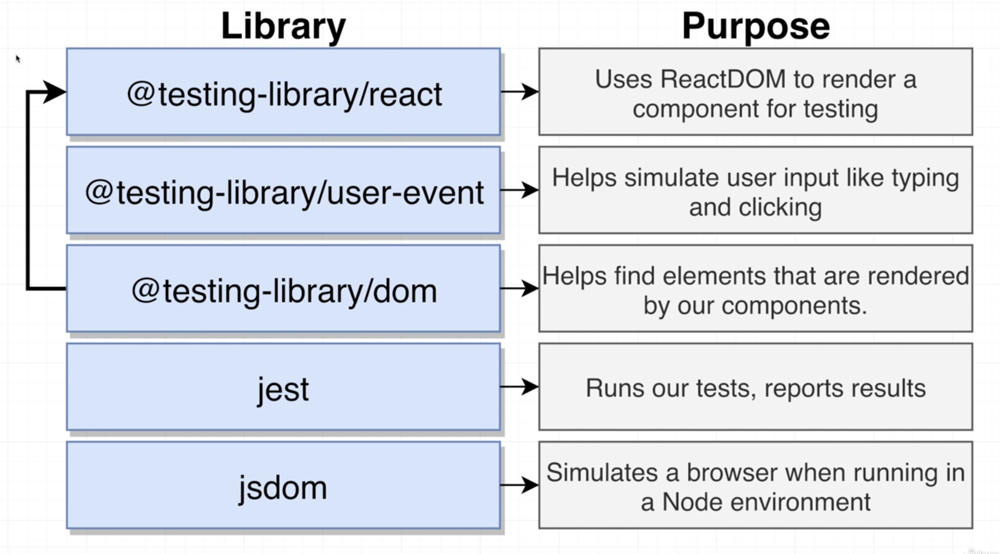
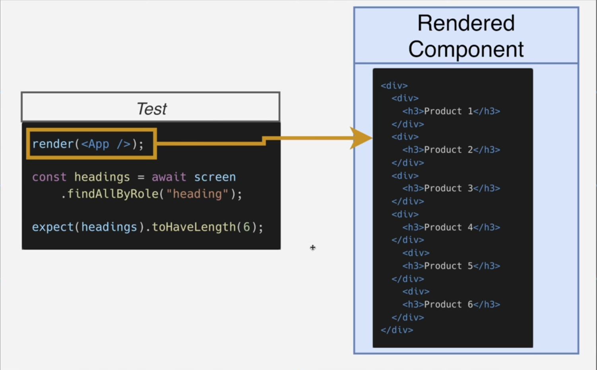
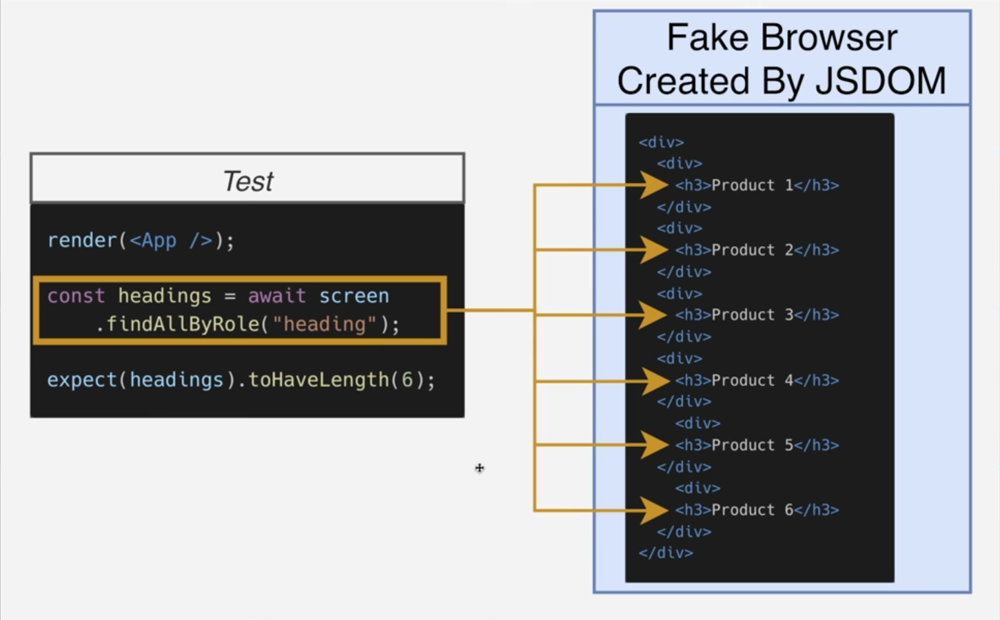
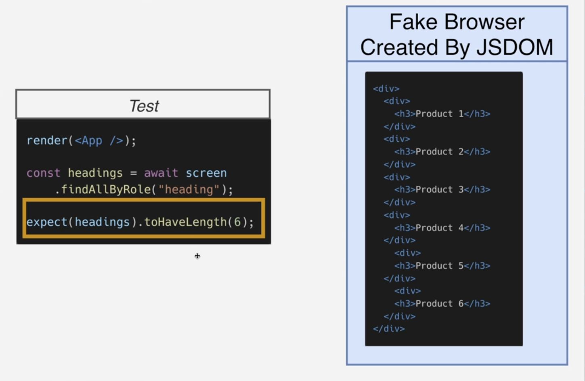

# INDEX

- [INDEX](#index)
  - [React Testing Library](#react-testing-library)
    - [How it works](#how-it-works)

---

## React Testing Library

**React Testing Library** is a library that helps you test your React components in a user-centric way. It is a very light-weight solution for testing React components.

- It provides light utility functions on top of `react-dom` and `react-dom/test-utils`, in a way that encourages better testing practices. Its primary guiding principle is:

  - The more your tests resemble the way your software is used, the more confidence they can give you.
  - It is recommended to use it with `Jest` as it provides a set of custom jest matchers that you can use to extend jest.

- Here's a comparison between popular testing libraries for React:
  

### How it works

- It renders your components and the components that are children of those components, and so on.
  
- It exposes methods that allow you to interact and find elements within the rendered components.
  
- After you've interacted with the components, you can make assertions about what happened.
  
