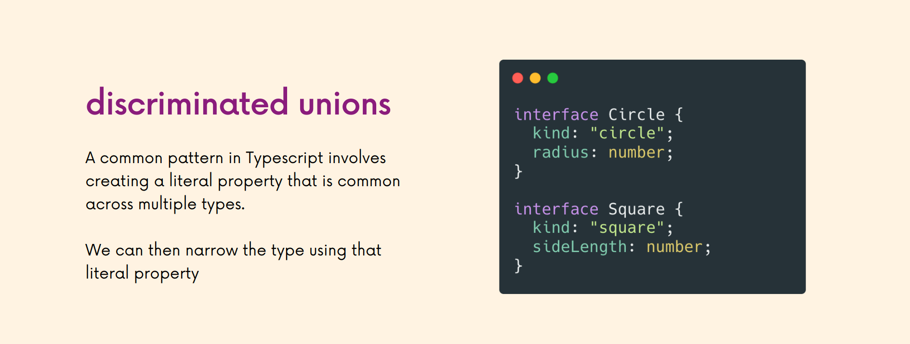

# INDEX

- [INDEX](#index)
  - [Installing](#installing)
    - [Compiling](#compiling)
      - [Compiling one TS file](#compiling-one-ts-file)
      - [Compiling entire project with all its files](#compiling-entire-project-with-all-its-files)
    - [Type Declarations](#type-declarations)
  - [Typing](#typing)
    - [Statically vs dynamically typed](#statically-vs-dynamically-typed)
    - [Strongly vs weakly typed](#strongly-vs-weakly-typed)
    - [Implicit Typing and Explicit Typing](#implicit-typing-and-explicit-typing)
  - [TypeScript](#typescript)
    - [why use Typescript](#why-use-typescript)
  - [TypeScript Types (Annotations)](#typescript-types-annotations)
  - [Type Assertions / Type Casting](#type-assertions--type-casting)
    - [How to use Type Assertion](#how-to-use-type-assertion)
  - [Generics](#generics)
    - [Generics Type Constraints](#generics-type-constraints)
  - [Type Guard (Narrowing)](#type-guard-narrowing)
    - [`typeof` type guard](#typeof-type-guard)
    - [Truthiness guard](#truthiness-guard)
    - [Equality Narrowing `===`](#equality-narrowing-)
    - [`in` operator narrowing](#in-operator-narrowing)
    - [`instanceof` Narrowing](#instanceof-narrowing)
    - [Type Predicates](#type-predicates)
    - [Discriminated Unions](#discriminated-unions)
    - [Exhaustiveness Checks with Never](#exhaustiveness-checks-with-never)
  - [Promises](#promises)
  - [Decorators](#decorators)
    - [Decorator configuration](#decorator-configuration)
    - [Decorator Composition](#decorator-composition)
    - [Class Decorator](#class-decorator)
  - [Namespace](#namespace)
  - [Bundling Typescript with Webpack](#bundling-typescript-with-webpack)
    - [For Development](#for-development)
      - [Source Maps](#source-maps)
    - [For Production](#for-production)

---

## Installing

- [reference](https://classroom.udacity.com/nanodegrees/nd0067-fwd-t3/parts/cd0292/modules/c0ad589b-67b3-4791-931f-9b0fa8ac0ed3/lessons/f92490de-12fb-4c61-a74a-3889a4727954/concepts/061049c2-7fdf-4d69-868b-e51c64c7ceef)

```bash
npm i typescript --save-dev    # save to devDependencies

npm i --save-dev ts-node

npm i --save-dev @types/node  # type definitions

```

---

### Compiling

Typescript doesn't run in the browser. We only use the language in our code-editor for development. Typescript only exists for the benefit of the developer.

- **Compiler:** is a piece of software that converts Typescript to Javascript so that it runs in the browser

#### Compiling one TS file

- `tsc` -> **TypeScript Compiler** is the command used to compile `typescript` to `javascript`

- in `html` file -> always use the javascript file and not the `TS` file

- `watch mode` : like live-server

  ```bash
  tsc app.ts --watch   # or --w
  ```

---

#### Compiling entire project with all its files

- To use TypeScript, you need to add a script to your `package.json` file to `compile` TypeScript to JavaScript. This is generally called your "`build`" script

  - this command will `transpile` TypeScript to JavaScript

  ```json
  "scripts": {
      "build": "npx tsc"
    },
  ```

- Add the default TypeScript configuration file

- To create general `tsc` (telling TS that everything in the folder is managed by Typescript):

  ```bash
  tsc --init   # this will create tsconfig.json file

  # after that run this :
  tsc  # this will tell TS to convert all (.ts) files to (.js)
  # or
  tsc --watch
  ```

- `tsconfig.json` -> This config file is also where you can tell TypeScript how strict it should be while checking your code and what to ignore. If you're moving a project to TypeScript, you can gracefully integrate TS by working with the settings in this config file.

- Helpful configurations to note for in `tsconfig.json`

  ```json
  {
    "compilerOptions": {
      "target": "es5", // which level of JS-support to target
      "module": "commonjs",
      "lib": ["ES2018", "DOM"],
      "outDir": "./build", // destination folder will have JS files
      "rootDir": "./src", // just include src folder that has TS files
      "strict": true,
      "noImplicitAny": true //  TypeScript will issue an error whenever it would have inferred (any)
    },
    "exclude": ["node_modules", "tests"]
  }
  ```

- `target` - sets what version of JS TypeScript will be transpiled to (and include compatible library declarations).
- `module` - sets what module system will be used when transpiling
  - specify what module code is generated when dealing with modules(multiple files with `import`/`export`)
  - best -> `"ES6"`
- Node.js uses the common.js module system by default
- `lib` - It's a set of bundled library-declaration files that describe the target runtime environment
  - Used to state what libraries your code is using. In this case, `ES2018` and the `DOM API`
- `outDir` - where you want your src code to output to. Often named build, prod, or server (when using it server-side)
- `strict` - enable strict type-checking options
- `noImplicitAny` - disallow the "any" type (covered in TypeScript Basics)
- specifying which file to compile:
  - `files`: list all files you want to compile to `js` or use (`include` & `exclude`)
  - `exclude`: files or directories to exclude in compiling
- for `Debugging` --> use `"sourceMap": true`

---

### Type Declarations

They are special files that end with `.d.ts` instead of `.ts`

- in `.d.ts` files, we find no implementation details, no code that is ever going to be run as javascript (no output), Instead we find files that only contain type information declarations of types which Typescript can use for our code
- example for them is the types files for the libraries where all the type-declarations are
- it's useful when working with 3rd party libraries code

  - if a library doesn't have type-declaration files like `lodash`, we can install the corresponding `@types` package externally

    ```sh
    npm i --save-dev @types/lodash
    ```

    - the `@type` is from a github repo -> [DefinitelyTyped](https://github.com/DefinitelyTyped/DefinitelyTyped)

---

## Typing


### Statically vs dynamically typed

- `Statically-typed` do type checking **before runtime** (at **compile-time**)
  - this detects errors in our code without running it.
- `dynamically-typed` do type-checking at **runtime** as there exist data types, but variables are not bound to any of them.

  ```js
  // no error
  let message = 'hello';
  message = 123456;
  ```

---

### Strongly vs weakly typed

- `Weakly-typed` languages make conversions between unrelated types implicitly
- `Strongly-typed` languages don't allow implicit conversions between unrelated types.

- JavaScript is `Weakly-Typed`.

  - it allows for `type coercion`
  - This means that types are assigned by the interpreter based on the data and makes an educated guess when the code's intention is ambiguous. This can lead to unintended results.

```js
let x = 21; // type assigned as int at runtime.
let y = x + 'dot';
// This code will run without any error. As Javascript is a weakly-typed language, it allows implicit conversion between unrelated types.
```

---

### Implicit Typing and Explicit Typing

- `Implicit Typing`

  - TypeScript will automatically assume types of objects if the object is not typed.

  ```js
  const myNum = 3; // TypeScript implicitly types myNum as a number based on the variable
  ```

- `Explicit Typing`

  - The developer does explicit typing. The developer explicitly applies a type to the object.

  ```js
  let myVar: number = 3; // myVar has been explicitly typed as a number
  ```

---

## TypeScript

**TypeScript** is a **static and strongly typed** superset of JavaScript. When we're done with our TypeScript code, it compiles to JavaScript.

> It's just: Javascript with types


### why use Typescript

- It helps us find errors before the code runs & analyzes our code as we type
- It allows you, as a code author, to leave more of your intent “on the page”
  - It only exists in **development** then it's compiled to javascript
- It has the potential to move some kinds of errors from **runtime** (users) to **compile time** , ex:
  - Values that are potentially absent (null or undefined)
  - Incomplete refactoring
  - Breakage around internal code contracts (e.g., an argument becomes required)
- It serves as the foundation for a great code authoring experience
  - `Example`: in-editor autocomplete


---

## TypeScript Types (Annotations)

We don't always need to write the type for each variable, as we can depend on **"Type Inference"**


- **Note:** One situation where we shouldn't depend on type-inference and should use type-annotations, is when you declare a variable separately from initializing it **(delayed initialization)**

  ```ts
  const letters = ['a', 'b', 'c'];
  let foundLetter; // declaring it, will be type "any"

  letters.forEach(letter => {
    if (letter === 'a') {
      foundLetter = 'a'; // initializing it as a string
    }
  });

  // instead use this:
  let foundLetter: string;
  ```

---

## Type Assertions / Type Casting

> Sometimes you might have more specific information about a value's type, and you want to make sure that Typescript knows it too.

Type Assertions are used to tell TypeScript: (that even though TypeScript thinks it should be one type, it is actually a different type **that you want**). Common to see when a type is unknown

- Usually used with `unknown` or `union` types

> Generally, using type coercion (as Type), is a way of telling TypeScript "I know what I'm doing, so just trust me this has this type", so you generally should avoid it and let the type checker and type inference do its thing.

- Type assertions helps you to force types when you are not in control of them.
  Typecasting refers to `type conversions`

### How to use Type Assertion

- There are two ways to do type assertions
  - `as` --> `let length: number = (lengthField as string);`
  - `Bracket` syntax --> `let length: number = (<string>lengthField);`
    - **Note:** it doesn't work with JSX/TSX, to fix this we add a trailing comma: `const getEl = <T,>(list: T[]):T => {}`

```ts
const myFunc = (student: unknown): string => {
  newStudent = student as string;
  return newStudent;
};

let mystery: unknown = 'Hello World';
const numChars = (mystery as string).length;
//or
const numChars = (<string>mystery).length;
```

---

## Generics

A generic is a way to write a function that is reusable across different types, by using **type parameters**

- They allow us to define reusable functions and classes that work with multiple types rather than a single type
- "generic" means **not specific** (we don't know this type but we will know it as soon as we invoke the function)

> **type parameters**: can be thought of as **function arguments, but for types**
>
> - Functions may return different values, depending on the arguments you pass them.

- why not just use `any` type?

  - `any` is an escape hatch. It turns off type checking for the variable so that you can do your thing without errors
    - It sort of defeats the purpose of Typescript and types
  - It's an anti-pattern(not recommended) in typescript
  - `any` allows for any type to go in, and any type to come out.
  - Using a `generic` means a number goes in and a number comes out or a string goes in and a string comes out.
  - `Generics` introduce the `Type Variable`
    - Rather than being a variable that accepts values, it's a variable that accepts types and is denoted with angle brackets myFunc`<T>`
    - it help us write more reusable and generic :) functions

> **Note:** when calling a generic function, we don't need to specify the generic-type when invoking it (because of type inference), but in some cases like with DOM elements we might need to

```ts
// Typed Function that deals only with numbers
const getItem = (arr: number[]): number => {
  return arr[1];
};
// we can work around it and use union type like this:
const getItem = (arr: (number | string)[]): number | string => {
  return arr[1];
};

// --------------------------------------------------------------

// Using Generics
const getItem = <T>(arr: T[]): T => {
  return arr[1];
};
// calling it
getItem([1, 2, 3]); // ✅ -> because of type inference
getItem<number>([1, 2, 3]); // ✅
```

In the first function, we have a function that takes in a number array and outputs the second number of the array. But what if we don't want to work with numbers? What if we want to work with strings? Well, we would need to create a second function. Or, we can use a generic, and whatever type we use when we call the function will translate to its return as well.

- another example

  ```ts
  // function takes object that contains certain type(T) and another object that contains certain type(U)
  function merge<T extends object, U extends object>(objA: T, objB: U) {
    return Object.assign(objA, objB);
  }
  // "extends" here is a (Type Constraint)

  // here first obj contains type(string) and the second obj contains type(number)
  const mergedObj = merge({ name: 'Max', hobbies: ['Sports'] }, { age: 30 });
  console.log(mergedObj);
  ```

**Generics Notes:**

- DOM query selector methods are generic function, and that's why we can use generic type with them

  ```ts
  const input = document.querySelector<HTMLInputElement>('todo-input')!;
  ```

- generics can be used with multiple types:

  ```ts
  function merge<T, U>(obj1: T, obj2: U) {
    return { ...obj1, ...obj2 };
  }
  ```

- A default type can be defined on a generic parameter as follows:

  ```ts
  <T = DefaultType>
  ```

---

### Generics Type Constraints

- You may sometimes want to write a generic function that works on a set of types where you have some knowledge about what capabilities that set of types will have. like `array` to be able to access the `.length` property, but the compiler could not prove that every type had a `.length` property, so it warns us that we can’t make this assumption.

  ```ts
  function logLength<T>(arg: T): T {
    console.log(arg.length);
    return arg;
  }

  logLength(235); // ❌ Property 'length' does not exist on type 'number'.
  ```

- Instead of working with `any` and `all` types, we’d like to constrain this function to work with `any` and `all` types that also have the `.length` property. As long as the type has this member, we’ll allow it, but it’s required to have at least this member. To do so, we must list our requirement as a constraint on what Type can be.

  - To do so, we’ll extend an interface that has the `length` property like `array`, then we’ll use this `interface` and the extends keyword to denote our constraint:

    ```ts
    function logLength<T extends Array>(arg: T): T {
      console.log(arg.length); // Now we know it has a ".length" property, so no more error
      return arg;
    }

    logLength(235); // ✅
    ```

---

## Type Guard (Narrowing)

- **Type Guard** : protects us from doing something unless we check the type first

- **Type Narrowing:** is doing a type check before working with a value, It's done using:

  1. `typeof` type guard
  2. truthiness guard
  3. Equality type guard `===`
  4. `in` operator narrowing
  5. `instanceof` Narrowing

### `typeof` type guard

- Usually used with union-types, as since they allow for multiple types for a value, It's good to check what came through before working with it.
- it control the flow of code using the type of something
- this process is called **Narrowing**
  - as it narrows our choice with the type-guard condition
- usually used with [unknown type](#unknown----type-guard) or [Union Types](#union-types)

```ts
function calculateTax(price: number | string, tax: number) {
  if (typeof price === 'string') {
    price = parseFloat(price.replace('$', ''));
  }
  return price * tax;
}
```

---

### Truthiness guard

It's checking a value for being truthy or falsy before working with it

- this is helpful in avoiding errors when values might be `null` or `undefined

```ts
function printLetters(word: string | null) {
  if (!word) {
    console.log('No word was provided');
  } else {
    word.forEach(letter => console.log(letter));
  }
}
```

---

### Equality Narrowing `===`

It involves comparing types to each other before doing certain operations with values

```ts
function someFunc(x: string | boolean, y: string | number) {
  if (x === y) {
    // x and y are strings in this case
    x.toUpperCase();
    y.toUpperCase();
  } else {
    console.log(x);
    console.log(y);
  }
}
```

---

### `in` operator narrowing

Javascript's `in` operator helps check if a certain property exists in an object. This means it can be used to check if a value exists in an object (according to its type-alias) before working with it

```ts
type Cat = { meow: () => void };
type Dog = { bark: () => void };

const talk = (creature: Cat | Dog) => {
  if ('meow' in creature) {
    console.log(creature.meow());
  } else {
    console.log(creature.bark());
  }
};
```

---

### `instanceof` Narrowing

It's a javascript operator that allows us to check if one thing is an instance of another. This can help us narrow types when working with things like **classes**

```ts
const printFullDate = (date: date | string) => {
  if (date instanceof Date) {
    return date.toUTCString();
  } else {
    return new Date(date).toUTCString();
  }
};
```

---

### Type Predicates

Typescript allows us to write custom functions that can narrow the type of a value. These functions have a very special **return type** called a **type predicate**

- A predicate takes the name -> **`parameterName + is + Type`**

```ts
// if the return value is true, then it must be "Cat"
function isCat(pet: Cat | Dog): pet is Dog {
  return (pet as Cat).meow !== undefined;
}

if (isCat(pet)) {
  pet.meow();
} else {
  pet.bark();
}
```

---

### Discriminated Unions



The concept here is that we add a **"discriminant"** which is just a property that all our types will have in common, and it will be of type: `literal-type` and by convention, It's called `kind`

---

### Exhaustiveness Checks with Never

It's the default thing to do when all the type-narrowing checks are all passed and this is the last check, and it's like: "we should never make it here, if we handled all cases correctly"

---

## Promises

- Promises in TypeScript take advantage of `generics`. This means we can explicitly state what type of Promise should be returned.

  ```ts
  // this async fun has a promise but doesn't return something
  const myFunc = async (): Promise<void> => {
    // do stuff
  };
  ```

---

## Decorators

Decorators are a way to decorate members of a class, or a class itself, with extra functionality. When you apply a decorator to a class or a class member, you are actually calling a function that is going to receive details of what is being decorated, and the decorator implementation will then be able to transform the code dynamically, adding extra functionality, and reducing boilerplate code.

- They are a way to have `metaprogramming` in TypeScript, which is a programming technique that enables the programmer to create code that uses other code from the application itself as data.

---

### Decorator configuration

- To enable experimental support for decorators, you must enable the experimentalDecorators compiler option either on the command line or in your tsconfig.json

  ```bash
  # command line
  tsc --target ES5 --experimentalDecorators
  ```

  ```json
  // tsconfig.json:
  {
    "compilerOptions": {
      "target": "ES5",
      "experimentalDecorators": true
    }
  }
  ```

---

### Decorator Composition

Decorator Composition is an important concept as it allows us to use multiple decorators on a single class member or declarations. The evaluation of these compositions is similar to the function composition that we will see in our mathematics class `(i.e (f ∘ g)(x) is equivalent to f(g(x)))`.

- the expression for each decorator will be evaluated from `top to bottom`
- the results are called from `bottom to top`

```ts
function outer() {
  console.log('Outer: expression');
  return function (target: any, propertyKey: string, descriptor: PropertyDescriptor) {
    console.log('Outer: result');
  };
}

function inner() {
  console.log('Inner: expression');
  return function (target: any, propertyKey: string, descriptor: PropertyDescriptor) {
    console.log('Inner: result');
  };
}

class DecoratorComposition {
  @outer()
  @inner()
  run() {}
}
const decoratorComposition = new DecoratorComposition();
decoratorComposition.run();
// resu;ts:
// Outer: expression
// Inner: expression
// Inner: result
// Outer: result
```

---

### Class Decorator

Class Decorator is very similar to inheriting from another class.

- Decorators are functions that accepts functions as a parameter as it's applied to functions or classes

```ts
const classDecorator = (target: Function) => {
  // do something with your class
};

@classDecorator
class Rocket {}
```

```ts
// ---------Using Decorator--------- //
function BankCard(constructor: Function) {
  constructor.prototype.cardId = Math.floor(Math.random() * 1000);
}

@BankCard
class HSBCBankCard {
  name: string;
  constructor(name: string) {
    this.name = name;
  }
}

// ---------Using class extends--------- //
class BankCard {
  cardId: number;
  constructor() {
    this.cardId = Math.floor(Math.random() * 1000);
  }
}

class HSBCBankCard extends BankCard {
  name: string;
  constructor(name: string) {
    super();
    this.name = name;
  }
}
```

---

## Namespace

Typescript has its own module-format called "namespaces" which is pre-dates the ES-Modules standard

- It's somehow deprecated, as the majority of the features in namespaces exists in ES-Modules now

---

## Bundling Typescript with Webpack

```bash
npm install webpack webpack-cli webpack-dev-server typescript ts-loader --save-dev
```

### For Development

- in `package.json` add this script :

  ```json
  "scripts": {
    "start": "webpack-dev-server",
    "build": "webpack"
    },
  ```

- For `development` --> create `webpack.config.js` file that contains this :

  ```js
  const path = require('path');

  module.exports = {
    mode: 'development',
    entry: './src/app.ts',
    output: {
      filename: 'bundle.js',
      path: path.resolve(__dirname, 'dist'),
      publicPath: 'dist'
    },

    // this part is for Adding TypeScript Support with the ts-loader Package

    devtool: 'inline-source-map',
    module: {
      rules: [
        {
          test: /\.tsx?$/, // regular expression
          use: 'ts-loader',
          exclude: /node_modules/
        }
      ]
    },
    resolve: {
      extensions: ['.ts', '.tsx', '.js']
    }
  };
  ```

---

#### Source Maps

Source Maps take the minified bundle and map it backwards to its pre-built state so that we can see where the actual code is coming from that makes up the bundle, in case we want to debug it

Guide [here](https://webpack.js.org/guides/typescript/#source-maps)

---

### For Production

- in `package.json` add this script :

  ```json
  "scripts": {
    "start": "webpack-dev-server",
    "build": "webpack --config webpack.config.prod.js"
    },
  ```

- install `clean-webpack-plugin` package to clean the `dist` folder whenever we **rebuild** the project

```bash
npm i --save-dev clean-webpack-plugin
```

- For `Production` --> create `webpack.config.prod.js` file that contains this :

  ```js
  const path = require('path');
  const CleanPlugin = require('clean-webpack-plugin');

  module.exports = {
    mode: 'production',
    entry: './src/app.ts',
    output: {
      filename: 'bundle.js',
      path: path.resolve(__dirname, 'dist')
    },
    devtool: 'none',
    module: {
      rules: [
        {
          test: /\.ts$/,
          use: 'ts-loader',
          exclude: /node_modules/
        }
      ]
    },
    resolve: {
      extensions: ['.ts', '.js']
    },
    plugins: [new CleanPlugin.CleanWebpackPlugin()]
  };
  ```
