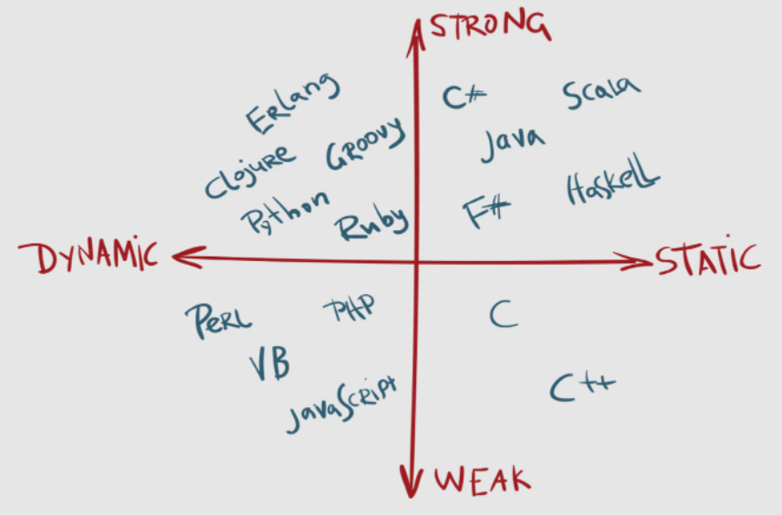
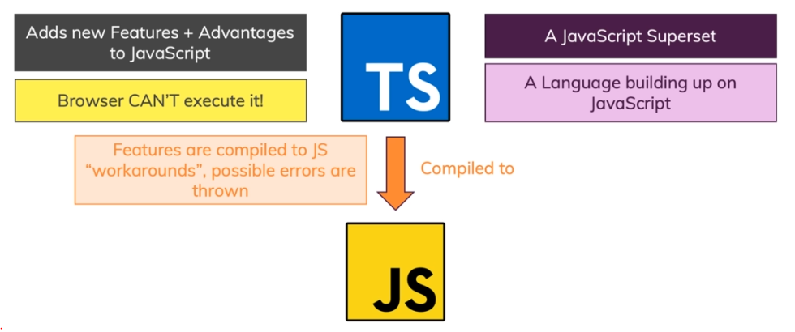
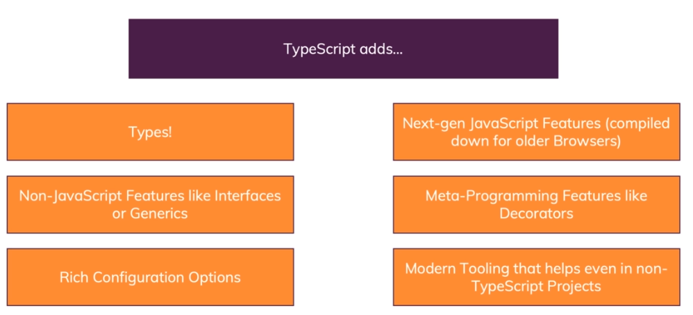
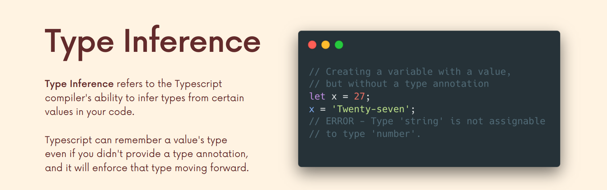
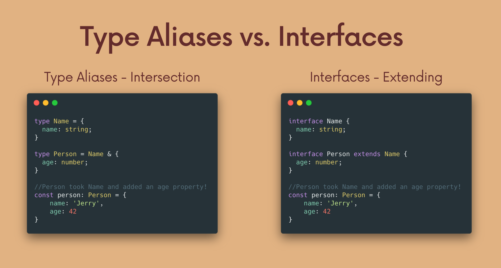
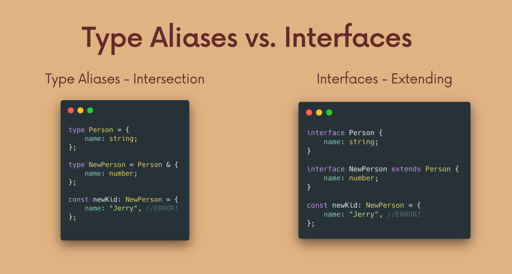
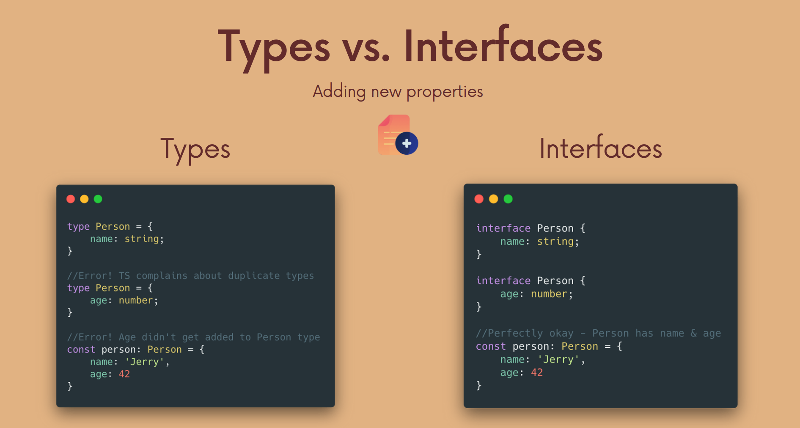

# INDEX

- [INDEX](#index)
  - [Installing](#installing)
    - [Compiling](#compiling)
      - [Compiling one TS file](#compiling-one-ts-file)
      - [Compiling entire project with all its files](#compiling-entire-project-with-all-its-files)
  - [Typing](#typing)
    - [Statically vs dynamically typed](#statically-vs-dynamically-typed)
    - [Strongly vs weakly typed](#strongly-vs-weakly-typed)
    - [Implicit Typing and Explicit Typing](#implicit-typing-and-explicit-typing)
  - [TypeScript](#typescript)
    - [why use Typescript](#why-use-typescript)
  - [TypeScript Types (Annotations)](#typescript-types-annotations)
    - [`Array`](#array)
    - [`Tuple`](#tuple)
    - [`Enum`](#enum)
    - [`Objects`](#objects)
      - [Object Excess Properties Checking](#object-excess-properties-checking)
    - [`unknown` -- (type guard)](#unknown----type-guard)
    - [`this` keyword types](#this-keyword-types)
  - [Type Aliases (`type`)](#type-aliases-type)
    - [`readonly` Modifier](#readonly-modifier)
  - [`Interfaces`](#interfaces)
    - [`interface` vs `type`](#interface-vs-type)
  - [`Union & Intersection Types`](#union--intersection-types)
    - [Union types](#union-types)
    - [Intersection types](#intersection-types)
  - [`Literal Types`](#literal-types)
    - [String Literal Types](#string-literal-types)
  - [Partial Type](#partial-type)
  - [function](#function)
    - [function type](#function-type)
    - [function interface](#function-interface)
    - [`void`](#void)
    - [`never`](#never)
  - [Type Guard (Narrowing)](#type-guard-narrowing)
  - [Type Assertions / Type Casting](#type-assertions--type-casting)
    - [How to use Type Assertion](#how-to-use-type-assertion)
  - [Classes](#classes)
    - [Using Interfaces with classes](#using-interfaces-with-classes)
    - [Access Modifiers](#access-modifiers)
  - [Generics](#generics)
  - [Promises](#promises)
  - [Decorators](#decorators)
    - [Decorator configuration](#decorator-configuration)
    - [Decorator Composition](#decorator-composition)
    - [Class Decorator](#class-decorator)
  - [Namespace](#namespace)
  - [Bundling Typescript with Webpack](#bundling-typescript-with-webpack)
    - [For Development](#for-development)
    - [For Production](#for-production)
  - [3rd Party JS-Libraries for TypeScript](#3rd-party-js-libraries-for-typescript)

---

## Installing

- [reference](https://classroom.udacity.com/nanodegrees/nd0067-fwd-t3/parts/cd0292/modules/c0ad589b-67b3-4791-931f-9b0fa8ac0ed3/lessons/f92490de-12fb-4c61-a74a-3889a4727954/concepts/061049c2-7fdf-4d69-868b-e51c64c7ceef)

```bash
npm i typescript --save-dev    # save to devDependencies

npm i --save-dev ts-node

npm i --save-dev @types/node  # type definitions

```

---

### Compiling

Typescript doesn't run in the browser. We only use the language in our code-editor for development. Typescript only exists for the benefit of the developer.

- **Compiler:** is a piece of software that converts Typescript to Javascript so that it runs in the browser

#### Compiling one TS file

- `tsc` -> **TypeScript Compiler** is the command used to compile `typescript` to `javascript`

- in `html` file -> always use the javascript file and not the `TS` file

- `watch mode` : like live-server

  ```bash
  tsc app.ts --watch   # or --w
  ```

---

#### Compiling entire project with all its files

- To use TypeScript, you need to add a script to your `package.json` file to `compile` TypeScript to JavaScript. This is generally called your "`build`" script

  - this command will `transpile` TypeScript to JavaScript

  ```json
  "scripts": {
      "build": "npx tsc"
    },
  ```

- Add the default TypeScript configuration file

- To create general `tsc` (telling TS that everything in the folder is managed by Typescript):

  ```bash
  tsc --init   # this will create tsconfig.json file

  # after that run this :
  tsc  # this will tell TS to convert all (.ts) files to (.js)
  # or
  tsc --watch
  ```

- `tsconfig.json` -> This config file is also where you can tell TypeScript how strict it should be while checking your code and what to ignore. If you're moving a project to TypeScript, you can gracefully integrate TS by working with the settings in this config file.

- Helpful configurations to note for in `tsconfig.json`

  ```json
  {
    "compilerOptions": {
      "target": "es5", // which level of JS-support to target
      "module": "commonjs",
      "lib": ["ES2018", "DOM"],
      "outDir": "./build", // destination folder will have JS files
      "rootDir": "./src", // just include src folder that has TS files
      "strict": true,
      "noImplicitAny": true //  TypeScript will issue an error whenever it would have inferred (any)
    },
    "exclude": ["node_modules", "tests"]
  }
  ```

- `target` - sets what version of JS TypeScript will be transpiled to (and include compatible library declarations).
- `module` - sets what module system will be used when transpiling
- Node.js uses the common.js module system by default
- `lib` - It's a set of bundled library-declaration files that describe the target runtime environment
  - Used to state what libraries your code is using. In this case, `ES2018` and the `DOM API`
- `outDir` - where you want your src code to output to. Often named build, prod, or server (when using it server-side)
- `strict` - enable strict type-checking options
- `noImplicitAny` - disallow the "any" type (covered in TypeScript Basics)
- specifying which file to compile:
  - `files`: list all files you want to compile to `js` or use (`include` & `exclude`)
  - `exclude`: files or directories to exclude in compiling
- for `Debugging` --> use `"sourceMap": true`

---

## Typing



### Statically vs dynamically typed

- `Statically-typed` do type checking **before runtime** (at **compile-time**)
  - this detects errors in our code without running it.
- `dynamically-typed` do type-checking at **runtime** as there exist data types, but variables are not bound to any of them.

  ```js
  // no error
  let message = 'hello';
  message = 123456;
  ```

---

### Strongly vs weakly typed

- `Weakly-typed` languages make conversions between unrelated types implicitly
- `Strongly-typed` languages don't allow implicit conversions between unrelated types.

- JavaScript is `Weakly-Typed`.

  - it allows for `type coercion`
  - This means that types are assigned by the interpreter based on the data and makes an educated guess when the code's intention is ambiguous. This can lead to unintended results.

```js
let x = 21; // type assigned as int at runtime.
let y = x + 'dot';
// This code will run without any error. As Javascript is a weakly-typed language, it allows implicit conversion between unrelated types.
```

---

### Implicit Typing and Explicit Typing

- `Implicit Typing`

  - TypeScript will automatically assume types of objects if the object is not typed.

  ```js
  const myNum = 3; // TypeScript implicitly types myNum as a number based on the variable
  ```

- `Explicit Typing`

  - The developer does explicit typing. The developer explicitly applies a type to the object.

  ```js
  let myVar: number = 3; // myVar has been explicitly typed as a number
  ```

---

## TypeScript

**TypeScript** is a **static and strongly typed** superset of JavaScript. When we're done with our TypeScript code, it compiles to JavaScript.

> It's just: Javascript with types



### why use Typescript

- It helps us find errors before the code runs & analyzes our code as we type
- It allows you, as a code author, to leave more of your intent “on the page”
  - It only exists in **development** then it's compiled to javascript
- It has the potential to move some kinds of errors from **runtime** (users) to **compile time** , ex:
  - Values that are potentially absent (null or undefined)
  - Incomplete refactoring
  - Breakage around internal code contracts (e.g., an argument becomes required)
- It serves as the foundation for a great code authoring experience
  - `Example`: in-editor autocomplete



---

## TypeScript Types (Annotations)

We don't always need to write the type for each variable, as we can depend on **"Type Inference"**


- **Note:** One situation where we shouldn't depend on type-inference and should use type-annotations, is when you declare a variable separately from initializing it **(delayed initialization)**

  ```ts
  const letters = ['a', 'b', 'c'];
  let foundLetter; // declaring it, will be type "any"

  letters.forEach(letter => {
    if (letter === 'a') {
      foundLetter = 'a'; // initializing it as a string
    }
  });

  // instead use this:
  let foundLetter: string;
  ```

---

### `Array`

```ts
let arr: string[]; // array of strings
// or :
let arr: Array<string>;

let arr2: (string | number)[]; // array of strings or numbers
```

- For multi-dimension array like a Matrix, use `number[][]`

- **Note:** These array types only allow data of that one type inside them, to use multiple options for types inside array -> Don't use `any` type, Instead use Union types

  ```ts
  const arr: (number | string)[] = [1, 2, 3, '22'];

  // this is different from (array of all strings or all numbers):
  const arr: number[] | string[] = [1, 2, 3];
  const arr: number[] | string[] = ['1', '2', '3'];
  ```

---

### `Tuple`

> It's a special type exclusive to Typescript (doesn't exist in Javascript)

It's an array of fixed lengths and ordered with specific types (like super rigid arrays)

- When you know exactly what data will be in the array with a **fixed length** and their **type-order**, and you will not be adding to the array or modifying the type for any value

  ```ts
  let myTuple: [string, number, string];

  myTuple = ['cat', 7, 'dog']; // ✅
  myTuple = ['cat', 'dog', 'dog']; // ❌
  ```

- **Gautcha (limitation of Tuples):** The way tuples are designed by Typescript, They don't actually prevent you from pushing or popping elements from the tuple **after creation** and doesn't raise errors as it assumes that the method won't change the array-structure

---

### `Enum`

It allows us to define a **set of named constants**. We can give these constants numeric or string values

- It's used an enum when you have a constant set of values that will not be changed.

  - It's to prevent misspelling of values
    - > like action-constants in `Vuex`, `redux`
  - it's like `Object.freeze` and [literal types](#literal-types) for objects

  ```ts
  enum Colors {
    // here we add the list of values we want to include (by convention, written in uppercase)
    RED = 'red',
    WHITE = 'white',
    BLUE = 'blue'
  }

  console.log(Colors.RED); // red
  ```

- If not given a values to the constants, Behind the scenes, It assigns labels to numbers (starts at `0`)

  ```ts
  enum OrderStatus {
    PENDING, // 0
    SHIPPED, // 1
    DELIVERED, // 2
    RETURNED // 3
  }

  console.log(OrderStatus.DELIVERED); // 2
  ```

> **Should you use enums?** -> Some say that enums don't have any benefits and that it can be replaced with object of values, and they have a valid point, and some say that it's useful for autocomplete

---

### `Objects`

Objects can be typed by declaring what the object should look like in the annotation

```ts
// not good and hard to read
// note that --> in object type we use `;` but in value section we use ','
let student: { name: string; age: number; enrolled: boolean } = {
  name: 'Maria',
  age: 10,
  enrolled: true
  // instead we use interfaces
};
```

- you can also use [type-aliases--(type)](#type-aliases-type)

#### Object Excess Properties Checking

**Excess property checking** is when Typescript checks your object to ensure that it doesn’t contain any extra properties on top of what is defined in the type annotation for the object.

Typescript doesn’t always check for excess properties in an object. Understanding when Typescript will check for excess properties is crucial as it helps you know what to expect from Typescript under different conditions.

- If we created a new variable and typed it as `Person`, any excess properties in the object will be checked, and Typescript will throw an error.

  ```ts
  type Person {
    firstName: string;
    lastName: string;
  }

  const x: Person = {
    firstName: "John",
    lastName: "Doe",
    age: 13, // ERROR -> 'age' is doesn't exist in type 'Person'
  }
  ```

- But, there are some situations where Typescript will remain silent when excess properties are available in an object:

  1. The first situation is when you introduce an object with the excess fields and assign it to a variable typed as `Person`.

     ```ts
     const x = {
       firstName: 'John',
       lastName: 'Doe',
       age: 13
     };

     const y: Person = x; // No Error
     ```

     - In this case, Typescript won’t check for excess properties as type Person is a subset of the type inferred for variable x, which is inferred to include all properties in Person plus age. This is known as **"duck-typing or structural typing"**, which I will look at later.
       - > "If it walks like a duck and it quacks like a duck, then it must be a duck"

  2. The second situation, when you use an assertion, this doesn’t trigger excess property checking in Typescript.

     ```ts
     const x = {
       firstName: 'John',
       lastName: 'Doe',
       age: 13
     } as Person; // No ERROR
     ```

     - Generally, using **type coercion** (as Type), is a way of telling TypeScript "I know what I'm doing, so just trust me this has this type", so you generally should avoid it and let the type checker and type inference do its thing.

> To recap, excess property checking is only triggered when we define object literals with a type annotation and not in other cases. So, why do we have it? It can be very useful for catching wrong typos and wrong property names. This means it’s very limited in scope and understanding when Typescript will check for excess properties and when it will not is essential for building a better mental model for understanding and using Typescript.

---

### `unknown` -- (type guard)

- Requires a `type check` (**type guard**)
  - > **type guard**: technique for guarding against certain operations unless we validate that we have the correct type for it.
- used when the type of the thing being typed is `unknown`. Used heavily for `type assertion`
- `unknown` is recommended over `any` because it provides **safer typing** — you have to use type assertion or narrowing to a specific type if you want to perform operations on unknown.
  - `any` -> can be used for `console.log()` content

```ts
let userInput: unknown;
let userName: string;

userInput = 5;
userInput = 'Max';

// type assertion or (Type Guard)
if (typeof userInput === 'string') {
  userName = userInput; // 'Max'
}
```

---

### `this` keyword types

- Sometimes we have a free-standing function that has a strong opinion around what `this` will end up being, at the time it is invoked.
- For example, if we had a DOM event listener for a button:

  ```html
  <button onClick="myClickHandler">Click Me!</button>
  ```

- We could define myClickHandler as follows:

  ```ts
  function myClickHandler(event: Event) {
    this.disabled = true;
    // 'this' implicitly has type 'any' because it does not have a type annotation.
  }

  myClickHandler(new Event('click')); // seems ok
  ```

- TypeScript isn’t happy with us. Despite the fact that we know that this will be element that fired the event, the compiler doesn’t seem to be happy with us using it in this way.

  - To address the problem, we need to give this function a `this` **type**

  ```ts
  function myClickHandler(this: HTMLButtonElement, event: Event) {
    this.disabled = true;

    // (property) HTMLButtonElement.disabled: boolean
  }

  myClickHandler(new Event('click')); // seems no longer ok
  ```

---

## Type Aliases (`type`)

Type aliases can be used to "create" your own types. Instead of writing out object-types in an annotation, we can declare them separately in a **type alias** to a (possibly complex) object type.

- It allows us to make our code more readable and to reuse the types elsewhere in our code
- Type aliases do not create a new type; they rename a type. Therefore, you can use it to type an object and give it a descriptive name.
- it's same as `interface`
- once a type alias is created, it can't be added to.

```ts
type User = { name: string; age: number };
const u1: User = { name: 'Max', age: 30 }; // this works!

// another ex

function greet(user: { name: string; age: number }) {
  console.log('Hi, I am ' + user.name);
}
// to this :
type User = { name: string; age: number };

function greet(user: User) {
  console.log('Hi, I am ' + user.name);
}
```

### `readonly` Modifier

TypeScript provides the `readonly` modifier that allows you to mark the properties of a (class or object) **immutable**.

- The assignment to a readonly property can only occur in one of two places:

  - In the property declaration.
  - In the constructor of the same class.

- Class example

  ```ts
  class Person {
    readonly birthDate: Date;

    constructor(birthDate: Date) {
      this.birthDate = birthDate;
    }
  }

  const person = new Person(new Date(1990, 12, 25));
  person.birthDate = new Date(1991, 12, 25); // Compile error
  ```

- Object example

  ```ts
  type Person = {
    name: string
    readonly birthDate: Date;
  };

  const John: Person = {
    name: 'John',
    birthDate; new Date(1990, 12, 25)
  };
  person.birthDate = new Date(1991, 12, 25); // Compile error
  ```

> the equivalent in variables is to use `const`

---

## `Interfaces`

They serve almost the same purpose as [Type Aliases](#type-aliases-type) (with a slightly different syntax)

- it's a blueprint for `object's items`
  - you create an abstract class as an `interface` for creating classes. With TypeScript, interfaces are simply used as the blueprint for the shape of something.
- Interfaces can be used to create reusable types that describe the shapes of objects/functions
- Use `PascalCase` for naming `interfaces`.

```js
interface Student {
  name: string;
  age: number;
  gender?: string; // (?) means that it's optional
  enrolled: boolean;
}
let newStudent: Student = { name: 'Maria', age: 10, enrolled: true };
```

> we can use class instead with all its properties are '?' as classes are implemented in javascript unlike interfaces which is in Typescript and needs to be transpiled to Javascript

### `interface` vs `type`

- types & interfaces are similar and share some behaviors like:

  - **Extending**
    
    
    - interfaces are **extendable** from other interfaces like classes
      - you can extend interfaces/classes using the word -> `implements`
    - `type-aliases` can be sort of extendable using [Intersection](#intersection-types)

- They differ in some behaviors:

  - Interfaces can only describe the shape of an object and can't be used as a literal-type, where `type-aliases` can describe any type (`object-type`, `function-type`, `union-type`, ...)
  - **Re-opening Adding new properties**
    
    - with `interface`, we can **re-open** and add new properties to the `interface` after we've already described it, which gives an error with `type`

- You can add how a **method** in an object will be using `interface` and not using `type`

---

## `Union & Intersection Types`

### Union types

A union type has a very specific technical definition that comes from set theory, but it’s completely fine to think of it as **OR** for types.

- used when more than one type can be used
- we can create a union-type by using the **pipe character `|`** to separate the types we want to include
- you shouldn't use it with type `any`, as it's like multiplying by `zero` as it will equal that the type will be `any` (`zero`)

```ts
let studentPhone: number | string;
studentPhone = '(555) 555 - 5555';
studentPhone = 5555555555;
```

- There's a downside that if we will perform an operation for a specific type like `.replace()` for string type, on a union type, we will get an error:

  ```ts
  function calculateTax(price: number | string, tax: number) {
    price.replace('$', ''); // ERROR, as it might be number
    return price * tax;
  }
  ```

  - To fix this, we use [Type Guard (Narrowing)](#type-guard-narrowing)

---

### Intersection types

It's for having multiple types and combining them with `&`

```ts
type Circle = {
  radius: number;
};
type Colorful = {
  color: string;
};

type ColorfulCircle = Circle & Colorful;
```

- This is quite different than what we saw with union types — this is quite literally a `Circle` and `Colorful` combined together, and we have access to everything immediately.

---

## `Literal Types`

The main idea here is that we provide **type & value** for the variable, usually using **const**

```ts
// We're making a guarantee that this variable
// helloWorld will never change, by using const.

// So, TypeScript sets the type to be "Hello World", not string
const helloWorld = 'Hello World';

// On the other hand, a let can change, and so the compiler declares it a string
let hiWorld = 'Hi World';
```

- On it's own, It's not super helpful, but combined with union-types, and it can have very fine-tuned type options for Typescript to enforce

### String Literal Types

- A `literal` is a more concrete sub-type of a collective type. What this means is that "Hello World" is a string, but a string is not "Hello World" inside the type system.

  ```ts
  let zero: 0 = 0;
  zero = 2; // ERROR
  ```

- usually used with `union-types`

  ```ts
  type DayOfWeek = 'Monday' | 'Tuesday' | 'Wednesday';

  let today: DayOfWeek = 'Monday';
  let today: DayOfWeek = 'Friday'; // ERROR
  ```

- There are **three** sets of literal types available in TypeScript today: `strings`, `numbers`, and `booleans`, by using literal types you can allow an exact value which a string, number, or boolean must have.
- ex :

- using it with animations:

  ```ts
  type Easing = 'ease-in' | 'ease-out' | 'ease-in-out';

  class UIElement {
    animate(dx: number, dy: number, easing: Easing) {
      if (easing === 'ease-in') {
        // ...
      } else if (easing === 'ease-out') {
      } else if (easing === 'ease-in-out') {
      } else {
        // It's possible that someone could reach this
        // by ignoring your types though.
      }
    }
  }

  let button = new UIElement();
  button.animate(0, 0, 'ease-in');
  button.animate(0, 0, 'uneasy');
  ```

- it can also be for any other type like `number` or `boolean`

  ```ts
  animate(dx: 10, dy: number, easing: Easing)
  ```

---

## Partial Type

The Partial Type accepts a generic argument (type argument). it creates a new type where all the properties of the original type are **optional**.

The partial type is simple to use as it only requires to pass a type **T** where **T** can be any object type regardless of whether it is a defined type.

> It generates a new type based on the input type/object/interface **with all the property-keys being optional**

```ts
Partial<MyType>;
Partial<MyInterface>;
Partial<{}>;
```

```ts
// no need to update all the property keys to be optional
interface Blog {
  id: string;
  title: string;
  slug: string;
  categories: string[];
  tags: string[];
  featureImageUrl?: string;
  content: string;
}

// Partial<Blog> generates a new type based on Blog with all the property
// keys being optional
const draft: Partial<Blog> = {
  title: 'What kind of title should I type?'
};
```

---

## function

We can specify the type of function parameters in a function definition which allows Typescript to enforce the types for the values being passed into the function

- if you have a default value for a parameter, we add the default value after the annotation:

  ```ts
  (person: string = 'John') => {};
  ```

### function type

- it's when you want a variable to be a function with specific conditions

```ts
let combineValues: (a: number, b: number):number => a * b;
// here the condition is to have 2 number-parameters & return a number

function add(n1: number, n2: number): number {
  return n1 + n2;
}

combineValues = add; // this works as (add) is a function that matches the condition
```

### function interface

```ts
interface TwoNumberMathFunc {
  (a: number, b: number): number;
}

const upperCaseFormatter: TwoNumberMathFunc = function (a, b) {
  return a * b;
};
// or with arrow function
const upperCaseFormatter: TwoNumberMathFunc = (a, b) => a * b;
```

---

### `void`

- It's a `return` type when the function returns **nothing**
  - or means that the function's return value **should be ignored**
- Typescript can **infer** this type fairly well and we don't have to **annotate** it, but sometimes it may want you to annotate a function with a `void` return explicitly

  ```ts
  function printResult(num: number): void {
    console.log('Result: ' + num);
  }
  ```

---

### `never`

It presents values that never occur. It's used to annotate a function that always throws an exception or a function that never finishes executing.

- used as a return type when the function will never return anything **as it crashes due to an error**, such as with functions that throw errors or infinite loops
  - as when it's reached, it means that something that wasn't supposed to be reached (returned), was actually reached due to error in code

```ts
function generateError(message: string, code: number): never {
  throw { message: message, errorCode: code };
  // or
  // while (true) {}
}
```

- **Don't confuse it with `void`**:
  - `void` -> returns `undefined` or `null` which is technically still a type of value
  - `never` -> function doesn't even finish executing, so it never returns

> It's a form of **bottom types**, which are types that describes no possible values allowed by the system

---

## Type Guard (Narrowing)

**Type Narrowing:** is doing a type check before working with a value

**Type Guard** : protects us from doing something unless we check the type first

- Usually used with union-types, as since they allow for multiple types for a value, It's good to check what came through before working with it.
- it control the flow of code using the type of something
- this process is called **Narrowing**
  - as it narrows our choice with the type-guard condition
- usually used with [unknown type](#unknown----type-guard) or [Union Types](#union-types)

```ts
function calculateTax(price: number | string, tax: number) {
  if (typeof price === 'string') {
    price = parseFloat(price.replace('$', ''));
  }
  return price * tax;
}
```

---

## Type Assertions / Type Casting

> Sometimes you might have more specific information about a value's type, and you want to make sure that Typescript knows it too.

Type Assertions are used to tell TypeScript: (that even though TypeScript thinks it should be one type, it is actually a different type **that you want**). Common to see when a type is unknown

- Usually used with `unknown` or `union` types

> Generally, using type coercion (as Type), is a way of telling TypeScript "I know what I'm doing, so just trust me this has this type", so you generally should avoid it and let the type checker and type inference do its thing.

- Type assertions helps you to force types when you are not in control of them.
  Typecasting refers to `type conversions`

### How to use Type Assertion

- There are two ways to do type assertions
  - `as` --> `let length: number = (lengthField as string);`
  - `Bracket` syntax --> `let length: number = (<string>lengthField);`
    - **Note: it doesn't work with JSX**

```ts
const myFunc = (student: unknown): string => {
  newStudent = student as string;
  return newStudent;
};

let mystery: unknown = 'Hello World';
const numChars = (mystery as string).length;
//or
const numChars = (<string>mystery).length;
```

---

## Classes

the big difference being our variables (properties) are typed, as are the parameters and return types for our constructor and methods.

```js
class Student {
  studentGrade: number;
  studentId: number;
  constructor(grade: number, id: number) {
    this.studentGrade = grade;
    this.studentId = id;
  }
}
```

### Using Interfaces with classes

- it uses the word `implements`
- a `class` can **implement** multiple `interfaces`
- it ensures that a class follows the guideline of the interface even if we have repeated code (**repeating the type stuff**)
- in the code below, we want `Person` class to be `Greetable`

```ts
interface Greetable {
  name: string;
  age?: number; // optional parameter/property

  greet(phrase: string): void;
}

class Person implements Greetable {
  name: string;
  age = 30;

  constructor(n: string) {
    this.name = n;
  }

  greet(phrase: string) {
    console.log(phrase + ' ' + this.name);
  }
}
```

---

### Access Modifiers

used to declare how accessible a variable should be

- `public` : not necessary
- `private` : private properties can only be accessed and modified from the class itself.
- `protected` : protected properties can be accessed by the class itself **and child classes**.

```js
// ex :
class Student {
  protected studentGrade: number;
  private studentId: number;
  public constructor(grade: number, id: number) {
    this.studentGrade = grade;
    this.studentId = id;
  }
  id(){
    return this.studentId;
  }
}

class Graduate extends Student {
  studentMajor: string; // public by default
  public constructor(grade: number, id: number, major: string ){
    super(grade, id);
      this.studentId = id; // TypeScript Error: Property 'studentId' is private and only accessible within class 'Student'.
      this.studentGrade = grade; // Accessable because parent is protected
      this.studentMajor = major;
  }
}

const myStudent = new Graduate(3, 1234, 'computer science');

console.log(myStudent.id()); //  prints 1234
myStudent.studentId = 1235; // TypeScript Error: Property 'studentId' is private and only accessible within class 'Student'.
console.log(myStudent.id()); // prints 1235
```

- you can also use these access modifiers in the constructor function instead of writing them many times

```ts
class Department {
  // private id: string;
  // private name: string;
  private employees: string[] = [];

  constructor(private id: string, public name: string) {
    // this.id = id;
    // this.name = n;
  }

```

---

## Generics

A generic is a way to write a function that is reusable across different types, by using **type parameters**

- "generic" means **not specific** (we don't know this type but we will know it as soon as we invoke the function)

> **type parameters**: can be thought of as **function arguments, but for types**
>
> - Functions may return different values, depending on the arguments you pass them.

- why not just use `any` type?
  - `any` is an escape hatch. It turns off type checking for the variable so that you can do your thing without errors
    - It sort of defeats the purpose of Typescript and types
  - It's an anti-pattern(not recommended) in typescript
  - `any` allows for any type to go in, and any type to come out.
  - Using a `generic` means a number goes in and a number comes out or a string goes in and a string comes out.
  - `Generics` introduce the `Type Variable`
    - Rather than being a variable that accepts values, it's a variable that accepts types and is denoted with angle brackets myFunc`<T>`
    - it help us write more reusable and generic :) functions

```ts
// Typed Function
const getItem = (arr: number[]): number => {
  return arr[1];
};

// Generic Function
const getItem = <T>(arr: T[]): T => {
  return arr[1];
};
```

In the first function, we have a function that takes in a number array and outputs the second number of the array. But what if we don't want to work with numbers? What if we want to work with strings? Well, we would need to create a second function. Or, we can use a generic, and whatever type we use when we call the function will translate to its return as well.

- another example

```ts
// function takes object that contains certain type(T) and another object that contains certain type(U)
function merge<T extends object, U extends object>(objA: T, objB: U) {
  return Object.assign(objA, objB);
}
// "extends" here is a (Type Constraint)

// here first obj contains type(string) and the second obj contains type(number)
const mergedObj = merge({ name: 'Max', hobbies: ['Sports'] }, { age: 30 });
console.log(mergedObj);
```

---

## Promises

- Promises in TypeScript take advantage of `generics`. This means we can explicitly state what type of Promise should be returned.

```js
// this async fun has a promise but doesn't return something
const myFunc = async ():Promise<void> => { // do stuff };

```

---

## Decorators

Decorators are a way to decorate members of a class, or a class itself, with extra functionality. When you apply a decorator to a class or a class member, you are actually calling a function that is going to receive details of what is being decorated, and the decorator implementation will then be able to transform the code dynamically, adding extra functionality, and reducing boilerplate code.

- They are a way to have `metaprogramming` in TypeScript, which is a programming technique that enables the programmer to create code that uses other code from the application itself as data.

---

### Decorator configuration

- To enable experimental support for decorators, you must enable the experimentalDecorators compiler option either on the command line or in your tsconfig.json

  ```bash
  # command line
  tsc --target ES5 --experimentalDecorators
  ```

  ```json
  // tsconfig.json:
  {
    "compilerOptions": {
      "target": "ES5",
      "experimentalDecorators": true
    }
  }
  ```

---

### Decorator Composition

Decorator Composition is an important concept as it allows us to use multiple decorators on a single class member or declarations. The evaluation of these compositions is similar to the function composition that we will see in our mathematics class `(i.e (f ∘ g)(x) is equivalent to f(g(x)))`.

- the expression for each decorator will be evaluated from `top to bottom`
- the results are called from `bottom to top`

```ts
function outer() {
  console.log('Outer: expression');
  return function (target: any, propertyKey: string, descriptor: PropertyDescriptor) {
    console.log('Outer: result');
  };
}

function inner() {
  console.log('Inner: expression');
  return function (target: any, propertyKey: string, descriptor: PropertyDescriptor) {
    console.log('Inner: result');
  };
}

class DecoratorComposition {
  @outer()
  @inner()
  run() {}
}
const decoratorComposition = new DecoratorComposition();
decoratorComposition.run();
// resu;ts:
// Outer: expression
// Inner: expression
// Inner: result
// Outer: result
```

---

### Class Decorator

Class Decorator is very similar to inheriting from another class.

- Decorators are functions that accepts functions as a parameter as it's applied to functions or classes

```ts
const classDecorator = (target: Function) => {
  // do something with your class
};

@classDecorator
class Rocket {}
```

```ts
// ---------Using Decorator--------- //
function BankCard(constructor: Function) {
  constructor.prototype.cardId = Math.floor(Math.random() * 1000);
}

@BankCard
class HSBCBankCard {
  name: string;
  constructor(name: string) {
    this.name = name;
  }
}

// ---------Using class extends--------- //
class BankCard {
  cardId: number;
  constructor() {
    this.cardId = Math.floor(Math.random() * 1000);
  }
}

class HSBCBankCard extends BankCard {
  name: string;
  constructor(name: string) {
    super();
    this.name = name;
  }
}
```

---

## Namespace

look at it online

---

## Bundling Typescript with Webpack

```bash
npm install webpack webpack-cli webpack-dev-server typescript ts-loader --save-dev
```

### For Development

- in `package.json` add this script :

  ```json
  "scripts": {
    "start": "webpack-dev-server",
    "build": "webpack"
    },
  ```

- For `development` --> create `webpack.config.js` file that contains this :

  ```js
  const path = require('path');

  module.exports = {
    mode: 'development',
    entry: './src/app.ts',
    output: {
      filename: 'bundle.js',
      path: path.resolve(__dirname, 'dist'),
      publicPath: 'dist'
    },

    // this part is for Adding TypeScript Support with the ts-loader Package

    devtool: 'inline-source-map',
    module: {
      rules: [
        {
          test: /\.ts$/, // regular expression
          use: 'ts-loader',
          exclude: /node_modules/
        }
      ]
    },
    resolve: {
      extensions: ['.ts', '.js']
    }
  };
  ```

---

### For Production

- in `package.json` add this script :

  ```json
  "scripts": {
    "start": "webpack-dev-server",
    "build": "webpack --config webpack.config.prod.js"
    },
  ```

- install `clean-webpack-plugin` package to clean the `dist` folder whenever we **rebuild** the project

```bash
npm i --save-dev clean-webpack-plugin
```

- For `Production` --> create `webpack.config.prod.js` file that contains this :

  ```js
  const path = require('path');
  const CleanPlugin = require('clean-webpack-plugin');

  module.exports = {
    mode: 'production',
    entry: './src/app.ts',
    output: {
      filename: 'bundle.js',
      path: path.resolve(__dirname, 'dist')
    },
    devtool: 'none',
    module: {
      rules: [
        {
          test: /\.ts$/,
          use: 'ts-loader',
          exclude: /node_modules/
        }
      ]
    },
    resolve: {
      extensions: ['.ts', '.js']
    },
    plugins: [new CleanPlugin.CleanWebpackPlugin()]
  };
  ```

---

## 3rd Party JS-Libraries for TypeScript

- search for library's name like this : `lodash types` and go to the npm page and follow the steps and it will also take you to
  [here](https://github.com/DefinitelyTyped/DefinitelyTyped/tree/master/types)
