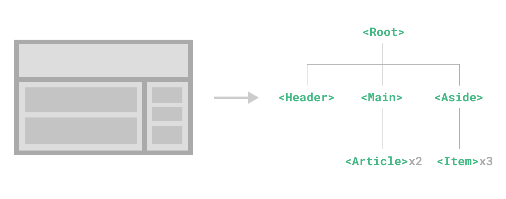

# INDEX

- [INDEX](#index)
  - [Vue](#vue)
    - [How it works?](#how-it-works)
      - [Reactivity and Proxies](#reactivity-and-proxies)
        - [Proxies Summary](#proxies-summary)
      - [Virtual DOM](#virtual-dom)
    - [Ways of Using Vue](#ways-of-using-vue)
  - [Instance LifeCycle](#instance-lifecycle)
    - [mounted](#mounted)
    - [LifeCycle Notes](#lifecycle-notes)
  - [Data](#data)
    - [Interpolation](#interpolation)
    - [Directives](#directives)
      - [Binding data (`v-bind`)](#binding-data-v-bind)
    - [v-model (2 Way Binding)](#v-model-2-way-binding)
      - [2 way binding for elements in a child-component or custom element component](#2-way-binding-for-elements-in-a-child-component-or-custom-element-component)
      - [Modifiers](#modifiers)
    - [Refs](#refs)
      - [Accessing the Refs](#accessing-the-refs)
    - [ref vs v-model](#ref-vs-v-model)
  - [Methods](#methods)
    - [Listening to Events](#listening-to-events)
      - [Accessing Event Argument](#accessing-event-argument)
  - [Computed Properties](#computed-properties)
    - [Computed properties vs methods](#computed-properties-vs-methods)
    - [Filters (old and deprecated)](#filters-old-and-deprecated)
  - [Watchers](#watchers)
  - [Styles](#styles)
    - [Dynamic styling](#dynamic-styling)
    - [Scoped styling](#scoped-styling)
    - [Vue Transitions \& Animations](#vue-transitions--animations)
      - [Transition vs animation](#transition-vs-animation)
      - [Vue Transition Classes](#vue-transition-classes)
      - [Transition modes](#transition-modes)
      - [Animating with JavaScript Hooks](#animating-with-javascript-hooks)
  - [Rendering Conditional Content \& List-items](#rendering-conditional-content--list-items)
    - [Conditional](#conditional)
      - [Dynamic Components](#dynamic-components)
        - [Keep-alive](#keep-alive)
    - [List-items (looping)](#list-items-looping)
      - [List item key](#list-item-key)
  - [Components](#components)
    - [Single File Component (SFC)](#single-file-component-sfc)
    - [Component Registration (Global / Local)](#component-registration-global--local)
      - [Global Registration](#global-registration)
      - [Local Registration](#local-registration)
  - [Communicate between Components](#communicate-between-components)
    - [Props](#props)
      - [Mutating Object / Array Props](#mutating-object--array-props)
    - [Component Events (Event emitter)](#component-events-event-emitter)
      - [`model-value` event: using `v-model` with custom components](#model-value-event-using-v-model-with-custom-components)
    - [Provide / Inject](#provide--inject)
      - [Provide](#provide)
      - [Inject](#inject)
  - [Slots](#slots)
    - [named-slots](#named-slots)
    - [slot props (scoped slots)](#slot-props-scoped-slots)
  - [Forms](#forms)
    - [Form Validation](#form-validation)
  - [Modes and Environment Variables](#modes-and-environment-variables)
    - [Modes](#modes)
    - [Environment Variables](#environment-variables)
  - [Performance](#performance)
    - [Loading data](#loading-data)
    - [Code Splitting - Lazy Loading](#code-splitting---lazy-loading)
      - [Webpack Chunks](#webpack-chunks)
  - [PWA](#pwa)
  - [Plugins](#plugins)
    - [Installing a plugin](#installing-a-plugin)
  - [Notes](#notes)

---

## Vue

It's a JavaScript framework for building user interfaces. It builds on top of standard HTML, CSS and JavaScript, and provides a **declarative and component-based programming model** that helps you efficiently develop user interfaces, be it simple or complex.

> **Framework**: is a third-party library that exposes utility-functionalities and a (set of rules) on how to build your Javascript application

- Comparison with other Frameworks:
  - Vue is neutral-Opinionated:
    - Vue has tools-ecosystem like for `routing`, `testing`, ... that are built by the Vue-team, but unlike `Angular`, Vue doesn't force you to use them even thought they're recommended
      
- Advantages of Vue:
  - **clean** -> (separation of concerns)
  - **semantic** -> able to write semantic HTML
  - **declarative**
  - **easy to maintain**
  - **reactive** -> responding to changes in a state
- You should always create an app and specify where the app applies its logic

  ```html
  <script src="https://unpkg.com/vue@3"></script>

  <div id="app">{{ message }}</div>

  <script>
    const { createApp } = Vue;
    const app = createApp(); // instantiation using (construction function)

    app({
      data() {
        return {
          message: 'Hello Vue!'
        };
      }
    });

    app.mount('#app'); // we use ID-selector as every Vue app must be connected to one HTML element
  </script>
  ```

---

### How it works?

#### Reactivity and Proxies

- Javascript in default is not reactive
- Vue has a built-in mechanism to be aware when a `data-property` or a `variable` is changed, so that parts of the app that rely on that variable can be updated, and for that it uses **"Proxies"**
- It uses **Proxy** which uses `set` method to update properties
- > **Proxy**: a figure that can be used to represent the value of something in a calculation (usually by creating a **setter**)

  

- **How proxy works?** -> it's for reactivity
  
  
  - It's done using (**track** all properties that are changing) and (**trigger** function that would update new things accordingly)

```js
const data = {
  message: 'Hello!'
};

// this object can set-up "traps" which proxies support
const handler = {
  set(target, key, value) {
    console.log(target); // object details before changing its property
    console.log(key); // object-key that was changed(set)
    console.log(value); // new object-value for the key that was changed
  };
}:

// instantiating the Proxy class with data-object + handler object
const proxy  = new Proxy(data, handler);

// we can now access/set the message from the proxy which will trigger the "set" method
proxy.message = 'Hola';
```

##### Proxies Summary

- what Vue does is: it keeps track of all your data-properties here(the proxy) and whenever such a property changes, it updates the part of your app where that property was used.
- it does that by wrapping your properties with proxies so that it has a chance of finding out when you're setting a new value

---

#### Virtual DOM


- This step is done after reactivity and changing values
- It's done in the **memory**

---

### Ways of Using Vue

- Standalone Script (`CDN`)
- Single-Page Application (`SPA`)
  - Some applications require rich interactivity, deep session depth, and non-trivial stateful logic on the frontend. The best way to build such applications is to use an architecture where Vue not only controls the entire page, but also handles data updates and navigation without having to reload the page. This type of application is typically referred to as a Single-Page Application (SPA).
- Fullstack / SSR
  - Pure client-side SPAs are problematic when the app is sensitive to SEO and time-to-content. This is because the browser will receive a largely empty HTML page, and has to wait until the JavaScript is loaded before rendering anything.
  - This means we can pre-render an entire application into HTML and serve them as static files. This improves site performance and makes deployment a lot simpler since we no longer need to dynamically render pages on each request.

---

## Instance LifeCycle


### mounted


### LifeCycle Notes

- when you want to use data in the instance within the `before-..` lifecycle hooks --> for that you **replace `this` with `vm`**

---

## Data

### Interpolation

> **Data binding**: The task of keeping data synchronized between the two

- The most basic form of **data binding** is text interpolation using the **"Mustache" syntax** (double curly braces):

  ```html
  <span>Message: {{ msg }}</span>
  ```

- another alternative way is to use `v-text` directive:

  ```html
  <span v-text="msg"></span>
  ```

  - it's not usually used, but we may use it if we only have access to change attributes or something and not able to insert something inside the element

---

### Directives

A directive is a template-token that tells Vue how we want to handle our DOM.P
It's used to tell vue to set the value of an html-attribute


```html
<!-- Examples -->
<p v-if="condition"></p>
<button v-on:click="handleClick">Click Me</button>
<a v-bind:href="varLink">link</a>
```

---

#### Binding data (`v-bind`)

Dynamically bind one or more attributes, or a component prop to an expression (tells `Vue` to set value from something).

- Shorthand: `:` or `.` (when using `.prop` modifier)

```html
<a v-bind:href="varLink">link</a>
<!-- OR -->
<a :href="varLink">link</a>
```

---

### v-model (2 Way Binding)

Vue **v-model** is a directive. It tells Vue that we want to create a two-way data binding (relationship) between a value in our template (usually a **form input**) and a value in our `data` properties, so that we can dynamically update values.

- A common use case for using v-model is when designing forms and inputs. We can use it to have our DOM input elements be able to modify the data in our Vue instance.

  - this is called: **ReActivity**

- **NOTE**: to make adjustment on the binded input, use a [modifier](#modifiers) -> EX:
  - `v-model.trim="name`
  - `v-model.number="rate`

```html
<div>
  <input type="text" v-model="value" />
  <p>Value: {{ value }}</p>
</div>

<script>
  export default {
    data() {
      return {
        value: 'Hello World'
      };
    }
  };
</script>
```

Here it's like we used 2 directives one for `input` element:

- `v-bind:value="value"`
- `v-on:input="setValue"`
  - `e.target.value ...`

---

#### 2 way binding for elements in a child-component or custom element component

Here:

- instead of `v-model=""` we use `:model-value=""`

then pass it to an event emitter to the parent component

---

#### Modifiers

- It is a very common need to call event.`preventDefault()` or event.`stopPropagation()` inside event handlers.
- also it can be used in keyCodes (keyboard) to specify specific key -> `@keyup.enter`
  Instead we use **Event Modifiers** or **modifiers** for inputs


```html
<!-- the submit event will no longer reload the page -->
<form @submit.prevent="onSubmit"></form>
```

---

### Refs

While Vue's declarative rendering model abstracts away most of the direct DOM operations for you, there may still be cases where we need **direct access to the underlying DOM elements**. To achieve this, we can use the special `ref` attribute:

```html
<input ref="input" />
```

**ref** is a special attribute, similar to the **key** attribute discussed in the `v-for`. It **allows us to obtain a direct reference to a specific DOM element (Access DOM elements Directly)** or child component instance after it's mounted. This may be useful when you want to, for example, programmatically focus an input on component mount, or initialize a 3rd party library on an element.

#### Accessing the Refs

```html
<script>
  export default {
    mounted() {
      this.$refs.input.focus();
    }
  };
</script>

<template>
  <input ref="input" />
</template>
```

---

### ref vs v-model


- **ref**

  - when you need to access the element from code
  - it changes the DOM and not the vue-instance
  - in ref -> you get the value from input as a **string**

- **v-model**
  - when you need to associate data with the element content
  - in v-model -> you get the value from input as a **its type**

Note from **stackoverflow**:

> Directly accessing component instances/DOM nodes (through refs, in this case) should always be a last resort, because you're explicitly sidestepping the framework and potentially making massive headaches for yourself in the process. That is to say, anything that you can use the framework to do (e.g. using v-model for two-way bindings), you should.

---

## Methods


> Don't use **Arrow-functions** as methods as it will miss-up the binding that vue makes using **"this"** keyword. Instead use ES6-methods

- **computed properties** can never be **asynchronous** as you expect value to be returned from them, UNLIKE **watchers** which are made for async actions without returning anything

---

### Listening to Events

**`v-on:<event-name>`** directive, which we use its shortcut: **"@"** symbol,

- It's used to **bind events**
- To listen to DOM events and run some JavaScript when they're triggered. The usage would be `v-on:click="handlerFunction"` or with the shortcut, `@click="handlerFunction"`.
- you can have **multiple bindings**:

  ```html
  <div
    v-on="
      mousedown: func1,
      mouseup: func2
    "
  ></div>

  <!-- OR -->
  <div
    @="
      mousedown: func1,
      mouseup: func2
    "
  ></div>
  ```

#### Accessing Event Argument

> When you add event-listener and then point at a function that should be executed (when that event occurs), that function will automatically get one argument, the browser will ensure that this argument is provided, and that will be an **object describing the event that occurred**

To Access event object

- in the element (**inline**) -> `$event`
- in the methods (**external**) -> `event`

> Best Practice: use **$event**

- using `$event` special variable

  ```html
  <!-- we pass "$event as the first argument" -->
  <button @click="warn('Form cannot be submitted yet.', $event)">Submit</button>
  ```

- using inline arrow function

  ```html
  <button @click="(event) => warn('Form cannot be submitted yet.', event)">Submit</button>
  ```

```js
methods: {
  warn(event, message) {
    // now we have access to the native event
    if (event) {
      event.preventDefault() // handle submitting the form manually instead of reloading
    }
    console.log(event.target); // access data about the event
    alert(message)
  }
}
```

- **Note**: when dealing with form and want to prevent default when submitting: it's better to use [Modifiers](#modifiers)

---

## Computed Properties

In-template expressions are very convenient, but they are meant for simple operations. Putting too much logic in your templates can make them bloated and hard to maintain.

- For complex logic that includes reactive data, it is recommended to use a computed property.
- > **Note**: Vue re-execute any method that you're using anywhere in your `HTML` code (between `{{}}` or with the `bind` or with the HTML-on-events) whenever anything on the screen changes(re-render), even if the method is not using the changed-value, as Vue doesn't know if this method change the value or not
  - > That's why **methods** aren't the best solution for computing some dynamically calculated value.
- Also for expensive logic we use computed-property as it caches the function so that it won't be created each time **UNLESS THE VARIABLES INSIDE IT CHANGED**

- It's used when you have dependent data (Vue is aware of the dependencies in the `computed property/function`)
  - Use it for outputting data, as it only re calculate tne function if any dependency inside it changed
- it has to `return` a value
- It prevents us from writing **Imperative code**
- in `HTML`, it's used in `{{}}` or in `v-for` like normal properties and not in the place of **methods**

```js
export default {
  data() {
    return {
      author: {
        name: "John Doe",
        books: [
          "Vue 2 - Advanced Guide",
          "Vue 3 - Basic Guide",
          "Vue 4 - The Mystery",
        ],
      },
    };
  },
  computed: {
    // a computed getter
    publishedBooksMessage() {
      // `this` points to the component instance
      return this.author.books.length > 0 ? "Yes" : "No";
    },
  },
};

<p>Has published books:</p>
// here it's called without ()
<span>{{ publishedBooksMessage }}</span>
```

> **You can use it with dynamic-classes or styles**

---

### Computed properties vs methods


---

### Filters (old and deprecated)

Vue allows you to define filters that can be used to apply common text formatting.

- Filters are usable in two places: **mustache interpolations** and `v-bind` expressions. Filters should be appended to the end of the JavaScript expression, denoted by the **“pipe” ( `|` )** symbol:

  ```html
  <!-- in mustaches -->
  {{ message | capitalize }}

  <!-- in v-bind -->
  <div v-bind:id="rawId | formatId"></div>
  ```


- It's now replaced with **Computed Properties** in Vue3

---

## Watchers

`Computed properties` allow us to declaratively compute derived values. However, there are cases where we need to perform **"side effects"** (watching something and reacting by changing another thing) in reaction to specific-state changes - for example, mutating the DOM, or changing another piece of state based on the result of an async operation.

- usually when the computed property depends on more than one thing
- (Good for Asynchronous updates) as when you want to do something when condition happens or promise fulfilled
- Note -> the watcher will be named like the watched property (`data-item` or `computed property`)
- here we don't `return` something as we don't use `watchers` anywhere in our HTML template
- it can take 2 arguments:
  
  1. new value
  2. old value

> With Options API, we can use the watch option to trigger a function whenever a **reactive property** changes

```js
export default {
  data() {
    return {
      question: "",
      answer: "Questions usually contain a question mark. ;-)",
    };
  },
  watch: {
    // whenever question changes, this function will run
    question(newQuestion, oldQuestion) {
      if (newQuestion.indexOf("?") > -1) {
        this.getAnswer();
      }
    },
  },
  methods: {
    async getAnswer() {
      this.answer = "Thinking...";
      try {
        const res = await fetch("https://yesno.wtf/api");
        this.answer = (await res.json()).answer;
      } catch (error) {
        this.answer = "Error! Could not reach the API. " + error;
      }
    },
  },
};

<p>
  Ask a yes/no question:
  <input v-model="question" />
</p>
<p>{{ answer }}</p>
```

---

## Styles

### Dynamic styling

here we use

- `v-bind:style` or `:style`
- `v-bind:class` or `:class` --> you can use computed properties with it
- in the style object,
  - you can write the css-property-name in 2 ways:
    1. a normal way but in a single quotes
    2. or in a **camelCase** without quotes (recommended)
  - the css-property-value is always in quotes

```html
<div :style="{borderColor: isSelected ? 'red' : 'blue'}"></div>
<!-- OR -->
<div :style="{'border-color': isSelected ? 'red' : 'blue'}"></div>

<div :class="isActive ? 'active' : ''"></div>
<!-- Or -->
<div :class="{ active: isActive }"></div>
<!-- if you want to use class-name from a variable (Dynamic object property) -->
<div :class="{ new: item.new, [rowClasses[index]]: true }"></div>
```

- To add multiple (`dynamic` + `fixed`) classes together:

  ```html
  <div :class="['fixed-class', { active: isActive }]"></div>
  <!-- OR -->
  <div class="fixed-class" :class="{ active: isActive }"></div>
  ```

> **Note:** It's a good practice to make the dynamic-style-object as a `computed property` to prevent crowding the HTML template

---

### Scoped styling

It's to make the styles scoped to its component

`<styles scoped>`

- it's done by giving the elements that has applied styles/selectors you write a (special attributes like: `data-v-9a9f6144`) to ensure that this styling is scoped to that HTML-element markup
- without it, any style you write in any component will be available for all components in the app and may result in styling conflicts

---

### Vue Transitions & Animations

`<Transition>` is a built-in component: this means it is available in any component's template without having to register it. It can be **used to apply enter and leave animations** on elements or components passed to it via its default slot.

- `<Transition>` must contain only one element inside of it
- another alternative is to use **binded-classes**:

```html
<div :class="[isShowing ? blurClass : '', bkClass]"></div>
```

> You can also use Native CSS animations: (transitions, animation)

---

#### Transition vs animation


---

#### Vue Transition Classes

> They focus on when element is **displayed conditionally**


- There are six classes applied for enter / leave transitions:

  - `v-enter-from`
  - `v-enter-active`
  - `v-enter-to`
  - `v-leave-from`
  - `v-leave-active`
  - `v-leave-to`

- `v-enter-active` and `v-leave-active` give us the ability to specify different easing curves for enter / leave transitions, which we'll see an example of in the following sections.

> Vue analyzes the css code for these classes and reads the durations of the animations/transitions and will remove the elements from the DOM once that duration is over, with these special-css-classes and the `transition` component, Vue will be able to tell if an animation is happening and how long the animation takes

- EX:

  ```html
  <template>
    <button @click="show = !show">Toggle</button>
    <!-- TRansition component -->
    <Transition>
      <p v-if="show">hello</p>
    </Transition>
  </template>

  <style>
    .v-enter-active,
    .v-leave-active {
      transition: opacity 0.5s ease;
    }

    .v-enter-from,
    .v-leave-to {
      opacity: 0;
    }
  </style>
  ```

- You can use "Named Transitions" when having multiple different `<transition>` components
- You can mix these classes with **Native CSS animations**:

  ```css
  .bounce-enter-active {
    animation: bounce-in 0.5s;
  }
  .bounce-leave-active {
    animation: bounce-in 0.5s reverse;
  }
  @keyframes bounce-in {
    0% {
      transform: scale(0);
    }
    50% {
      transform: scale(1.25);
    }
    100% {
      transform: scale(1);
    }
  }
  ```

- or:
  

---

#### Transition modes

the entering and leaving of **multiple elements** that are **animated at the same time** may conflict, and we may have to make them `position: absolute` to avoid the layout issue when both elements are present in the DOM. in some cases this isn't an option, or simply isn't the desired behavior.

- We may want the leaving element to be animated out first, and for the entering element to only be inserted after the leaving animation has finished.
- we can enable this behavior by passing `<Transition>` a **"mode"** prop:
  - `in-out`-> The current element waits until the new element is done transitioning-in to fire
  - `out-in`-> The current element transitions-out and then the new element transitions-in

```HTML
<Transition mode="out-in">
  <div v-if="condition"></div>
  <div v-else"></div>
</Transition>
```

> `<Transition>` also supports `mode="in-out"`, although it's much less frequently used.
>
> `<Transition>` can also be used around **dynamic components**

---

#### Animating with JavaScript Hooks

It makes animation more free unlike in `css`, as Javascript allows for more handles than CSS


- if you will use it, you have to disable **css-binding**:

> The methods are from [GSAP - GreenSock](https://greensock.com/gsap/)

---

## Rendering Conditional Content & List-items


### Conditional

Here we can use

- `v-if=""` & `v-else`
- v-show


- Which to use?
  - `v-if`: if the element will appear/disappear **occasionally/rarely** from the page
  - `v-show`: if the element will **constantly** appear/disappear from the page
    - it show/hide elements with **`CSS`**

---

#### Dynamic Components

Sometimes, it's useful to dynamically switch between components, like in a **tabbed interface**(tabs):

- it's used with `<component></component>` tag

- instead of using multiple

  ```html
  <comp1>v-if="currentComponent === comp1"</comp1>
  <comp2>v-if="currentComponent === comp2"</comp2>
  <comp3>v-if="currentComponent === comp3"</comp3>
  ```

- use this:

  ```html
  <!-- Component changes when (currentTab property) changes -->
  <component :is="currentComponent"></component>

  <button @click="selected = 'comp1'"></button>
  <button @click="selected = 'comp2'"></button>
  ```

##### Keep-alive

When switching between multiple components with `<component :is="...">`, a component will be **unmounted(destroyed)** when it is switched away from. We can force the inactive components to stay "alive" with the built-in `<KeepAlive>` component.

**`KeepAlive` / `keep-alive`** is a built-in component that allows us to conditionally **cache** component instances when dynamically switching between multiple components. which:

1. saves performance of mounting/unmounting
2. keep whatever change we did in the component like wrote text in `input` but didn't finish

```html
<!-- Inactive components will be cached! -->
<KeepAlive>
  <component :is="activeComponent" />
</KeepAlive>
```

`Tabs` example:


---

---

### List-items (looping)

```html
<li v-for="goal in goals" :key="goal.id">{{goal.name}}</li>
<li v-for="(goal,i) in goals" :key="goal.id">{{goal.name}} and index is {{i}}</li>
```

- it can also be used with (`objects` and range of numbers) instead of `arrays`

  ```html
  <li v-for="num in 5" :key="num">{{num}}</li>
  ```

#### List item key

- **`Key`**: needs to be unique, It's what Vue uses to **track the VDOM changes**
- when we delete an item from a list(`<li>`) in vue, Vue doesn't re-render the entire list elements, instead it just moves the content of the lists to the first list-DOM-element and other list items after that
  - this way Vue re-uses Dom-elements instead of re-render them for performance
  - so we need to give each list element in a loop a unique **key**

---

## Components

Components allow us to split the UI into independent and reusable pieces, and think about each piece in isolation. It's common for an app to be organized into a tree of nested components



- They're collection of elements that are encapsulated into a group that can be accessed through one single element
- When using a `build` step, we typically define each Vue component in a dedicated file using the `.vue` extension - known as a Single-File Component (**SFC**)

  ```html
  <script>
    export default {
      data() {
        return {
          count: 0
        };
      }
    };
  </script>

  <template>
    <button @click="count++">You clicked me {{ count }} times.</button>
  </template>
  ```

- When not using a `build` step, a Vue component can be defined as a plain JavaScript **object** containing Vue-specific options

  - > you can use named exports to export multiple components from the same file.

  ```js
  export default {
    data() {
      return {
        count: 0
      };
    },
    template: `
      <button @click="count++">
        You clicked me {{ count }} times.
      </button>`
  };
  ```

- Using a Component:
  - To use a child component, we need to import it in the parent component, then To expose the imported component to our template, we need to **register** it with the `components` option. The component will then be available as a tag using the key it is registered under.
  - each one maintains its own, separate **state**. That's because each time you use a component, a new **instance** of it is created.
  - we use **PascalCase** names when registering components
    - `<PascalCase />` makes it more obvious that this is a Vue component instead of a native HTML element in templates or a custom web-component
  - Vue supports resolving **kebab-case** tags to components registered using **PascalCase**. This means a component registered as MyComponent can be referenced in the template via both `<MyComponent>` and `<my-component>`.

---

### Single File Component (SFC)

- **SFC** is a defining feature of Vue as a framework, and is the recommended approach for using Vue in the following scenarios:
  - `Single-Page Applications (SPA)`
  - `Static Site Generation (SSG)`
- How It Works
  - Vue `SFC` is a framework-specific file format and must be pre-compiled by `@vue/compiler-sfc` into standard JavaScript and CSS. A compiled SFC is a standard JavaScript (ES) module - which means with proper build setup you can import an SFC like a `module`
  - `<style>` tags inside SFCs are typically injected as native `<style>` tags during development **to support hot updates**. For production they can be extracted and merged into a single CSS file.
- What About Separation of Concerns? - which `HTML`/`CSS`/`JS` were supposed to separate!
  - To answer this question, it is important for us to agree that separation of concerns is not equal to the separation of file types. The ultimate goal of engineering principles is to improve the maintainability of codebase.
  - instead of dividing the codebase into three huge layers that interweave with one another, it makes much more sense to divide them into loosely-coupled components and compose them. Inside a component, its template, logic, and styles are inherently coupled, and collocating them actually makes the component more cohesive and maintainable.

> More info on SFC [here](https://vuejs.org/api/sfc-spec.html)

---

### Component Registration (Global / Local)

A Vue component needs to be "registered" so that Vue knows where to locate its implementation when it is encountered in a template. There are two ways to register components: **global** and **local**.

#### Global Registration

- We can make components available globally in the entire current Vue application without importing each time using the `app.component()` method:

  ```js
  // in main.js
  import { createApp } from 'vue';
  import MyComponent from './App.vue'

  const app = createApp({});

  // arguments: (name-registered-that-will-be-used, the-actual-component)
  app.component(
    // the registered name
    'MyComponent', MyComponent
  );
  ```

- The `app.component()` method can be chained:

  ```js
  app
    .component('ComponentA', ComponentA)
    .component('ComponentB', ComponentB)
    .component('ComponentC', ComponentC)

  ```

- this has some downsides:
  - Global registration prevents build systems from removing unused components (a.k.a **"tree-shaking"**). If you globally register a component but end up not using it anywhere in your app, it will still be included in the final bundle.
    - also Vue needs to load them all when the application is loaded initially and the `browser` needs to download the code for all those components initially
  - also this will crowd the `main.js` file with all the registering components code
  - Global registration makes dependency relationships less explicit in large applications. It makes it difficult to locate a child component's implementation from a parent component using it.
  - > To solve this, we register these components locally, where they are used.

#### Local Registration

Local registration scopes the availability of the registered components to the current component only. It makes the dependency relationship more explicit, and is more tree-shaking friendly.

```html
<script>
import ComponentA from './ComponentA.vue'

export default {
  // the key will be the registered name of the component, and the value will contain the implementation of the component.
  components: {
    ComponentA
  }
}
</script>

<template>
  <ComponentA />
</template>
```

> **Note** that locally registered components are not also available in descendant components. In this case, ComponentA will be made available to the current component only, not any of its child or descendant components.

---

## Communicate between Components

[Guide](https://dev.to/sanchithasr/how-to-communicate-between-components-in-vue-js-kjc)

1. Using **Props** (Parent to Child Communication)
2. Using **Events-emitter** (Child to Parent Communication)
3. Using **Event Bus** (Communication between any components)
4. Using **provide/inject** (Parent to Child Communication)
5. Using **this.$refs** (Parent to Child Communication)

---

### Props

> Props always always pass data **Down** from parent to child, as we want a single source of truth of "who owns the state" + we want "one way data-flow"
>
> - this is called: **"props down .. events up"**
> - So this is why we can't modify the prop value in the `child component` as it violate the `"one directional data-flow"` patterns

- You should write props in **camelCase** but if you wrote it in **kebab case** -> Vue will transfer it to camelCase when you use it in the child component


- Props are defined in the **child component** using the `props` option in **2 ways** as:

  - an **array** in the simplest form

    ```js
    props: ["title"],
    ```

  - an **object** with multiple properties for each prop (`type`, `required`?, `default`, ..)

    ```js
    props: {
        title: String
        price: {
          type: Number,
          default: 100,
          required:true
          },
      },
    ```

    - usually for **Prop Validation**
      - Components can specify requirements for their props, such as the types you've already seen. If a requirement is not met, Vue will warn you in the browser's JavaScript console.
    - **default value**: if the `default` value is an `object` or `array`; then we need the default-value to be returned from a function

      ```js
      // Object with a default value
          propE: {
            type: Object,
            // Object or array defaults must be returned from
            // a factory function. The function receives the raw
            // props received by the component as the argument.
            default(rawProps) {
              return { message: 'hello' }
            }
          },
      ```

      - default value for props can also be primitive value
      - The **Boolean** absent props will be cast to false. You can change this by setting a default for it — i.e.: default: `undefined` to behave as a non-Boolean prop.

        ```html
        <!-- equivalent of passing :disabled="true" -->
        <MyComponent disabled />

        <!-- equivalent of passing :disabled="false" -->
        <MyComponent />
        ```

    - **Validating props**:

      - inside it you can't access the component's properties as it hasn't been created yet

      ```js
      props: {
        price: {
          type: Number,
          default: 100,
          required:true,
          validator: propValue => {
          return propValue < 1200;
            },
            // or
          validator(propValue) {
          return propValue < 1200;
            }
           }
        },
      ```

- In the **parent component**:

  - if you want to pass a prop of any type other than `string` like **Boolean** -> you must write it with `v-bind:` or `:`

    ```html
    <ButtonCounter :isEnabled="true" />
    ```

    ```html
    <!-- in the child: BlogPost.vue -->
    <script>
      export default {
        props: ['title']
      };
    </script>

    <template>
      <h4>{{ title }}</h4>
    </template>

    <!-- In parent -->
    <BlogPost title="My journey with Vue" />
    <!-- Or using message-property -->
    <BlogPost :title="message" />
    ```

---

#### Mutating Object / Array Props

When objects and arrays are passed as props, while the child component cannot mutate the prop binding, it will be able to mutate the object or array's nested properties. This is because in JavaScript **objects and arrays are passed by reference**, and it is unreasonably expensive for Vue to prevent such mutations.

- The main drawback of such mutations is that it allows the child component to affect parent state in a way that isn't obvious to the parent component, potentially making it more difficult to reason about the data flow in the future. As a best practice, you should avoid such mutations unless the parent and child are tightly coupled by design.
  - In most cases, the child should **emit an event** to let the parent perform the mutation.
  - > or you can avoid mutating state by duplicating the object/array and returning the new one after mutating it without affecting the original one

---

### Component Events (Event emitter)

- A component can emit custom events directly in template expressions (e.g. in a `v-on` handler) using the built-in `$emit` method
  - The `$emit()` method is also available on the component instance as `this.$emit()`
- the first argument to `$emit` is the event-name. The follow-up arguments represent the data that we would like to pass up
- when declaring events emitted from a component, Similar to prop type validation, an emitted event can be **validated** if it is defined with the **object syntax** instead of the array syntax.

- Inline

  ```html
  <button @click="$emit('someEvent')">click me</button>
  ```

- external

  ```js
  // Emitted events can be explicitly declared on the component via the "emits" option
  emits: ['submit'], // You can also use an object of emits instead of an array, which allows us to perform runtime validation of the payload of the emitted events

  methods: {
    submit() {
      this.$emit('methodName_usedIn_parentComponent',emitted_value) //payload
    }
  },
  ```

- in parent component:

  ```html
  <child-component @eventName_usedIn_parentComponent="handling_method" />
  ```

> **Notes**:
>
> - we create an **`emits`** array/object for "documentation", so that when other developer enters the component, he knows that this component emits events.
> - Unlike native DOM events, component emitted events do not **bubble**. You can only listen to the events emitted by a direct child component. If there is a need to communicate between sibling or deeply nested components, use an external event bus

---

#### `model-value` event: using `v-model` with custom components

it's for using the directive `v-model` on custom input components other than the native `input` elements

> By default, `v-model` on a component uses `modelValue` as the prop and `update:modelValue` as the event. We can modify these names passing an argument to `v-model`

- it works by using `v-model` on the custom-component and then it will be applied as a `prop` + `event-emitter` with the name of `"model-view"` automatically

[guide](https://vuejs.org/guide/components/events.html#usage-with-v-model)

> Video 10 - part 14


```html
<CustomInput :modelValue="searchText" @update:modelValue="newValue => searchText = newValue" />
```

Custom events can also be used to create custom inputs that work with **v-model**.

- For this to actually work though, the `<input>` inside the component must:

  - Bind the value attribute to the **modelValue** prop
  - On input, emit an **update:modelValue** event with the new value

  ```vue
  <!-- CustomInput.vue  (child component) -->
  <script>
  export default {
    props: ['modelValue'],
    emits: ['update:modelValue']
  };
  </script>

  <template>
    <input :value="modelValue" @input="$emit('update:modelValue', $event.target.value)" />
  </template>
  ```

- And now in the parent component we use this:

  ```html
  <!-- in parent component -->
  <!-- instead of this -->
  <CustomInput :modelValue="searchText" @update:modelValue="newValue => searchText = newValue" />

  <!-- use this -->
  <CustomInput v-model="searchText" />
  ```

---

### Provide / Inject

They can be used instead of passing props, or emitting events(different implementation)

#### Provide

it's like **context**: it prevents props-drilling


```js
// in the upper component
export default {
  provide: {
    message: 'hello!'
  }
};
```

**Note**: If we need to provide per-instance dynamic/state property, for example data declared via the `data()`, then provide must use a function value:

```js
export default {
  data() {
    return {
      message: 'hello!'
    };
  },

  provide() {
    // use function syntax so that we can access `this`
    return {
      message: this.message
    };
  }
};
```

- In addition to providing data in a component, we can also provide at the app level:

  ```js
  import { createApp } from 'vue';

  const app = createApp({});

  // EX: app.provide(key, value);
  app.provide(message, 'hello!');
  ```

#### Inject

Injections are resolved **before** the component's own state, so you can access injected properties in data():

- injection must be in a `child-relationship` component to the component that `provide` and can't be between neighbors components

```js
// in the lower component
export default {
  inject: ['message'],

  data() {
    return {
      // initial data based on injected value
      fullMessage: this.message
    };
  }
};
```

---

## Slots

It's like `children` in react

> It allow parent-component to inject (dynamic-HTML-content) that can be received and rendered inside a child component

The `<slot>` element is a slot outlet that indicates where the parent-provided slot content should be rendered.


```html
<div>
  <slot></slot>
</div>
```

> **Notes**:
>
> - what is inside the slot will be the default value
>   
> - the scoped styles will affect the HTML markup in the child component as what in the slots is passed to the child component as a `HTML markup` and the data/properties/methods are not passed, so they won't be accessible in the child component

---

### named-slots

> **IT HAS TO BE ON A `<template>` TAGS**


```html
<!-- in BaseLayout container -->
<div class="container">
  <header>
    <slot name="header"></slot>
  </header>
  <main>
    <!-- Fallback Content -->
    <slot></slot>
  </main>
  <footer>
    <slot name="footer"></slot>
  </footer>
</div>

<!-- Using It -->
<BaseLayout>
<!-- IT HAS TO BE ON A <template> TAGS -->
  <template v-slot:header>
    <!-- Or -->
  <template #header>
    <!-- content for the header slot -->
  </template>
</BaseLayout>
```

---

### slot props (scoped slots)

It's a way for the child to pass data to a slot when rendering it.


```html
<!-- In Child: MyComponent.vue -->
<div>
  <slot :text="greetingMessage" :count="1"></slot>
</div>
<!--------------------------------------------------->
<!-- In parent -->
<MyComponent v-slot="slotProps">{{ slotProps.text }} {{ slotProps.count }}</MyComponent>
```

---

## Forms

- when creating initial values for input elements in `data()`

  - number -> `null`
  - string -> `""`
  - dropDown-select (only one selection) -> `"one value from the options"`
  - checkboxes (multiple selections), ex: `radio buttons` -> Array `[]`
  - single checkbox ex: `confirm to terms` -> `true/false`

- to use **buttons** in a form to select value, Use `type="button"` in the element

### Form Validation

- **manually**
  - for this you write conditions for the inputs either when finishing typing/selecting or when submitting the form
  - based on these conditions, you can show/hide different labels/modals and also change styles for input elements (ex: change border & text color to `red`)
  - **Tip**: you can use `.lazy` event modifier with large text area so that you don't annoy user when typing
- [VeeValidate](https://vee-validate.logaretm.com/v4/)
  - [VeeValidate2](https://www.section.io/engineering-education/form-validation-in-vue.js-using-veevalidate/)

---

## Modes and Environment Variables

### Modes

> There are three modes:
>
> - **development** is used by vue-cli-service serve
> - **test** is used by vue-cli-service test:unit
> - **production** is used by vue-cli-service build and vue-cli-service test:e2e

### Environment Variables

```sh
.env                # loaded in all cases
.env.local          # loaded in all cases, ignored by git
.env.[mode]         # only loaded in specified mode
.env.[mode].local   # only loaded in specified mode & ignored by git
```

- **Notes**:

  - Don't forget to restart serve if it is currently running.
  - only `NODE_ENV`, `BASE_URL`, and variables that start with **VUE*APP*** will be statically embedded into the client bundle with `webpack.DefinePlugin`. It is to avoid accidentally exposing a private key on the machine that could have the same name.

---

## Performance

### Loading data

To make the page loads with the data already loaded:

- instead of loading the data in the **created()** lifeCycle-hook, use -> **beforeRouteEnter()**
- for that you replace **this** with **vm**

---

### Code Splitting - Lazy Loading

> Usually in **router** file

- **Webpack Chunk**: a file that is separate from the bundle can still be loaded into the bundle

This is used to load components only when the page that contain the components is accessed

> **Lazy**: Don't do work(importing) until necessary

```js
// instead of this:
import a1 from '@/components/a1';
import a2 from '@/components/a2';
import b1 from '@/components/b1';
import b2 from '@/components/b2';

// use this:
const a1 = () => import('@/components/a1');
const a2 = () => import('@/components/a2');
const b1 = () => import('@/components/b1');
const b2 = () => import('@/components/b2');
```

#### Webpack Chunks

Same as above + you can group multiple imports in the same file for webpack

```js
const a1 = () => import(/* webpackChunkName: "file1" */ '@/components/a1');
const a2 = () => import(/* webpackChunkName: "file1" */ '@/components/a2');
```

---

## PWA

[plugin-pwa](https://cli.vuejs.org/core-plugins/pwa.html)

---

## Plugins

Plugins are self-contained code that usually add **app-level functionality** to Vue.

> It creates the configurations and adds the package to the app to use it directly out of the box

### Installing a plugin

```sh
vue add <name of the plugin>
```

---

## Notes

- only `methods` are written as object, but `data` and `lifecycle hooks` are written as `ES6-functions`

- when you want to change a property that is being rendered you should modify it and not create a new property -> to make vue **rerenders** it

  - Ex: array of items: you should use `splice` to remove item instead of using (filter as it will create new array)

- To fix **eslint** error :

  ```js
  // .eslintrc.js
  module.exports = {
    rules: {
      'prettier/prettier': ['error', { endOfLine: 'auto' }],
      'vue/multi-word-component-names': 0
    }
  };
  ```

- when using a **modal** try using [Teleport](https://vuejs.org/guide/built-ins/teleport.html)

  - > `<Teleport>` is a built-in component that allows us to "teleport" a part of a component's template into a DOM node that exists outside the DOM hierarchy of that component.

  ```html
  <teleport to="body"></teleport>
  ```

- in object properties Don't use `function` and use `arrow function` to prevent errors with (**this** keyword)
- In **methods**: don't use `arrow function`

  - this is also in http requests (`.then()`)

- You must mount the app **at last** to be able to use middleware

- **Methods** are functions that can be called as normal JS functions, but **computed properties** will be “re-calculated” anytime some data changes in the component.

- to use multiple classes:

```html
<p :class="["class1","class2","class3"]"></p>
```

- in `jsconfig.json` -> the **src** folder is aliased with `@` symbol

- **Hot Reloading**: is a feature that re-renders the vue app/component when code changes

- **Instances** vs **Components**
  

  - Instances -> Are not reusable (connected to one place in the dom)
  - Components -> reusable

  - Yes, but it's better to use Vuex
  - Vuex state is mutable, hence we can directly create state variables and assign values to them. Redux uses Reducers, which are pure functions that take the previous state and action, and return the next state

- A change to Vue component's data (props or state) isn't immediately reflected in the DOM. Rather, **Vue updates DOM asynchronously**.

  - You can catch the moment when Vue updates DOM using `Vue.nextTick()`
  - A utility for waiting for the **next DOM update flush**.

  ```html
  <script>
    import { nextTick } from 'vue';

    export default {
      data() {
        return {
          count: 0
        };
      },
      methods: {
        async increment() {
          this.count++;

          // DOM not yet updated
          console.log(document.getElementById('counter').textContent); // 0

          await nextTick();
          // DOM is now updated
          console.log(document.getElementById('counter').textContent); // 1
        }
      }
    };
  </script>

  <template>
    <button id="counter" @click="increment">{{ count }}</button>
  </template>
  ```

- `v-once` and `v-pre`:
  

  ```js
  <h1 v-pre>{{ data }}</h1> // outputs -> {{ data }}
  ```

- if you want to access the `data` object, you can use `$data`

  - this is sometimes useful for debugging

- **Templates**:
  - Vue uses HTML-based Template syntax to bind the Vue instance to the DOM, it's used for components
  - Templates are optional, you can write `render functions` with optional **JSX** support
