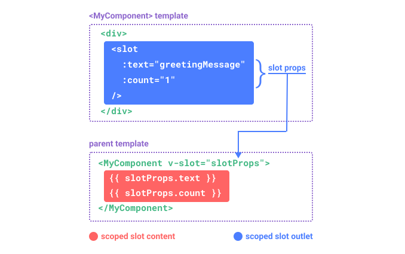
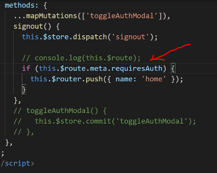

## INDEX

- [INDEX](#index)
- [Vue](#vue)
  - [How it works?](#how-it-works)
  - [Instance LifeCycle](#instance-lifecycle)
    - [mounted](#mounted)
- [Data](#data)
  - [Interpolation](#interpolation)
  - [Directives](#directives)
  - [v-model (2 Way Binding)](#v-model-2-way-binding)
    - [2 way binding for elements in a child-component or custom element component](#2-way-binding-for-elements-in-a-child-component-or-custom-element-component)
  - [Refs](#refs)
    - [Accessing the Refs](#accessing-the-refs)
  - [ref vs v-model](#ref-vs-v-model)
- [Methods](#methods)
  - [Listening to Events](#listening-to-events)
    - [Accessing Event Argument](#accessing-event-argument)
    - [Event Modifiers](#event-modifiers)
  - [Computed Properties](#computed-properties)
  - [Watchers](#watchers)
- [Styling](#styling)
  - [Dynamic styling](#dynamic-styling)
  - [Scoped styling](#scoped-styling)
  - [Transitions](#transitions)
    - [Transition Classes](#transition-classes)
- [Rendering Conditional Content & List-items](#rendering-conditional-content--list-items)
  - [Conditional](#conditional)
  - [List-items](#list-items)
- [Components](#components)
  - [Dynamic Components](#dynamic-components)
  - [Global Components](#global-components)
- [Props](#props)
- [Communicate between Components](#communicate-between-components)
  - [Event emitter](#event-emitter)
    - [using v-model with custom components](#using-v-model-with-custom-components)
    - [model-view](#model-view)
  - [Provide / Inject](#provide--inject)
    - [Provide](#provide)
    - [Inject](#inject)
- [Slots](#slots)
  - [named-slots](#named-slots)
  - [slot-props](#slot-props)
- [Forms](#forms)
  - [Form Validation](#form-validation)
- [Routing](#routing)
  - [Router configuration](#router-configuration)
    - [History](#history)
    - [Nested Routes](#nested-routes)
    - [Dynamic params](#dynamic-params)
  - [route vs router](#route-vs-router)
  - [Navigate from a link: Router-Link](#navigate-from-a-link-router-link)
  - [Navigate programmatically](#navigate-programmatically)
  - [Scroll Behavior (Scroll To Top)](#scroll-behavior-scroll-to-top)
  - [Route Meta Fields](#route-meta-fields)
    - [Using meta for navigation guards](#using-meta-for-navigation-guards)
  - [Navigation Guards](#navigation-guards)
- [Modes and Environment Variables](#modes-and-environment-variables)
  - [Modes](#modes)
  - [Environment Variables](#environment-variables)
- [Performance](#performance)
  - [Loading data](#loading-data)
  - [Code Splitting - Lazy Loading](#code-splitting---lazy-loading)
    - [Webpack Chunks](#webpack-chunks)
- [PWA](#pwa)
- [Plugins](#plugins)
  - [Installing a plugin](#installing-a-plugin)
- [Notes](#notes)

---

## Vue

It's a JavaScript framework for building user interfaces. It builds on top of standard HTML, CSS and JavaScript, and provides a **declarative and component-based programming model** that helps you efficiently develop user interfaces, be it simple or complex.

- You should always create an app and specify where the app applies its logic

```html
<script src="https://unpkg.com/vue@3"></script>

<div id="app">{{ message }}</div>

<script>
  const { createApp } = Vue;
  const app = createApp(); // construction function

  app({
    data() {
      return {
        message: "Hello Vue!",
      };
    },
  });

  app.mount("#app");
</script>
```

---

### How it works?


It uses **Proxy** which uses `set` method to update properties

- **Proxy**: a figure that can be used to represent the value of something in a calculation (usually by creating a **setter**)

  

---

### Instance LifeCycle


#### mounted


---

## Data

### Interpolation

The most basic form of **data binding** is text interpolation using the "Mustache" syntax (double curly braces):

```html
<span>Message: {{ msg }}</span>
```

---

### Directives

A directive is a template token that tells Vue how we want to handle our DOM.

It's used to tell vue to set the value of an html-attribute


```html
<!-- Examples -->
<p v-if="condition"></p>
<button v-on:click="handleClick">Click Me</button>
<a v-bind:href="varLink">link</a>
```

---

### v-model (2 Way Binding)

Vue **v-model** is a directive. It tells Vue that we want to create a two-way data binding between a value in our template and a value in our data properties.

- A common use case for using v-model is when designing forms and inputs. We can use it to have our DOM input elements be able to modify the data in our Vue instance.

  - this is called: **ReActivity**

- **NOTE**: to make adjustment on the binded input -> EX:
  - `v-model.trim="name`
  - `v-model.number="rate`

```html
<div>
  <input type="text" v-model="value" />
  <p>Value: {{ value }}</p>
</div>

<script>
  export default {
    data() {
      return {
        value: "Hello World",
      };
    },
  };
</script>
```

Here it's like we used 2 directives one for `input` element:

- `v-bind:value="value"`
- `v-on:input="setValue"`
  - `e.target.value ...`

---

#### 2 way binding for elements in a child-component or custom element component

Here:

- instead of `v-model=""` we use `:model-value=""`

then pass it to an event emitter to the parent component

---

### Refs

While Vue's declarative rendering model abstracts away most of the direct DOM operations for you, there may still be cases where we need **direct access to the underlying DOM elements**. To achieve this, we can use the special `ref` attribute:

```html
<input ref="input" />
```

**ref** is a special attribute, similar to the **key** attribute discussed in the `v-for`. It **allows us to obtain a direct reference to a specific DOM element (Access DOM elements Directly)** or child component instance after it's mounted. This may be useful when you want to, for example, programmatically focus an input on component mount, or initialize a 3rd party library on an element.

#### Accessing the Refs

```html
<script>
  export default {
    mounted() {
      this.$refs.input.focus();
    },
  };
</script>

<template>
  <input ref="input" />
</template>
```

---

### ref vs v-model


- **ref**

  - when you need to access the element from code
  - it changes the DOM and not the vue-instance
  - in ref -> you get the value from input as a **string**

- **v-model**
  - when you need to associate data with the element content
  - in v-model -> you get the value from input as a **its type**

Note from **stackoverflow**:

> Directly accessing component instances/DOM nodes (through refs, in this case) should always be a last resort, because you're explicitly sidestepping the framework and potentially making massive headaches for yourself in the process. That is to say, anything that you can use the framework to do (e.g. using v-model for two-way bindings), you should.

---

## Methods


> Don't use Arrow-functions as methods as it will miss-up the binding that vue makes. Instead use ES6-methods

- **computed properties** can never be asynchronous as you expect value to be returned from them, UNLIKE **watchers** which are made for async actions without returning anything

---

### Listening to Events

We can use the **v-on** directive, which we typically shorten to the **@** symbol,

- To listen to DOM events and run some JavaScript when they're triggered. The usage would be `v-on:click="handler"` or with the shortcut, `@click="handler"`.

#### Accessing Event Argument

To Access event object

- in the element (**inline**) -> `$event`
- in the methods (**external**) -> `event`

> Best Practice: use **$event**

```html
<!-- using $event special variable -->
<button @click="warn('Form cannot be submitted yet.', $event)">Submit</button>

<!-- using inline arrow function -->
<button @click="(event) => warn('Form cannot be submitted yet.', event)">
  Submit
</button>
```

```js
methods: {
  warn(message, event) {
    // now we have access to the native event
    if (event) {
      event.preventDefault()
    }
    alert(message)
  }
}
```

---

#### Event Modifiers

It is a very common need to call event.`preventDefault()` or event.`stopPropagation()` inside event handlers.
Instead we use **Event Modifiers**

```html
!-- the submit event will no longer reload the page -->
<form @submit.prevent="onSubmit"></form>
```

---

### Computed Properties

In-template expressions are very convenient, but they are meant for simple operations. Putting too much logic in your templates can make them bloated and hard to maintain.

- For complex logic that includes reactive data, it is recommended to use a computed property.
- Also for expensive logic we use computed-property as it caches the function so that it won't be created each time **UNLESS THE VARIABLES INSIDE IT CHANGED**

- It's used when you have dependent data
  - It only re calculate tne function if any dependency inside it changed
- it has to return a value
- It prevents us from writing **Imperative code**

```js
export default {
  data() {
    return {
      author: {
        name: "John Doe",
        books: [
          "Vue 2 - Advanced Guide",
          "Vue 3 - Basic Guide",
          "Vue 4 - The Mystery",
        ],
      },
    };
  },
  computed: {
    // a computed getter
    publishedBooksMessage() {
      // `this` points to the component instance
      return this.author.books.length > 0 ? "Yes" : "No";
    },
  },
};

<p>Has published books:</p>
// here it's called without ()
<span>{{ publishedBooksMessage }}</span>
```

> **You can use it with dynamic-classes or styles**

---

### Watchers

Computed properties allow us to declaratively compute derived values. However, there are cases where we need to perform **"side effects"** in reaction to state changes - for example, mutating the DOM, or changing another piece of state based on the result of an async operation.

With Options API, we can use the watch option to trigger a function whenever a **reactive property** changes:

```js
export default {
  data() {
    return {
      question: "",
      answer: "Questions usually contain a question mark. ;-)",
    };
  },
  watch: {
    // whenever question changes, this function will run
    question(newQuestion, oldQuestion) {
      if (newQuestion.indexOf("?") > -1) {
        this.getAnswer();
      }
    },
  },
  methods: {
    async getAnswer() {
      this.answer = "Thinking...";
      try {
        const res = await fetch("https://yesno.wtf/api");
        this.answer = (await res.json()).answer;
      } catch (error) {
        this.answer = "Error! Could not reach the API. " + error;
      }
    },
  },
};

<p>
  Ask a yes/no question:
  <input v-model="question" />
</p>
<p>{{ answer }}</p>
```

---

## Styling

### Dynamic styling

here we use

- `v-bind:style` or `:style`
- `v-bind:class` or `:class` --> you can use computed properties with it

```html
<div :style="{}"></div>
<div :class="isActive ? 'active' : ''"></div>

<!-- Or -->
<div :class="{ active: isActive }"></div>
<!-- if you want to use class-name from a variable (Dynamic object property) -->
<div :class="{ new: item.new, [rowClasses[index]]: true }"></div>
```

---

### Scoped styling

It's to make the styles scoped to its component

`<styles scoped> `

---

### Transitions

`<Transition>` is a built-in component: this means it is available in any component's template without having to register it. It can be **used to apply enter and leave animations** on elements or components passed to it via its default slot.

- `<Transition>` must contain only one element inside of it

> You can also use Native CSS animations: (transitions, animation)

#### Transition Classes


There are six classes applied for enter / leave transitions:

- `v-enter-from`
- `v-enter-active`
- `v-enter-to`
- `v-leave-from`
- `v-leave-active`
- `v-leave-to`

- `v-enter-active` and `v-leave-active` give us the ability to specify different easing curves for enter / leave transitions, which we'll see an example of in the following sections.

Named Transitions

```html
<template>
  <button @click="show = !show">Toggle</button>
  <Transition>
    <p v-if="show">hello</p>
  </Transition>
</template>

<style>
  .v-enter-active,
  .v-leave-active {
    transition: opacity 0.5s ease;
  }

  .v-enter-from,
  .v-leave-to {
    opacity: 0;
  }
</style>
```

- You can mix these classes with **Native CSS animations**:

  ```css
  .bounce-enter-active {
    animation: bounce-in 0.5s;
  }
  .bounce-leave-active {
    animation: bounce-in 0.5s reverse;
  }
  @keyframes bounce-in {
    0% {
      transform: scale(0);
    }
    50% {
      transform: scale(1.25);
    }
    100% {
      transform: scale(1);
    }
  }
  ```

---

## Rendering Conditional Content & List-items


### Conditional

Here we can use

- `v-if=""` & `v-else`
- v-show


- Which to use?
  - `v-if`: if the element will appear/disappear **occasionally/rarely** from the page
  - `v-show`: if the element will **constantly** appear/disappear from the page

---

### List-items

```html
<li v-for="goal in goals" :key="goal.id">{{goal.name}}</li>
```

---

## Components

```html
<!-- In the child -->
<script>
  export default {
    data() {
      return {
        count: 0,
      };
    },
  };
</script>

<template>
  <button @click="count++">You clicked me {{ count }} times.</button>
</template>

<!-- ----------------------------------------------------------- -->

<!-- In Parent -->
<script>
  import ButtonCounter from "./ButtonCounter.vue";

  export default {
    // Component Registration
    components: {
      ButtonCounter,
    },
  };
</script>

<template>
  <h1>Here is a child component!</h1>
  <ButtonCounter />
</template>
```

---

### Dynamic Components

Sometimes, it's useful to dynamically switch between components, like in a tabbed interface:

- instead of using multiple

  ```html
  <comp1>v-if="currentComponent === comp1"</comp1>
  <comp2>v-if="currentComponent === comp2"</comp2>
  <comp3>v-if="currentComponent === comp3"</comp3>
  ```

- use this:

  ```html
  <!-- Component changes when (currentTab property) changes -->
  <component :is="currentComponent"></component>
  ```

When switching between multiple components with `<component :is="...">`, a component will be **unmounted** when it is switched away from. We can force the inactive components to stay "alive" with the built-in `<KeepAlive>` component.

**KeepAlive** is a built-in component that allows us to conditionally **cache** component instances when dynamically switching between multiple components.

```html
<!-- Inactive components will be cached! -->
<KeepAlive>
  <component :is="activeComponent" />
</KeepAlive>
```

---

### Global Components

To be able to use component inside the entire app without importing each time

```js
// in main.js

// import the component

import { createApp } from "vue";
const app = createApp({ App });

// 2 arguments: (name-registered-that-will-be-used, the-actual-component)
app.component("MyComponent", the_imported_component);
```

---

## Props

You should write props in **camelCase** but if you wrote it in **kebab case** -> Vue will transfer it to camelCase when you use it in the child component

- Props are defined in the **child component** in **2 ways** as:

  - an array in the simplest form

    ```js
    props: ["title"],
    ```

- an object with multiple properties for each prop (`type`, `required`?, `default`, ..)

  ```js
  props: {
      price: {
        type: Number,
        default: 100,
        required:true
        },
    },
  ```

  - **Validating props**:
    - inside it you can't access the component's properties as it hasn't been created yet
    ```js
    props: {
      price: {
        type: Number,
        default: 100,
        required:true,
        validator: propValue => {
        return propValue < 1200;
          },
          // or
        validator(propValue) {
        return propValue < 1200;
          }
         }
      },
    ```

- In the **parent component**:

  - if you want to pass a prop of any type other than `string` like **Boolean** -> you must write it with `v-bind:` or `:`

    ```html
    <ButtonCounter :isEnabled="true" />
    ```

```html
<!-- in the child: BlogPost.vue -->
<script>
  export default {
    props: ["title"],
  };
</script>

<template>
  <h4>{{ title }}</h4>
</template>

<!-- In parent -->
<BlogPost title="My journey with Vue" />
<!-- Or using message-property -->
<BlogPost :title="message" />
```

---

## Communicate between Components

[Guide](https://dev.to/sanchithasr/how-to-communicate-between-components-in-vue-js-kjc)

1. Using **Props** (Parent to Child Communication)
2. Using **Events-emitter** (Child to Parent Communication)
3. Using **Event Bus** (Communication between any components)
4. Using **provide/inject** (Parent to Child Communication)
5. Using **this.$refs** (Parent to Child Communication)

---

### Event emitter


- Inline

  ```html
  <button @click="$emit('someEvent')">click me</button>
  ```

- external

  ```js
  methods: {
    submit() {
      this.$emit('methodName_usedIn_parentComponent',emitted_value) //payload
    }
  },
   emits: ['submit']
  ```

- in parent component:

  ```html
  <child-component @methodName_usedIn_parentComponent="handling_method" />

  <!-- Or handling it (inline) -->
  <!-- in this case to access the payload we use ($event) -->

  <child-component @methodName_usedIn_parentComponent="role=$event" />
  ```

---

#### using v-model with custom components

Custom events can also be used to create custom inputs that work with **v-model**.

For this to actually work though, the `<input>` inside the component must:

- Bind the value attribute to the **modelValue** prop
- On input, emit an **update:modelValue** event with the new value

  ```vue
  <!-- CustomInput.vue  (child component) -->
  <script>
  export default {
    props: ["modelValue"],
    emits: ["update:modelValue"],
  };
  </script>

  <template>
    <input
      :value="modelValue"
      @input="$emit('update:modelValue', $event.target.value)"
    />
  </template>
  ```

- And now in the parent component we use this:

  ```html
  <!-- in parent component -->
  <!-- instead of this -->
  <CustomInput
    :modelValue="searchText"
    @update:modelValue="newValue => searchText = newValue"
  />

  <!-- use this -->
  <CustomInput v-model="searchText" />
  ```

---

#### model-view

[guide](https://vuejs.org/guide/components/events.html#usage-with-v-model)

> Video 10 - part 14


```html
<CustomInput
  :modelValue="searchText"
  @update:modelValue="newValue => searchText = newValue"
/>
```

---

### Provide / Inject

#### Provide

it's like **context**: it prevents props-drilling


```js
// in the upper component
export default {
  provide: {
    message: "hello!",
  },
};
```

**Note**: If we need to provide per-instance state, for example data declared via the `data()`, then provide must use a function value:

```js
export default {
  data() {
    return {
      message: "hello!",
    };
  },
  provide() {
    // use function syntax so that we can access `this`
    return {
      message: this.message,
    };
  },
};
```

- In addition to providing data in a component, we can also provide at the app level:

  ```js
  import { createApp } from "vue";

  const app = createApp({});

  app.provide(/* key */ "message", /* value */ "hello!");
  ```

#### Inject

Injections are resolved **before** the component's own state, so you can access injected properties in data():

```js
// in the lower component
export default {
  inject: ["message"],
  data() {
    return {
      // initial data based on injected value
      fullMessage: this.message,
    };
  },
};
```

---

## Slots

It's like `children` in react

> It allow parent-component to inject (dynamic-HTML-content) that can be rendered inside a child component

The `<slot>` element is a slot outlet that indicates where the parent-provided slot content should be rendered.


```html
<div>
  <slot></slot>
</div>
```

> what is inside the slot will be the default value

---

### named-slots

IT HAS TO BE ON A `<template>` TAGS


```html
<!-- in BaseLayout container -->
<div class="container">
  <header>
    <slot name="header"></slot>
  </header>
  <main>
    <!-- Fallback Content -->
    <slot></slot>
  </main>
  <footer>
    <slot name="footer"></slot>
  </footer>
</div>

<!-- Using It -->
<BaseLayout>
<!-- IT HAS TO BE ON A <template> TAGS -->
  <template v-slot:header>
    <!-- Or -->
  <template #header>
    <!-- content for the header slot -->
  </template>
</BaseLayout>
```

---

### slot-props

It's a way for the child to pass data to a slot when rendering it.


```html
<!-- In Child: MyComponent.vue -->
<div>
  <slot :text="greetingMessage" :count="1"></slot>
</div>
<!--------------------------------------------------->
<!-- In parent -->
<MyComponent v-slot="slotProps">
  {{ slotProps.text }} {{ slotProps.count }}
</MyComponent>
```

---

## Forms

- when creating initial values for input elements

  - number -> `null`
  - string -> `""`
  - select -> `"one value from the options"`
  - multiple check boxes -> `[]`
  - single check box -> `true/false`

- to use **buttons** in a form to select value, Use `type="button"` in the element

### Form Validation

- manually
- [VeeValidate](https://vee-validate.logaretm.com/v4/)
  - [VeeValidate2](https://www.section.io/engineering-education/form-validation-in-vue.js-using-veevalidate/)

---

## Routing

### Router configuration

```js
const router = createRouter({
  history: createWebHistory(), // used to enable history-mode in the browser
  routes: [
    { path: "/", redirect: "/teams" },
    {
      name: "teams",
      path: "/teams",
      meta: { needsAuth: true },
      components: { default: TeamsList, footer: TeamsFooter },
      children: [
        {
          name: "team-members", // without "/"
          path: ":teamId",
          component: TeamMembers,
          props: true, // to tell vue that this component can take the query-parameter as a prop
        }, // /teams/t1
      ],
    }, // our-domain.com/teams => TeamsList
    {
      path: "/users",
      components: {
        default: UsersList,
        footer: UsersFooter,
      },
      // Navigation Guards
      beforeEnter(to, from, next) {
        console.log("users beforeEnter");
        console.log(to, from);
        next();
      },
    },
    { path: "/:notFound(.*)", component: NotFound },
  ],
  linkActiveClass: "active", // changing default class name from vue for active-link
  scrollBehavior(_, _2, savedPosition) {
    if (savedPosition) {
      return savedPosition;
    }
    return { left: 0, top: 0 }; // scroll to top of the page
  },
});

router.beforeEach(function(to, from, next) {
  console.log('Global beforeEach');
  console.log(to, from);
  if (to.meta.needsAuth) {
    console.log('Needs auth!');
    next();
  } else {
    next();
  }

router.afterEach(function(to, from) {
  // sending analytics data
  console.log('Global afterEach');
  console.log(to, from);
});
```

> **Note**: You can use `alias` instead of `redirect`, so that you can have 2 routes that point to the same component
> `alias : "/teams"`

---

#### History

It's used to track the browser history

**history: createWebHistory()**: used to enable history-mode in the browser (instead of hash # mode)

- **history-api**: it lets you interact with the **browseHistory** to change URL without refreshing the page

```js
history: createWebHistory(process.env.BASE_URL);
// BASE_URL="/" // can be modified in vue UI
```

---

#### Nested Routes

```sh
/user/johnny/profile                     /user/johnny/posts
+------------------+                  +-----------------+
| User             |                  | User            |
| +--------------+ |                  | +-------------+ |
| | Profile      | |  +------------>  | | Posts       | |
| |              | |                  | |             | |
| +--------------+ |                  | +-------------+ |
+------------------+                  +-----------------+
```

- **Note**: you must use ` <router-view />` in the parent route to show the place for the nested(child) route
  - it's a global component registered in the `main.js` file

#### Dynamic params

- in routing-options for the route you can use this `props: true` to:
  - tell vue that this component can take the `params/queryParams` as a prop

---

### route vs router

**route** -> store information about where you are (`quereyParams`, `URL`)

**router** -> the tool that allows user to navigate anywhere in the app

---

### Navigate from a link: Router-Link

- By default, Vue sets an active-class (`router-link-active`) on the clicked link -> so we can style it in **CSS** using this class

  - or you can make an **alias** for this class with different name in the router options

    ```js
    routes=[],
    linkExactActiveClass:"text-yellow-500", // replacing the active class with this class
    ```

  - also in the link you can set the active class for this link only using `exact-active-class="no-active"`, (usually with the page logo in the navbar):

    ```js
    <router-link to="/" exact-active-class="no-active"></router-link>
    ```

- `<router-link></router-link>` acts like `<a>` in **css**
- `<router-link>` takes `to` directive instead of href
  - `to="/"` -> for string route
  - `:to="{name : Home}"` for binding route (not string)

---

### Navigate programmatically

```js
// literal string path
this.$router.push("/users/eduardo");

// object with path
this.$router.push({ path: "/users/eduardo" });

// named route with params to let the router build the url --> (params="/:username")
this.$router.push({ name: "user", params: { username: "eduardo" } });

// with query, resulting in /register?plan=private
this.$router.push({ path: "/register", query: { plan: "private" } });

// with hash, resulting in /about#team
this.$router.push({ path: "/about", hash: "#team" });
```

---

### Scroll Behavior (Scroll To Top)

When using client-side routing, we may want to **scroll to top when navigating to a new route**, or **preserve the scrolling position of history entries** just like real page reload does.

- Vue Router allows you to achieve these and even better, **allows you to completely customize the scroll behavior on route navigation**.

```js
scrollBehavior() {
    return { left: 0, top: 0 }; // scroll to top of the page
  },
```

---

### Route Meta Fields

Sometimes, you might want to **attach arbitrary information to routes** like transition names, who can access the route, etc. This can be achieved through the meta property which accepts an object of properties and can be accessed on the route location and navigation guards.

```js
const routes = [
  {
    path: "/posts",
    component: PostsLayout,
    children: [
      {
        path: "new",
        component: PostsNew,
        // only authenticated users can create posts
        meta: { requiresAuth: true },
      },
      {
        path: ":id",
        component: PostsDetail,
        // anybody can read a post
        meta: { requiresAuth: false },
      },
    ],
  },
];
```

#### Using meta for navigation guards

instead of this:


we use this:


---

### Navigation Guards

Here we have **global-guards** & **local-guards** & **Per-Route Guard**

They are used to guard navigations. either by redirecting it or canceling it. There are a number of ways to hook into the route navigation process: globally, per-route, or in-component (locally).

> it can be in the route-object or in the component's script or the router-file outside the route-object

- Global Guards:

  - `beforeEach()`

- In-Component Guards (local guards):

  - `beforeEnter()`

- Per-Route Guard (in routes array):
  - `beforeRouteLeave()`
  - `beforeRouteEnter()`
  - `beforeRouteUpdate()`

```js
// to confirm navigation:
next(); // Or
next(true);

// ---------------------------------- //
// to cancel navigation:
next(false);

// ---------------------------------- //
// to cancel navigation and redirect to another route:
next("/teams");
// Or
if (to.name === "teams") {
  next();
} else {
  next({ name: "teams" });
}
```

---

## Modes and Environment Variables

### Modes

> There are three modes:
>
> - **development** is used by vue-cli-service serve
> - **test** is used by vue-cli-service test:unit
> - **production** is used by vue-cli-service build and vue-cli-service test:e2e

### Environment Variables

```sh
.env                # loaded in all cases
.env.local          # loaded in all cases, ignored by git
.env.[mode]         # only loaded in specified mode
.env.[mode].local   # only loaded in specified mode & ignored by git
```

- **Notes**:

  - Don't forget to restart serve if it is currently running.
  - only `NODE_ENV`, `BASE_URL`, and variables that start with **VUE*APP*** will be statically embedded into the client bundle with `webpack.DefinePlugin`. It is to avoid accidentally exposing a private key on the machine that could have the same name.

---

## Performance

### Loading data

To make the page loads with the data already loaded:

- instead of loading the data in the **created()** lifeCycle-hook, use -> **beforeRouteEnter()**
- for that you replace **this** with **vm**

---

### Code Splitting - Lazy Loading

> Usually in **router** file

- **Webpack Chunk**: a file that is separate from the bundle can still be loaded into the bundle

This is used to load components only when the page that contain the components is accessed

> **Lazy**: Don't do work(importing) until necessary

```js
// instead of this:
import a1 from "@/components/a1";
import a2 from "@/components/a2";
import b1 from "@/components/b1";
import b2 from "@/components/b2";

// use this:
const a1 = () => import("@/components/a1");
const a2 = () => import("@/components/a2");
const b1 = () => import("@/components/b1");
const b2 = () => import("@/components/b2");
```

#### Webpack Chunks

Same as above + you can group multiple imports in the same file for webpack

```js
const a1 = () => import(/* webpackChunkName: "file1" */ "@/components/a1");
const a2 = () => import(/* webpackChunkName: "file1" */ "@/components/a2");
```

---

## PWA

[plugin-pwa](https://cli.vuejs.org/core-plugins/pwa.html)

---

## Plugins

Plugins are self-contained code that usually add **app-level functionality** to Vue.

> It creates the configurations and adds the package to the app to use it directly out of the box

### Installing a plugin

```sh
vue add <name of the plugin>
```

---

## Notes

- when you want to change a property that is being rendered you should modify it and not create a new property -> to make vue **rerenders** it

  - Ex: array of items: you should use `splice` to remove item instead of using (filter as it will create new array)

- To fix **eslint** error :

  ```js
  // .eslintrc.js
  module.exports = {
    rules: {
      "prettier/prettier": ["error", { endOfLine: "auto" }],
      "vue/multi-word-component-names": 0,
    },
  };
  ```

- when using a **modal** try using

  ```html
  <teleport to="body"></teleport>
  ```

- in object properties Don't use `function` and use `arrow function` to prevent errors with (**this** keyword)
- In **methods**: don't use `arrow function`

  - this is also in http requests (`.then()`)

- You must mount the app **at last** to be able to use middleware

- **Methods** are functions that can be called as normal JS functions, but **computed properties** will be “re-calculated” anytime some data changes in the component.

- to use multiple classes:

```html
<p :class="["class1","class2","class3"]"></p>
```

- in `jsconfig.json` -> the **src** folder is aliased with `@` symbol

- **Hot Reloading**: is a feature that re-renders the vue app/component when code changes

- **Instances** vs **Components**
  

  - Instances -> Are not reusable (connected to one place in the dom)
  - Components -> reusable

  - Yes, but it's better to use Vuex
  - Vuex state is mutable, hence we can directly create state variables and assign values to them. Redux uses Reducers, which are pure functions that take the previous state and action, and return the next state

- A change to Vue component's data (props or state) isn't immediately reflected in the DOM. Rather, **Vue updates DOM asynchronously**.

  - You can catch the moment when Vue updates DOM using `Vue.nextTick()`
  - A utility for waiting for the **next DOM update flush**.

  ```html
  <script>
    import { nextTick } from "vue";

    export default {
      data() {
        return {
          count: 0,
        };
      },
      methods: {
        async increment() {
          this.count++;

          // DOM not yet updated
          console.log(document.getElementById("counter").textContent); // 0

          await nextTick();
          // DOM is now updated
          console.log(document.getElementById("counter").textContent); // 1
        },
      },
    };
  </script>

  <template>
    <button id="counter" @click="increment">{{ count }}</button>
  </template>
  ```
