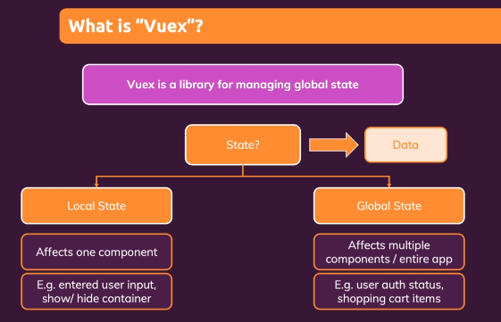
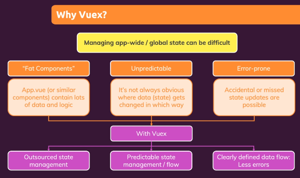
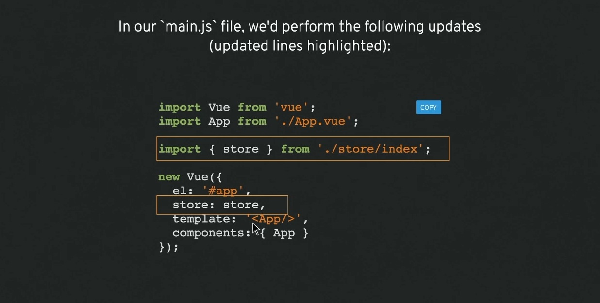
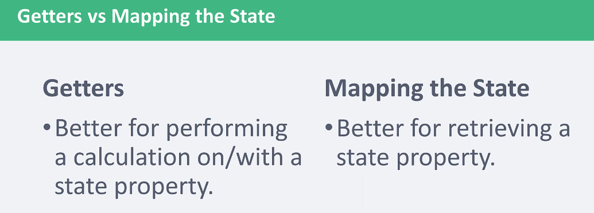

# INDEX

- [INDEX](#index)
  - [Vuex](#vuex)
    - [Application Structure](#application-structure)
    - [Basic Abstract Example](#basic-abstract-example)
    - [Usage in Components](#usage-in-components)
  - [State](#state)
  - [Getting data from the State](#getting-data-from-the-state)
    - [Getting data from the State Directly](#getting-data-from-the-state-directly)
    - [Getters vs mapping](#getters-vs-mapping)
      - [mapping the State](#mapping-the-state)
    - [Getters](#getters)
      - [mapGetters](#mapgetters)
  - [Mutations](#mutations)
    - [mapMutation](#mapmutation)
  - [Actions](#actions)
    - [mapActions](#mapactions)
  - [Modules](#modules)
    ](#mapmutation)
- [Modules](#modules)

---

## Vuex

a library for managing global-state in Vue, with rules that ensure that the state can be only mutated in a predictable way.

> Also install plugin for ready and easy configuration

- Vuex is a **state management pattern + library** for Vue.js applications. It serves as a centralized store for (shared data and logic, even shared methods or async) in an application, with rules **ensuring that the state can only be mutated in a predictable fashion**.
  
- it ensures a **unidirectional data flow**, to prevent going with state up&down, this ensures that we truly know who owns the state
- influenced by **Flux Application Architecture**, like with `Redux`
  
- **Why** Vuex?

  - in a complex `SPA`, passing state between many components and especially deeply nested or sibling components, can get complicated quickly, having one centralized place to access your data can help you stay organized
    
    

- **When** to use Vuex?
  - "You just Know :)"
  - or when you have multiple instances of children/siblings communicating
  - or if I'd like to "see" what all of the state looks like and keep it organized in one place

---

### Application Structure

```sh
├── index.html
├── main.js
├── api
│   └── ... # abstractions for making API requests
├── components
│   ├── App.vue
│   └── ...
└── store
    ├── index.js          # (main store file): where we assemble modules and export the store
    ├── actions.js        # root actions
    ├── mutations.js      # root mutations
    └── modules
        ├── cart.js       # cart module
        └── products.js   # products module
```



---

### Basic Abstract Example

```js
export const store = new Vuex.Store({
  state: {
    counter: 0
  },
  //showing things, not mutating state
  getters: {
    tripleCounter: state => {
      return state.counter * 3;
    }
  },
  //mutating the state
  //mutations are always synchronous
  mutations: {
    //showing passed with payload, represented as num
    increment: (state, num) => {
      state.counter += num;
    }
  },
  //commits the mutation, it's asynchronous
  actions: {
    // showing passed with payload, represented as asynchNum (an object)
    asyncIncrement: ({ commit }, asyncNum) => {
      setTimeout(() => {
        //the asyncNum objects could also just be static amounts
        commit('increment', asyncNum.by);
      }, asyncNum.duration);
    }
  }
});
```

---

### Usage in Components


- You can use shortcuts -> `map<somethingFromStore>` instead like:
  - `mapState`
  - `mapGetters`

---

## State

**State**: is the state of the application. Similar to how we use `data` in the components.

```js
const store = createStore({
  state: {
    todos: [
      { id: 1, text: '...', done: true },
      { id: 2, text: '...', done: false }
    ]
  },
  getters: {
    doneTodos(state) {
      return state.todos.filter(todo => todo.done);
    }
  }
});
```

---

## Getting data from the State

### Getting data from the State Directly

```js
const Counter = {
  template: `<div>{{ count }}</div>`,
  computed: {
    count() {
      return this.$store.state.count;
    }
  }
};
```

---

### Getters vs mapping



- **Getters** -> like mapping over an array in the state and returning something from it (heavy process)

---

#### mapping the State

When a component needs to make use of multiple store state properties or getters, declaring all these computed properties can get repetitive. To deal with this we can make use of the `mapState` helper which **generates computed getter functions for us**, saving us some keystrokes

- mapState
- mapGetters
- mapMutation
- mapActions

```js
// in a component
import { mapState } from "vuex";

export default {
  // ...
  computed: {
    mapState({
    // arrow functions can make the code very succinct!
    count: (state) => state.count,
    }),
  }
};
```

- `mapState` returns an **object**. How do we use it in combination with other local computed properties? Normally, we'd have to use a utility to merge multiple objects into one so that we can pass the final object to computed. However with the object spread operator, we can greatly simplify the syntax with the **spread operator**:

  ```js
  computed: {
    localComputed () { /* ... */ },
    // mix this into the outer object with the object spread operator
    ...mapState({
      // ...
    })
  }
  ```

- Best Syntax:

```js
export default {
  computed: {
    // mix this into the outer object with the object spread operator
    ...mapState(['count', 'isLoggedIn'])
  }
};
```

---

### Getters

**Getters**: will make values able to show statically in our templates. In other words, **"getters can read the value, but not mutate the state"**.

Instead of accessing the state's data directly, we use **getters** which help in **memory-caching**

> caching because they use **closures**

- Getters can invoke other getters
- It's recommended to use **Arrow Functions**

```js
// It's a replace for this:
computed: {
  doneTodosCount () {
    return this.$store.state.todos.filter(todo => todo.done).length
  }
}

// ------------------------------------------------------------------ //

// we use this:
const store = createStore({
  // state ...
  getters: {
    doneTodos (state) {
      return state.todos.filter(todo => todo.done)
    }
  }
})

// and in the component:
computed: {
  doneTodosCount () {
    return this.$store.getters.doneTodosCount
  }
}
```

---

#### mapGetters

```js
import { mapGetters } from 'vuex';

export default {
  // ...
  computed: {
    // mix the getters into computed with object spread operator
    ...mapGetters(['doneTodosCount', 'anotherGetter'])
  }
};
```

---

## Mutations

**Mutations**: will allow us to update the state, but they will always be synchronous. Mutations are the only way to change data in the state in the store.

- Must be **synchronous**
- in the store-options you can use **strict mode** that prevents mutation of the store's state outside of the mutation
  - Only use it in `development mode` as it reduces performance
- To perform a mutation, use `commit`

  ```js
  this.$store.commit('name of method(mutation) in the mutations');
  ```

### mapMutation

It creates component methods that map/connect to Vuex-store-mutations, as Vuex invokes the `commit` method on the store with the mutation-name.

You can commit mutations in components with `this.$store.commit('xxx')`, or use the **mapMutations** helper which maps component methods to store.commit calls:

```js
import { mapMutations } from 'vuex';
export default {
  methods: {
    ...mapMutations([
      'increment', // map `this.increment()` to `this.$store.commit('increment')`
      // `mapMutations` also supports payloads:
      'incrementBy' // map `this.incrementBy(amount)` to `this.$store.commit('incrementBy', amount)`
    ])
  }
};
```

---

## Actions

**Actions** will allow us to update the state, **asynchronously**, but will use an existing mutation. This can be very helpful if you need to perform a few different mutations at once in a particular order, or reach out to a server.

- They are methods that commits a mutation + they allow for Async operations
- actions receive `context` object, it's like the `store` object
- **Async** -> as we can make an API call-in the action, then commit the mutation when we receive the data

```js
// in the store
export const actions = {
  FETCH_JOBS: async context => {
    const jobs = await getJobs(); // async operations
    context.commit(RECEIVE_JOBS, jobs); // after the async action completes
  }
};

// in the component
// import FETCH_JOBS
this.$store.dispatch(FETCH_JOBS);
```

---

### mapActions

it defines methods on the component that dispatch the appropriat action to the Vuex-store

You can dispatch actions in components with `this.$store.dispatch('xxx')`, or use the **mapActions** helper which maps component methods to store.dispatch calls:

```js
import { mapActions } from 'vuex';

export default {
  methods: {
    ...mapActions([
      'increment', // map `this.increment()` to `this.$store.dispatch('increment')`
      // `mapActions` also supports payloads:
      'incrementBy' // map `this.incrementBy(amount)` to `this.$store.dispatch('incrementBy', amount)`
    ])
  }
};
```

---

## Modules

it's better to organize code and states in different modules

```js
const moduleA = {
  state: () => ({ ... }),
  mutations: { ... },
  actions: { ... },
  getters: { ... }
}

const moduleB = {
  state: () => ({ ... }),
  mutations: { ... },
  actions: { ... }
}

const store = createStore({
  modules: {
    a: moduleA,
    b: moduleB
  }
})

store.state.a // -> `moduleA`'s state
store.state.b // -> `moduleB`'s state
```
