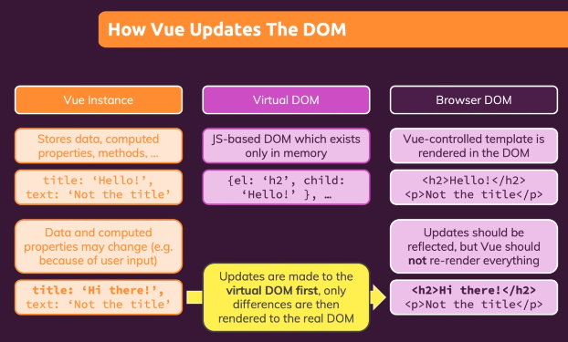
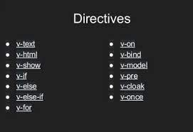

## INDEX

- [INDEX](#index)
- [Vue](#vue)
  - [How it works?](#how-it-works)
  - [Instance LifeCycle](#instance-lifecycle)
- [Data](#data)
  - [Interpolation](#interpolation)
  - [Directives](#directives)
  - [v-model (2 Way Binding)](#v-model-2-way-binding)
    - [2 way binding for elements in a child-component or custom element component](#2-way-binding-for-elements-in-a-child-component-or-custom-element-component)
  - [Refs](#refs)
    - [Accessing the Refs](#accessing-the-refs)
  - [ref vs v-model](#ref-vs-v-model)
- [Methods](#methods)
  - [Listening to Events](#listening-to-events)
    - [Accessing Event Argument](#accessing-event-argument)
    - [Event Modifiers](#event-modifiers)
  - [Computed Properties](#computed-properties)
  - [Watchers](#watchers)
- [Styling](#styling)
  - [Dynamic styling](#dynamic-styling)
  - [Scoped styling](#scoped-styling)
  - [Transitions](#transitions)
    - [Transition Classes](#transition-classes)
- [Rendering Conditional Content & List-items](#rendering-conditional-content--list-items)
  - [Conditional](#conditional)
  - [List-items](#list-items)
- [Components](#components)
  - [Props](#props)
  - [Communicate between Components](#communicate-between-components)
    - [Provide / Inject](#provide--inject)
      - [Provide](#provide)
      - [Inject](#inject)
  - [Slots](#slots)
    - [named-slots](#named-slots)
  - [Dynamic Components](#dynamic-components)
- [Forms](#forms)
- [Routing](#routing)
  - [Navigate from a link: Router-Link](#navigate-from-a-link-router-link)
  - [Navigate programmatically](#navigate-programmatically)
  - [Scroll Behavior](#scroll-behavior)
  - [Navigation Guards](#navigation-guards)
- [Notes](#notes)

---

## Vue

It's a JavaScript framework for building user interfaces. It builds on top of standard HTML, CSS and JavaScript, and provides a **declarative and component-based programming model** that helps you efficiently develop user interfaces, be it simple or complex.

- You should always create an app and specify where the app applies its logic

```html
<script src="https://unpkg.com/vue@3"></script>

<div id="app">{{ message }}</div>

<script>
  const { createApp } = Vue;
  const app = createApp();

  app({
    data() {
      return {
        message: "Hello Vue!",
      };
    },
  });

  app.mount("#app");
</script>
```

---

### How it works?

It uses **Proxy** which uses `set` method to update properties



---

### Instance LifeCycle


---

## Data

### Interpolation

The most basic form of **data binding** is text interpolation using the "Mustache" syntax (double curly braces):

```html
<span>Message: {{ msg }}</span>
```

---

### Directives

A directive is a template token that tells Vue how we want to handle our DOM.

It's used to tell vue to set the value of an html-attribute



```html
<!-- Examples -->
<p v-if="condition"></p>
<button v-on:click="handleClick">Click Me</button>
<a v-bind:href="varLink">link</a>
```

---

### v-model (2 Way Binding)

Vue **v-model** is a directive. It tells Vue that we want to create a two-way data binding between a value in our template and a value in our data properties.

A common use case for using v-model is when designing forms and inputs. We can use it to have our DOM input elements be able to modify the data in our Vue instance.

```html
<div>
  <input type="text" v-model="value" />
  <p>Value: {{ value }}</p>
</div>

<script>
  export default {
    data() {
      return {
        value: "Hello World",
      };
    },
  };
</script>
```

Here it's like we used 2 directives one for `input` element:

- `v-bind:value="value"`
- `v-on:input="setValue"`
  - `e.target.value ...`

---

#### 2 way binding for elements in a child-component or custom element component

Here:

- instead of `v-model=""` we use `:model-value=""`

then pass it to an event emitter to the parent component

---

### Refs

While Vue's declarative rendering model abstracts away most of the direct DOM operations for you, there may still be cases where we need **direct access to the underlying DOM elements**. To achieve this, we can use the special `ref` attribute:

```html
<input ref="input" />
```

**ref** is a special attribute, similar to the **key** attribute discussed in the `v-for`. It allows us to obtain a direct reference to a specific DOM element or child component instance after it's mounted. This may be useful when you want to, for example, programmatically focus an input on component mount, or initialize a 3rd party library on an element.

#### Accessing the Refs

```html
<script>
  export default {
    mounted() {
      this.$refs.input.focus();
    },
  };
</script>

<template>
  <input ref="input" />
</template>
```

---

### ref vs v-model

- **ref**

  - when you need to access the element from code
  - in ref -> you get the value from input as a **string**

- **v-model**
  - when you need to associate data with the element content
  - in v-model -> you get the value from input as a **its type**

Note from **stackoverflow**:

> Directly accessing component instances/DOM nodes (through refs, in this case) should always be a last resort, because you're explicitly sidestepping the framework and potentially making massive headaches for yourself in the process. That is to say, anything that you can use the framework to do (e.g. using v-model for two-way bindings), you should.

---

## Methods


### Listening to Events

We can use the **v-on** directive, which we typically shorten to the **@** symbol,

- To listen to DOM events and run some JavaScript when they're triggered. The usage would be `v-on:click="handler"` or with the shortcut, `@click="handler"`.

#### Accessing Event Argument

```html
<!-- using $event special variable -->
<button @click="warn('Form cannot be submitted yet.', $event)">Submit</button>

<!-- using inline arrow function -->
<button @click="(event) => warn('Form cannot be submitted yet.', event)">
  Submit
</button>
```

```js
methods: {
  warn(message, event) {
    // now we have access to the native event
    if (event) {
      event.preventDefault()
    }
    alert(message)
  }
}
```

---

#### Event Modifiers

It is a very common need to call event.`preventDefault()` or event.`stopPropagation()` inside event handlers.
Instead we use **Event Modifiers**

```html
!-- the submit event will no longer reload the page -->
<form @submit.prevent="onSubmit"></form>
```

---

### Computed Properties

In-template expressions are very convenient, but they are meant for simple operations. Putting too much logic in your templates can make them bloated and hard to maintain.

For complex logic that includes reactive data, it is recommended to use a computed property.

- It only re calculate tne function if any dependency inside it changed

```js
export default {
  data() {
    return {
      author: {
        name: "John Doe",
        books: [
          "Vue 2 - Advanced Guide",
          "Vue 3 - Basic Guide",
          "Vue 4 - The Mystery",
        ],
      },
    };
  },
  computed: {
    // a computed getter
    publishedBooksMessage() {
      // `this` points to the component instance
      return this.author.books.length > 0 ? "Yes" : "No";
    },
  },
};

<p>Has published books:</p>
// here it's called without ()
<span>{{ publishedBooksMessage }}</span>
```

---

### Watchers

Computed properties allow us to declaratively compute derived values. However, there are cases where we need to perform "side effects" in reaction to state changes - for example, mutating the DOM, or changing another piece of state based on the result of an async operation.

With Options API, we can use the watch option to trigger a function whenever a **reactive property** changes:

```js
export default {
  data() {
    return {
      question: "",
      answer: "Questions usually contain a question mark. ;-)",
    };
  },
  watch: {
    // whenever question changes, this function will run
    question(newQuestion, oldQuestion) {
      if (newQuestion.indexOf("?") > -1) {
        this.getAnswer();
      }
    },
  },
  methods: {
    async getAnswer() {
      this.answer = "Thinking...";
      try {
        const res = await fetch("https://yesno.wtf/api");
        this.answer = (await res.json()).answer;
      } catch (error) {
        this.answer = "Error! Could not reach the API. " + error;
      }
    },
  },
};

<p>
  Ask a yes/no question:
  <input v-model="question" />
</p>
<p>{{ answer }}</p>
```

---

## Styling

### Dynamic styling

here we use

- `v-bind:style` or `:style`
- `v-bind:class` or `:class`

```html
<div :style="{}"></div>
<div :class="isActive ? 'active' : ''"></div>

<!-- Or -->
<div :class="{ active: isActive }"></div>
```

---

### Scoped styling

It's to make the styles scoped to its component

`<styles scoped> `

---

### Transitions

`<Transition>` is a built-in component: this means it is available in any component's template without having to register it. It can be **used to apply enter and leave animations** on elements or components passed to it via its default slot.

- `<Transition>` must contain only one element inside of it

> You can also use Native CSS animations: (transitions, animation)

#### Transition Classes


There are six classes applied for enter / leave transitions:

- `v-enter-from`
- `v-enter-active`
- `v-enter-to`
- `v-leave-from`
- `v-leave-active`
- `v-leave-to`

- `v-enter-active` and `v-leave-active` give us the ability to specify different easing curves for enter / leave transitions, which we'll see an example of in the following sections.

Named Transitions

```html
<template>
  <button @click="show = !show">Toggle</button>
  <Transition>
    <p v-if="show">hello</p>
  </Transition>
</template>

<style>
  .v-enter-active,
  .v-leave-active {
    transition: opacity 0.5s ease;
  }

  .v-enter-from,
  .v-leave-to {
    opacity: 0;
  }
</style>
```

- You can mix these classes with **Native CSS animations**:

  ```css
  .bounce-enter-active {
    animation: bounce-in 0.5s;
  }
  .bounce-leave-active {
    animation: bounce-in 0.5s reverse;
  }
  @keyframes bounce-in {
    0% {
      transform: scale(0);
    }
    50% {
      transform: scale(1.25);
    }
    100% {
      transform: scale(1);
    }
  }
  ```

---

## Rendering Conditional Content & List-items


### Conditional

Here we can use

- `v-if=""` & `v-else`
- v-show


### List-items

```html
<li v-for="goal in goals" :key="goal.id">{{goal.name}}</li>
```

---

## Components

```html
<!-- In the child -->
<script>
  export default {
    data() {
      return {
        count: 0,
      };
    },
  };
</script>

<template>
  <button @click="count++">You clicked me {{ count }} times.</button>
</template>

<!-- ----------------------------------------------------------- -->

<!-- In Parent -->
<script>
  import ButtonCounter from "./ButtonCounter.vue";

  export default {
    // Component Registration
    components: {
      ButtonCounter,
    },
  };
</script>

<template>
  <h1>Here is a child component!</h1>
  <ButtonCounter />
</template>
```

---

### Props

You should write props in **camelCase** but if you wrote it in **kebab case** -> Vue will transfer it to camelCase when you use it in the child component

- Props are defined in the **child component** as:

  - an array in the simplest form
  - an object with multiple properties for each prop (`type`, `required`?, `default`, ..)

- In the **parent component**:

  - if you want to pass a prop of any type other than `string` like Boolean -> you must write it with `v-bind:` or `:`

    ```html
    <ButtonCounter :isEnabled="true" />
    ```

```html
<!-- in the child: BlogPost.vue -->
<script>
  export default {
    props: ["title"],
  };
</script>

<template>
  <h4>{{ title }}</h4>
</template>

<!-- In parent -->
<BlogPost title="My journey with Vue" />
<!-- Or using message-property -->
<BlogPost :title="message" />
```

---

### Communicate between Components

[Guide](https://dev.to/sanchithasr/how-to-communicate-between-components-in-vue-js-kjc)

1. Using **Props** (Parent to Child Communication)
2. Using **Events** (Child to Parent Communication)
3. Using **Event Bus** (Communication between any components)
4. Using **provide/inject** (Parent to Child Communication)
5. Using **this.$refs** (Parent to Child Communication)

#### Provide / Inject

##### Provide

it's like **context**: it prevents props-drilling


```js
// in the upper component
export default {
  provide: {
    message: "hello!",
  },
};
```

**Note**: If we need to provide per-instance state, for example data declared via the `data()`, then provide must use a function value:

```js
export default {
  data() {
    return {
      message: "hello!",
    };
  },
  provide() {
    // use function syntax so that we can access `this`
    return {
      message: this.message,
    };
  },
};
```

- In addition to providing data in a component, we can also provide at the app level:

  ```js
  import { createApp } from "vue";

  const app = createApp({});

  app.provide(/* key */ "message", /* value */ "hello!");
  ```

##### Inject

Injections are resolved **before** the component's own state, so you can access injected properties in data():

```js
// in the lower component
export default {
  inject: ["message"],
  data() {
    return {
      // initial data based on injected value
      fullMessage: this.message,
    };
  },
};
```

---

### Slots

It's like `children` in react

The `<slot>` element is a slot outlet that indicates where the parent-provided slot content should be rendered.


```html
<div>
  <slot></slot>
</div>
```

#### named-slots


```html
<!-- in BaseLayout container -->
<div class="container">
  <header>
    <slot name="header"></slot>
  </header>
  <main>
    <slot></slot>
  </main>
  <footer>
    <slot name="footer"></slot>
  </footer>
</div>

<!-- Using It -->
<BaseLayout>
  <template v-slot:header>
    <!-- Or -->
  <template #header>
    <!-- content for the header slot -->
  </template>
</BaseLayout>
```

---

### Dynamic Components

Sometimes, it's useful to dynamically switch between components, like in a tabbed interface:

- instead of using multiple

  ```html
  <comp1>v-if="currentComponent === comp1"</comp1>
  <comp2>v-if="currentComponent === comp2"</comp2>
  <comp3>v-if="currentComponent === comp3"</comp3>
  ```

- use this:

  ```html
  <!-- Component changes when (currentTab property) changes -->
  <component :is="currentComponent"></component>
  ```

When switching between multiple components with `<component :is="...">`, a component will be **unmounted** when it is switched away from. We can force the inactive components to stay "alive" with the built-in `<KeepAlive>` component.

**KeepAlive** is a built-in component that allows us to conditionally **cache** component instances when dynamically switching between multiple components.

```html
<!-- Inactive components will be cached! -->
<KeepAlive>
  <component :is="activeComponent" />
</KeepAlive>
```

---

## Forms

- when creating initial values for input elements

  - number -> `null`
  - string -> `""`
  - select -> `"one value from the options"`
  - multiple check boxes -> `[]`
  - single check box -> `true/false`

- to use **buttons** in a form to select value, Use `type="button"` in the element

---

## Routing

```js
const router = createRouter({
  history: createWebHistory(),
  routes: [
    { path: "/", redirect: "/teams" },
    {
      name: "teams",
      path: "/teams",
      meta: { needsAuth: true },
      components: { default: TeamsList, footer: TeamsFooter },
      children: [
        {
          name: "team-members", // without "/"
          path: ":teamId",
          component: TeamMembers,
          props: true,
        }, // /teams/t1
      ],
    }, // our-domain.com/teams => TeamsList
    {
      path: "/users",
      components: {
        default: UsersList,
        footer: UsersFooter,
      },
      // Navigation Guards
      beforeEnter(to, from, next) {
        console.log("users beforeEnter");
        console.log(to, from);
        next();
      },
    },
    { path: "/:notFound(.*)", component: NotFound },
  ],
  linkActiveClass: "active", // changing default class name from vue for active-link
  scrollBehavior(_, _2, savedPosition) {
    if (savedPosition) {
      return savedPosition;
    }
    return { left: 0, top: 0 }; // scroll to top of the page
  },
});

router.beforeEach(function(to, from, next) {
  console.log('Global beforeEach');
  console.log(to, from);
  if (to.meta.needsAuth) {
    console.log('Needs auth!');
    next();
  } else {
    next();
  }

router.afterEach(function(to, from) {
  // sending analytics data
  console.log('Global afterEach');
  console.log(to, from);
});
```

---

### Navigate from a link: Router-Link

- By default, Vue sets an active-class (`router-link-active`) on the clicked link -> so we can style it in **CSS** using this class
  - or you can make an **alias** for this class with different name in the router options
- `<router-link></router-link>` acts like `<a>` in **css**

---

### Navigate programmatically

```js
this.$router.push("/");
```

---

### Scroll Behavior

When using client-side routing, we may want to **scroll to top when navigating to a new route**, or **preserve the scrolling position of history entries** just like real page reload does.

- Vue Router allows you to achieve these and even better, **allows you to completely customize the scroll behavior on route navigation**.

---

### Navigation Guards

They are used to guard navigations. either by redirecting it or canceling it. There are a number of ways to hook into the route navigation process: globally, per-route, or in-component.

- `beforeEach()`
- `beforeEnter()`
- `beforeRouteLeave()`
- `beforeRouteEnter()`

```js
// to confirm navigation:
next(); // Or
next(true);

// ---------------------------------- //
// to cancel navigation:
next(false);

// ---------------------------------- //
// to cancel navigation and redirect to another route:
next("/teams");
// Or
if (to.name === "teams") {
  next();
} else {
  next({ name: "teams" });
}
```

---

## Notes

- when you want to change a property that is being rendered you should modify it and not create a new property -> to make vue **rerenders** it

  - Ex: array of items: you should use `splice` to remove item instead of using (filter as it will create new array)

- when using a **modal** try using

  ```html
  <teleport to="body"></teleport>
  ```

- don't use `function` and use `arrow-function` to prevent errors with **this** keyword
  - this is also in http requests (`.then()`)
