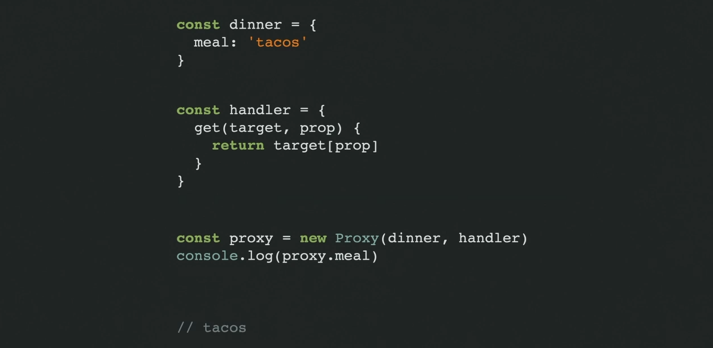

# INDEX

- [INDEX](#index)
  - [Composition API](#composition-api)
    - [Why use it ?](#why-use-it-)
    - [Differences](#differences)
  - [Reactivity](#reactivity)
    - [Reactive Programming](#reactive-programming)
    - [`ref` function](#ref-function)
    - [`Computed` function](#computed-function)
    - [`reactive` function](#reactive-function)
    - [`toRef` function](#toref-function)
    - [`toRefs` function](#torefs-function)
  - [Composables](#composables)
  - [LifeCycles Hooks](#lifecycles-hooks)
  - [Mixins](#mixins)
  - [props](#props)
    - [Using destructed props](#using-destructed-props)
  - [Context](#context)
  - [Router](#router)
  - [Store](#store)
  - [Notes](#notes)

---

## Composition API

Composition API allow you to **encapsulate** one piece of functionality so that you can use it in different components throughout the application

- It's an alternative syntax for writing components
- it bundles together all the component-logic in a single `setup` method that is part of the Vue configuration object


- new syntax for the `setup`
  

---

### Why use it ?

- **Problems of Options-API**:
  - Code that belongs together logically is split across multiple parts of the Vue config object (`data`, `methods`, `computed`)
  - difficult to reuse logic across components. (Vue2 offered mixins but they're considered an **anti-pattern**)
- **Why Composition?**

  - we write functions (composables) that use Vue's **reactive features** and we can write these functions outside of a component and reuse them across multiple components
    

  - Better **Typescript** support
    - as it's made and written in **Typescript**
  - Better Organization

    - related code(data+methods) are close to each other

    

---

### Differences

- Here in composition api, we don't use **this** keyword
- must return an object with the data/methods to use in the `<template></template>`
- we use the `ref` function to define a piece of reactive state (data that will change over time).
  - it analogous to `data` in the Options API
- we use `computed` function to re-run logic whenever a reactive piece of state changes.
  - we pass a function to it and Vue will re-invoke the function whenever a piece of state referenced inside it updates
  - this is analogous to `computed` properties in Options API
- we use javascript functions to operate on and change the reactive data
  - remember to read/write the `value` property
  - they are analogous to `methods` in the Options API
- the `setup` method receives a reactive object of `props` as its first argument. the `props` object is reactive but its individual properties are not.
  - you can pass the `props` object to the `toRefs` function to return an object with all reactive properties
- When we use reactive objects in HTML, Vue knows to extract their underlying `value`, so no need to add `.value`

> You can use **`Composition-API`** with **`Options-API`**

---

## Reactivity

It's the process of **updating the template** whenever a change in the data occurs.

> It's the equivalent of **computed & reactive-data** in options-API

### Reactive Programming

It's the programming with asynchronous **data streams**

- **Stream**: is a sequence of ongoing events ordered in time that offer some hooks with which to observe it
  - Ex: `hover` state that have transition: we have multiple stages:
    1. the moment when you start hovering with the **initial** state
    2. the **transition** changing
    3. the **end** state
- when we use **"reactive premises"** for building applications, this means it's very easy to update state in reaction to events
- How does **Vue 3** do this:
  1. Detect when there's a change in one of the values
  2. track the function that changes it
  3. trigger the function so it can update the final value

> [Amazing video that show reactivity](https://codepen.io/sdras/full/zYYzjBg)

---

### `ref` function

It wraps its argument in a reactive object. The original value can be accessed/overwritten via the `value` property

- **Reactive References**: are variables Vue should keep track of.

  - they are created by **ref()**

- why use **ref**?
  - to make the properties become **reactive**
  - it creates a reactive object
  - you can access the value of the property using `.value`

```html
<script>
  import { ref } from 'vue';

  export default {
    setup() {
      const count = ref(0); // give it the initial value = 0

      // expose to template and other options API hooks
      return {
        count
      };
    },

    mounted() {
      console.log(this.count); // 0
    }
  };
</script>

<template>
  <button @click="count++">{{ count }}</button>
</template>
```

---

### `Computed` function

It's reactive-ready function which is imported from **Vue**

- it accepts a **function** as an argument, Vue will re-invoke the function whenever its referenced values change
  - it depends on values inside the function body as whenever any value changes in the body, the computed-function will react to that change and rerun the function and get the new value
- The function inside it -> returns a **reactive object**

  ```js
  const { ref, computed } = require('vue');

  let a = ref(1);
  let b = ref(2);
  let c = computed(() => a.value + b.value); // c.value = 3

  a.value = 10;
  // c.value = 12
  ```

- it's **read-only** (can't assign values to properties inside of it)

```js
import { ref, computed, Ref } from '@vue/composition-api';

export default {
  setup() {
    const movieName = ref('Relatos Salvajes');
    const country = ref('Argentina');

    const nameAndCountry = computed(
      () => `The movie name is ${movieName.value} from ${country.value}`
    );

    return { movieName, country, nameAndCountry };
  }
};
```

> The same for **Watchers**

---

### `reactive` function

> We can pass an object to the `ref` function. However, it's cleaner to pass the object to the `reactive` function because it removes the need for a `value` property

Returns a reactive proxy of the **object** and not **Primitive values** like **ref**.





> **Must Watch this** [video on proxies in Vue](https://media.slid.es/videos/75854/Getg0nRu/reactivity2.mp4)

- here we use it with `object-properties` to be able to access the object's properties (nested properties)
- now we don't have to use the `value` property as it help us from going so deep into the object to get values from it
- here we can't use `spread operator {...}` or `destructuring` as **it will make us lose reactivity**
- if we use the `reactive()` function, we no longer have to use `.value` to use the value elsewhere.

```js
// OLD (using ref)
const user = ref({
  name: 'John',
  age: 20
});
const title = computed(() => `${user.value.name} with age of ${user.value.age}`);

// NEW (using reactive)
const user = reactive({
  name: 'John',
  age: 20
});
// notice that we don't use them as "user.age.value"
const title = computed(() => `${user.name} with age of ${user.age}`);

// NOTE: this won't work!
const { name, age } = user; // this will be values at only this specific time
const title = computed(() => `${name} with age of ${age}`);
// instead, We can use toRef()
```

---

### `toRef` function

Creates a reactive object around a single reactive-object-properties

- creates a `ref`(reference) for a property on a source reactive object. The created `ref` is synced with its source property: mutating the source property will update the ref, and vice-versa.

```js
const state = reactive({
  foo: 1,
  bar: 2
});

const fooRef = toRef(state, 'foo'); // creating connection to  the "foo" property in the "state" object

// mutating the ref updates the original
fooRef.value++;
console.log(state.foo); // 2

// mutating the original also updates the ref
state.foo++;
console.log(fooRef.value); // 3
```

> if the object has a lot of properties that you want them to be reactive -> use [toRefs()](https://vuejs.org/api/reactivity-utilities.html#torefs)

---

### `toRefs` function

Accepts a reactive Object, and makes every object property reactive. This approach allows us to **destructure** properties. However, **Note that** the properties will now be reactive-objects with `value` properties.

- It's going to return an object where every individual property is going to be reactive, and this enable us to destructure properties from this object without problems
- it gives us an object where every key is going to return another reactive object, unlike in `reactive` where it just return a single reactive object with properties nested inside it
- it only accepts a reactive object and not normal javascript object

```js
const state = reactive({
  foo: 1,
  bar: 2
});

const { foo, bar } = toRefs(state);
// foo = {value: 1}
// bar = {value: 2}

console.log(foo.value); // Correct
console.log(foo); // Wrong
```

---

## Composables

The composition API replaces lots of functionality with helper functions (**composables**)

> **Composable**: is a helper function that utilizes Vue's reactive features. The intent is that a component is composed of lots of smaller, reusable functions that provide reactive objects

- we can use Vue functions like `ref`, `computed`, `reactive` and more in a composable function body

---

## LifeCycles Hooks


---

## Mixins

Mixins are a flexible **way to distribute reusable functionalities** for Vue components.

- If there's a clash of names between data in mixins or data in the component -> **the data in component has the priority**
  - that's why mixins work better with composition-api

```js
// define a mixin object
var myMixin = {
  created: function () {
    this.hello();
  },
  methods: {
    hello: function () {
      console.log('hello from mixin!');
    }
  }
};

// ----------------------------------------------------- //

// define a component that uses this mixin
var Component = Vue.extend({
  mixins: [myMixin]
});
// Or
new Vue({
  mixins: [mixin], // must be array
  data: function () {}
});

var component = new Component(); // => "hello from mixin!"
```

---

## props

The first argument in the setup function is the **props argument**. Just as you would expect in a standard component, props inside of a setup function **are reactive** and will be updated when new props are passed in.

```js
export default {
  props: {
    title: String
  },
  setup(props) {
    console.log(props.title);
  }
};
```

### Using destructed props

If you destructure the props object, the destructured variables **will lose reactivity**.

If you really need to destructure the props, or need to pass a prop into an external function while retaining reactivity, you can do so with the **toRefs()** and **toRef()** utility APIs

```js
import { toRefs, toRef } from 'vue';

export default {
  setup(props) {
    // turn `props` into an object of refs, then destructure
    const { title } = toRefs(props);
    // `title` is a ref that tracks `props.title`
    console.log(title.value);

    // OR, turn a single property on `props` into a ref
    const title = toRef(props, 'title');
  }
};
```

---

## Context

he second argument passed to the `setup` function is a Setup **Context object**. The context object exposes other values that may be useful inside setup -> It's like **"this"** or **"$"**

- things like `$emit`, `$attrs` could be accessed here

```js
export default {
  setup(props, context) {
    // Attributes (Non-reactive object, equivalent to $attrs)
    console.log(context.attrs);

    // Slots (Non-reactive object, equivalent to $slots)
    console.log(context.slots);

    // Emit events (Function, equivalent to $emit)
    context.emit('eventName');

    // Expose public properties (Function)
    context.expose();
  }
};
```

The context object is **not reactive** and can be safely destructured:

```js
export default {
  setup(props, { attrs, slots, emit, expose }) {
    ...
  }
}
```

---

## Router

Because we don't have access to **this** inside of setup, we cannot directly access `this.$router or this.$route` anymore. Instead we use the **`useRouter`** function:

```js
import { useRouter, useRoute } from 'vue-router';

export default {
  setup() {
    const router = useRouter();
    const route = useRoute();

    function pushWithQuery(query) {
      router.push({
        name: 'search',
        query: {
          ...route.query
        }
      });
    }
  }
};
```

---

## Store

To use store functionalities, we use the `useStore` function

---

## Notes

- you can mix between **options-api** and **composition-api** and use them together without problems
