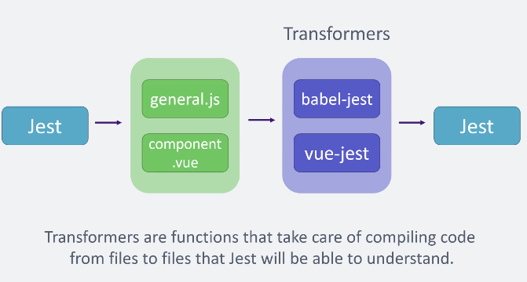

## INDEX

- [INDEX](#index)
- [Jest with Vue](#jest-with-vue)
  - [problems of Jest for Vue](#problems-of-jest-for-vue)
  - [Solution: Testing Flow](#solution-testing-flow)
- [Installing](#installing)
  - [plugin](#plugin)
  - [Vue Test Utils](#vue-test-utils)
- [mount](#mount)
  - [Second parameter](#second-parameter)
- [Events](#events)
- [find() vs get()](#find-vs-get)
- [Stubs and Shallow-Mount](#stubs-and-shallow-mount)
  - [RouterLinkStub](#routerlinkstub)
- [Testing Asynchronous Behavior](#testing-asynchronous-behavior)
  - [Async outside vue](#async-outside-vue)

---

## Jest with Vue

### problems of Jest for Vue

- Doesn't run in the browser, runs in **node**
- Comes with its own environment built on top of JSDOM
- Doesn't understand Vue Component-files
- Limited Syntax

### Solution: Testing Flow



- Transformers need to be installed separately
  - **babel-jest**: to run js with latest syntax-features
  - **vue-jest**: Will compile **single-file-components** into Objects

You can use the [dependency](https://www.npmjs.com/package/vue-jest) or the [plugin](https://cli.vuejs.org/core-plugins/unit-jest.html)

---

## Installing

### plugin


### Vue Test Utils

It is a set of utility functions aimed to simplify testing Vue.js components. It provides some methods to **mount** and **interact** with Vue components in an isolated manner.

---

## mount

| mount                                                                                                                                                                                          | shallowMount                                                                                                                                                                                                                              |
| ---------------------------------------------------------------------------------------------------------------------------------------------------------------------------------------------- | ----------------------------------------------------------------------------------------------------------------------------------------------------------------------------------------------------------------------------------------- |
| takes the Vue component as a first argument and returns its vue instance along with some helper which is used to interact with a component instance like set `props`, `trigger` `clicks`, etc. | also works similar to the `mount` method the main difference is **shallowMount doesn’t render child components** so that it allows us to test the component in isolation to make sure that child components are not included in the test. |

- `.toMatch` -> checks for a text within another piece of text (check that a string matches a regular expression)

### Second parameter

the second parameter of **mount** creates an object to modify data in the component

---

## Events

- `trigger("click")` -> simulate a click event

---

## find() vs get()

> Try to use **attributes** when finding elements/components instead of (element-selector or class/id )
> EX: `.find(["data-test=navbar"])`

---

## Stubs and Shallow-Mount

**Stub** is where you replace an existing implementation of a custom component with a dummy component that doesn't do anything at all, which can simplify an otherwise complex test.

It's a replacement or stand-in for a real component, we can use it to simplify tests by focusing on the component under test

- A common example is when you would like to test something in a component that appears very high in the component hierarchy.

```js
test("stubs component with custom template", () => {
  const wrapper = mount(App, {
    global: {
      stubs: {
        // instead of doing a fetch
        FetchDataFromApi: {
          template: "<span />",
        },
      },
    },
  });

  console.log(wrapper.html());
  // <h1>Welcome to Vue.js 3</h1><span></span>

  expect(wrapper.html()).toContain("Welcome to Vue.js 3");
});
```

---

### RouterLinkStub

A component to stub the Vue Router router-link component.

> as the router is in the upper level of the app and in testing each component is tested isolated, so we use stub to replace the router

- You can use this component to find a router-link component in the render tree.

```js
import { mount, RouterLinkStub } from "@vue/test-utils";

const wrapper = mount(Component, {
  stubs: {
    RouterLink: RouterLinkStub,
  },
});
expect(wrapper.findComponent(RouterLinkStub).props().to).toBe("/some/path");
```

---

## Testing Asynchronous Behavior

There are two types of asynchronous behavior you will encounter in your tests:

1. Updates applied by Vue
2. Asynchronous behavior outside of Vue (ex: `promises`)

### Async outside vue

One of the most common asynchronous behaviors outside of Vue is API calls in **Vuex actions**. The following examples shows how to test a method that makes an API call.

```js
import { shallowMount } from "@vue/test-utils";
import Foo from "./Foo"; // the component
jest.mock("axios", () => ({
  get: Promise.resolve("value"),
}));

// This test currently fails because the assertion is called before the promise in (fetchResults) resolves.
it("fetches async when a button is clicked", () => {
  const wrapper = shallowMount(Foo);
  wrapper.find("button").trigger("click");
  expect(wrapper.text()).toBe("value");
});

// solution: We can use done in combination with $nextTick or setTimeout to ensure any promises are settled before the assertion is made.
it("fetches async when a button is clicked", (done) => {
  const wrapper = shallowMount(Foo);
  wrapper.find("button").trigger("click");
  wrapper.vm.$nextTick(() => {
    expect(wrapper.text()).toBe("value");
    done();
  });
});
```
