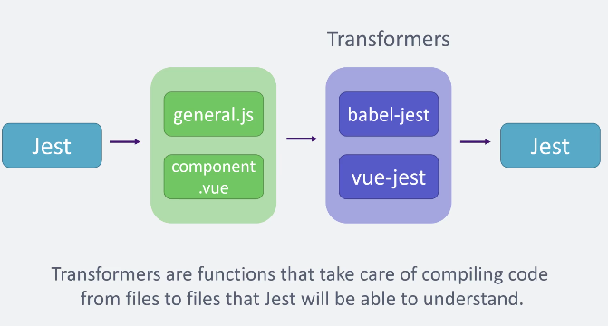
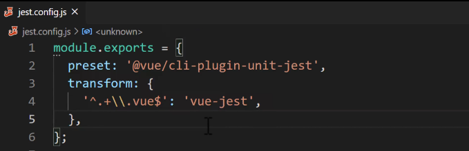
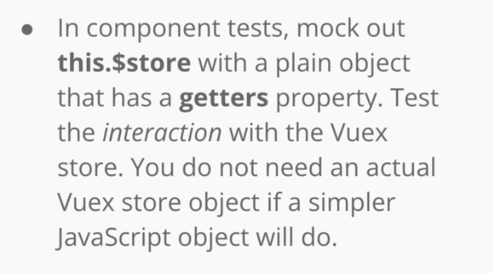

# INDEX

- [INDEX](#index)
  - [Jest with Vue](#jest-with-vue)
    - [problems of Jest for Vue](#problems-of-jest-for-vue)
    - [Solution: Testing Flow](#solution-testing-flow)
  - [Installing](#installing)
    - [plugin](#plugin)
    - [Vue Test Utils](#vue-test-utils)
  - [mount](#mount)
    - [Second parameter (vue configuration object)](#second-parameter-vue-configuration-object)
    - [find() vs get()](#find-vs-get)
    - [Mounting Notes](#mounting-notes)
      - [Mounting factory function](#mounting-factory-function)
  - [Events](#events)
    - [Emitted Events](#emitted-events)
  - [Stubs and Shallow-Mount](#stubs-and-shallow-mount)
    - [Stub](#stub)
    - [Shallow-Mount (most used)](#shallow-mount-most-used)
    - [Router Stubbing](#router-stubbing)
      - [RouterLinkStub](#routerlinkstub)
      - [Mocking `$route` and `$router`](#mocking-route-and-router)
  - [Testing Asynchronous Behavior](#testing-asynchronous-behavior)
    - [Telling Vue to rerender manually (nextTick)](#telling-vue-to-rerender-manually-nexttick)
      - [flushPromises](#flushpromises)
    - [Async outside vue](#async-outside-vue)
  - [Composable helper functions](#composable-helper-functions)
  - [Testing Vuex](#testing-vuex)
    - [Store testing ways](#store-testing-ways)
      - [using the real Vuex store](#using-the-real-vuex-store)
      - [Using a Mock Store](#using-a-mock-store)
    - [Testing getters](#testing-getters)
  - [Testing with Composition-API](#testing-with-composition-api)
  - [Test Coverage](#test-coverage)

---

## Jest with Vue

### problems of Jest for Vue

- Doesn't run in the browser, runs in **node**
- Comes with its own environment built on top of JSDOM
- Doesn't understand Vue Component-files
- Limited Syntax

### Solution: Testing Flow



- Transformers need to be installed separately
  - **babel-jest**: to run js with latest syntax-features
  - **vue-jest**: Will compile **single-file-components** into Objects

You can use the [dependency](https://www.npmjs.com/package/vue-jest) or the [plugin](https://cli.vuejs.org/core-plugins/unit-jest.html)

---

## Installing

### plugin



### Vue Test Utils

It's a library used in jest, it provides several utility functions for testing vue components

- Its methods allow us to **mount** and **interact** with Vue components in an isolated manner (outside the browser).

It is a set of utility functions aimed to simplify testing Vue.js components.

---

## mount

- `mount` method:
  - is to simulate the component as if it exists in the real world but we're going to treat it like a **javascript object** to be able to use it outside the browser
  - this will allow us to see that component output such as its HTML, text-rendered, ... and all of this is outside of the visual browser environment
  - it takes the imported component as an argument and returns an object that is a wrapper around the vue-component with some `properties` and `methods` for testing -> `const wrapper = mount(<component>)`

| mount                                                                                                                                                                                                    | shallowMount                                                                                                                                                                                                                              |
| -------------------------------------------------------------------------------------------------------------------------------------------------------------------------------------------------------- | ----------------------------------------------------------------------------------------------------------------------------------------------------------------------------------------------------------------------------------------- |
| takes the Vue component as a first argument and returns its vue instance along with some helper which is used to interact with a component instance like set `props`, `slots` , `trigger` `clicks`, etc. | also works similar to the `mount` method the main difference is **shallowMount doesn’t render child components** so that it allows us to test the component in isolation to make sure that child components are not included in the test. |

> `shallowMount` is more used in unit testing

- `.toMatch` -> checks for a text within another piece of text (check that a string matches a regular expression)

### Second parameter (vue configuration object)

the second parameter of **mount** creates an object to modify data in the component

```js
const wrapper = mount(MainNav, {
  data() {
    return {
      company: 'Super Corp'
    };
  }
});
```

- Another way is to use the **`setData()`** method, the different here that:

  - it's **Asynchronous method** so the test will run first before it finishes, we should make the test-callbackFunction Async and also to await the `setData()` method

    ```js
    it('displays company name', async () => {
      const wrapper = mount(MainNav);
      await wrapper.setData({ company: 'Super Corp' });
    });
    ```

  - it's not recommended as it's not actually mimicking how the component works in normal behavior

---

### find() vs get()

- **find**: Returns Wrapper of first DOM node or Vue component matching selector.
  - > **Note:** if item doesn't exist it will return **Undefined**, so the test won't fail
  - You should use find when searching for an element that may not exist.
- **get**: Works just like `find` **but will throw an error** if nothing matching the given selector is found, So the test will fail.

  - You should use this method when getting an element that should exist and it will provide a nice error message if that is not the case.

- We can search for a custom attribute like `data-test` in our tests to decouple them from implementation(as if the class/id changed in the implementation, we won't have a problem)

  - Try to use **custom-attributes** when finding elements/components instead of (element-selector or class/id )

  - EX: `.find(["data-test=navbar"])`

- when getting an element and then do an event that changes the existence-state of the element, then we have to re-define(find) the element again so that we won't use the old(outdated) reference
- **findComponent**: It returns Wrapper of first matching Vue component, use it with:
  - [routerlinkstub](#routerlinkstub)
  - any component

---

### Mounting Notes

- reducing the duplication of mounting in `beforeEach` hook:

  - note that the hooks are function-scoped, so if you want to declare a wrapper each time, it will be locally scoped and we won't be able to access it in the test-specs
  - solution is to declare it first and then assign the value in the hook function body

    ```js
    let wrapper;
    beforeEach(() => {
      wrapper = shallowMount(MainNav);
    });
    ```

  - another option is to just define the config object outside and just reference it when mounting

    - this approach is called: **Factory Function**

    ```js
    const createConfig = {
      global: {
        stubs: {
          'router-link': RouterLinkStub
        }
      }
    };
    it('displays company name', () => {
      const wrapper = shallowMount(MainNav, createConfig);
    });
    ```

#### Mounting factory function

```js
// --------------Factory Functions-------------- //

// for props
const createJobProps = (jobProps = {}) => ({
  title: 'Vue Developer',
  organization: 'AirBnB',
  ...jobProps
});

// for route
const createRoute = (queryParams = {}) => ({
  query: {
    page: '5',
    ...queryParams
  }
});

// for mount config object
const createConfig = (jobProps, $route) => ({
  props: {
    job: {
      ...jobProps
    }
  },
  global: {
    stubs: {
      'router-link': RouterLinkStub
    },
    mocks: {
      $route
    }
  }
});

// ex: using it
it('renders job title', () => {
  const jobProps = createJobProps({ title: 'Vue Programmer' });
  const $route = createRoute();
  const wrapper = mount(JobListing, createConfig(jobProps, $route));
  expect(wrapper.text()).toMatch('Vue Programmer');
});
```

---

## Events

- `trigger()` method can trigger or simulate a user event
- `trigger("click")` -> simulate a click event
- The `trigger()` method is asynchronous so we have to use (`async .. await`) to wait until it's complete. otherwise, our test assertions will run before the re-render is complete

### Emitted Events

in testing, the `.emitted()` method returns an **object** that keeps track of a component's emitted events

- the properties will be the event names
- the values will be arrays of arrays, each nested array stores the data/arguments that the event included

Ex:

```js
const input = wrapper.find('input');
input.setValue('Engi');
input.setValue('eer');
const message = wrapper.emitted()['update:modelValue']; // array of arrays with all emitted values from the key: "update:modelValue"
expect(message).toEqual([['Engi'], ['eer']]);
```

---

## Stubs and Shallow-Mount

- **Stubs:** are focus on child components
- **Mocks:** are focus on global injections (properties that the component is going to have access to, and that are going to be defined on it from some kind of global implementation (e.g. vue, vue-router))

### Stub

**Stub**: is a **replacement to an existing implementation of a custom/global component** with a dummy component that doesn't do anything at all, which can simplify an otherwise complex test.

- We can use it to simplify tests by focusing on the component under test.
- A common examples is when you:

  - would like to test something in a component that appears very high in the component hierarchy -> **component with a lot of nested children**.
  - The component you are testing uses a **global component**

    ```js
    const wrapper = mount(SubNav, {
      // stub for global components
      global: {
        stubs: {
          FontAwesomeIcon: true
        }
      },
      data() {
        return {
          onJobResultsPage: true
        };
      }
    });
    ```

```js
test('stubs component with custom template', () => {
  const wrapper = mount(App, {
    global: {
      stubs: {
        // instead of doing a fetch
        FetchDataFromApi: {
          template: '<span />'
        }
      }
    }
  });

  console.log(wrapper.html());
  // <h1>Welcome to Vue.js 3</h1><span></span>

  expect(wrapper.html()).toContain('Welcome to Vue.js 3');
});
```

---

### Shallow-Mount (most used)

shallow are focused on a specific component. shallow can be useful for testing advanced components in complete isolation. If you just have one or two components that are not relevant to your tests, consider using mount in combination with stubs instead of shallow. **The more you stub, the less production-like your test becomes.**

- shallow mounting will:

  - automatically stub out all the child components
  - we don't have to explicitly write out those components names
  - we don't have to come up with the complex mount-configuration-object
  - decouple parent-component from its child-components (focus and isolate just the component without caring about other components that need to be rendered)

  ```js
  test('shallow stubs out all child components', () => {
    const wrapper = mount(ComplexComponent, {
      shallow: true
    });

    console.log(wrapper.html());
    /*
      <h1>Welcome to Vue.js 3</h1>
      <complex-a-stub></complex-a-stub>
      <complex-b-stub></complex-b-stub>
      <complex-c-stub></complex-c-stub>
    */
  });
  ```

---

### Router Stubbing

#### RouterLinkStub

- the problem with using `shallowMount()` to automatically stub `<router-link>` component:
  - it stubs it with another thing that doesn't render the properties like `to` and the name shown so we won't be able to get data we want and will show warning
  - it's like stubbing it with a `<div>` element
- Solution is to use the `RouterLinkStub` from `@vue/test-utils`

A component to stub the Vue Router router-link component.

> - `<router-link>` and `<router-vue>` are registered as global-components, So our tests don't understand where they are coming from.
> - As the router is in the upper level of the app and in testing each component is tested isolated, so we use stub to replace the router

- You can use this component to find a router-link component in the render tree.
  - to have access to the `RouterLinkStub` component as an object which we can assert on its properties(like `props`), we use `findComponent` method instead of the "find" method which gets the RAW HTML DOM Element

```js
import { shallowMount, RouterLinkStub } from '@vue/test-utils';

const wrapper = shallowMount(MainNav, {
  global: {
    stubs: {
      'router-link': RouterLinkStub
    }
  }
});
expect(wrapper.findComponent(RouterLinkStub).props('to')).toBe('/some/path');
```

> **Note**: You can use a beforeEach for if you are testing router-link multiple times or you can create a helper-function (factory-function):

```js
// factory-function
const createConfig = () => ({
  global: {
    stubs: {
      'router-link': RouterLinkStub
    }
  }
});

// code
const wrapper = mount(Component, createConfig());
```

---

#### Mocking `$route` and `$router`

> **Mocks:** are focus on global injections (properties that the component is going to have access to, and that are going to be defined on it from some kind of global implementation (e.g. vue, vue-router))

Sometimes you want to test that a component does something with parameters from the `$route` and `$router` objects. To do that, you can pass custom mocks to the Vue instance.

- We can use the `mocks` property in our test configuration object (in `global` object) to mock/replace global properties with our own custom objects
  - it replaces `$router` and `$route` properties with simpler javascript objects. This decouples the tests from real vue-router implementation

```js
import { shallowMount } from '@vue/test-utils';

const $route = {
  path: '/some/path'
};

const wrapper = shallowMount(Component, {
  mocks: {
    // mocks "this.$route object"
    $route // ES6-object-property
  }
});

wrapper.vm.$route.path; // /some/path
```

> You also can use a helper-function if you are using it multiple times

---

## Testing Asynchronous Behavior

There are two types of asynchronous behavior you will encounter in your tests:

1. Updates applied by Vue
2. Asynchronous behavior outside of Vue (ex: `promises`)

---

### Telling Vue to rerender manually (nextTick)

> A nice rule to follow is to
>
> - always await on mutations like **trigger** or **setProps**.
> - If your code relies on something async, like calling axios, add an **await** to the **flushPromises** call as well.

in tests, when you mount the component then do an action that should (make vue rerenders the component), it doesn't do so as you should here tell it manually to do so using **vm** and **nextTick**

- Use it immediately after you've changed some data to wait for the DOM updates

```js
button.trigger('click');
await Vue.nextTick();

// It's the same as this:
await button.trigger('click');
```

```js
it('swaps action verb after first interval', async () => {
  jest.useFakeTimers();
  const wrapper = mount(HeadLine);
  // move forward to the next interval
  jest.runOnlyPendingTimers(); // Executes only the macro-tasks that are currently pending (only the tasks that have been queued by setTimeout() or setInterval() up to this point)

  // now we have to tell the component (wrapper.vm) to refresh the DOM
  await nextTick(); // wait for the DOM updates
  const actionPhrase = wrapper.find("[data-test='action-phrase']");
  expect(actionPhrase.text()).toBe('Create for everyone');
  jest.useRealTimers();
});
```

---

#### flushPromises

It resolves any pending promises. This is helpful for async events within our component (such as API requests)

> makes all promises resolve then go to next line

```js
import JobListings from '@/components/JobResults/JobListings.vue';
import { flushPromises, shallowMount } from '@vue/test-utils';
import axios from 'axios';
jest.mock('axios'); // Must be on the same scope as your `import`

it('fetches async when a button is clicked', async () => {
  axios.get.mockResolvedValue({ data: Array(15).fill({}) });
  const wrapper = shallowMount(JobListings);
  await flushPromises(); // axios promise is resolved immediately like using "nextTick()"
  const jobListings = wrapper.findAll("[data-test='job-listing']");
  expect(jobListings).toHaveLength(15);
});
```

---

### Async outside vue

One of the most common asynchronous behaviors outside of Vue is API calls in **Vuex actions**. The following examples shows how to test a method that makes an API call.

```js
import { shallowMount } from '@vue/test-utils';
import Foo from './Foo'; // the component
jest.mock('axios', () => ({
  get: Promise.resolve('value')
}));

// This test currently fails because the assertion is called before the promise in (fetchResults) resolves.
it('fetches async when a button is clicked', () => {
  const wrapper = shallowMount(Foo);
  wrapper.find('button').trigger('click');
  expect(wrapper.text()).toBe('value');
});

// solution: We can use done in combination with $nextTick or setTimeout to ensure any promises are settled before the assertion is made.
it('fetches async when a button is clicked', done => {
  const wrapper = shallowMount(Foo);
  wrapper.find('button').trigger('click');
  wrapper.vm.$nextTick(() => {
    expect(wrapper.text()).toBe('value');
    done();
  });
});
```

---

## Composable helper functions

When using **Route, Router, Vuex, ..**, each time you have to initiate the thing you are using with tools like `useRouter` and others and then use **computed** function to get reactive value from them -> So you can move them to individual helper functions than can be used multiple times

```js
import { computed } from 'vue';
import { useRoute } from 'vue-router';

const useConfirmRoute = (routeName: any) => {
  const route = useRoute();
  return computed(() => route.name === routeName);
};

export default useConfirmRoute;
```

---

## Testing Vuex

### Store testing ways

A Vuex store's state method and mutations object use plain Javascript constructs. we can test them in isolation without worrying about how the Vuex store uses them. in other words, invoke the appropriate function/method and test its return value

There's 2 methods:

1. component-tests can use a real Vuex-store or to use a mock object(a simple javascript object) that can play the role of a Vuex-store

#### using the real Vuex store

Testing with a Real Vuex Store and not a mock, so we want to register it with our component

- here we add it to plugins property in the mount-configuration object

  ```js
  import { createStore } from 'vuex';

  describe('MainNav', () => {
    const createConfig = store => ({
      global: {
        // plugins are any extensions from a library that we want to provide to our component
        plugins: [store] // here we will use the real vuex store and not a mock, so we want to register it with our component
      }
    });

    it('displays company name', () => {
      const store = createStore({
        state() {
          return {
            isLoggedIn: true
          };
        }
      });
      const wrapper = shallowMount(MainNav, createConfig(store));
      const subnav = wrapper.find("[data-test='subnav']");
      expect(subnav.exists()).toBe(true);
    });
  });
  ```

#### Using a Mock Store

Here, we pass in the mock object using the `global.mocks` property in the configuration object that we pass as the second argument to `mount/shallowMount`

```js
describe('MainNav', () => {
  const createConfig = $store => ({
    global: {
      mocks: {
        $store
      }
    }
  });

  it('displays company name', () => {
    const $store = {
      state: {
        isLoggedIn: true
      }
    };
    const wrapper = shallowMount(MainNav, createConfig($store));
    const subnav = wrapper.find("[data-test='subnav']");
    expect(subnav.exists()).toBe(true);
  });
});
```

---

### Testing getters



---

## Testing with Composition-API

here when you use Router, Vuex or other outer objects, now you have to **mock** them like with **axios** instead of just mocking the `$router` object in the Options-API

---

## Test Coverage

When running `npm run test:unit`, it shows the test coverage table which show if any components that are in the code were not tested due to error or a lack of testing for it

- usually it happens for a small components that doesn't need testing like `ProfileImage.vue` component that just displays an `image` or a `div`
- for these small component, We can just use a simple test to check the existence or if it matches the snapshot

  ```js
  import ProfileImage from '@/components/ProfileImage.vue';
  import { mount } from '@vue/test-utils';

  describe('ProfileImage', () => {
    it('should render correctly', () => {
      const wrapper = mount(ProfileImage);
      expect(wrapper.exists()).toBe(true);
    });

    // or
    it('should render correctly', () => {
      const wrapper = mount(ProfileImage);
      expect(wrapper.element).toMatchSnapshot();
    });
  });
  ```

> **Note:** 100% testing coverage is not required but recommended
