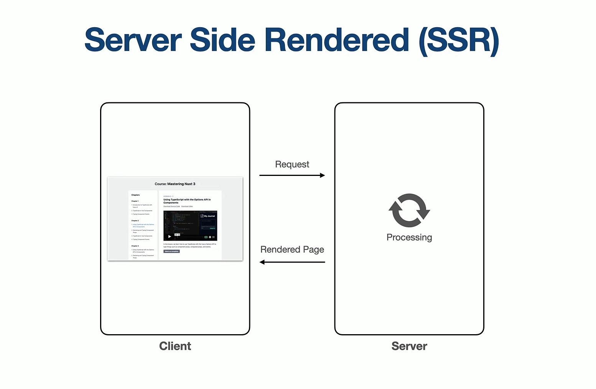
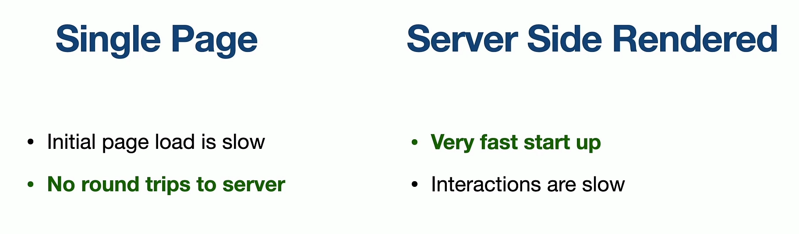
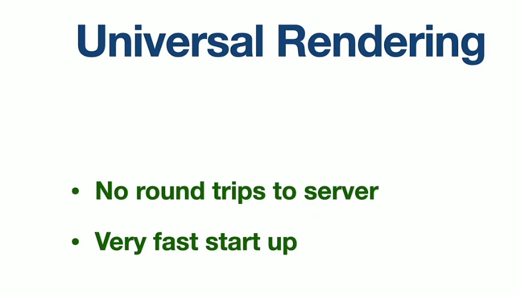
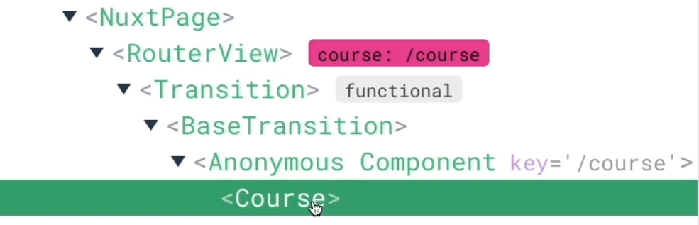

# INDEX

- [INDEX](#index)
  - [NUXT](#nuxt)
    - [Installation](#installation)
    - [Auto Imports](#auto-imports)
  - [Server Side Rendering (SSR)](#server-side-rendering-ssr)
  - [Components](#components)
    - [Global components](#global-components)
  - [Routes](#routes)
    - [Dynamic Pages](#dynamic-pages)
    - [Layouts](#layouts)
  - [Composables](#composables)
    - [useHead](#usehead)
    - [useState](#usestate)
    - [useLocalStorage](#uselocalstorage)
    - [VueUse](#vueuse)
  - [Hydration](#hydration)

---

## NUXT


### Installation

```sh
npx nuxi init app
```

- when installing it, it automatically comes with typescript support via `tsconfig.json` file, but you don't have to use it or use typescript, as Nuxt3 comes with typescript in its core so you can say it provides **"free typing functionalities"** out of the box

### Auto Imports

- Nuxt 3 comes with auto imports for components / layouts / composables, pinia and `use`-methods (ex: `useRouter`)
- You will notice that there's no components or imports other than the `app.vue` file, as the default components are tree-shake to prevent unused imports

---

## Server Side Rendering (SSR)




- Nuxt have best of both worlds as it takes the advantages from both ways to do what is knows as **"Universal Rendering"**
  

---

## Components

### Global components

Instead of making Vue auto-import the registered global components, we can just put them in a folder named **`global`**

---

## Routes

To make Views with routes, just put the component in a folder named **`pages`**

- the Home route `/` is the component named `index.vue` in the `pages` folder
- for catchAll route, we create page with name `404.vue`
- instead of `<router-view/>`, we ues `<NuxtPage/>`
  - under the hood it renders a `<RouterView/>` inside it with some transition and animations
    
- to have nested routes, we use folders with the parent route name and inside it the child views(routes)

- For navigation, we use `<NuxtLink/>` instead of `<RouterLink/>`

### Dynamic Pages

- With Nuxt 2 dynamic routes were handled by using an **underscore** in front of a file or folder.

  ```js
  File: /pages/users/_id.vue
  Url:  /users/123

  $route.params = { id: "123" }
  ```

- in Nuxt 3, Instead of using an underscore `_` like Nuxt 2, Nuxt 3 uses brackets `[ ]`.

  ```js
  File: /pages/[people]/[id].vue
  Url:  /developer/123

  $route.params = { people: 'developer', id: '123' }
  ```

- Using brackets allows you to also match both static and dynamic text within a route!

  ```js
  File: /pages/person-[name]/index.vue
  Url:  /person-spongebob/

  $route.params = { name: 'spongebob' }

  // or multiple dynamic matching
  File: /pages/person-[name]-[color]/lives-[area]-[city].vue
  Url: /person-spongebob-yellow/lives-ocean-bikinibottom/

  $route.params = {
  name: 'spongebob',
  color: 'yellow',
  area: 'ocean',
  city: 'bikinibottom'
  }
  ```

- using double brackets `[[ ]]` allows us to have optional segments

  - it's like `?` modifier in normal routing

- Nuxt 3 also lets you have catchall files that can match any number of arguments! Anything that matches after the folder name will be added to an array using the key name of your filename.

  ```js
  File: /pages/person/[...slugs].vue

  Url:  /person/spongebob/123/abc
  $route.params = { slugs: ['spongebob', '123', 'abc' ] }

  Url: /person/
  $route.params = ''
  ```

---

### Layouts

Nuxt provides a customizable layouts framework you can use throughout your application, ideal for extracting **common UI** or code patterns into reusable layout components like **navbar** or **footer**.


- Layouts are placed in the `layouts/` directory and will be automatically loaded via asynchronous import when used. Layouts are used by adding `<NuxtLayout>` to your app.vue, and either setting a layout property as part of your page `metadata` (if you are using the `~/pages` integration), or by manually specifying it as a prop to `<NuxtLayout>`. (Note: The layout name is normalized to kebab-case, so "someLayout" becomes "some-layout".)
- it's done using **slots**
- > If you only have a single layout in your application, Nuxt recommends using `app.vue` instead

How to use it -> [Layouts Directory](https://nuxt.com/docs/guide/directory-structure/layouts)

---

## Composables

### useHead

Nuxt provides the `useHead` composable to add and customize the **head** tag properties of individual pages of your Nuxt app.

```js
// -------- Usage -------- //
useHead(meta: MaybeComputedRef<MetaObject>): void

interface MetaObject {
  title?: string
  titleTemplate?: string | ((title?: string) => string)
  base?: Base
  link?: Link[]
  meta?: Meta[]
  style?: Style[]
  script?: Script[]
  noscript?: Noscript[]
  htmlAttrs?: HtmlAttributes
  bodyAttrs?: BodyAttributes
}

// -------- EX -------- //
const pageTitle = computed(() => {
  return `${lesson.value.title} - ${course.title}`
});
useHead({
  title: pageTitle.value, // change title of the page
})
```

### useState

### useLocalStorage

### VueUse

---

## Hydration

- When you have a SSR app, sometimes the (data + the static HTML) act strange, due to state not being updated when taking data from server
  - to fix this you can render some parts as a client side component by wrapping it with `<ClientOnly/>` component, but note that by that we won't use the advantages of the SSR on this part
    - only use it when you have component that is rendered on the server, but you want to to be rendered on the client side only
